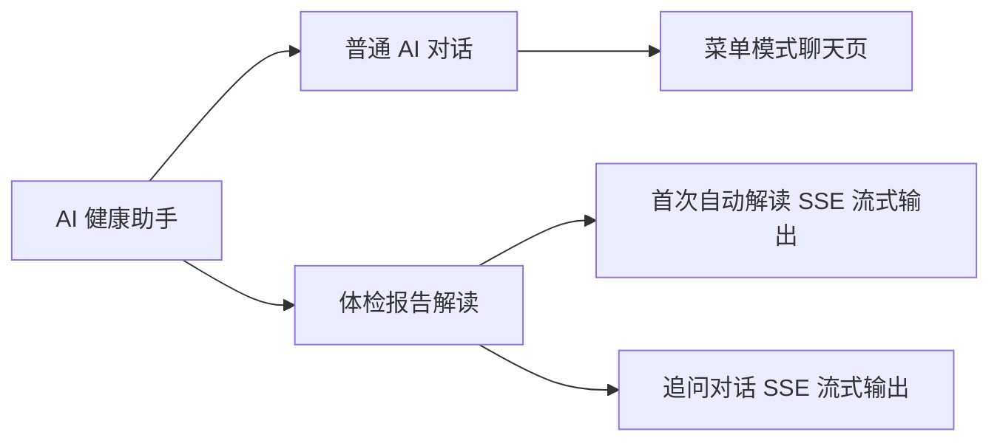
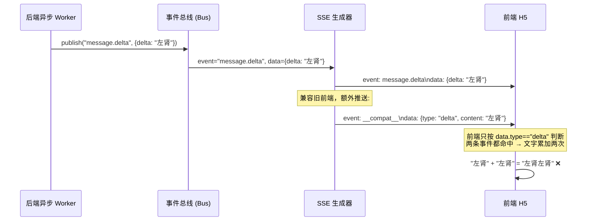

# bini-health 菜单模式 AI 回复 Bug 修复方案文档

## 1. Bug 发生背景

### 1.1 项目概述

bini-health 是一套健康管理平台，包含 H5 网页端、Flutter APP 端、微信小程序端等多个终端。其中 AI 健康助手模块提供了智能对话、体检报告解读、症状分析等核心功能。

### 1.2 涉及功能模块



- **Bug 1**：AI 健康助手 → 菜单模式聊天页 → AI 回复内容渲染（`ai-home` 页面）
- **Bug 2**：AI 健康助手 → 体检报告解读 → 首次自动解读的 SSE 流式输出（`checkup/chat` 页面）

### 1.3 发现时间与发现方式

用户在使用过程中发现，反馈截图为证。

---

## 2. Bug 描述

### Bug 1：AI 回复中 Markdown 标题标记（`#`）原样显示

#### 2.1 错误现象

AI 回复内容中，`##`、`###` 等 Markdown 标题标记直接显示为原始字符，没有被转换为对应的标题样式。例如 AI 返回 `## 左肾结石` 时，页面上直接显示 `## 左肾结石`，而不是以标题样式呈现。

#### 2.2 重现步骤

| 步骤 | 操作 | 预期结果 | 实际结果 |
|------|------|----------|----------|
| 1 | 打开 AI 健康助手菜单模式聊天页 | 页面正常加载 | 正常 |
| 2 | 向 AI 提问健康相关问题 | AI 返回格式化的回复 | AI 正常回复 |
| 3 | 查看 AI 回复中带有 `##`、`###` 标记的标题 | 标题应以加粗大字样式显示，`##` 和 `###` 有字号区分 | `#` 符号原样显示在页面上 |

#### 2.3 根因分析

前端 `ai-home` 页面的 `renderMarkdown` 函数**已经包含**了 `#`、`##`、`###` 标题标记的转换逻辑（第 96-98 行），但由于**先对 `>` 字符做了 HTML 实体转义**（`>` → `&gt;`），导致 HTML 标签中的 `>` 也被转义，最终 `<h2 ...>` 变成了 `<h2 ...&gt;`，浏览器无法识别为合法的 HTML 标签，标题样式不生效。

具体问题代码：

```typescript
function renderMarkdown(text: string): string {
  let html = text
    .replace(/&/g, '&amp;')
    .replace(/</g, '&lt;')
    .replace(/>/g, '&gt;');           // ← 此行把所有 > 都转义了
  html = html.replace(/^### (.+)$/gm, '<h3 ...>$1</h3>');  // ← 生成的 <h3> 中 > 已被转义
  html = html.replace(/^## (.+)$/gm, '<h2 ...>$1</h2>');
  // ...
}
```

转义应在 Markdown 解析**之后**对纯文本部分进行，或者改为**先做 Markdown 解析再做 HTML 实体转义**的顺序。

#### 2.4 影响范围

- 影响所有通过 `ai-home` 页面展示的 AI 回复（菜单模式对话场景）
- 其他使用不同渲染方式的页面（如 `checkup/chat`）不受影响

---

### Bug 2：体检报告解读流式输出文字重复

#### 2.1 错误现象

体检报告解读的首次自动解读过程中，SSE 流式输出的文字出现严重重复。从截图可以看到：

- "左左肾肾结石结石"（应为"左肾结石"）
- "可能可能原因原因"（应为"可能原因"）
- "指标指标详情详情"（应为"指标详情"）
- "11.. 左左肾肾结石结石"（应为"1. 左肾结石"）
- "22.. 前列腺前列腺增生增生并并钙钙化化"（应为"2. 前列腺增生并钙化"）

每个字/词都被重复了一遍。流式输出完成后，最终显示的文字恢复正常。

#### 2.2 重现步骤

| 步骤 | 操作 | 预期结果 | 实际结果 |
|------|------|----------|----------|
| 1 | 上传体检报告 | 报告上传成功 | 正常 |
| 2 | 进入体检报告解读页面 | AI 开始流式输出解读内容 | AI 开始流式输出 |
| 3 | 观察流式输出过程 | 文字逐字/逐句正常显示 | 每个字/词都重复了一遍，出现乱码 |
| 4 | 等待流式输出完成 | 最终显示完整的解读内容 | 流式结束后文字恢复正常 |

#### 2.3 根因分析



问题出在后端 `_heartbeat_wrapped_sse` 函数中，第 606-612 行（位于 `report_interpret.py`）：

**后端在推送每条 `message.delta` 原始事件后，为了兼容旧版前端，又额外推送了一条 `__compat__` 兼容事件**，其 data 中也包含 `{type: "delta", content: "..."}`。

而前端解析 SSE 时（`checkup/chat/[sessionId]/page.tsx` 第 259 行），只判断 `data:` 开头的行，并按 `obj.type === 'delta'` 来匹配——这意味着 `message.delta` 原始事件和 `__compat__` 兼容事件中的 data 都会被解析并命中 `type === 'delta'` 条件，导致**同一段内容被累加了两次**。

**为什么流式结束后文字恢复正常**：因为后端在流式结束时推送 `done` 事件，data 中包含完整的最终文本（`obj.type === 'done'` 分支），前端用这个完整文本**直接替换**了之前累加的内容，所以最终结果是正确的。

**为什么只在体检报告解读出现**：普通 AI 对话（`ai-home` 页面的 `sendSSE` 函数）走的是不同的 SSE 接口（`/api/chat/sessions/{sid}/stream`），该接口的事件格式是 `event: delta\ndata: {content: "..."}` 且**没有**额外推送 `__compat__` 兼容事件，所以普通对话不受影响。

#### 2.4 影响范围

- 仅影响体检报告解读的首次自动解读流式输出过程（`checkup/chat` 页面）
- 追问对话和普通 AI 对话不受影响
- 流式输出完成后最终文字正常，不影响数据持久化

---

## 3. 预期正确效果

### Bug 1 修复后

- AI 回复中的 `##` 标记 → 转换为**二级标题样式**（字号 16px，加粗，上方加 8px 间距）
- AI 回复中的 `###` 标记 → 转换为**三级标题样式**（字号 15px，加粗，上方加 8px 间距）
- 标题与正文之间有明显的段落分隔感（上方 margin-top）
- `#` 符号不再原样显示在页面上
- 其他 Markdown 元素（加粗、斜体、代码块、列表等）保持正常渲染

### Bug 2 修复后

- 体检报告解读的 SSE 流式输出过程中，文字逐字/逐句正常显示，不再出现重复
- 流式输出完成后，最终文字与修复前一致（仍然正确）
- 追问对话和普通 AI 对话不受影响（保持现有正常行为）

---

## 4. 修复方案

### Bug 1 修复方案：修正 `renderMarkdown` 函数中 HTML 转义与标题解析的执行顺序

**修改范围**：H5 前端 `ai-home` 页面的 `renderMarkdown` 函数

**修复思路**：将 HTML 实体转义（`<`、`>`、`&`）放到 Markdown 标记解析**之前**执行，但在正则替换生成 HTML 标签时使用**占位符**替代 `<` 和 `>`，最后统一将占位符替换回真实的 HTML 标签符号。或者更简洁的方案：先解析 Markdown 标记，将匹配到的内容**移除**出待转义文本，最后合并。

**推荐方案**：调整 `renderMarkdown` 函数逻辑，让 HTML 转义只作用于**用户原始文本**，而非解析后生成的 HTML 标签。具体做法：

1. 先对原始文本进行 HTML 实体转义（`&` → `&amp;`、`<` → `&lt;`、`>` → `&gt;`）
2. 然后在**已转义的文本**上匹配 Markdown 标记（此时 `##` 等标记未被转义，仍可正常匹配）
3. 替换时直接生成完整的 HTML 标签字符串（不会被二次转义）

同时按用户要求调整标题样式：

- `##`：字号 16px，加粗，`margin-top: 12px`（标题行上方增加间距）
- `###`：字号 15px，加粗，`margin-top: 10px`

**涉及文件**：

| 文件 | 修改内容 |
|------|----------|
| H5 前端 `ai-home` 页面 | 修正 `renderMarkdown` 函数，调整 HTML 转义与 Markdown 标题解析的执行顺序，更新 `##`/`###` 样式（字号区分 + 加粗 + 上间距） |

### Bug 2 修复方案：前端过滤 `__compat__` 兼容事件，避免 delta 重复累加

**修改范围**：H5 前端 `checkup/chat/[sessionId]` 页面的 SSE 解析逻辑

**修复思路**：在前端 SSE 解析循环中，增加对 SSE `event:` 字段的识别，**跳过** `event: __compat__` 事件，只处理 `event: message.delta`、`event: message.done` 等原始事件。

具体做法：

1. 在 SSE 分片解析循环中，除了解析 `data:` 行，还需解析 `event:` 行
2. 当 `event` 为 `__compat__` 时，跳过该条数据不做处理
3. 当 `event` 为 `message.delta` 时，从 `data.delta` 字段（而非 `data.content`）读取增量文本
4. 当 `event` 为 `message.done` 时，从 `data.content` 字段读取最终完整文本
5. 保留对 `obj.type === 'delta'` 的兼容解析（用于 `/messages-stream` 追问接口，该接口不使用 event 字段）

**涉及文件**：

| 文件 | 修改内容 |
|------|----------|
| H5 前端 `checkup/chat/[sessionId]` 页面 | 修改 `startStream` 函数中 SSE 解析逻辑，识别 `event:` 字段，跳过 `__compat__` 兼容事件，从 `message.delta` 事件的 `data.delta` 字段读取增量文本 |

---

## 5. 补充说明

### 关于后端兼容事件的保留

后端 `_heartbeat_wrapped_sse` 中的 `__compat__` 兼容事件是为了兼容旧版本前端而设计的。本次修复采用**前端侧过滤**的方案，不修改后端逻辑，以避免影响其他可能依赖兼容事件的客户端。

### 关于其他终端的影响

- **Flutter APP 端**和**微信小程序端**：如果这些终端也存在体检报告解读功能且使用相同的 SSE 流式接口，需要同步检查是否存在相同的重复累加问题，并做相应修复
- 本方案聚焦 H5 网页端的修复，其他终端按相同思路排查即可

### 风险评估

- Bug 1 修复为纯前端渲染逻辑调整，风险极低
- Bug 2 修复为前端 SSE 解析逻辑优化，不涉及后端改动，风险极低
- 两个 Bug 的修复互不依赖，可以独立进行
