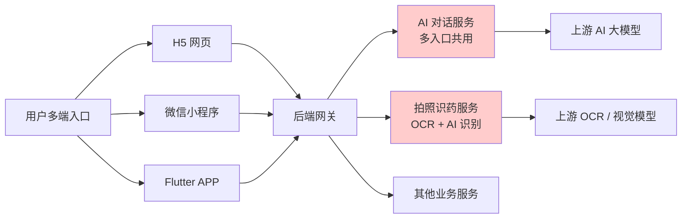
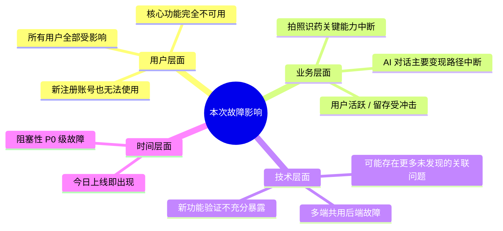
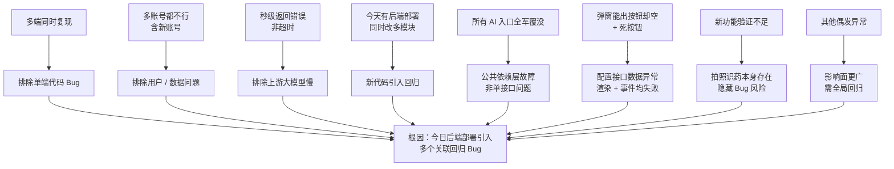
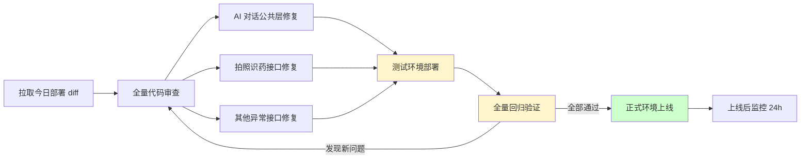

# bini-health AI 对话与拍照识药 Bug 修复方案文档

> 文档生成时间：2026-05-14 23:57
> 适用范围：本期一次性全量修复，所有 Bug 统一规划为一期工程修复完毕

---

## 1. Bug 发生背景

### 1.1 项目概述

本项目为 bini-health 健康类应用，包含多端形态（H5、小程序、Flutter 移动 APP 等），核心能力包括：

- **AI 智能对话**：覆盖普通问诊、用药咨询、报告解读等多个对话入口，是用户使用频率最高的核心功能之一
- **拍照识药**：用户通过相册 / 拍照 / 本机文件 / 微信等多种方式上传药品图片，由后端 OCR + AI 识别返回药品信息
- **健康计划、用药管理、报告解读** 等其他业务模块

*图 1：项目核心链路与本次故障影响模块（红色为故障模块）*

### 1.2 涉及功能模块

| 模块 | 故障情况 | 端覆盖 |
|------|----------|--------|
| AI 对话（普通问诊） | ❌ 全部入口报"网络异常" | H5 / 小程序 / APP |
| AI 对话（用药咨询） | ❌ 全部入口报"网络异常" | H5 / 小程序 / APP |
| AI 对话（报告解读） | ❌ 全部入口报"网络异常" | H5 / 小程序 / APP |
| 拍照识药弹窗 | ❌ 弹窗能弹出，但 4 个按钮全部失灵 | H5 / 小程序 / APP |
| 拍照识药按钮渲染 | ❌ 按钮图标 / 文字有缺失或错位 | H5 / 小程序 / APP |
| 其他业务接口 | ⚠️ 部分页面 / 接口偶发报错 | 多端 |

### 1.3 发现时间与发现方式

- **发现时间**：2026-05-14（今天）
- **故障窗口**：今天某次后端部署之后
- **昨日状态**：昨天还是正常的，今天突然出现
- **发现方式**：产品 / 测试 / 用户使用过程中发现，多账号（含新注册账号）复现一致

---

## 2. Bug 描述

### 2.1 错误现象

**Bug A：AI 对话提示"网络异常，请稍后重试"**

- 点击发送任何对话内容后**秒级**弹出错误提示
- 所有 AI 对话入口（普通问诊、用药咨询、报告解读等）**全部不可用**
- 多账号（含新注册账号）一致复现，与用户身份无关
- H5 / 小程序 / Flutter APP **多端同时复现**

**Bug B：拍照识药弹窗按钮全部失灵**

- 从首页 / 工具栏的"拍照识药"独立入口点击后，弹窗能正常弹出
- 弹窗内"相册 / 拍照 / 本机 / 微信" **4 个按钮全部无反应**，连点按下去的动画 / 高亮反馈都没有
- 同时，按钮的**图标和文字存在缺失或错位**现象
- 该功能为**最近一两周新上线**功能，上线时未做充分回归验证
- 多端同时复现

**Bug C：其他偶发异常**

- 部分页面 / 接口在今天部署后偶发报错，具体表现未详细记录
- 强烈提示本次部署影响面不止 A / B 两点

### 2.2 重现步骤

#### Bug A：AI 对话报错

| 步骤 | 操作 | 预期结果 | 实际结果 |
|------|------|----------|----------|
| 1 | 打开任一端（H5 / 小程序 / APP），登录任意账号 | 正常进入首页 | 正常 |
| 2 | 进入"AI 对话"任意入口（问诊 / 用药咨询 / 报告解读） | 进入对话页 | 正常 |
| 3 | 输入任意问题，点击发送 | 几秒内返回 AI 回答 | **秒级弹出"网络异常，请稍后重试"** |
| 4 | 换账号、换端再试 | 至少部分账号 / 端可用 | **所有账号、所有端均失败** |

#### Bug B：拍照识药按钮失灵

| 步骤 | 操作 | 预期结果 | 实际结果 |
|------|------|----------|----------|
| 1 | 在首页 / 工具栏点击"拍照识药" | 弹出选择来源弹窗 | 正常弹出 |
| 2 | 观察弹窗 | 4 个按钮图标、文字完整 | **图标 / 文字缺失或错位** |
| 3 | 点击"相册" | 调起相册选图 | **无任何反应** |
| 4 | 点击"拍照" | 调起相机 | **无任何反应** |
| 5 | 点击"本机" | 调起本地文件选择 | **无任何反应** |
| 6 | 点击"微信" | 调起微信文件 | **无任何反应** |

### 2.3 影响范围

*图 2：故障影响范围全景*

- **用户影响**：100% 用户受影响（多账号验证一致），核心功能全部不可用
- **功能影响**：AI 对话全线 + 拍照识药全线 + 其他偶发异常
- **端覆盖**：H5、小程序、Flutter APP **全端覆盖**
- **故障级别**：P0 级阻塞性故障，必须立即修复

---

## 3. 预期正确效果

### 3.1 AI 对话正确行为

- 用户在任意端、任意 AI 对话入口（普通问诊 / 用药咨询 / 报告解读等）发送消息后
- 后端应在合理时间（一般 1~10 秒）内返回 AI 的对话回复
- 仅在真正的网络中断 / 上游超时 / 限流等**真实异常**时，才显示"网络异常，请稍后重试"
- 多账号、多端均应正常工作

### 3.2 拍照识药正确行为

- 点击"拍照识药"入口后，弹窗弹出，4 个按钮**图标和文字完整、无错位**
- 点击任一按钮应有点击反馈（高亮 / 动画）
- "相册"按钮：调起系统相册选图
- "拍照"按钮：调起系统相机拍摄
- "本机"按钮：调起本机文件选择
- "微信"按钮：调起微信内置文件选择
- 选图后正确进入识药识别流程，识别结果正常返回

### 3.3 其他模块

- 今日部署所波及到的其他偶发异常接口 / 页面也应一并修复
- 整体回到昨日部署前的稳定可用状态，并保留本次新功能改动的合理部分

---

## 4. 根因分析方向（修复时优先排查）

### 4.1 关键证据链

*图 3：根因证据推理链*

### 4.2 Bug A（AI 对话）重点排查方向

由 AI 在新会话的实际修复阶段优先排查（用户无需手动操作）：

1. **AI 对话公共网关 / 中间件**
   - 鉴权拦截器是否在部署后异常拦截了所有请求
   - 网关路由配置是否被改坏，导致所有 `/chat/*` 路由 404 / 500
   - 公共请求拦截器、全局异常处理器是否被改动

2. **AI 上游配置层**
   - 上游 AI 大模型的 API Key / Token 是否在配置中被误删或误改
   - 上游 Base URL、模型名、调用参数是否变更
   - 上游账户是否欠费 / 限流 / 封禁（虽然秒回错误更像是本地报错，但仍需排查）

3. **统一配置 / 环境变量**
   - 配置中心相关 AI 对话开关、配额开关是否被误关闭
   - 容器环境变量是否在部署时丢失或写错

4. **依赖服务**
   - Redis / DB / MQ 等依赖是否在部署时出现连接异常
   - 上下文存储（对话历史）服务是否可达

### 4.3 Bug B（拍照识药）重点排查方向

1. **按钮配置接口**
   - 拍照识药弹窗的按钮配置接口（如 `function-buttons` 类配置）返回结构是否被改动
   - 字段命名（icon / text / action）是否变更，导致前端拿不到正确数据 → 图标文字缺失 + onClick 未绑定

2. **图片上传 / OCR 相关后端**
   - 用户回答中明确说今日"改了拍照识药 / 图片上传 / OCR 相关的逻辑"
   - 重点对比改动 diff，识别接口路径、入参、响应结构是否破坏了前端契约

3. **前端按钮渲染逻辑**
   - 若按钮配置由前端硬编码，则检查前端是否依赖了后端的某个初始化接口才能完成事件绑定
   - 检查接口失败时的兜底逻辑，避免出现"按钮渲染了但事件没绑"的死按钮状态

4. **多端共用代码**
   - 多端同时复现说明问题在共用的后端 + 共用的前端组件库 / 配置上

### 4.4 Bug C（其他偶发异常）排查方向

- 拉出今天部署的完整 git diff，按服务 / 模块逐一过一遍
- 重点关注公共拦截器、全局配置、共享工具类的改动
- 配合日志（由 AI 直接查看服务端日志）扫描今日 4xx / 5xx 异常分布

---

## 5. 修复策略（本期一次性全量修复）

*图 4：修复执行流程（一次性全量修复，先在测试环境验证后上线）*

### 5.1 修复原则

- ✅ **所有 Bug 统一为一期工程，一次性全量修复完毕**，不分批不分期
- ✅ **先在测试环境完整验证**，全部通过后再发布到正式环境
- ✅ **修复过程中由 AI 自行查看服务端日志**，用户无需关心后端日志细节
- ✅ **保留本次新功能的合理改动**，仅修复其中的 Bug，不做大范围回滚

### 5.2 修复任务清单

| 编号 | 任务 | 类型 |
|------|------|------|
| T1 | 拉取并审查今日全部后端部署 diff | 代码审查 |
| T2 | 修复 AI 对话公共层故障，恢复所有 AI 对话入口 | 后端修复 |
| T3 | 修复拍照识药按钮配置接口，让 4 个按钮恢复正常 | 后端 + 前端 |
| T4 | 修复拍照识药弹窗按钮图标 / 文字缺失问题 | 前端 |
| T5 | 排查并修复其他偶发异常的接口 / 页面 | 后端 + 前端 |
| T6 | 在测试环境完整部署并自检 | 部署 |
| T7 | 全量回归验证（含 AI 对话、拍照识药、其他偶发点） | 验证 |
| T8 | 正式环境部署上线 | 部署 |
| T9 | 上线后多端 + 多账号回归确认 | 验证 |

### 5.3 验证清单（测试环境 + 正式环境均需通过）

**AI 对话验证**：

- [ ] 普通问诊：H5 / 小程序 / APP 三端各发送 3 条消息，均能正常收到回复
- [ ] 用药咨询：同上
- [ ] 报告解读：同上
- [ ] 新注册账号：在三端各注册新账号，验证 AI 对话能正常使用
- [ ] 异常路径：断网 / 上游异常时仍能合理提示"网络异常"

**拍照识药验证**：

- [ ] 三端弹窗按钮图标、文字完整无错位
- [ ] "相册"按钮可正常调起相册并选图
- [ ] "拍照"按钮可正常调起相机
- [ ] "本机"按钮可正常调起本机文件
- [ ] "微信"按钮可正常调起微信文件
- [ ] 选图后能正常进入识药流程并返回识别结果

**其他偶发异常验证**：

- [ ] 今日改动涉及的所有模块逐一回归
- [ ] 重点页面（首页、健康计划、用药管理、报告等）整体走查一遍
- [ ] 检查后端今日 4xx / 5xx 日志，确认无异常残留

---

## 6. 补充说明

### 6.1 关键风险点

- **新功能验证不充分**：拍照识药为最近一两周新上线功能，本次问题暴露了上线前回归不全面的问题，后续建议加强新功能上线前的多端 + 多账号回归
- **多模块同次部署**：本次部署同时改动多个模块（AI 对话、拍照识药、其他业务），一旦出问题影响面就会扩大，后续建议关键模块尽量分批部署
- **公共层改动需重点验证**：AI 对话所有入口全军覆没，强烈提示是公共层（鉴权 / 网关 / 拦截器 / 配置）改动引起，此类改动需作为高风险变更对待

### 6.2 修复后建议

- 给 AI 对话公共层接口加上**健康检查端点**，方便部署后第一时间自检
- 给拍照识药按钮配置接口加上**前后端契约校验**，避免字段变更直接打穿前端
- 建立"今日部署 diff 检查清单"，每次部署后自动扫描公共层、上游 Key、配置项等高风险点

### 6.3 修复方式

本次所有 Bug 由小白 AI 自动化修复。得益于自动化开发能力，整体修复 + 测试环境验证 + 正式上线在极短时间内即可完成。

---

## 7. 下一步行动

本文档为**本次会话的最终交付物**，包含完整的 Bug 描述、根因方向、修复策略与验证清单。

**如需进入实际修复阶段，请在新的会话中发起，由 AI 按本文档执行实际的代码修复、测试环境部署、回归验证和正式上线流程。**

---

*本方案文档为小白 AI 基于多轮结构化沟通生成，所有 Bug 一期全量修复，无需分批分期。*
