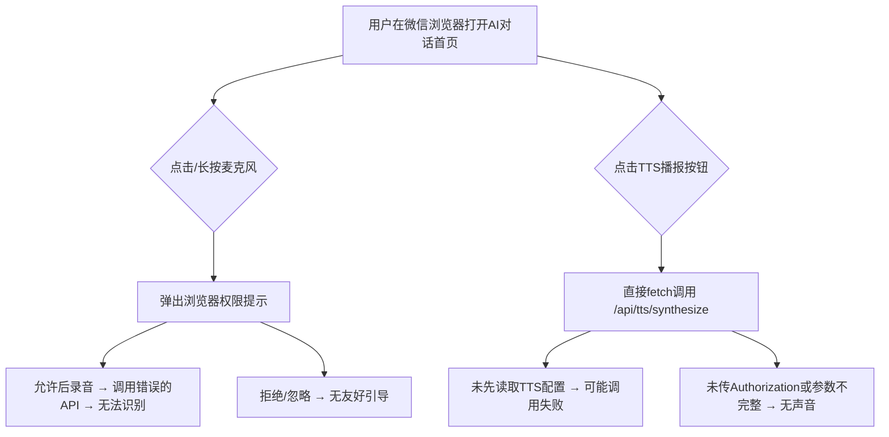
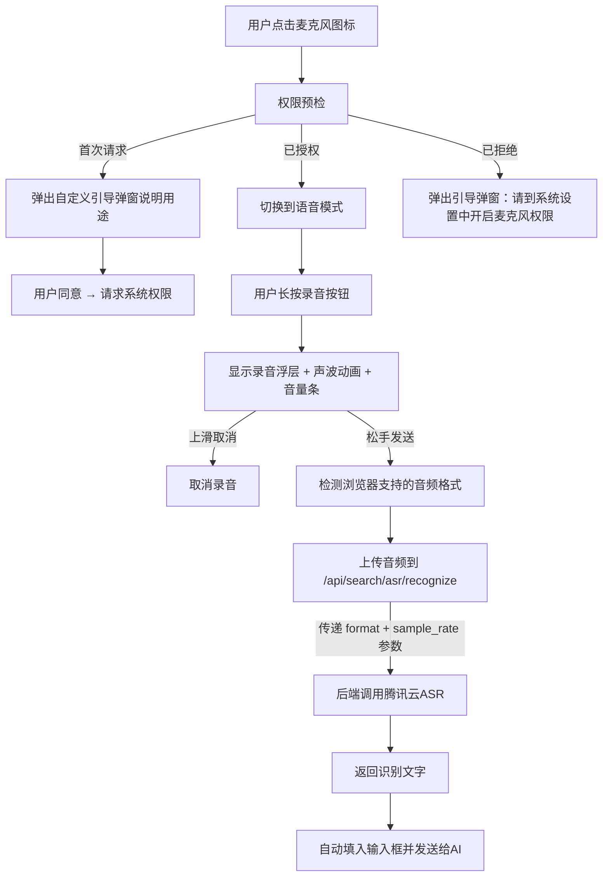
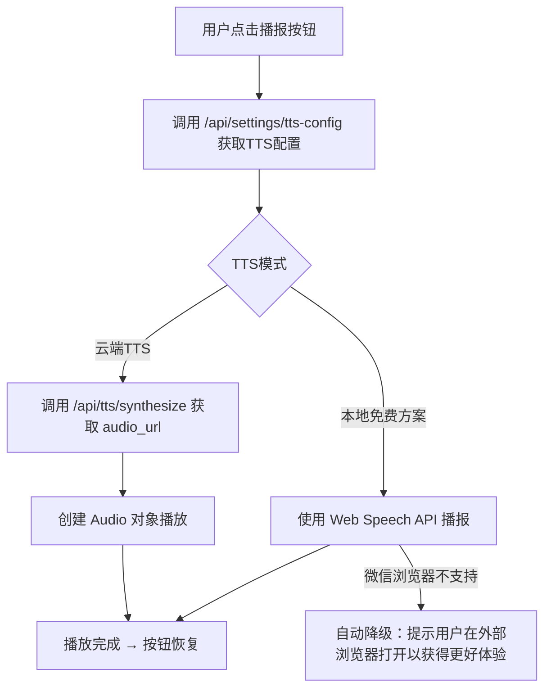

# AI对话首页（ai-home）语音输入与TTS播报 Bug 修复方案文档

## 1. Bug 发生背景

### 1.1 项目概述

碧尼健康（Bini Health）H5端的AI对话首页（ai-home），在完成功能整合升级（SSE流式对话、语音输入、TTS语音朗读、对话持久化等）后，语音输入和TTS播报两项功能未能正常工作。

### 1.2 涉及功能模块

- **语音输入（ASR语音识别）**：用户长按麦克风录音后自动识别为文字并发送
- **TTS语音播报**：点击AI回复消息下方的播报按钮，朗读AI的回复内容

### 1.3 发现时间与发现方式

用户在微信内置浏览器中访问H5链接，手动操作发现语音输入按住后无法正确识别、TTS播报按钮点击后无声音。



---

## 2. Bug 描述

### Bug 1（致命）：语音识别调用了错误的API接口

#### 2.1 错误现象

用户长按麦克风录音完成后，音频数据被发送到了 **TTS合成接口** `/api/tts/synthesize`，而非 **ASR语音识别接口** `/api/search/asr/recognize`。这导致即使录音成功，后端也不会返回识别文字——因为 TTS 接口期望的是 JSON 格式的 `{text: "..."}` 请求体（用于文字→语音），而前端发送的是 FormData 格式的音频文件（用于语音→文字），接口参数完全不匹配。

#### 2.2 重现步骤

| 步骤 | 操作 | 预期结果 | 实际结果 |
|------|------|----------|----------|
| 1 | 打开AI对话首页，点击麦克风图标切换到语音模式 | 进入语音输入模式 | ✅ 正常 |
| 2 | 长按"按住说话"按钮开始录音 | 开始录音，显示声波动画 | ✅ 正常（前提是授予了麦克风权限） |
| 3 | 松手结束录音 | 显示"语音识别中..."，然后自动将识别文字发送给AI | ❌ 调用了 `/api/tts/synthesize`，返回错误或无法识别的结果，文字不会被填入输入框 |

#### 2.3 根因分析

**新版 `ai-home/page.tsx`** 录音完成后的代码：

```javascript
// 错误：调用了TTS合成接口
const resp = await fetch(`${basePath}/api/tts/synthesize`, {
  method: 'POST',
  headers: { 'Authorization': `Bearer ${token}` },
  body: formData,  // 发送的是音频文件FormData
});
```

**旧版 `chat/[sessionId]/page.tsx`** 录音完成后的代码（正确写法）：

```javascript
// 正确：调用ASR语音识别接口
const data = await api.post('/api/search/asr/recognize', fd, {
  headers: { 'Content-Type': 'multipart/form-data' },
  timeout: 30000,
});
```

后端 `/api/search/asr/recognize` 接口已存在且正常工作（调用腾讯云一句话识别 SentenceRecognition API），接收 `audio_file`（音频文件）、`format`（格式）、`sample_rate`（采样率）三个参数。

#### 2.4 影响范围

所有通过AI对话首页使用语音输入的用户，语音识别功能完全不可用。

---

### Bug 2（严重）：录音格式检测和参数缺失

#### 2.1 错误现象

新版录音时没有进行浏览器支持的音频编码格式检测，直接使用 `new MediaRecorder(stream)` 不指定 mimeType，且上传时固定使用 `voice.webm` 文件名，未向后端传递 `format` 和 `sample_rate` 参数。不同浏览器默认编码格式不同（Chrome 默认 webm/opus，Safari 默认 mp4），这可能导致后端无法正确识别音频格式。

#### 2.2 重现步骤

| 步骤 | 操作 | 预期结果 | 实际结果 |
|------|------|----------|----------|
| 1 | 在 Safari 浏览器中长按录音 | 录音并以正确格式上传 | ❌ MediaRecorder 可能不支持 webm，使用默认的 mp4 格式录制，但上传时文件名仍为 `voice.webm`，且未告知后端实际格式 |

#### 2.3 根因分析

**新版缺失的逻辑**——旧版有完整的格式检测链：

```javascript
// 旧版：检测浏览器支持的最佳音频格式
const getPreferredMimeType = () => {
  if (MediaRecorder.isTypeSupported('audio/webm;codecs=opus')) return 'audio/webm;codecs=opus';
  if (MediaRecorder.isTypeSupported('audio/webm')) return 'audio/webm';
  if (MediaRecorder.isTypeSupported('audio/mp4')) return 'audio/mp4';
  if (MediaRecorder.isTypeSupported('audio/mp3')) return 'audio/mp3';
  return '';
};

// 旧版：上传时传递format和sample_rate
fd.append('audio_file', blob, `recording.${fmt}`);
fd.append('format', fmt);
fd.append('sample_rate', '16000');
```

新版直接 `new MediaRecorder(stream)` 不传 mimeType 选项，且 FormData 中不包含 `format` 和 `sample_rate` 字段。

#### 2.4 影响范围

在 Safari（iOS）、部分安卓浏览器中，音频格式可能与后端期望不匹配，导致ASR识别失败。

---

### Bug 3（体验问题）：麦克风权限拒绝后无友好引导

#### 2.1 错误现象

新版直接调用 `navigator.mediaDevices.getUserMedia` 触发浏览器原生权限弹窗。如果用户拒绝或忽略了权限，只显示一句简单的"无法访问麦克风" Toast 提示，没有引导用户如何重新授权。

#### 2.2 重现步骤

| 步骤 | 操作 | 预期结果 | 实际结果 |
|------|------|----------|----------|
| 1 | 点击麦克风进入语音模式，长按录音 | 弹出友好的授权引导弹窗 | ❌ 直接弹出浏览器原生权限提示（在微信中可能不太明显） |
| 2 | 拒绝或忽略权限提示 | 显示引导提示，告知如何去系统设置中重新授权 | ❌ 只显示"无法访问麦克风"，用户不知道如何操作 |

#### 2.3 根因分析

**旧版有完整的权限预检和引导流程**：

```javascript
// 旧版：先检查权限状态
const checkMicPermission = async () => {
  // 1. 通过 navigator.permissions.query 检查当前权限状态
  // 2. 如果已被拒绝 → 弹出 Dialog.confirm 引导用户去系统设置开启
  // 3. 如果是首次 → 先弹自定义确认框说明用途，再请求权限
  // 4. 只有权限通过后才进入语音模式
};
```

新版缺少整个权限预检流程，直接在 `startRecording` 里调用 `getUserMedia`，把权限处理完全丢给了浏览器。

#### 2.4 影响范围

所有首次使用语音输入或曾拒绝过权限的用户，体验不友好，不知道如何恢复权限。

---

### Bug 4（严重）：TTS播报无法正常播放

#### 2.1 错误现象

用户点击AI回复消息下方的播报/朗读按钮后，没有声音播放。

#### 2.2 重现步骤

| 步骤 | 操作 | 预期结果 | 实际结果 |
|------|------|----------|----------|
| 1 | 与AI对话后，在AI回复消息下方找到播报按钮 | 看到播报按钮 | ✅ 正常 |
| 2 | 点击播报按钮 | AI回复内容被语音朗读出来 | ❌ 无声音，可能报错 |

#### 2.3 根因分析

**新版 `handleTTS` 函数的问题**：

```javascript
// 新版：直接调用 /api/tts/synthesize，不先读取TTS配置
const resp = await fetch(`${basePath}/api/tts/synthesize`, {
  method: 'POST',
  headers: { 'Content-Type': 'application/json', 'Authorization': `Bearer ${token}` },
  body: JSON.stringify({ text }),
});
// 然后判断 resp.headers 是否包含 audio 来决定播放方式
```

**旧版 `handleTts` 函数的正确流程**：

```javascript
// 旧版：先读取TTS配置，判断使用云端还是本地
const configRes = await api.get('/api/settings/tts-config', { params: { platform: 'h5' } });
const useCloudTts = config?.tts_provider === 'cloud' || config?.use_cloud_tts;

if (useCloudTts) {
  // 云端TTS：调用 /api/tts/synthesize，后端返回 audio_url
  const ttsRes = await api.post('/api/tts/synthesize', { text: plainText });
  if (data.audio_url) {
    const audio = new Audio(data.audio_url);
    // 播放...
  }
} else {
  // 本地TTS：使用浏览器 Web Speech API
  const utterance = new SpeechSynthesisUtterance(plainText);
  utterance.lang = 'zh-CN';
  window.speechSynthesis.speak(utterance);
}
```

新版的问题有两个：

1. **没有先读取 `/api/settings/tts-config` 判断TTS模式**——如果后台配置的是"免费方案"（本地Web Speech API），新版却直接调云端接口，必然失败
2. **新版判断响应类型的方式不对**——新版检查 `resp.headers.get('content-type')?.includes('audio')` 来判断是否返回音频流，但后端 `/api/tts/synthesize` 实际返回的是 JSON `{ audio_url, text_length, provider }`，不是音频流。所以这个判断永远为 false，然后走 fallback 的 Web Speech API，但微信内置浏览器对 Web Speech API 的支持很差，因此也没有声音

#### 2.4 影响范围

所有在AI对话首页点击播报按钮的用户，TTS功能不可用。

---

## 3. 预期正确效果

### 3.1 语音输入修复后的正确行为



1. 点击麦克风图标时，先进行权限预检（检查 `navigator.permissions` 状态）
2. 首次请求时弹出自定义确认框，说明"需要使用麦克风进行语音输入"
3. 权限被拒绝时，弹出引导弹窗指导用户去系统设置重新授权
4. 录音时自动检测浏览器支持的最佳音频编码格式（webm/opus → webm → mp4 → mp3）
5. 录音结束后，将音频文件连同 `format`、`sample_rate` 参数一并上传到正确的 ASR 接口 `/api/search/asr/recognize`
6. 接口返回识别文字后，自动填入输入框并发送给AI

### 3.2 TTS播报修复后的正确行为



1. 点击播报按钮后，先调用 `/api/settings/tts-config` 读取后台TTS配置
2. 如果配置为云端TTS → 调用 `/api/tts/synthesize`，从返回的 `audio_url` 创建 Audio 播放
3. 如果配置为本地方案 → 使用 Web Speech API（`SpeechSynthesisUtterance`）
4. 如果 Web Speech API 也不支持（如微信浏览器）→ 尝试云端 TTS 作为 fallback
5. 全部失败时给出友好提示

---

## 4. 修复方案

### 4.1 Bug 1 修复：语音识别接口纠正

**修改范围**：AI对话首页前端组件中的 `startRecording` → `recorder.onstop` 回调

**修复内容**：

- 将录音完成后的 API 调用从 `/api/tts/synthesize` 改为 `/api/search/asr/recognize`
- 使用项目中已封装的 `api.post()` 方法（带统一鉴权和错误处理），替代原生 `fetch`
- 录音完成后从响应中取 `data.text` 字段作为识别结果

### 4.2 Bug 2 修复：音频格式检测与参数补全

**修改范围**：AI对话首页前端组件中的录音相关逻辑

**修复内容**：

- 新增 `getPreferredMimeType()` 函数，逐一检测浏览器支持的 MIME 类型（webm/opus → webm → mp4 → mp3）
- 新增 `mimeToFormat()` 函数，将 MIME 类型映射为后端接受的格式标识
- `new MediaRecorder(stream)` 改为 `new MediaRecorder(stream, { mimeType: preferredMime })`
- FormData 中补充 `format` 和 `sample_rate` 字段
- 上传文件名从固定的 `voice.webm` 改为动态的 `recording.{fmt}`

### 4.3 Bug 3 修复：麦克风权限预检与友好引导

**修改范围**：AI对话首页前端组件

**修复内容**：

- 新增 `checkMicPermission()` 函数，在用户点击麦克风图标时执行
- 通过 `navigator.permissions.query({ name: 'microphone' })` 检查当前权限状态
- 状态为 `denied` → 弹出 Dialog.confirm 引导用户去系统设置开启
- 状态为 `prompt`（首次）→ 弹出自定义确认框说明用途再请求权限
- 状态为 `granted` → 直接进入语音模式
- 权限检查失败时做 graceful fallback（某些浏览器不支持 permissions API）

### 4.4 Bug 4 修复：TTS播报流程对齐旧版

**修改范围**：AI对话首页前端组件中的 `handleTTS` 函数

**修复内容**：

- 播报前先调用 `/api/settings/tts-config?platform=h5` 读取TTS配置
- 根据配置的 `tts_provider` 判断使用云端还是本地方案
- 云端方案：调用 `/api/tts/synthesize`，从返回的 JSON 中取 `audio_url` 播放（而非判断 content-type）
- 本地方案：使用 Web Speech API
- 增加 fallback 机制：本地方案失败时自动尝试云端，云端也失败时给出友好提示
- 增加对微信浏览器的兼容处理（微信对 Web Speech API 支持差）

### 4.5 修复方案总览

| Bug编号 | 问题描述 | 严重程度 | 修复方案 | 涉及文件 |
|---------|----------|----------|----------|----------|
| Bug 1 | ASR调用了TTS接口 | 致命 | 改为调用 `/api/search/asr/recognize` | ai-home 前端组件 |
| Bug 2 | 录音格式缺乏检测与参数缺失 | 严重 | 新增格式检测函数、补全上传参数 | ai-home 前端组件 |
| Bug 3 | 权限拒绝后无引导 | 体验问题 | 新增权限预检 + 引导弹窗 | ai-home 前端组件 |
| Bug 4 | TTS播报不读取配置直接调接口 | 严重 | 先读配置再按策略播放 + fallback | ai-home 前端组件 |

---

## 5. 补充说明

### 5.1 后端接口现状

经过代码检查确认，以下后端接口均已存在且功能正常，**无需后端改动**：

- `POST /api/search/asr/recognize` — 语音识别接口（腾讯云ASR），接收音频文件、格式、采样率
- `POST /api/tts/synthesize` — TTS合成接口，接收文本返回 `audio_url`
- `GET /api/settings/tts-config` — TTS配置查询接口，返回平台级TTS配置

本次修复**全部集中在前端**（ai-home 页面组件），不涉及后端代码变更。

### 5.2 微信浏览器兼容性注意事项

- 微信内置浏览器对 `MediaRecorder` 的支持有限，建议在录音启动前检测是否支持
- 微信对 `Web Speech API`（`SpeechSynthesis`）基本不支持，TTS应优先使用云端方案
- 微信中 `navigator.permissions.query` 可能不可用，权限预检需要做 try-catch fallback

### 5.3 参考实现

旧版对话页面（菜单模式下的AI健康咨询）中的语音输入和TTS播报功能已经完整、稳定运行，可作为本次修复的直接参考蓝本。核心是将旧版经过验证的语音逻辑迁移到新版 ai-home 页面中。
