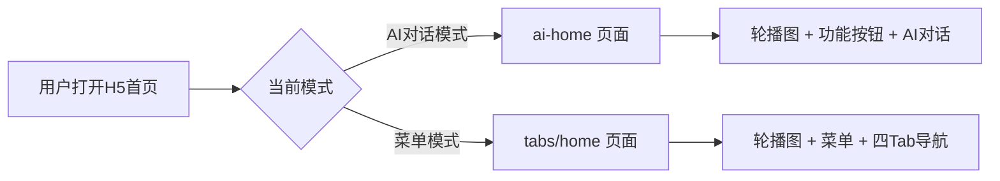
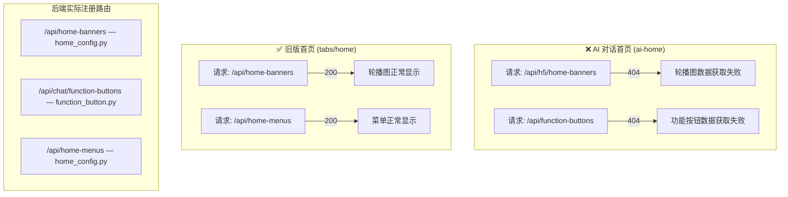
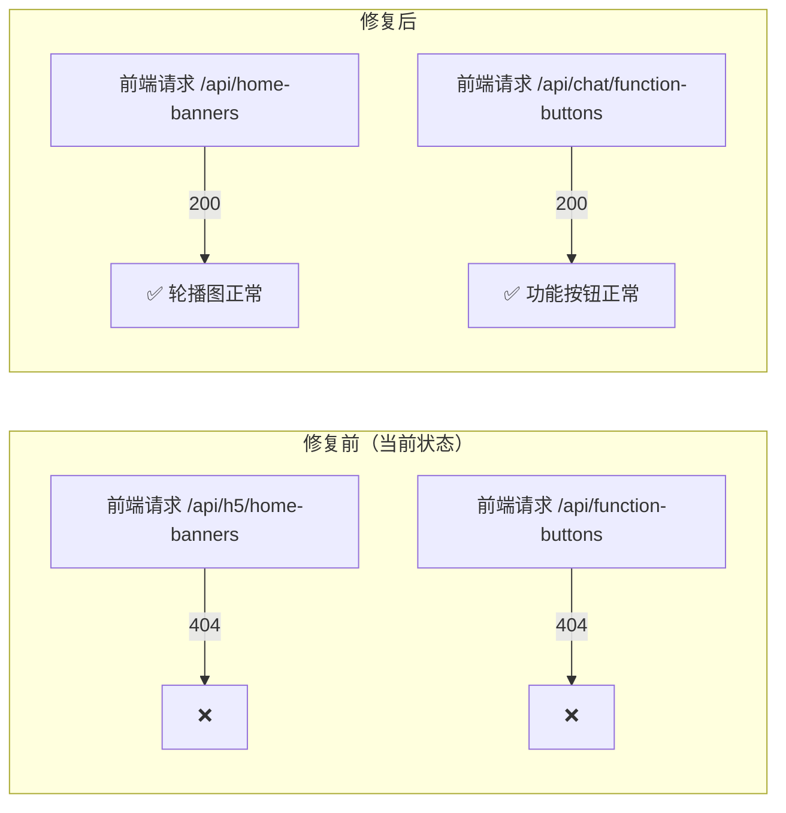

# bini-health AI 对话版首页轮播图与菜单不显示 Bug 修复方案文档

## 1. Bug 发生背景

### 1.1 项目概述

bini-health 是一套健康管理平台，用户端（H5）近期完成了全面改版——新增 **AI 对话模式**作为首屏默认体验。改版后用户端支持两种模式切换：

- **AI 对话模式（新版）**：首屏为 AI 对话界面，顶部展示轮播图、六宫格功能卡片和快捷菜单
- **菜单模式（旧版）**：传统的四 Tab 底部导航布局

### 1.2 涉及功能模块

| 模块 | 说明 |
|------|------|
| H5 用户端 — AI 对话首页 | `ai-home` 页面，负责展示轮播图、六宫格功能卡片、底部快捷标签栏 |
| H5 用户端 — 旧版菜单首页 | `tabs/home` 页面（正常工作，作为对照参考） |
| 后端 — 首页配置 API | `home_config.py`，提供轮播图数据接口 |
| 后端 — 功能按钮 API | `function_button.py`，提供功能按钮数据接口 |

### 1.3 发现时间与发现方式

用户在后台已配置好轮播图和功能按钮数据的前提下，切换到 AI 对话版本后，发现首页上方的轮播图、六宫格功能卡片和底部快捷标签栏全部消失。旧版菜单模式下这些内容显示正常。

---

## 2. Bug 描述

### 2.1 错误现象

AI 对话版首页存在 **三个组件完全不显示** 的问题：

| 组件 | 具体表现 |
|------|----------|
| **轮播图** | 区域完全不显示，连占位空间都没有，页面上看不到任何轮播相关的痕迹 |
| **六宫格功能卡片** | 完全不显示（如：查报告、查用药、健康档案等功能入口消失） |
| **底部快捷标签栏** | 完全不显示 |

关键特征：

- 这些内容在**旧版菜单模式**下显示正常
- **切换到 AI 对话版本后**才出现此问题
- 后台**已经配置过**轮播图和功能按钮的数据

### 2.2 重现步骤

| 步骤 | 操作 | 预期结果 | 实际结果 |
|------|------|----------|----------|
| 1 | 在 Admin 后台配置好轮播图和功能按钮数据 | 数据保存成功 | 数据保存成功 ✅ |
| 2 | 将用户端切换为"AI 对话模式" | 模式切换成功 | 模式切换成功 ✅ |
| 3 | 打开 H5 用户端首页（进入 ai-home 页面） | 顶部显示轮播图、六宫格功能卡片和快捷标签栏 | **三个组件全部不显示，页面上完全看不到** ❌ |
| 4 | 切回旧版菜单模式，打开 tabs/home 页面 | 轮播图和菜单正常显示 | 轮播图和菜单正常显示 ✅ |

### 2.3 影响范围

- **受影响页面**：AI 对话模式首页（ai-home），这是新版用户端的默认首屏
- **受影响功能**：轮播图展示、功能快捷入口（六宫格）、底部快捷标签栏——均为首页核心导航组件
- **受影响用户**：所有使用 AI 对话模式的终端用户
- **旧版不受影响**：菜单模式首页（tabs/home）一切正常

---

## 3. 根因分析

### 3.1 直接原因：前端 API 请求路径与后端路由不匹配

经过代码比对，AI 对话版首页（ai-home）中请求的两个接口路径，与后端实际注册的路由路径**均不一致**，导致请求返回 404 错误。

**详细路径对比表：**

| 组件 | AI 首页前端请求路径 | 后端实际路由 | 旧版首页前端请求路径 | 问题说明 |
|------|-------------------|-------------|--------------------|---------| 
| 轮播图 | `/api/h5/home-banners` | `/api/home-banners` | `/api/home-banners` | AI 首页多了 `h5/` 前缀，导致 404 |
| 功能按钮 | `/api/function-buttons` | `/api/chat/function-buttons` | 不适用（旧版用 `/api/home-menus`） | AI 首页少了 `chat/` 前缀，导致 404 |

### 3.2 间接原因：前端静默 catch 导致无占位区域

AI 首页代码中，两个接口请求都使用了 `.catch(() => {})` 进行静默错误处理——404 错误被捕获后，数据数组被赋值为空数组。

由于前端渲染逻辑为：

- `banners.length > 0` 时才渲染轮播图区域
- `funcButtons.length > 0` 时才渲染功能按钮区域

空数组导致条件判断为 false，因此**连占位区域都不会渲染**，用户看到的就是完全消失、毫无痕迹的效果。

### 3.3 数据来源确认

用户确认：**两种模式共用同一套后台配置数据**。也就是说轮播图和功能按钮在 AI 对话模式和菜单模式下应显示相同的内容，不需要单独的数据源。

---

## 4. 预期正确效果

修复完成后，AI 对话版首页应实现以下效果：

| 组件 | 预期表现 |
|------|----------|
| **轮播图** | 在页面顶部正常展示后台配置的轮播图，与旧版菜单模式显示内容一致 |
| **六宫格功能卡片** | 正常展示后台配置的功能按钮（如查报告、查用药、健康档案等），可点击跳转 |
| **底部快捷标签栏** | 正常展示快捷标签，可点击使用 |
| **数据源** | 与旧版菜单模式共用同一套后台配置数据，无需单独维护 |

---

## 5. 修复方案

### 5.1 修复内容总览

本次 Bug 修复只需调整 **1 个前端文件** 中的 **2 处 API 请求路径**，无需改动后端代码，无需改动数据库，无需新增接口。

### 5.2 具体修复点

#### 修复点 1：轮播图 API 路径纠正

| 项目 | 内容 |
|------|------|
| **修复文件** | H5 用户端 — AI 对话首页页面组件 |
| **修复位置** | 轮播图数据请求的 API 路径 |
| **当前错误值** | `/api/h5/home-banners` |
| **修复为** | `/api/home-banners` |
| **修复原因** | 去掉多余的 `h5/` 前缀，与后端 `home_config.py` 中注册的路由路径保持一致 |

#### 修复点 2：功能按钮 API 路径纠正

| 项目 | 内容 |
|------|------|
| **修复文件** | H5 用户端 — AI 对话首页页面组件（同上） |
| **修复位置** | 功能按钮数据请求的 API 路径 |
| **当前错误值** | `/api/function-buttons` |
| **修复为** | `/api/chat/function-buttons` |
| **修复原因** | 补上缺失的 `chat/` 前缀，与后端 `function_button.py` 中注册的路由路径保持一致 |

### 5.3 不需要改动的部分

| 部分 | 原因 |
|------|------|
| 后端接口代码 | 后端路由本身没有问题，旧版首页一直正常调用 |
| 数据库 | 数据已存在且旧版正常读取，无需任何数据迁移或修改 |
| Admin 后台 | 后台配置功能正常，两种模式共用数据源 |
| 旧版菜单首页 | 旧版路径正确、功能正常，不做任何改动 |

---

## 6. 验证方案

修复部署后，按以下步骤验证：

| 步骤 | 验证操作 | 预期结果 |
|------|----------|----------|
| 1 | 确保 Admin 后台已配置轮播图和功能按钮数据 | 数据存在 |
| 2 | 将用户端切换为 AI 对话模式，打开首页 | 页面正常加载 |
| 3 | 查看轮播图区域 | 轮播图正常展示，图片和链接均可用 |
| 4 | 查看六宫格功能卡片 | 功能按钮正常展示，点击可跳转对应页面 |
| 5 | 查看底部快捷标签栏 | 标签栏正常展示，点击可使用 |
| 6 | 切回旧版菜单模式，检查首页 | 旧版首页功能不受影响，一切正常 |
| 7 | 打开浏览器开发者工具 Network 面板，确认两个接口返回 200 | 无 404 错误 |

---

## 7. 补充说明

- 本 Bug 属于**前端接口路径拼写错误**，根因简单明确，修复改动量极小（仅修改 2 个字符串），不涉及任何逻辑变更
- 修复不会影响任何现有功能（旧版首页、后端接口、Admin 后台均无需改动）
- 两种模式共用同一套后台配置数据，修复后无需额外配置即可生效
