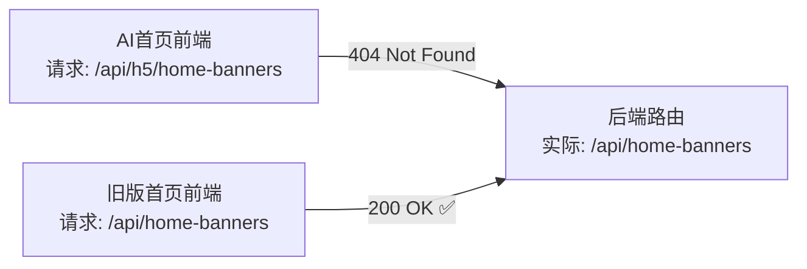

# AI 对话版首页轮播图、功能菜单不显示 — Bug 修复方案文档

## 1. Bug 发生背景

### 1.1 项目概述

本项目为 **bini-health 健康管理平台**，包含用户端（H5）、管理后台（Admin）、后端 API 等多端。用户端近期完成了一次**全面改版**——新增了"AI 对话模式"，首屏为 AI 对话界面，替代了原有的四 Tab 底部导航菜单模式。

### 1.2 涉及功能模块

- **AI 对话首页**（`ai-home` 页面）：用户进入 H5 端后的默认首页
- **轮播图 / 健康贴士**：首页顶部蓝色卡片区域，展示健康贴士内容（数据来源为后台 Banner 配置）
- **六宫格功能菜单**：首页中间区域，展示 AI 诊室、看报告、健康档案等功能入口
- **底部快捷标签栏**：输入框上方的横向滚动标签（体检解读、用药查询、饮食建议等）

### 1.3 发现时间与发现方式

用户在切换到 AI 对话版本后发现首页轮播图、功能菜单、快捷标签栏全部不显示。旧版菜单模式下这些内容均正常可见。

---

## 2. Bug 描述

### 2.1 错误现象

- **轮播图区域完全不显示**：连占位都没有，页面上看不到任何轮播/健康贴士相关的痕迹
- **六宫格功能卡片完全不显示**：AI 诊室、看报告、健康档案等功能入口消失
- **底部快捷标签栏完全不显示**：体检解读、用药查询、饮食建议等标签消失
- 这些内容在旧版菜单模式下**均正常显示**，切到 AI 对话版本后全部不可见
- 后台**已配置过**轮播图和功能按钮的数据

### 2.2 重现步骤

| 步骤 | 操作 | 预期结果 | 实际结果 |
|------|------|----------|----------|
| 1 | 打开 H5 用户端，进入 AI 对话模式首页 | 顶部显示问候语 + 蓝色健康贴士卡片 | 只显示问候语，贴士卡片不可见 |
| 2 | 继续向下查看 | 显示六宫格功能菜单（AI诊室、看报告、健康档案） | 功能菜单完全不可见 |
| 3 | 查看输入框上方 | 显示底部快捷标签栏（体检解读、用药查询、饮食建议） | 快捷标签栏完全不可见 |
| 4 | 切换回旧版菜单模式首页 | 轮播图和菜单正常显示 | 确实正常显示（旧版不受影响） |

### 2.3 影响范围

- **受影响用户**：所有使用 AI 对话模式的 H5 端用户
- **受影响功能**：轮播图/健康贴士展示、功能菜单入口（AI诊室/看报告/健康档案）、底部快捷操作标签
- **业务影响**：用户无法通过首页快捷入口进入核心功能模块，严重影响用户体验和功能可达性

---

## 3. 根因分析

经过代码检查，确认存在 **三个问题**：

### 问题一：轮播图 API 路径不匹配（请求 404）



| 对比项 | 前端请求路径 | 后端实际路由 |
|--------|-------------|-------------|
| AI 对话首页 | `/api/h5/home-banners` | `/api/home-banners` |
| 旧版菜单首页 | `/api/home-banners` | `/api/home-banners` |

**原因**：AI 首页代码中请求路径多了一层 `/h5` 前缀，导致 404。catch 捕获后赋值空数组，`banners.length > 0` 判断为 false，轮播图区域整块不渲染。

### 问题二：功能菜单的数据源需要调整

根据用户确认，AI 对话首页的三宫格功能菜单（AI 诊室、看报告、健康档案）应使用**后台首页菜单数据**（`home-menus`），而非功能按钮数据（`function-buttons`）。同时菜单项需要显示**灰色说明文字**（如"智能问诊"、"报告解读"、"全家管理"），对齐截图中的 UI 设计。

当前代码的问题：

1. **数据源错误**：前端请求的是 `/api/function-buttons`（且路径还不匹配后端的 `/api/chat/function-buttons`），应改为请求 `/api/home-menus`
2. **缺少说明字段**：当前 `FunctionButton` interface 没有描述/说明字段；改用 `home-menus` 数据后，可利用菜单项的现有字段或扩展字段来展示灰色说明文字

### 问题三：UI 样式与设计稿不一致

对照用户提供的截图，当前代码的 UI 存在以下差异需要修复：

| UI 元素 | 截图设计稿 | 当前代码实现 |
|---------|-----------|-------------|
| 健康贴士 | 蓝色渐变卡片，显示"今日健康贴士"标签 + 标题 + 副标题 | 使用 Swiper 轮播图组件，背景图片模式 |
| 功能菜单 | 三列圆角卡片，图标 + 名称 + 灰色说明文字 | 六列网格，只有图标 + 名称，无说明文字 |
| 空对话状态 | 对话气泡图标 + "还没有对话记录" + 引导文字 | 无此空状态提示 |
| 底部快捷标签 | 带 emoji 图标的圆角标签（体检解读、用药查询、饮食建议等） | 纯文字圆角标签 |

---

## 4. 预期正确效果

修复后，AI 对话首页应完整还原截图中的设计效果：

### 4.1 顶部问候区域

- 左上角显示 AI 助手头像 + "Hi~ XX好 👋" 问候语
- 问候语下方显示"我是您的AI健康顾问小康"

### 4.2 健康贴士卡片（Banner 数据驱动）

- 蓝色渐变背景的圆角卡片
- 左上角显示"今日健康贴士"标签
- 卡片内显示标题（如"春季养生，多喝温水少熬夜"）
- 卡片下方显示副标题/详情（如"每天8杯水，保持身体活力"）
- 数据来源：后台 Banner 配置（`/api/home-banners`），以蓝色卡片样式展示

### 4.3 三宫格功能菜单（Home-menus 数据驱动）

- 三列等宽圆角白色卡片布局
- 每个卡片包含：图标 + 功能名称 + **灰色说明文字**
- 参照截图示例：
  - 🤖 AI诊室 / 灰色：智能问诊
  - 📋 看报告 / 灰色：报告解读
  - 📁 健康档案 / 灰色：全家管理
- 数据来源：后台首页菜单配置（`/api/home-menus`）
- 灰色说明文字取自菜单数据中的字段

### 4.4 空对话状态

- 当没有对话记录时，在功能菜单下方显示：
  - 对话气泡图标
  - "还没有对话记录"
  - "试试在下方输入您的健康问题吧"

### 4.5 底部快捷标签栏

- 输入框上方横向滚动的标签区域
- 每个标签带 emoji 图标 + 文字（如 🔍 体检解读、💊 用药查询、🥗 饮食建议）
- 点击标签触发对应快捷对话
- 数据来源：后台功能按钮配置（`/api/chat/function-buttons`）

### 4.6 底部输入框

- 左侧麦克风按钮
- 中间输入框（placeholder："输入您的健康问题..."）
- 右侧拍照按钮

---

## 5. 修复方案

### 修复项一：修正轮播图 API 路径

**改动文件**：AI 对话首页组件

**改动内容**：

将 Banner 请求路径从 `/api/h5/home-banners` 改为 `/api/home-banners`，与后端路由对齐。

```
// 修复前
api.get('/api/h5/home-banners')

// 修复后
api.get('/api/home-banners')
```

### 修复项二：功能菜单改用 home-menus 数据源

**改动文件**：AI 对话首页组件

**改动内容**：

1. 将功能菜单的数据请求从 `/api/function-buttons` 改为 `/api/home-menus`
2. 更新前端 interface 以匹配 `home-menus` 的数据结构
3. 在菜单卡片中新增灰色说明文字的展示

home-menus 后端返回的数据字段：

| 字段 | 类型 | 说明 |
|------|------|------|
| id | int | 主键 |
| name | str | 菜单名称（如"AI诊室"） |
| icon_type | str | 图标类型（emoji/image） |
| icon_content | str | 图标内容（如 emoji 或图片 URL） |
| link_type | str | 链接类型 |
| link_url | str | 链接地址 |
| sort_order | int | 排序 |
| is_visible | bool | 是否可见 |

> **关于灰色说明文字**：当前 home-menus 数据结构中没有专门的"说明/description"字段。需要在后端模型和管理后台中为菜单项**新增一个 `description` 字段**，用于存储灰色说明文字（如"智能问诊"、"报告解读"、"全家管理"）。

### 修复项三：底部快捷标签改用正确的 API 路径

**改动文件**：AI 对话首页组件

**改动内容**：

底部快捷标签栏继续使用功能按钮数据，但需修正 API 路径：

```
// 修复前
api.get('/api/function-buttons')

// 修复后
api.get('/api/chat/function-buttons')
```

### 修复项四：Banner 改为蓝色健康贴士卡片样式

**改动文件**：AI 对话首页组件

**改动内容**：

将当前的 Swiper 轮播图（背景图片模式）改为蓝色渐变卡片样式，显示：

- "今日健康贴士" 标签
- Banner 标题文字（大号白色字体）
- Banner 副标题/描述文字（小号白色字体）

### 修复项五：新增空对话状态提示

**改动文件**：AI 对话首页组件

**改动内容**：

在功能菜单下方、对话区域中，当 `messages.length === 0` 时显示：

- 对话气泡图标（💬）
- "还没有对话记录"
- "试试在下方输入您的健康问题吧"

### 修复项六：后端新增菜单 description 字段

**改动文件**：后端 Model、Schema、管理端 API

**改动内容**：

1. 在 `HomeMenuItem` 模型中新增 `description` 字段（可选，String 类型）
2. 在对应的 Schema（`HomeMenuItemCreate`、`HomeMenuItemUpdate`、`HomeMenuItemResponse`）中加入 `description` 字段
3. 管理后台菜单编辑页面增加"说明文字"输入框
4. 数据库执行 migration 添加字段

### 修复项七：底部快捷标签增加 emoji 图标

**改动文件**：AI 对话首页组件

**改动内容**：

在底部快捷标签中，显示功能按钮的图标（取自 `icon_url` 或 `icon` 字段），实现截图中带 emoji 的标签效果。

---

## 6. 修复涉及的文件清单

| 序号 | 端 | 文件 | 改动说明 |
|------|-----|------|---------|
| 1 | H5 前端 | AI 对话首页组件 | 修正 API 路径、改用 home-menus 数据源、UI 样式对齐设计稿 |
| 2 | 后端 | 数据库模型文件 | HomeMenuItem 新增 description 字段 |
| 3 | 后端 | Schema 文件 | 菜单相关 Schema 新增 description 字段 |
| 4 | Admin 前端 | 首页菜单管理页 | 菜单编辑表单新增"说明文字"输入框 |

---

## 7. 补充说明

- 修复后，AI 对话版首页与旧版菜单模式**共用同一套后台配置数据**（Banner 共用、菜单共用），无需单独维护两套配置
- Banner 在旧版首页以图片轮播形式展示，在 AI 对话首页以蓝色卡片形式展示，数据相同、展示形态不同
- 功能菜单使用 `home-menus` 数据，底部快捷标签使用 `function-buttons` 数据，两者是不同的数据源
- 后端新增的 `description` 字段为可选字段，不影响旧版首页和管理后台的现有功能
- 修复完成后需在管理后台为各菜单项补充灰色说明文字内容
