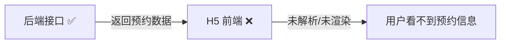
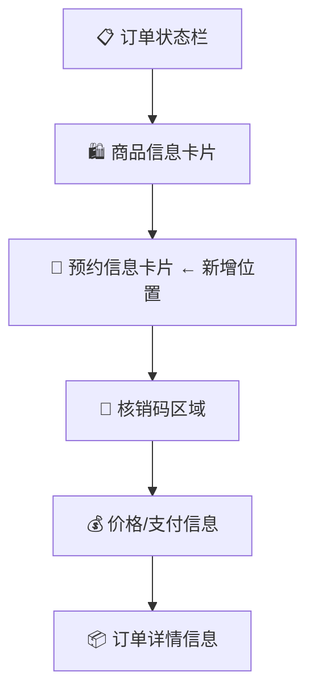

# H5 客户端订单详情页预约信息缺失 — Bug 修复方案文档

## 1. Bug 发生背景

### 1.1 项目概述

本项目是一个健康服务类商城平台，包含多端客户端（Flutter APP、H5 Web、微信小程序）和商户管理端。用户可通过各端下单购买健康服务商品，支持到店核销和物流配送两种履约方式，到店核销类商品支持预约功能。

### 1.2 涉及功能模块

- **H5 Web 客户端** — 统一订单详情页（`unified-order/[id]`）
- **预约信息展示模块** — 展示用户下单时选择的预约时间和预约门店

### 1.3 发现时间与发现方式

用户在使用 H5 网页版查看订单时，发现订单详情页中完全看不到预约信息（预约时间、预约门店等），由用户主动反馈发现。

## 2. Bug 描述

### 2.1 错误现象

H5 Web 客户端的订单详情页（`unified-order/[id]/page.tsx`）**完全缺失预约信息展示模块**：

- 页面 UI 中没有任何预约信息相关的渲染区域
- `OrderDetail` 接口类型定义中未包含预约相关字段
- 页面未从后端接口获取或展示预约数据

而后端接口本身**已经返回了预约数据**，问题出在 H5 前端未对接和渲染。



### 2.2 重现步骤

| 步骤 | 操作 | 预期结果 | 实际结果 |
|------|------|----------|----------|
| 1 | 用户在 H5 网页版下单购买到店核销类商品，并选择预约时间和门店 | 下单成功 | 下单成功 ✅ |
| 2 | 进入「我的订单」列表，点击该订单查看详情 | 订单详情页正常加载 | 订单详情页正常加载 ✅ |
| 3 | 查看订单详情页中的预约信息 | 应显示预约时间和预约门店名称 | **页面中完全没有预约信息区域** ❌ |

### 2.3 影响范围

- **受影响端**：H5 Web 客户端（浏览器 / WebView 访问）
- **受影响用户**：所有通过 H5 网页版查看订单的用户
- **受影响场景**：到店核销类商品的订单详情查看
- **不受影响**：Flutter APP 端订单详情页预约信息展示正常

## 3. 预期正确效果

修复后，H5 订单详情页应在**商品信息卡片下方、核销码区域上方**新增一个预约信息卡片，具体要求如下：

### 3.1 展示内容

- **预约时间**：日期 + 时间段（如「2026-04-29 14:00-15:00」）
- **预约门店名称**：门店名称（如「xxx 健康中心（朝阳店）」）

### 3.2 展示位置



该位置符合主流平台（美团、抖音团购、支付宝口碑等）的设计惯例，形成「买了什么 → 约了什么时间去哪里 → 到店凭码」的自然阅读流。

### 3.3 展示样式

采用**带图标的信息行卡片**样式：

- 使用一个独立的白色圆角卡片区域，标题为「预约信息」
- 每行前面带一个语义化图标：
  - 📅 **日历图标** + 预约时间（时间文字使用蓝色高亮 `#1677ff`）
  - 📍 **定位图标** + 门店名称（门店名称使用正常深色文字）
- 整体风格与当前 H5 订单详情页已有的白色圆角卡片风格保持一致

```
┌─────────────────────────────────────┐
│  预约信息                            │
│                                     │
│  📅  2026-04-29  14:00 - 15:00      │  ← 蓝色高亮
│  📍  xxx健康中心（朝阳店）            │  ← 正常深色
└─────────────────────────────────────┘
```

### 3.4 无预约信息时的处理

当订单没有预约信息时（如纯物流配送商品），**直接隐藏**预约信息卡片区域，不显示任何占位提示。

## 4. 补充说明

### 4.1 技术要点

- 后端接口已返回预约数据，前端只需在 `OrderDetail` 接口类型中补充预约相关字段（预约时间、门店名称等），并在页面中渲染即可
- 需要检查后端返回的预约数据字段名称，确保前端正确解析
- 卡片区域需做条件判断：只有当预约数据存在时才渲染

### 4.2 设计参考

- 卡片风格与页面现有的商品信息卡片、核销码卡片保持一致（白色圆角、内边距统一）
- 图标建议使用 antd-mobile 内置图标或 SVG 图标，确保在不同设备上的清晰度
- 蓝色高亮色值：`#1677ff`（与 antd 主色一致）

### 4.3 跨端一致性

本次修复仅涉及 H5 Web 客户端。Flutter APP 端已有预约信息展示且正常，无需修改。
