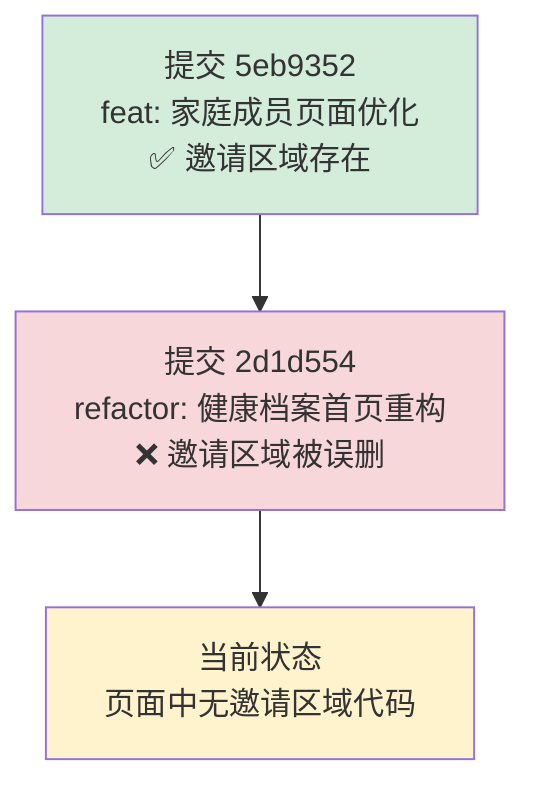
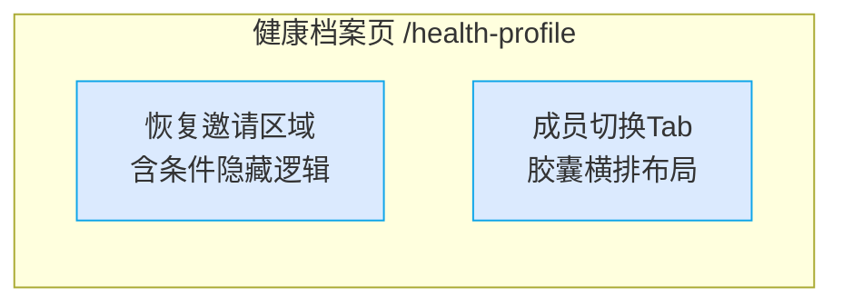

# 贝尼健康 — 健康档案邀请区域丢失 & 成员切换Tab优化 Bug 修复方案文档

## 1. Bug 发生背景

### 1.1 项目概述

贝尼健康（Bini Health）是一款面向家庭的健康管理系统，提供健康档案管理、家庭成员守护、AI 外呼提醒等功能。用户可通过 H5 端管理自己和家人的健康数据。

### 1.2 涉及功能模块

- **健康档案页**（`/health-profile`）：包含成员切换 Tab、Hero 信息卡、邀请家人区域等
- **成员切换 Tab 组件**：位于页面顶部，用于切换不同家庭成员的健康档案视图

### 1.3 发现时间与发现方式

- 发现时间：2026年5月22日
- 发现方式：用户在提交家庭成员页面优化需求后，对照 PRD 文档检查页面时发现邀请区域缺失

---

## 2. Bug 描述

### 2.1 错误现象

**Bug 1 — 邀请区域丢失**

健康档案页（`/health-profile`）中，原本位于 Hero 卡片正下方的「邀请家人加入守护计划」区域完全不见了，页面上没有任何邀请入口。

**Bug 2 — 成员切换 Tab 布局问题（优化项）**

当前成员切换 Tab 采用竖向卡片布局（头像在上、文字在下），单个 Tab 高度约 96px，占用页面空间过大，尤其在成员较多时横向拥挤。

### 2.2 重现步骤

| 步骤 | 操作 | 预期结果 | 实际结果 |
|------|------|----------|----------|
| 1 | 登录系统，进入健康档案页 | Hero 卡片下方显示「邀请家人加入守护计划」区域 | 邀请区域完全不存在 |
| 2 | 在成员切换条中切换到「本人」或未守护成员 | 邀请区域正常显示 | 邀请区域不存在，无论切换到任何成员 |
| 3 | 查看成员切换 Tab 的空间占用 | Tab 应紧凑合理 | Tab 高度 96px，占用空间过大 |

### 2.3 影响范围

- **功能影响**：用户无法在健康档案页快速触达「邀请家人共管」入口，降低了家庭成员绑定转化率
- **体验影响**：成员切换 Tab 占用过多纵向空间，减少了核心内容的可视面积
- **影响页面**：健康档案页（`/health-profile`）

### 2.4 根因分析



在提交 `2d1d554`（健康档案首页重构 — 单页平铺折叠式布局）中，页面代码被大面积重写（990 行新增、745 行删除），重构过程中**将原本位于 `renderHero()` 正下方的邀请区域代码整段遗漏**，未迁移到新版本中。

---

## 3. 预期正确效果

### 3.1 Bug 1 修复 — 邀请区域恢复

修复后，健康档案页 Hero 卡片正下方应出现邀请区域，具体设计规格如下：

#### 视觉设计

| 属性 | 规格 |
|------|------|
| 背景色 | 纯白色（`#FFFFFF`） |
| 左侧装饰 | 4px 宽天蓝色竖条（`#0EA5E9`） |
| 圆角 | 12px |
| 投影 | 轻投影（`0 2px 8px rgba(0,0,0,0.06)`） |
| 内边距 | 16px |
| 外边距 | 距 Hero 卡片下方 12px |

#### 内容布局

```
┌──────────────────────────────────────────────┐
│▌💙  邀请家人加入守护计划          去邀请 ›   │
│▌     远程监督用药、健康异常提醒              │
└──────────────────────────────────────────────┘
 ↑                                          ↑
 左侧4px天蓝竖条                    文字链按钮(#0EA5E9)
```

- **左侧图标**：💙 emoji
- **主标题**：「邀请家人加入守护计划」— 字号 15px，字重 600，颜色 `#1E293B`
- **副标题**：「远程监督用药、健康异常提醒」— 字号 13px，颜色 `#64748B`
- **右侧按钮**：「去邀请 ›」文字链 — 字号 14px，颜色 `#0EA5E9`，字重 500
- **点击行为**：点击后跳转到邀请流程页面

#### 条件隐藏逻辑

| 当前选中成员状态 | 邀请区域显示 |
|------------------|--------------|
| `guard_status === 'self'`（本人） | ✅ 显示 |
| `guard_status === 'unguarded'`（未守护） | ✅ 显示 |
| `guard_status === 'guarded'`（已守护） | ❌ 隐藏 |

- 隐藏/显示过渡动效：`opacity + height`，300ms ease，无闪烁

---

### 3.2 Bug 2 修复 — 成员切换 Tab 布局优化

将成员切换 Tab 从竖向卡片布局改为**胶囊横排布局**：

#### 改动对比

| 维度 | 当前（竖向卡片） | 目标（胶囊横排） |
|------|-----------------|-----------------|
| 布局方向 | 纵向（头像上、文字下） | 横向（头像左、文字右） |
| 单项高度 | ~96px | ~42px（↓56%） |
| 头像尺寸 | 48px 圆形 | 28px 圆形 |
| 外形 | 独立方块卡片 | 胶囊药丸形 |
| 选中态 | 底部蓝色指示条 | 天蓝色填充背景 + 白色文字 |
| 未选中态 | 灰底 | 浅灰底（`#F1F5F9`）+ 深灰文字 |

#### 胶囊单元规格

```
┌─────────────────────────┐
│  [○头像] 关系/名字       │  ← 高度 36px，圆角 18px（全圆角胶囊）
└─────────────────────────┘
```

- **头像**：28px 圆形，紧贴左侧
- **文字**：关系 + 名字（如"爸爸 张三"），字号 13px
- **选中态**：背景 `#0EA5E9`，文字 `#FFFFFF`
- **未选中态**：背景 `#F1F5F9`，文字 `#64748B`
- **胶囊间距**：8px
- **容器**：横向滚动，支持多成员横滑

#### "守护中"角标

- 已守护成员的胶囊右上角保留「守护中」角标
- 角标样式：背景 `#0EA5E9`，文字 `#FFFFFF`，字号 10px，圆角胶囊
- 位置：`position: absolute`，右上角偏移

---

## 4. 补充说明

### 4.1 修复范围汇总

本次修复涉及以下两个改动，统一在一次修复中全量完成：



### 4.2 涉及文件

- 健康档案页主组件（page.tsx）
- 成员切换 Tab 相关渲染函数

### 4.3 交互动效规格

| 动效 | 参数 |
|------|------|
| 邀请区域显示/隐藏 | `opacity 0→1 + max-height 0→120px`，`300ms ease` |
| Tab 选中态切换 | `background-color + color`，`200ms ease` |
| 胶囊 Tab 横向滚动 | 原生 `overflow-x: auto`，隐藏滚动条 |

### 4.4 兼容性要求

- 适配 iOS / Android 微信内置浏览器
- 适配主流移动端浏览器（Safari、Chrome）
- 适配屏幕宽度 320px ~ 428px
- 胶囊 Tab 在窄屏下支持横向滚动，邀请区域自适应宽度
