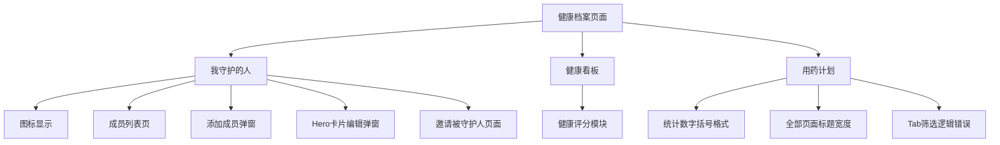
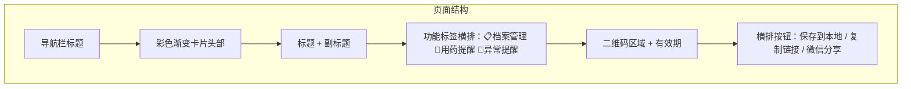
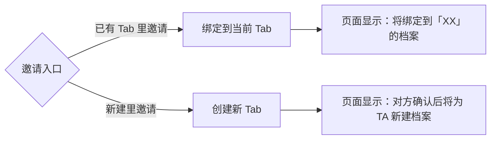
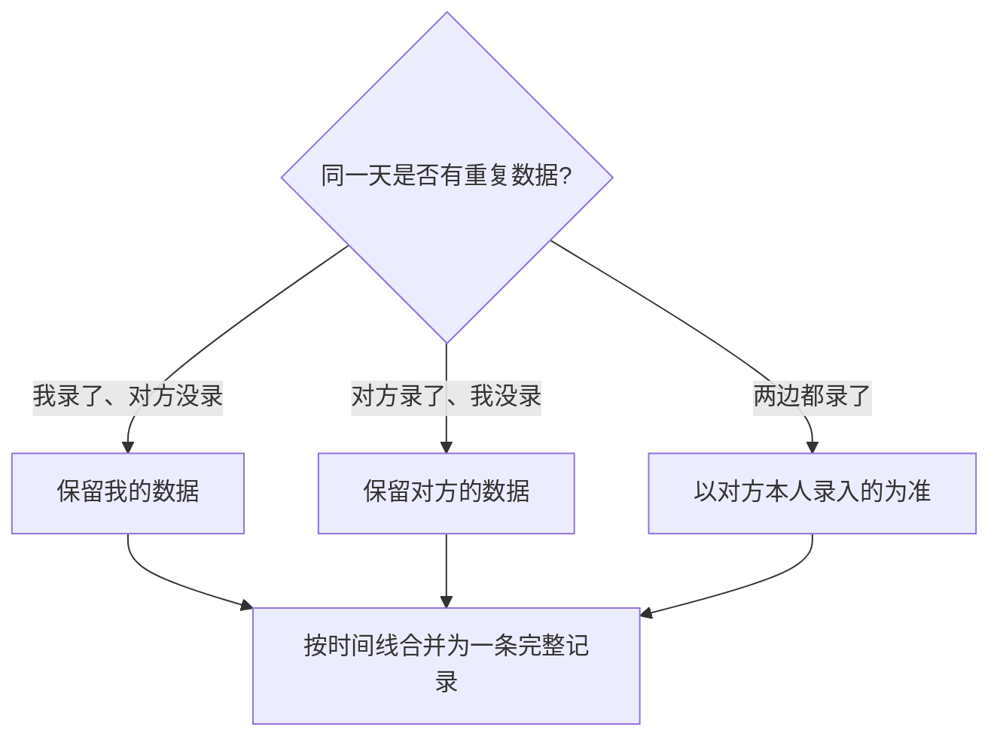

# 健康档案页面问题修复 Bug 修复方案文档

## 1. Bug 发生背景

### 1.1 项目概述

本项目为 bini-health 健康管理平台，主要包含后端（FastAPI + SQLAlchemy + MySQL）、H5 前端（Next.js + React + Ant Design Mobile）、小程序端等多端架构。

健康档案模块是产品核心功能之一，涵盖家庭成员管理、健康看板、用药计划、守护关系管理等子功能。

### 1.2 涉及功能模块



### 1.3 发现时间与发现方式

- 发现时间：2026年5月24日
- 发现方式：用户使用过程中发现多处UI与逻辑问题

---

## 2. Bug 描述

### Bug 1：「我守护的人」图标错误

#### 2.1 错误现象

健康档案首页「我守护的人」入口当前使用的是 🛡️ 盾牌图标，与功能语义不匹配。

#### 2.2 重现步骤

| 步骤 | 操作 | 预期结果 | 实际结果 |
|------|------|----------|----------|
| 1 | 打开健康档案页面 | 「我守护的人」显示家庭头像（3人图标） | 显示为盾牌图标 🛡️ |

#### 2.3 影响范围

健康档案首页入口视觉呈现，影响用户对功能的直觉理解。

---

### Bug 2：健康看板「健康评分」模块需移除

#### 2.1 错误现象

健康看板中的「健康评分」模块当前使用了一套自定义评分规则，但该规则存在多项权威性与合理性问题：

| 评分维度 | 权重 | 存在问题 |
|----------|------|----------|
| 血压指标 | 25分 | 无数据=0分，用户不测血压但健康也会低分 |
| 血糖指标 | 25分 | 同上，且权重分配无临床依据 |
| 心率指标 | 15分 | 同上 |
| 用药完成度 | 20分 | 仅看7天数据，周期太短 |
| 录入规律性 | 15分 | "勤测数据≠身体好"，逻辑有误 |

**结论**：评分规则缺乏权威医学依据，容易误导用户。

#### 2.2 重现步骤

| 步骤 | 操作 | 预期结果 | 实际结果 |
|------|------|----------|----------|
| 1 | 打开健康看板页面 | 不显示健康评分（待有权威标准后再加回） | 显示了一个不够权威的健康评分模块 |

#### 2.3 影响范围

健康看板核心展示区域，可能误导用户对自身健康状况的判断。

---

### Bug 3：用药计划统计数字括号格式

#### 2.1 错误现象

用药计划标题旁的统计数字多了一层括号，显示为 `(2)` 格式，不够简洁。

#### 2.2 重现步骤

| 步骤 | 操作 | 预期结果 | 实际结果 |
|------|------|----------|----------|
| 1 | 查看健康档案页面用药计划区域 | 数字直接显示，如「用药计划 2」 | 显示为「用药计划 (2)」，多了括号 |

#### 2.3 影响范围

用药计划区域的视觉展示。

---

### Bug 4：用药计划「全部」页面多项问题

#### 2.1 错误现象

**问题 4a：标题太宽**

用药计划「全部」页面的标题栏样式与其他页面不一致，标题过宽。

**问题 4b：Tab 筛选逻辑错误**

后端 `in_progress`（服药中）的过滤条件为：

```
status != deleted AND (long_term == true OR start_date IS NULL OR start_date <= today)
```

该条件没有排除 `status == 'archived'` 的已归档计划，也没有排除 `end_date < today` 的已过期计划。导致：
- 还没开始的计划出现在「服药中」Tab
- 已结束的计划出现在「服药中」Tab

#### 2.2 重现步骤

| 步骤 | 操作 | 预期结果 | 实际结果 |
|------|------|----------|----------|
| 1 | 点击用药计划区域的「全部」 | 进入用药计划列表，标题宽度与其他页面一致 | 标题过宽，与其他页面不一致 |
| 2 | 查看「服药中」Tab | 仅显示当前正在服药的计划 | 包含了未开始和已结束的计划 |
| 3 | 查看「未开始」Tab | 显示尚未开始的计划 | 统计维度错误 |
| 4 | 查看「已结束」Tab | 显示已完成的计划 | 统计维度错误 |

#### 2.3 影响范围

用药计划管理的核心筛选逻辑，影响用户对当前用药状态的准确判断。

---

### Bug 5：「我守护的人」详情页多项问题

#### Bug 5.1：标题格式错误

**错误现象**：当前标题为「家庭成员」，需要改为「我守护的人(守护者：XX)」，XX 为当前登录用户的名字。

| 步骤 | 操作 | 预期结果 | 实际结果 |
|------|------|----------|----------|
| 1 | 点击「我守护的人」进入详情页 | 标题显示「我守护的人(守护者：XX)」 | 标题显示「家庭成员」 |

#### Bug 5.2：添加成员弹窗多项问题

**问题 5.2a：标题文案**

「添加家庭成员」需改为「添加成员」。

**问题 5.2b：表单布局**

当前标签在上方、输入框在下方的两行布局，需改为标签和输入在同一行。

**问题 5.2c：出生日期规则错误**

用户45岁（约1981年出生），选择「爸爸」关系时，代码中 `birthYearOffset` 的计算方向写反了——用 `selfBirthYear + 25 = 2006` 代替了正确的 `selfBirthYear - 25 = 1956`。正号意味着年份更大（更年轻），**方向反了**。

| 步骤 | 操作 | 预期结果 | 实际结果 |
|------|------|----------|----------|
| 1 | 打开添加成员弹窗 | 标题为「添加成员」 | 标题为「添加家庭成员」 |
| 2 | 查看表单布局 | 标签和输入框在同一行 | 标签在上、输入框在下 |
| 3 | 选择关系为「爸爸」 | 出生日期默认约为1956年 | 出生日期默认为2006年（方向反了） |

**注意**：此弹窗（`NewFamilyMemberModal` 组件）在两处复用：
- 「我守护的人」详情页右上角的 `+` 按钮
- AI 首页左下角「选择咨询人」里的「新建」

两处需一起修改。

#### Bug 5.3：Hero 卡片编辑弹窗没自适应

**错误现象**：编辑个人档案的弹窗在小屏手机上字段布局挤压变形、内容溢出。

| 步骤 | 操作 | 预期结果 | 实际结果 |
|------|------|----------|----------|
| 1 | 点击 Hero 卡片右上角「编辑」 | 弹窗在各尺寸手机上正常适配 | 小屏手机上字段挤压变形、内容溢出 |

---

### Bug 6：邀请页面文案与跳转问题

#### Bug 6.1：邀请区域文案不统一

**涉及两处邀请入口：**

| 入口位置 | 当前标题 | 当前说明 |
|----------|----------|----------|
| 健康档案主页 Tab 下方横幅 | 邀请家人加入守护计划 | 远程监督用药、健康异常提醒 |
| 添加成员弹窗顶部横幅 | 邀请家人加入健康守护计划 | 共同管理家庭健康档案 |

两处文案不统一，且未准确表达「邀请对方成为我守护的人」这一核心含义。

**统一后的文案：**

| 元素 | 统一文案 |
|------|----------|
| 标题 | **邀请 TA 成为我守护的人** |
| 说明 | **管理健康档案、监督用药、异常提醒** |
| 按钮 | **去邀请** |

#### Bug 6.2：Tab 下方「去邀请」跳转缺少参数

**错误现象**：健康档案主页 Tab 下方的「去邀请」按钮跳转到 `/family-invite` 页面时**没有传递 `member_id` 参数**，导致页面报错「未找到要邀请的成员」。

**修复方案**：跳转时自动携带当前选中 Tab 对应的成员 ID。

| 步骤 | 操作 | 预期结果 | 实际结果 |
|------|------|----------|----------|
| 1 | 在某个成员 Tab 下点击「去邀请」 | 正确打开邀请页面并生成该成员的邀请二维码 | 页面报错「未找到要邀请的成员」 |

---

## 3. 预期正确效果

### 3.1 Bug 1 修复后

「我守护的人」入口图标改为家庭头像（3人图标 👨‍👩‍👧），直观表达家庭成员管理的含义。

### 3.2 Bug 2 修复后

健康看板页面**暂时移除「健康评分」模块**，等将来有权威评分标准后再加回来。移除后健康看板只保留其他已确认的数据展示模块。

### 3.3 Bug 3 修复后

用药计划统计数字去掉括号，直接以简洁格式显示数量（如「用药计划 2」）。

### 3.4 Bug 4 修复后

- **标题宽度**：与其他页面标题样式保持一致
- **Tab 筛选逻辑**：后端严格按以下规则过滤：

| Tab | 正确的筛选条件 |
|-----|---------------|
| 服药中 | status = active 且 start_date <= today 且（end_date >= today 或 long_term = true） |
| 未开始 | status = active 且 start_date > today |
| 已结束 | status = archived 或（status = active 且 end_date < today 且 long_term = false） |

### 3.5 Bug 5 修复后

- **5.1**：标题显示为「我守护的人(守护者：XX)」
- **5.2a**：弹窗标题改为「添加成员」
- **5.2b**：名字、性别、出生日期等字段改为标签和输入在同一行的布局
- **5.2c**：出生日期规则修正，选择「爸爸」时默认出生年份 = 本人出生年 - 25（不是 +25）
- **5.2 复用**：`NewFamilyMemberModal` 组件在「我守护的人」和「AI 首页选择咨询人新建」两处同步生效
- **5.3**：Hero 卡片编辑弹窗增加自适应处理，小屏手机上字段不再挤压变形

### 3.6 Bug 6 修复后

- 两处邀请入口文案统一为：标题「邀请 TA 成为我守护的人」 / 说明「管理健康档案、监督用药、异常提醒」
- Tab 下方「去邀请」正确携带 `member_id` 参数跳转到邀请页面

---

## 4. 邀请页面设计方案（新增需求）

### 4.1 邀请页面样式统一

系统中有两个邀请页面，需统一样式（以 `/family-invite` 页面为基准，采用方案 D 设计风格）：

| 页面 | 路由 | 用途 | 主题色 |
|------|------|------|--------|
| 邀请对方成为被守护人 | `/family-invite` | 我邀请 TA 成为被守护人 | 蓝色渐变 |
| 邀请别人守护我 | `/my-guardians/invite` | 我邀请 TA 守护我 | 绿色渐变 |

**统一设计要素（方案 D 风格）：**



**两个页面的文案差异：**

| 元素 | 邀请被守护人 | 邀请 TA 守护我 |
|------|-------------|---------------|
| 标题 | 邀请 TA 成为我守护的人 | 邀请 TA 守护我的健康 |
| 副标题 | 管理健康档案、监督用药、异常提醒 | 让 TA 随时关注我的健康 |
| 功能标签 | 📋 档案管理 / 💊 用药提醒 / 🔔 异常提醒 | 📋 档案管理 / 💊 用药提醒 / 🔔 异常提醒 |
| 操作按钮 | 保存到本地 / 复制链接 / 微信分享（横排） | 保存到本地 / 复制链接 / 微信分享（横排） |

### 4.2 Tab 绑定逻辑

根据邀请入口不同，邀请成功后的处理方式不同：



| 邀请场景 | 入口位置 | 是否已有 Tab | 邀请成功后 | 页面提示 |
|----------|----------|-------------|-----------|----------|
| 在已有 Tab 里邀请 | Tab 下方横幅 | ✅ 已有 | 绑定到当前 Tab，不新建 | 「将绑定到『XX』的档案」 |
| 在新建里邀请 | 添加成员弹窗横幅 | ❌ 没有 | 新建一个 Tab | 「对方确认后将为 TA 新建档案」 |

### 4.3 邀请方式

通过**生成邀请链接/二维码**实现，对方扫码或点击链接后在 App 中确认。

### 4.4 守护关系建立后的数据权限

守护者可以**查看 + 代录入**对方的健康数据，因为是**一份数据、两边共同维护**。

### 4.5 数据合并策略

当「手动建档」与「邀请绑定」产生数据冲突时：



---

## 5. 补充说明

### 5.1 修改范围汇总

| Bug 编号 | 涉及端 | 涉及模块/组件 |
|----------|--------|--------------|
| Bug 1 | H5 前端 | 健康档案首页图标 |
| Bug 2 | H5 前端 | 健康看板 → 健康评分模块 |
| Bug 3 | H5 前端 | 健康档案首页 → 用药计划统计显示 |
| Bug 4a | H5 前端 | 用药计划全部页面 → 标题样式 |
| Bug 4b | 后端 | 用药计划 Tab 筛选逻辑（`medication_plans_v1.py`） |
| Bug 5.1 | H5 前端 | 我守护的人列表页 → 标题 |
| Bug 5.2a | H5 前端 | `NewFamilyMemberModal` 组件 → 标题文案 |
| Bug 5.2b | H5 前端 | `NewFamilyMemberModal` 组件 → 表单布局 |
| Bug 5.2c | H5 前端 | `NewFamilyMemberModal` 组件 → 出生日期规则 |
| Bug 5.3 | H5 前端 | `HealthProfileEditor` 组件 → 自适应 |
| Bug 6.1 | H5 前端 | 两处邀请横幅文案统一 |
| Bug 6.2 | H5 前端 | Tab 下方跳转 → 携带 `member_id` |
| 新增：邀请页面统一 | H5 前端 | `/family-invite` + `/my-guardians/invite` 页面样式统一 |
| 新增：Tab 绑定逻辑 | 后端 + H5 前端 | 邀请确认后的绑定/新建逻辑 |
| 新增：数据合并 | 后端 | 邀请绑定时的数据合并策略 |

### 5.2 两处邀请页面统一保持独立路由

两个邀请场景保持两个独立页面（各自独立路由），只是样式统一。

### 5.3 Tab 横幅显示条件

保持现有逻辑——未关联真实账号的成员，Tab 下方显示邀请横幅。

### 5.4 `NewFamilyMemberModal` 复用说明

该组件在以下两处复用，修改一处即可两处同步生效：
- 「我守护的人」详情页右上角 `+` 按钮
- AI 首页「选择咨询人」→「新建」

### 5.5 代录入数据可见性

守护者代录入的数据对方能看到，但不特别标注来源。因为是一份数据，两边共同维护。
