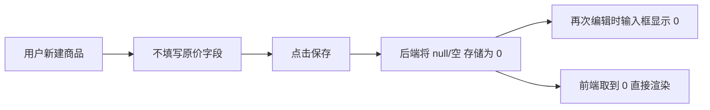
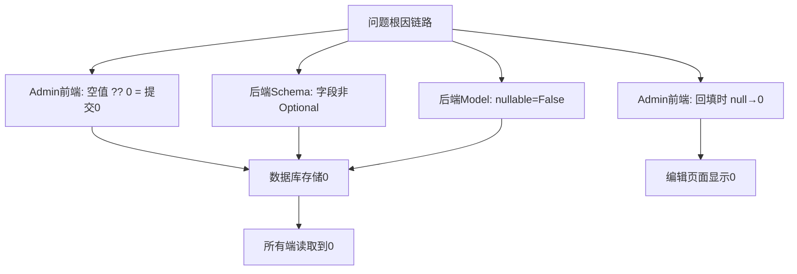

# 商品管理 — 原价为空时显示 0 的 Bug 修复方案文档

## 1. Bug 发生背景

### 1.1 项目概述

本项目为 bini-health 健康管理平台，包含管理后台（Admin Web）、用户端 H5（H5 Web）、后端 API（FastAPI）等多端。商品体系是系统的核心模块之一，支持商品的创建、编辑、展示和购买流程。

### 1.2 涉及功能模块

- **商品管理模块**（商品体系 - 商品管理）
- 涉及端：管理后台 Admin Web、用户端 H5 Web、后端 API

### 1.3 发现时间与发现方式

用户在日常使用中发现：新建商品时不填写原价，保存后再次编辑或在前端展示时，原价字段显示为 0，而非保持为空。

---

## 2. Bug 描述

### 2.1 错误现象

在商品管理中，当新建商品时**不填写原价字段**（原价是选填项，用于划线价展示），保存后系统将原价存储为 `0`，导致：

- 管理后台：编辑商品时，原价输入框中显示 `0`，而不是空白
- 用户端商品详情页：如果原价为 0 且不大于售价，虽然不会展示划线价，但底层数据不正确
- 用户端商品列表页：同上逻辑

### 2.2 重现步骤

| 步骤 | 操作 | 预期结果 | 实际结果 |
|------|------|----------|----------|
| 1 | 管理后台进入"商品管理"，点击新建商品 | 原价输入框为空 | ✅ 原价输入框为空 |
| 2 | 填写商品名称、售价等必填项，**不填写原价** | — | — |
| 3 | 点击保存 | 商品保存成功，原价保持为 null | ❌ 原价被存储为 0 |
| 4 | 再次编辑该商品 | 原价输入框为空 | ❌ 原价输入框显示 0 |
| 5 | 用户端查看该商品 | 不展示划线原价 | 虽然因 0 ≤ 售价未显示划线价，但数据不正确 |

### 2.3 影响范围

- **管理后台编辑体验**：管理员每次编辑商品都会看到一个不该出现的 0，造成困惑
- **数据准确性**：数据库中无法区分"用户未填写原价"和"原价确实为 0"
- **涉及所有已创建的商品**：历史数据中所有未填写原价的商品，原价字段均为 0

---

## 3. 预期正确效果

修复后的正确行为：

| 场景 | 正确表现 |
|------|----------|
| 新建商品不填原价 → 保存 | 数据库中原价字段为 `NULL` |
| 编辑商品（原价未填） | 原价输入框为**空白**，不显示 0 |
| 用户端商品详情页（原价为空） | **完全不展示**划线原价相关内容 |
| 用户端商品列表页（原价为空） | **完全不展示**划线原价相关内容 |
| 管理后台商品列表（原价为空） | 原价列显示为空（如 `—`），而非 0 |

---

## 4. 根因分析

经代码排查，问题出在以下环节：

### 4.1 后端数据模型层

商品模型（`Product`）中 `original_price` 字段定义为 `Numeric(10, 2), nullable=False`，不允许为空，导致未填写时被默认写入 0。

### 4.2 后端 Schema 层

商品创建 Schema 中 `original_price: float` 为必填字段，未设置为 `Optional`，导致前端不传时可能触发默认值逻辑。

### 4.3 前端 Admin 提交逻辑

管理后台提交商品时代码中存在 `original_price: specMode === 1 ? (values.original_price ?? 0) : 0`，将未填写的原价强制转为 0 后提交。

### 4.4 前端数据回填逻辑

编辑商品时代码中存在 `original_price: Number(raw.original_price ?? 0)`，将后端返回的 null 转为 0 展示。

---

## 5. 修复方案

### 5.1 后端修复

#### 5.1.1 数据模型修改

将 `Product` 模型的 `original_price` 字段改为允许为空：

- `original_price = mapped_column(Numeric(10, 2), nullable=True)` 

#### 5.1.2 Schema 修改

将商品创建 Schema 中的 `original_price` 改为可选字段：

- `original_price: Optional[float] = None`

#### 5.1.3 API 层修改

确保创建/更新商品时，如果 `original_price` 为 `None` 或未传入，存储为 `NULL` 而非 0。

#### 5.1.4 数据库迁移 + 历史数据清洗

- 修改表结构：`ALTER TABLE products ALTER COLUMN original_price DROP NOT NULL`
- 清洗历史数据：`UPDATE products SET original_price = NULL WHERE original_price = 0`

### 5.2 管理后台前端修复

#### 5.2.1 提交逻辑修改

将 `original_price: specMode === 1 ? (values.original_price ?? 0) : 0` 改为：

- 当 `values.original_price` 为空/undefined 时，提交 `null`（不再兜底为 0）

#### 5.2.2 数据回填修改

将 `original_price: Number(raw.original_price ?? 0)` 改为：

- 当 `raw.original_price` 为 `null` 或 `0` 时，不强制转为 0，保持为 `undefined`（输入框显示空白）

#### 5.2.3 列表展示修改

如果商品列表中有原价列，当值为 `null` 时显示 `—` 而非 `0`。

### 5.3 用户端 H5 前端修复

#### 5.3.1 商品详情页

当前代码已有判断：`currentOriginPrice && currentOriginPrice > currentSalePrice`，`null` 时不会展示——此处在后端返回 `null` 后即可自动修复。但需确保前端类型定义支持 `null`：

- `original_price: number | null`

#### 5.3.2 商品列表页

当前代码判断为 `p.original_price > p.sale_price`，当值为 `null` 时比较结果为 `false`，不会展示——后端返回 `null` 后即可自动修复。同样需更新类型定义。

---

## 6. 修复优先级与影响评估

| 维度 | 评估 |
|------|------|
| 严重程度 | 低（不影响核心购买流程，但影响管理体验和数据准确性） |
| 修复复杂度 | 低（后端 + 两端前端联动修改，改动点明确） |
| 影响范围 | 商品管理全链路（创建、编辑、列表展示、详情展示） |
| 回归风险 | 低（需确认原价为 null 时不影响下单、购物车等流程） |

---

## 7. 补充说明

- 所有原价为 0 的历史商品数据均为"未填写"，不存在真实原价为 0 元的情况，因此可以安全地将历史数据中的 0 全部清洗为 `NULL`
- 修复后，原价字段语义明确：`NULL` = 未设置划线价，`> 0` = 有划线价
- 用户端遵循"只在用户端不展示，管理后台编辑框保持空白即可"的预期
