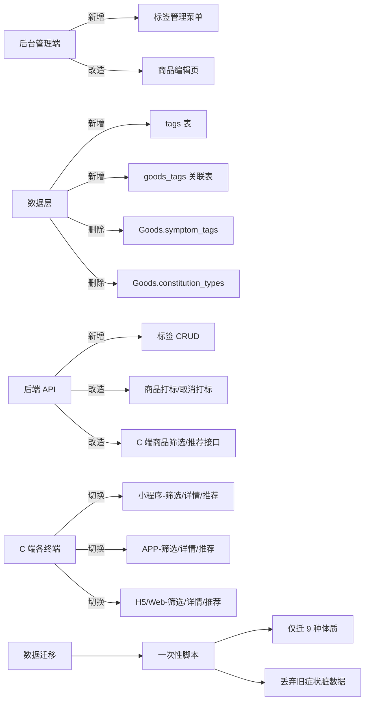
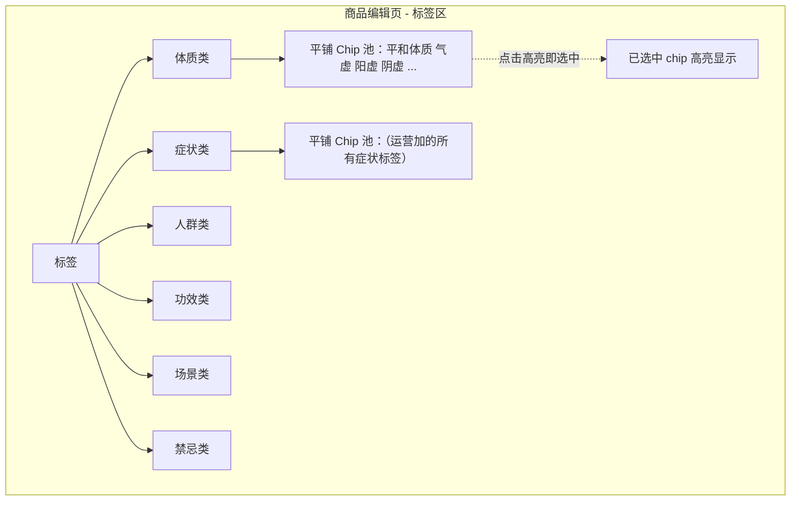
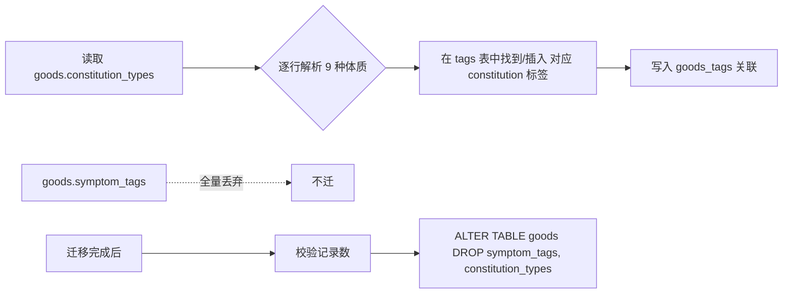

# 商品标签体系重构 Bug 修复方案文档

> 文档版本：v1.0  
> 生成时间：2026-05-20  
> Bug 类型：体系性 Bug（不是单点缺陷，而是「标签体系」从数据结构到前后端 UI、再到 C 端筛选推荐的整条链路都存在的设计性问题）  
> 修复范围：**一期工程，一次性全量修复并上线，不分期不分批**

---

## 1. Bug 发生背景

### 1.1 项目概述

bini-health 是一款以「中医体质 + 健康干预」为核心的健康管理平台，覆盖后台管理端、Web 端、H5、小程序、安卓 APP、苹果 APP 等多端。商品（含实物商品与服务类商品）是平台连接「体质识别」与「健康干预方案」的关键载体——C 端用户基于自身体质、症状、人群属性等维度筛选/被推荐合适的商品，运营在后台为商品打标签。

商品「标签」是整个平台的**核心匹配维度**，几乎所有 C 端商品筛选、相关推荐、详情页"相似商品"、个性化首页都依赖它。

### 1.2 涉及功能模块

本次 Bug 涉及的模块如下（全部包含在本次一期修复范围内）：



| 模块层 | 受影响项 |
|---|---|
| 数据库 | `goods` 表（drop 旧字段）、新建 `tags` 表、新建 `goods_tags` 关联表 |
| 后端 | `Goods` 模型（删字段）、新增 `Tag` / `GoodsTag` 模型、新增标签管理接口、改造商品接口、改造 C 端筛选/推荐接口 |
| 后台前端 | 新增「标签管理」一级菜单；商品编辑页移除旧输入框，改为 Chip 池选择；履约方式为「实物」时隐藏服务特性分类 |
| C 端（小程序 / APP / H5） | 商品列表筛选条件、商品详情页标签展示、相关商品推荐、个性化推荐算法全部切到新标签体系 |
| 数据 | 一次性迁移脚本：将旧 `constitution_types` 中的 9 种体质数据迁入新表；旧 `symptom_tags` 数据全量丢弃 |

### 1.3 发现时间与发现方式

由产品/运营在日常使用与体验过程中发现并提出，主要表现为：

- 运营在多个商品上看到的"症状标签"是历史自由文本，包含大量同义词、错别字、空格不一致（如"疲劳"、"疲劳感"、"易疲劳"、"乏力"），无法用于 C 端精准筛选
- 商品的「适用体质」与「症状标签」散落在 `Goods` 模型的两个独立字段中，没有统一的标签字典，无法被复用、统一维护
- 后台没有专门的"标签管理"入口，运营无法集中查看/启停/合并/规范标签
- 实物商品页面仍然出现"服务特性"等服务类标签 Tab，对运营造成误导
- C 端筛选条件 / 相关推荐基于这些脏数据，效果差、相关性弱

---

## 2. Bug 描述

### 2.1 错误现象

#### 现象 ①：标签数据无字典、运营各自为战

- `Goods.symptom_tags` 字段为「自由文本」，运营随手输入，存在大量同义/近义/错别字
- 同一个含义的标签在数据库里有 N 种写法：`疲劳` / `疲劳感` / `易疲劳` / `易疲劳感` / `乏力` / ` 疲劳 `（带空格）
- 无法统一查询、无法合并、无法被 C 端精准匹配

#### 现象 ②：标签维度残缺、混在两个字段里

- 仅有「适用体质」（9 种枚举，规整）+「症状标签」（自由文本，脏数据）两个维度
- 缺少业务真正需要的：**人群类、功效类、场景类、禁忌类**

#### 现象 ③：后台没有「标签管理」入口

- 运营无法在一个集中位置看到「全平台目前有哪些标签、各自被多少个商品引用、是否启用」
- 想下线某个标签 → 需要逐个商品改，几乎不可操作

#### 现象 ④：商品编辑页的「服务特性」对实物商品仍可见

- 履约方式为「实物」时，「服务特性」分类的 Tab/折叠区域仍然显示，对运营造成误导，存在打错标签的风险

#### 现象 ⑤：C 端筛选/推荐效果差

- 小程序 / APP 商品列表筛选条件、商品详情页"相关商品"、首页个性化推荐都基于上述脏数据，相关性差

### 2.2 重现步骤

| 步骤 | 操作 | 预期结果 | 实际结果 |
|---|---|---|---|
| 1 | 后台进入"商品管理 → 编辑某个商品" | 看到结构化、可复用的标签选择器 | 看到的是「症状标签」自由文本输入框 + 「适用体质」9 选 Checkbox |
| 2 | 后台菜单中查找"标签管理"入口 | 能进入标签字典页，集中维护 | **没有该菜单** |
| 3 | 在数据库执行 `SELECT DISTINCT symptom_tags FROM goods;` | 返回有限的、规范的标签列表 | 返回数百条夹杂同义词、空格、错别字的脏数据 |
| 4 | 编辑一个履约方式 = 实物的商品 | 不应显示「服务特性」相关分类 | 仍然显示「服务特性」Tab |
| 5 | 小程序商品列表按"症状"筛选 | 选项规范、筛选结果精准 | 选项混乱，"疲劳"与"疲劳感"互不命中 |
| 6 | 小程序商品详情页查看"相关商品" | 推荐相关性高 | 推荐相关性差，常出现无关商品 |

### 2.3 影响范围

| 维度 | 影响说明 |
|---|---|
| **运营** | 日常打标签效率低、标签无法统一维护、无法分析单个标签下的商品分布 |
| **C 端用户** | 商品筛选不精准、相关推荐质量差、个性化体验弱 |
| **数据资产** | 历史症状标签脏数据沉淀严重，已经无法清洗修复，只能"重置" |
| **后续业务** | 体质识别 → 商品推荐这条核心链路被弱化，影响平台核心价值兑现 |

---

## 3. 预期正确效果

### 3.1 标签数据模型重构

新增 2 张表，drop 旧字段：

```sql
-- 1. 标签字典
CREATE TABLE tags (
  id            BIGINT PRIMARY KEY AUTO_INCREMENT,
  name          VARCHAR(64)  NOT NULL,            -- 标签名（如「气虚体质」「易疲劳」「孕妇慎用」）
  category      VARCHAR(16)  NOT NULL,            -- 6 选 1：constitution / symptom / crowd / effect / scene / contraindication
  is_active     TINYINT(1)   NOT NULL DEFAULT 1,  -- 启用/停用
  sort_order    INT          NOT NULL DEFAULT 0,
  created_at    DATETIME,
  updated_at    DATETIME,
  UNIQUE KEY uk_name_category (name, category)
);

-- 2. 商品-标签 多对多关联
CREATE TABLE goods_tags (
  id         BIGINT PRIMARY KEY AUTO_INCREMENT,
  goods_id   BIGINT NOT NULL,
  tag_id     BIGINT NOT NULL,
  created_at DATETIME,
  UNIQUE KEY uk_goods_tag (goods_id, tag_id),
  KEY idx_tag (tag_id)
);

-- 3. drop 旧字段
ALTER TABLE goods DROP COLUMN symptom_tags;
ALTER TABLE goods DROP COLUMN constitution_types;
```

### 3.2 6 大标签分类（最终方案）

| Category Key | 中文名 | 用途 | 上线时初始内容 |
|---|---|---|---|
| `constitution` | 体质类 | 与体质识别结果直接挂钩 | **预置 9 种体质**（平和、气虚、阳虚、阴虚、痰湿、湿热、血瘀、气郁、特禀） |
| `symptom` | 症状类 | C 端症状筛选 | **初始为空**，运营自行新增 |
| `crowd` | 人群类 | 如"孕妇"、"中老年"、"上班族" | **初始为空**，运营自行新增 |
| `effect` | 功效类 | 如"补气血"、"改善睡眠" | **初始为空**，运营自行新增 |
| `scene` | 场景类 | 如"出差/旅行"、"换季"、"加班" | **初始为空**，运营自行新增 |
| `contraindication` | 禁忌类 | 如"孕妇慎用"、"哺乳期禁用" | **初始为空**，运营自行新增 |

### 3.3 后台「标签管理」菜单

新增一级菜单，功能要点：

- 顶部 6 个分类 Tab 切换
- 列表展示：标签名、所属分类、引用商品数、启用状态、排序、操作（编辑/启用停用/删除）
- 支持：新增标签、批量启用/停用、按名称搜索
- 删除约束：若该标签已被商品引用，提示"被 N 个商品使用，请先解除引用再删除"或提供"软停用"
- 体质类的 9 个初始标签默认锁定，不允许运营删除（仅允许停用）

### 3.4 商品编辑页改造（核心交互：Chip 池）



**交互规则（与 Q9 / Q10 完全对齐）**：

- 每个分类下，将该分类所有「启用」状态的标签**平铺为 chip**，点击即选中（再次点击取消）
- **完全自由挂载**：所有分类都不强制必填，挂载数量无上限
- 已选标签数量在分类标题后用 `(已选 N)` 实时显示
- 履约方式 = 「实物」时，**「服务特性」相关分类整体隐藏**（含分类标题与 chip 区域，不留空白）
  - 注：现有"服务特性"概念在新分类体系下并不直接对应任意一个新分类。本次改造中按"实物商品不展示与服务履约相关的分类项"原则隐藏旧 Tab；新体系下不再保留"服务特性"这个独立 Tab
- 旧的「症状标签自由文本输入框」、「适用体质 9 选 Checkbox」**从 UI 上完全删除**

### 3.5 C 端筛选 / 推荐 同步切换（Q11.A）

需同步改造的端：**小程序、安卓 APP、苹果 APP、H5、Web**。

| 场景 | 改造内容 |
|---|---|
| 商品列表页 - 筛选器 | 筛选条件由旧字段切到新标签库，按 6 大分类组织 |
| 商品详情页 - 标签展示 | 展示该商品挂载的所有启用标签，按分类分组渲染 |
| 商品详情页 - 相关商品 | 推荐算法切到「标签命中数加权」算法（命中越多越靠前） |
| 个性化首页推荐 | 用户体质 → 命中 `constitution` 标签 → 加权计算召回与排序 |
| 搜索 | 命中标签名也作为搜索召回的一路（与商品名 OR 关系） |

### 3.6 数据迁移脚本（Q5 / Q7.A）

一次性、幂等、可重跑：



**关键策略**：

- **只迁体质（9 种规整数据）**
- **症状标签全量丢弃**（脏数据无清洗价值，让运营在新体系下从零开始打）
- 迁移完成 → 校验通过 → 执行 `DROP COLUMN`，与 Q4「最彻底」对齐
- 脚本可多次重跑（基于 `goods_tags` 的唯一键去重）

### 3.7 一期上线范围一览

| 层 | 改造项 | 是否本期完成 |
|---|---|---|
| 数据库 | 新建 `tags`、`goods_tags` | 是 |
| 数据库 | drop `goods.symptom_tags` / `goods.constitution_types` | 是 |
| 数据迁移 | 9 种体质迁移脚本 | 是 |
| 后端 | `Tag` / `GoodsTag` 模型 + CRUD 接口 | 是 |
| 后端 | 商品打标 / 取消打标接口 | 是 |
| 后端 | C 端筛选/推荐/搜索 接口适配新表 | 是 |
| 后台前端 | 「标签管理」一级菜单 | 是 |
| 后台前端 | 商品编辑页 Chip 池 + 旧输入框删除 | 是 |
| 后台前端 | 实物商品隐藏服务特性分类 | 是 |
| 小程序 | 列表筛选 / 详情标签 / 相关推荐 切换 | 是 |
| APP（安卓+苹果） | 列表筛选 / 详情标签 / 相关推荐 切换 | 是 |
| H5 / Web | 列表筛选 / 详情标签 / 相关推荐 切换 | 是 |

> 全部一次性上线，得益于小白 AI 的自动化开发能力，交付周期显著缩短。

---

## 4. 补充说明

### 4.1 风险与对策

| 风险点 | 对策 |
|---|---|
| 旧症状数据丢弃后，部分商品在 C 端搜索中可能"暂时搜不到" | 已与运营对齐：上线后由运营在新体系下重新打标即可；同时商品名/描述仍可被搜索命中 |
| 删字段不可逆 | 迁移脚本执行前自动备份 `goods` 表完整快照，必要时可回滚 |
| 体质类 9 个标签是平台核心匹配维度，运营误删会破坏 C 端推荐 | 9 个体质标签默认锁定（只能停用，不能物理删除），界面也隐藏删除按钮 |
| 多端 C 端同步切换变更面大 | 后端接口保持稳定的对外契约（响应字段语义不变），各端只需改前端展示与筛选条件构造 |
| 实物商品历史上挂了"服务特性"相关标签 | 迁移脚本顺带做一次清理：实物商品上不属于其有效分类的标签关联自动解除 |

### 4.2 验收清单

- [ ] 后台菜单出现「标签管理」一级入口，可对 6 大类标签进行 CRUD 与启停
- [ ] 商品编辑页旧的「症状标签」输入框、「适用体质」Checkbox **完全消失**
- [ ] 商品编辑页按分类显示 Chip 池，点击 chip 即选中，挂载数量无上限、无必填校验
- [ ] 履约方式 = 实物时，服务相关分类区域**完全不渲染**
- [ ] 数据库 `goods.symptom_tags` 与 `goods.constitution_types` 字段已 drop
- [ ] `tags` 表中已预置 9 个体质标签且默认启用、锁定
- [ ] 迁移脚本执行后，每个原有 `constitution_types` 不为空的商品都在 `goods_tags` 中有对应的体质关联
- [ ] 小程序 / 安卓 / 苹果 / H5 / Web 商品列表筛选已切到新标签体系
- [ ] 各端商品详情页正确按分类展示标签
- [ ] 各端"相关商品"按标签命中数排序
- [ ] 用户体质识别结果命中 `constitution` 类标签后，个性化推荐能正确加权

### 4.3 不在本期范围内的事项

- 标签运营策略文档与运营 SOP（属运营产出物，本次工程不交付）
- 标签的多语言支持（如有跨境需求再单独立项）
- 标签的"标签组合搜索权重精调"算法（先按"命中数加权"基础策略上线，后续可基于数据再迭代）

### 4.4 上线后建议

- 上线 1 周内安排运营在新「标签管理」中补齐：症状类、人群类、功效类、场景类、禁忌类 5 大类初始标签
- 建议建立"标签命名规范"运营文档（如：症状类统一以症状词收尾，不带程度副词如"易/略/微"），避免再次出现同义词泛滥
- 后续观察 C 端筛选/推荐数据指标变化，作为是否进一步优化推荐算法的依据

---

> **本方案为一期工程一次性全量修复，所有列出的改造项在同一版本内交付上线，不分期、不分批。**

