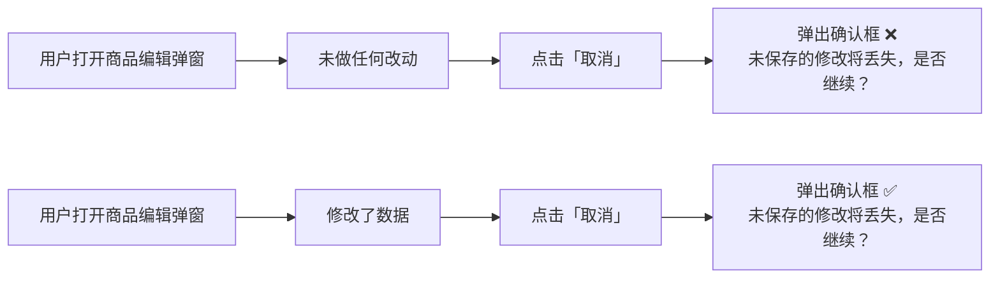
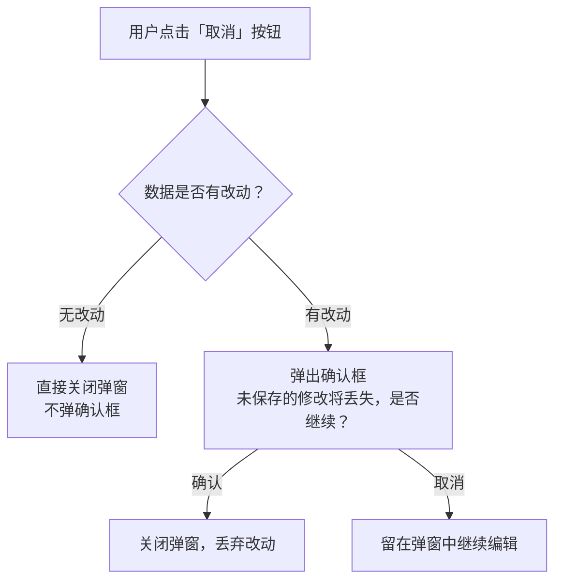
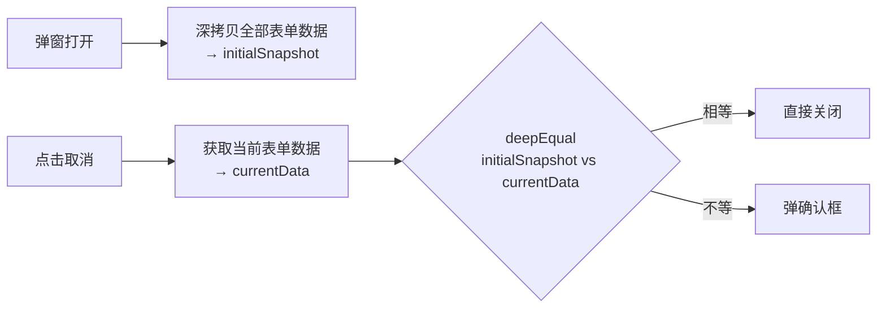

# 商品编辑弹窗「取消」按钮无条件弹确认框 — Bug 修复方案文档

## 1. Bug 发生背景

### 1.1 项目概述

本项目为健康管理电商平台，管理后台（Admin Web）基于 Next.js + React + Ant Design 构建。管理员通过「商品管理」模块的编辑弹窗（Modal）对商品信息进行增删改查操作。

### 1.2 涉及功能模块

| 模块 | 说明 |
|------|------|
| 管理后台 - 商品管理 - 商品编辑弹窗 | 包含 5 个 Tab（基础信息、标签设置、积分设置、预约与核销、排序与权重），底部有「取消」「保存」「保存并上架」按钮 |

### 1.3 发现方式

用户在使用商品管理的编辑弹窗时发现：即使未对任何数据做过改动，点击「取消」按钮仍会弹出「未保存的修改将丢失，是否继续？」确认框，操作体验不流畅。

---

## 2. Bug 描述

### 2.1 错误现象

商品编辑弹窗中，点击「取消」按钮时，**无论用户是否修改了弹窗中的任何数据**，都会无条件弹出确认框，提示「未保存的修改将丢失，是否继续？」。



当前代码实现为：

```javascript
const handleCancelModal = () => {
    Modal.confirm({
      title: '关闭确认',
      content: '未保存的修改将丢失，是否继续？',
      onOk: () => setModalVisible(false),
    });
};
```

即直接调用 `Modal.confirm`，无任何数据变更判断逻辑。

### 2.2 重现步骤

| 步骤 | 操作 | 预期结果 | 实际结果 |
|------|------|----------|----------|
| 1 | 进入管理后台 → 商品管理，点击某商品的「编辑」按钮 | 打开商品编辑弹窗 | 打开商品编辑弹窗 ✅ |
| 2 | 不做任何修改，直接点击底部「取消」按钮 | 弹窗直接关闭，无确认提示 | **弹出确认框** ❌ |
| 3 | 在弹窗中修改某个字段后，点击「取消」 | 弹出确认框提示用户 | 弹出确认框 ✅ |

### 2.3 影响范围

| 维度 | 影响描述 |
|------|----------|
| **受影响的页面** | 仅管理后台商品编辑弹窗 |
| **受影响的按钮** | 仅「取消」按钮 |
| **用户体验影响** | 每次关闭弹窗都需要多点一次确认，操作冗余，影响管理效率 |
| **功能影响** | 无功能性错误，仅为交互体验优化 |

---

## 3. 预期正确效果

修复后，商品编辑弹窗的「取消」按钮应实现**智能判断**：

### 3.1 交互逻辑



### 3.2 「数据改动」检测范围

需要检测**所有 5 个 Tab 中全部用户可感知的内容变化**，包括但不限于：

| 检测维度 | 具体内容 |
|----------|----------|
| **表单字段** | 商品名称、分类、品牌、价格、库存、描述等所有输入项 |
| **图片/视频** | 商品主图、详情图、视频等媒体资源的新增、删除、替换、排序变化 |
| **SKU 规格表** | 规格项的新增/删除/修改，各 SKU 行的价格、库存等数据变化 |
| **标签设置** | 标签的选择/取消选择 |
| **积分设置** | 积分抵扣规则、积分获取规则的变更 |
| **预约与核销** | 预约设置、核销规则的变更 |
| **排序与权重** | 排序值、权重值的变更 |

### 3.3 检测方式建议

在弹窗打开时对**所有 Tab 的完整表单数据**做一次深拷贝快照（`initialSnapshot`），每次点击「取消」时将**当前表单数据**与快照做**深度比较（deep equal）**：

- 若完全一致 → 判定为"无改动"
- 若存在差异 → 判定为"有改动"



### 3.4 优化适用范围

- ✅ 仅适用于**商品编辑弹窗**的「取消」按钮
- ❌ 不涉及其他弹窗（如表单字段配置弹窗等）

---

## 4. 补充说明

- 本优化仅影响「取消」按钮的交互行为，不影响「保存」「保存并上架」按钮的逻辑
- 「保存」按钮当前的行为（全部 5 个 Tab 内容一起提交）已确认是正确的，无需调整
- 深度比较应覆盖所有 Tab 的数据，包括动态生成的 SKU 表、图片列表等复杂数据结构
- 对于图片/视频等资源，比较其 URL 或文件标识即可，无需比较二进制内容
- 建议使用 lodash 的 `isEqual` 或类似工具进行深度比较，避免手写比较逻辑遗漏边界情况
