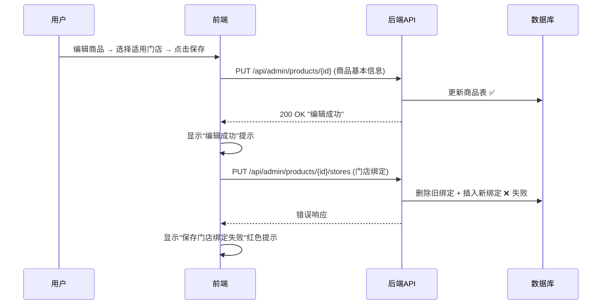
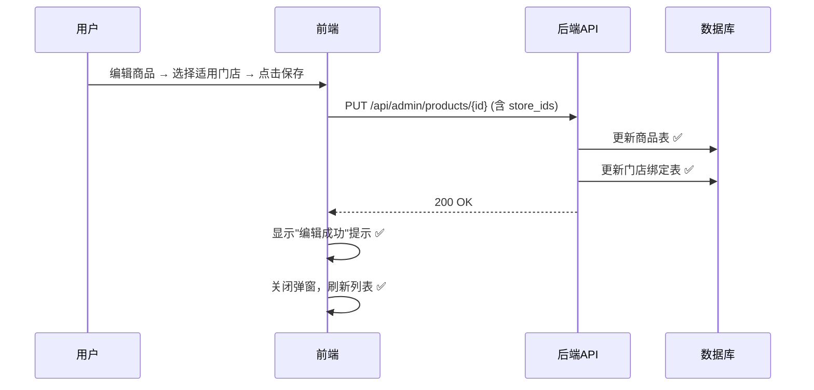

# 商品管理 — 适用门店保存失败 Bug 修复方案文档

## 1. Bug 发生背景

### 1.1 项目概述

bini-health 是一套健康管理平台，采用前后端分离架构：后端基于 FastAPI + SQLAlchemy + MySQL，管理后台基于 Next.js + React + Ant Design。管理后台中的「商品管理」模块允许管理员对商品进行增删改查，并为商品绑定适用的门店。

### 1.2 涉及功能模块

- **管理后台 — 商品管理**：编辑商品时可在"适用门店"区域多选门店，保存时将商品与门店的绑定关系持久化到数据库
- **后端 — 商品门店绑定 API**：`PUT /api/admin/products/{product_id}/stores` 接口负责接收前端传来的门店 ID 列表，更新 `product_stores` 关联表

### 1.3 发现时间与发现方式

该问题自功能上线以来一直存在，由日常运营使用中发现。

---

## 2. Bug 描述

### 2.1 错误现象

在管理后台编辑已有商品时，选择"适用门店"后点击保存，页面弹出红色提示"保存失败"。具体表现为：

- 商品的基本信息（名称、价格、库存等）**保存成功**
- 门店绑定关系**未保存成功**
- 选一个门店或选多个门店均会报错，不是特定门店的问题
- 不选择门店时，商品保存完全正常

### 2.2 重现步骤

| 步骤 | 操作 | 预期结果 | 实际结果 |
|------|------|----------|----------|
| 1 | 进入管理后台 → 商品管理 | 正常显示商品列表 | ✅ 正常 |
| 2 | 点击某个已有商品的"编辑"按钮 | 弹出编辑弹窗，加载商品信息 | ✅ 正常 |
| 3 | 在"适用门店"区域选择一个或多个门店 | 门店选择成功 | ✅ 正常 |
| 4 | 点击"保存"按钮 | 商品信息和门店绑定全部保存成功 | ❌ 商品基本信息保存成功，但门店绑定保存失败，弹出红色"保存失败"提示 |

### 2.3 影响范围

- **受影响功能**：商品管理 — 适用门店绑定（编辑场景）
- **受影响用户**：所有使用管理后台编辑商品的管理员
- **数据影响**：商品无法关联到任何门店，导致基于门店过滤商品、门店端查看对应商品等依赖门店绑定关系的功能无法正常运作

---

## 3. 预期正确效果

修复后，编辑商品时选择适用门店并保存，应当实现：

1. **商品基本信息和门店绑定在同一次保存操作中全部成功**，不出现"信息保存了但门店没保存上"的半成功状态
2. 保存成功后，页面显示统一的"编辑成功"提示，弹窗正常关闭
3. 再次编辑该商品时，之前选择的门店应正确回显
4. 选一个门店、选多个门店、取消门店选择（清空），各种场景均正常工作

---

## 4. 补充说明

### 4.1 根因分析

经过代码审查，定位到以下两层问题：

**问题一：前后端保存流程割裂（前端层面）**

前端 `handleSubmit` 函数在保存商品时，将"商品基本信息"和"门店绑定"拆成两个独立的 HTTP 请求：

1. 先调用 `PUT /api/admin/products/{id}` 保存商品基本信息（payload 中不含 `store_ids`）
2. 再调用 `PUT /api/admin/products/{id}/stores` 保存门店绑定

而实际上后端的 `admin_update_product` 接口的 `ProductUpdate` 模型**已经支持** `store_ids` 字段，并且在代码中已有处理逻辑（删除旧绑定 → 插入新绑定），可以在一个请求、一个事务中完成全部保存。

前端却没有将 `store_ids` 放入主请求的 payload 中，而是单独调用了一个独立的门店绑定接口，导致：

- 两步操作无法保证原子性
- 第一步成功后第二步失败，出现数据不一致

**问题二：独立门店绑定接口的数据库操作问题（后端层面）**

`PUT /api/admin/products/{product_id}/stores` 接口在同一次 `flush()` 中先删除旧绑定、再插入新绑定。由于 `product_stores` 表上存在 `UniqueConstraint("product_id", "store_id")`，在某些数据库引擎/事务隔离级别下，`flush()` 时删除操作的 DELETE 和插入操作的 INSERT 的执行顺序可能导致唯一约束冲突，从而抛出异常。

**问题三：错误处理不够健壮（前端层面）**

`saveProductStores` 函数内部用 `try-catch` 吞掉了异常，只弹出 `message.error('保存门店绑定失败')`，没有向外层抛出错误。这导致即使门店保存失败，弹窗仍然会关闭，给用户造成"好像保存成功了"的错觉。

### 4.2 修复方案

**方案：统一为单请求保存（推荐）**

将门店 ID 列表直接放入商品更新的主请求 payload 中，利用后端 `admin_update_product` 已有的 `store_ids` 处理逻辑，在同一个请求、同一个数据库事务中完成商品信息和门店绑定的保存。

具体修改要点：

| 修改位置 | 修改内容 |
|----------|----------|
| 前端 `handleSubmit` — payload 构造 | 在 payload 中加入 `store_ids: selectedStoreIds`（当有选择门店时传门店 ID 数组，无选择时传空数组） |
| 前端 `handleSubmit` — 保存逻辑 | 移除单独调用 `saveProductStores` 的逻辑，因为门店绑定已在主请求中一并处理 |
| 后端 `admin_update_product` | 在 `store_ids` 处理逻辑中，确保先执行 `await db.flush()` 完成删除后，再执行插入操作，避免唯一约束冲突 |
| 后端 `admin_update_product_stores` | 同样优化删除与插入之间的 flush 顺序，确保独立接口也能正常工作（作为备用） |
| 前端 `saveProductStores` | 如保留该函数，需在 catch 中重新 throw 错误，让调用方能感知失败 |

### 4.3 注意事项

- 修复后需验证：新增商品时选门店、编辑商品时选门店、编辑时清空门店、选一个门店、选多个门店等多种场景
- 修复后需验证：已有的门店绑定数据不受影响，编辑时能正确回显
- 修复不影响商品管理的其他功能（上架、下架、SKU 管理等）
