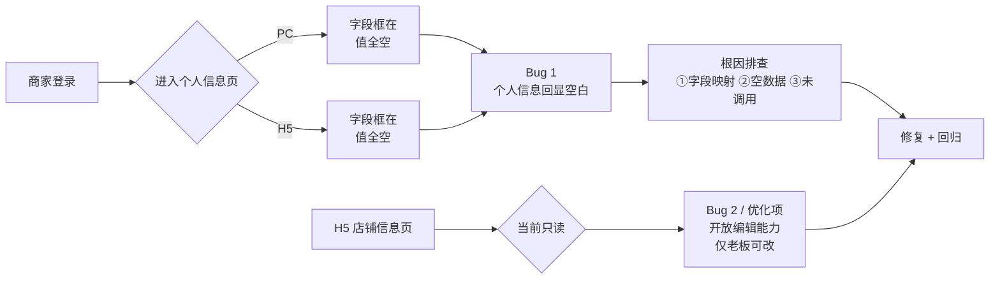
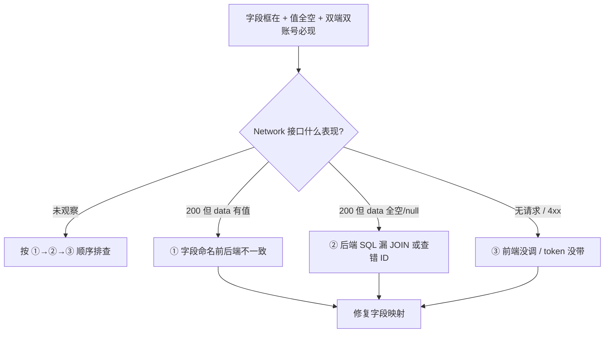
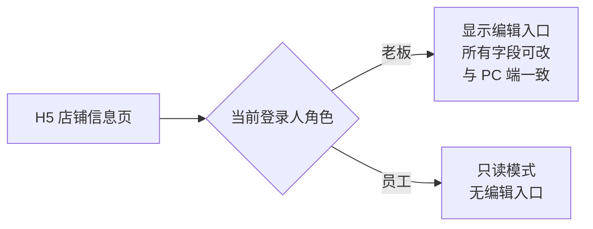

# 商家个人信息空白 + H5 店铺信息可编辑 Bug 修复方案文档

> 一份「修 Bug + 顺手补一个产品诉求」的合并方案。涉及 **商家 PC 后台** 和 **商家 H5 后台** 两端，外加 **后端商家域接口**。

---

## 0. 文档速览



*图 0：本次两个问题与修复主线一览*

| 编号 | 类型 | 问题简称 | 涉及端 | 严重度 |
|---|---|---|---|---|
| Bug-1 | Bug | 商家「个人信息」页字段全空（姓名 / 手机号等） | 商家 PC + 商家 H5 | **P0**（核心信息无法查看） |
| Opt-2 | 优化 | H5「店铺信息」页只读，需开放编辑（仅老板角色） | 商家 H5 | P1（产品能力缺失） |

---

## 1. Bug 发生背景

### 1.1 项目概述

本项目是一套面向 **B 端商家** 的多端运营平台，包含：

- **平台管理后台**（admin，PC）
- **商家 PC 后台**
- **商家 H5 后台**（移动端商家自助）

近期刚完成「PC 管理后台优化 V1.0」，新增了三端账号安全能力，其中包括：

- 商家 PC 后台右上角下拉菜单中的「**个人信息**」「**修改密码**」入口
- 商家 H5「**我的**」Tab 内的「**个人信息**」「**修改密码**」入口

本次问题就发生在这两个新增页面上。

### 1.2 涉及功能模块

| 模块 | 端 | 路径/入口 | 当前状态 |
|---|---|---|---|
| 商家个人信息 | PC | 右上角下拉 → 个人信息 | 字段框在、值全空 ❌ |
| 商家个人信息 | H5 | 我的 Tab → 个人信息 | 字段框在、值全空 ❌ |
| 商家店铺信息 | H5 | 我的 Tab → 店铺信息 | 仅展示、不可改 ⚠️ |
| 商家店铺信息 | PC | 店铺管理 | 可改 ✅（不动） |

### 1.3 发现时间与发现方式

- **发现时间**：2026-04-25
- **发现方式**：商家本人登录 PC + H5 后台，进入「个人信息」页发现"姓名"、"手机号"等字段全部空白
- **测试账号**：商家账号 `6399`、商家账号 `6366`（**双账号双端 100% 复现**）

---

## 2. Bug 描述

### 2.1 错误现象

#### Bug-1：商家「个人信息」页字段全空

**现象描述**：

- 商家进入「个人信息」页面后，**页面框架、字段标签全部正常渲染**（"姓名："、"手机号："等 label 都在）
- **但是每个字段对应的值都是空的**（输入框/文本显示都是空白，没有任何回显内容）
- "姓名"、"手机号"这种**数据库里绝对不可能为空**的字段也是空的，说明并不是真的没数据，而是**数据没被读出来或者没被前端正确接住**

**关键特征**：

- ✅ 字段标签正常（说明前端组件加载没问题）
- ❌ 字段值全空（说明数据没回填）
- ✅ PC 端、H5 端都复现（说明问题大概率不在某一端的前端组件，而在**共用的后端接口**或**两端各自的字段映射**）
- ✅ 商家账号 `6399`、`6366` 都复现（说明不是某个商家的数据特殊性问题）

#### Opt-2：H5「店铺信息」页只读

**现象描述**：

- 商家在 H5 端"我的"Tab 中可以查看店铺信息
- **但完全没有编辑入口/编辑能力**——只能看，不能改
- 当前如果商家想改店铺信息，必须切换到 PC 端操作，**对纯靠手机办公的商家很不友好**

### 2.2 重现步骤

#### Bug-1 重现步骤

| 步骤 | 操作 | 预期结果 | 实际结果 |
|------|------|----------|----------|
| 1 | 用商家账号 `6399`（或 `6366`）登录 **商家 PC 后台** | 登录成功，进入工作台 | ✅ 正常 |
| 2 | 点击 PC 后台**右上角下拉** → **个人信息** | 进入个人信息页 | ✅ 进入页面 |
| 3 | 查看"姓名"、"手机号"等字段的值 | 应回显商家的真实姓名和手机号 | ❌ **字段全空** |
| 4 | 退出，用同一账号登录 **商家 H5 后台** | 登录成功，进入 H5 首页 | ✅ 正常 |
| 5 | 进入「我的」Tab → 点击「个人信息」 | 进入 H5 个人信息页 | ✅ 进入页面 |
| 6 | 查看"姓名"、"手机号"等字段的值 | 应回显商家的真实姓名和手机号 | ❌ **字段全空** |

#### Opt-2 重现步骤

| 步骤 | 操作 | 预期结果 | 实际结果 |
|------|------|----------|----------|
| 1 | 商家账号登录 **H5 后台** | 登录成功 | ✅ 正常 |
| 2 | 进入「我的」Tab → 点击「店铺信息」 | 进入店铺信息页，可查看且**可编辑** | ❌ **只能看，没有编辑入口** |

### 2.3 影响范围

- **影响功能**：商家 PC + 商家 H5 的「个人信息」展示与（潜在的）个人信息维护链路
- **影响用户**：**全部商家用户**（PC + H5 双端 100% 必现，已被多账号验证）
- **影响数据**：仅展示链路异常，**底层数据本身是完好的**（手机号、姓名在 DB 里肯定有值，否则商家无法登录）
- **业务严重度**：
  - **P0**：商家无法在后台核对自己的账号信息，对刚上线的"账号安全能力（个人信息 + 修改密码）"造成**直接观感冲击**
  - 商家可能误以为系统数据丢失，引发**信任危机**和**客诉**

---

## 3. 根因初判（按概率排序）

> 本节为修复时的**优先排查顺序**，按 ① → ② → ③ 依次试，命中即停。



*图 1：根因排查决策树*

### 3.1 候选根因 ①（最高概率，★★★★★）：前后端字段命名不一致

**典型表现**：

- 后端接口返回的是 `realName` / `userName` / `mobile`
- 前端读取的却是 `name` / `phone`
- 因为两边对不上，前端拿到 `undefined` → 渲染为空

**为什么概率最高**：

- 字段框正常说明前端组件没问题
- 双端复现说明**后端接口本身或字段约定**的概率最大
- 这次个人信息页是**新上线的 M3/M4 模块**，前后端约定容易出现"刚开发完没对齐"的情况

### 3.2 候选根因 ②（次高概率，★★★★）：后端接口返回了空壳

**典型表现**：

- 接口 `/api/merchant/profile` 200 返回，但 `data` 是 `{}` 或字段全 null
- 可能原因：
  - SQL 漏了 JOIN（个人信息表 + 商家表），导致拿不到字段
  - 查询条件用错了 ID（例如用 `merchant_id` 当 `user_id` 查）
  - 接口里的 ORM 映射用错了模型类

### 3.3 候选根因 ③（较低概率，★★）：前端根本没调用接口

**典型表现**：

- Network 中根本没有 `/api/merchant/profile` 请求
- 或者接口返回 401 / 404 / 500
- 可能原因：
  - 前端路由钩子（`useEffect` / `onMounted`）没触发
  - token 没正确带上
  - 请求 baseURL 配错

### 3.4 修复优先级与策略

修复阶段会**一次性把上面 3 类排查 + 修复全部做完**，不分 P0/P1/P2，统一作为 **一期工程一次性修复并上线**。同时把 Opt-2（H5 店铺信息可编辑）一并完成。

---

## 4. 预期正确效果

### 4.1 Bug-1 修复后效果

#### PC 端「个人信息」页

```
┌─────────────────────────────────────┐
│  个人信息                            │
├─────────────────────────────────────┤
│  姓名      ：  张三                  │  ← 必须有值
│  手机号    ：  138****1234            │  ← 必须有值
│  所属商家  ：  小白健康连锁店         │  ← 必须有值
│  角色      ：  老板 / 员工            │  ← 必须有值
│  账号状态  ：  正常                   │  ← 必须有值
│                          [编辑] [...]│
└─────────────────────────────────────┘
```

#### H5 端「个人信息」页

```
┌──────────────────────┐
│ ← 个人信息            │
├──────────────────────┤
│ 姓名     张三      > │
│ 手机号   138****1234 > │
│ 所属商家 小白健康连锁  │
│ 角色     老板        │
│ 账号状态 正常        │
└──────────────────────┘
```

**核心要求**：

- ✅ 姓名、手机号、所属商家等字段**全部正确回显**
- ✅ 商家 `6399`、`6366` 双账号验证通过
- ✅ PC + H5 两端字段值**完全一致**（不能 PC 显示一套、H5 显示另一套）
- ✅ 字段值不仅展示正确，**点击编辑后保存也能正确写回**（避免只修了读、没修写）

### 4.2 Opt-2 修复后效果（H5 店铺信息可编辑）



*图 2：H5 店铺信息页角色分流*

#### 字段范围（与 PC 端店铺信息一致）

| 字段 | 老板可改 | 员工 |
|---|---|---|
| 店铺名称 | ✅ | 只读 |
| 店铺 Logo | ✅ | 只读 |
| 联系电话 | ✅ | 只读 |
| 地址 | ✅ | 只读 |
| 营业时间 | ✅ | 只读 |
| 简介 | ✅ | 只读 |
| 其他业务字段 | ✅ | 只读 |

#### 角色权限规则

- **老板**：H5 店铺信息页右上角显示「编辑」按钮，进入编辑态后可修改所有字段并保存
- **员工**：H5 店铺信息页**完全只读**，**不显示**编辑按钮（不是 disable，是直接不渲染入口，避免引导）
- **后端兜底**：保存接口必须在服务端**强校验当前操作人是否为老板**，员工调用直接返回 `403 无权限`，**不能只靠前端隐藏按钮**

#### 与 PC 端的关系

- 字段、校验规则、保存逻辑**完全复用 PC 端的店铺信息接口**（避免两套实现飘移）
- H5 上仅做 UI 适配（移动端表单组件、上传组件、地图选点组件等）

---

## 5. 修复执行清单（一期一次性完成）

> 该清单是下一个会话执行修复时直接使用的「待办列表」。

### 5.1 Bug-1 修复任务

- [ ] **后端**：核查 `/api/merchant/profile` 接口（GET）返回的字段名与前端期望是否完全一致
- [ ] **后端**：核查接口内部 SQL/ORM 是否真正能查到当前登录人的姓名、手机号、所属商家、角色等字段
- [ ] **后端**：补齐 `/api/merchant/profile` 的回归测试用例（覆盖老板 + 员工两种角色）
- [ ] **PC 前端**：核查个人信息页 `useEffect` 是否正常调用接口、字段映射是否一致、token 是否带上
- [ ] **H5 前端**：核查 H5 个人信息页同上
- [ ] **联调**：用 `6399` 和 `6366` 双账号在 PC + H5 各跑一遍，字段必须全部正确回显

### 5.2 Opt-2 修复任务

- [ ] **H5 前端**：在「店铺信息」页右上角增加「编辑」入口（**仅老板角色可见**）
- [ ] **H5 前端**：实现编辑态的表单（字段与 PC 端一致），适配移动端 UI
- [ ] **H5 前端**：调用现有 PC 店铺信息保存接口（无需新增接口，前提是该接口本身支持权限分流）
- [ ] **后端**：在店铺信息保存接口里加强角色校验——**仅老板可保存**，员工请求返回 `403`
- [ ] **联调**：分别用「老板账号」和「员工账号」登录 H5 验证：老板可改、员工无入口且接口被服务端拦截

### 5.3 回归用例

| 用例编号 | 用例描述 | 预期结果 |
|---|---|---|
| RC-01 | 商家 `6399` 登录 PC，看个人信息 | 字段全部正确回显 |
| RC-02 | 商家 `6399` 登录 H5，看个人信息 | 字段全部正确回显且与 PC 一致 |
| RC-03 | 商家 `6366` 登录 PC，看个人信息 | 字段全部正确回显 |
| RC-04 | 商家 `6366` 登录 H5，看个人信息 | 字段全部正确回显且与 PC 一致 |
| RC-05 | 老板账号登录 H5，进店铺信息 | 看到「编辑」入口，可改、可保存 |
| RC-06 | 员工账号登录 H5，进店铺信息 | **看不到**「编辑」入口，整页只读 |
| RC-07 | 用员工账号 token **直接调**店铺信息保存接口 | 返回 `403 无权限` |
| RC-08 | 老板在 H5 改完店铺信息后，去 PC 端查看 | PC 端看到的内容**与 H5 提交一致** |
| RC-09 | 修改密码、个人信息编辑保存等关联链路 | 不受本次修改影响，仍正常 |

---

## 6. 补充说明

### 6.1 与近期"M3/M4 账号安全模块"的关系

本次 Bug 直接发生在最近上线的 M3（商家 PC 个人信息）和 M4（商家 H5 个人信息/改密）模块上。修复时建议**同步检查**：

- 修改密码页是否也有类似的字段回显问题
- 强制改密页（首登 / 密码过期）的用户名等字段是否也是空的
- 「员工管理」中的字段回显是否同样存在风险（之前已修过 `module_codes` 回显，本次顺便核对）

### 6.2 排查辅助建议

- 在浏览器 F12 → Network 中，过滤关键字 `profile`，观察接口的 **Status / Response** 是哪种情况，可以**直接定位** ① / ② / ③ 中的哪一个
- 若不方便看 Network，本次会按 **① → ② → ③** 顺序逐一排查并修复，命中即修，不命中再继续

### 6.3 上线策略

- 所有修复**单版本一次性上线**，不分期
- 上线后立刻用 `6399`、`6366` 双账号在 PC + H5 双端做冒烟回归，确认 RC-01 ~ RC-08 全部通过

### 6.4 兜底安全

- H5 店铺信息编辑能力开放后，**前端隐藏 + 后端强校验**双保险：
  - 前端：员工角色不渲染编辑入口
  - 后端：店铺信息保存接口校验"当前操作人是否为该商家的老板"，否则直接 403
- 避免出现"员工通过抓包/构造请求绕过前端按钮"的越权风险

---

## 7. 交付物

本次修复完成后将交付：

1. ✅ 商家 PC 后台「个人信息」页字段全部正确回显
2. ✅ 商家 H5 后台「个人信息」页字段全部正确回显
3. ✅ 商家 H5 后台「店铺信息」页对老板开放编辑能力，对员工保持只读
4. ✅ 后端店铺信息保存接口的老板权限强校验
5. ✅ 上述 9 条回归用例（RC-01 ~ RC-09）全部通过
