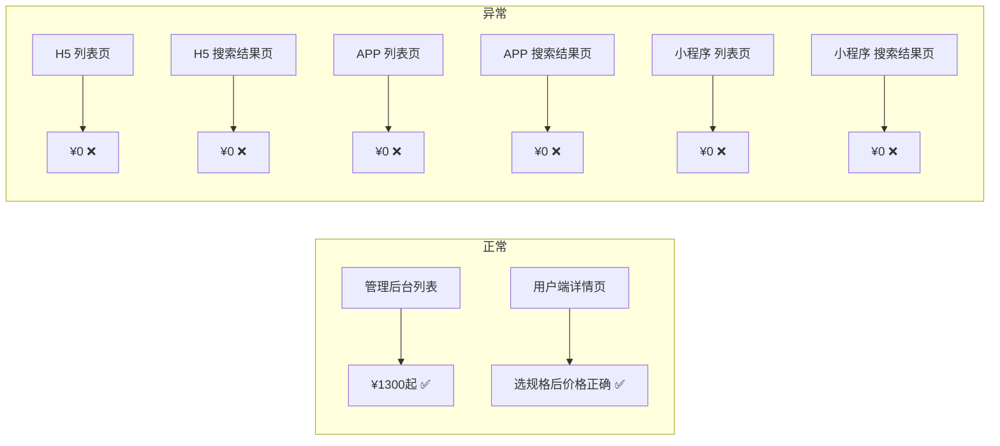
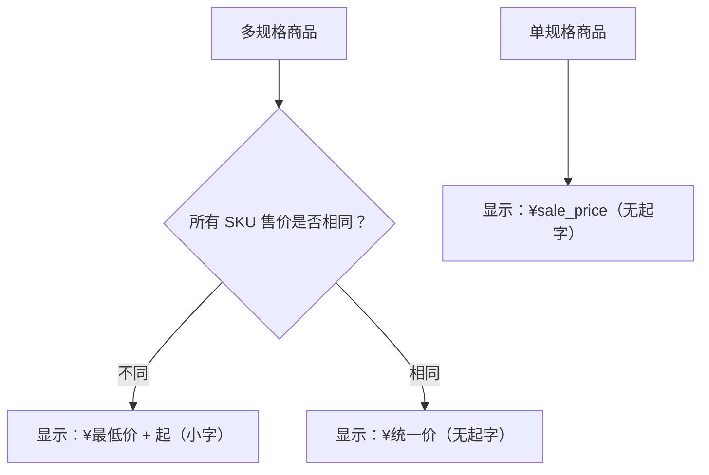
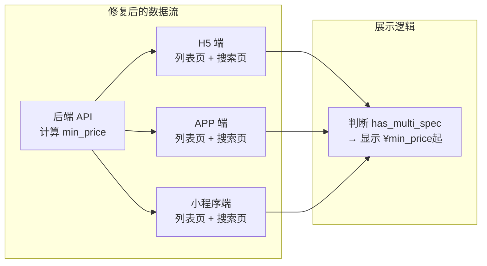

# 多规格商品用户端列表页及搜索结果页价格显示为 0 — Bug 修复方案文档 V3

## 1. Bug 发生背景

### 1.1 项目概述

本项目为健康管理电商平台，包含管理后台（Admin Web）、H5 移动端网页、Flutter APP、微信小程序等多端。商品支持单规格和多规格（多 SKU）两种形态，管理员在后台创建商品并配置规格与价格，用户在前端浏览和购买商品。

### 1.2 涉及功能模块

| 模块 | 说明 |
|------|------|
| 管理后台 - 商家管理 - 商品管理 | 商品创建与编辑，支持配置多规格 SKU 及各规格售价 |
| H5 用户端 - 首页 - 服务列表 | 展示商品卡片，包含商品图片、名称、价格等信息 |
| H5 用户端 - 搜索结果页 | 搜索关键词后展示匹配商品列表，包含价格 |
| Flutter APP - 服务列表 | 同上，APP 端的商品浏览列表 |
| Flutter APP - 搜索结果页 | APP 端搜索商品后的结果列表 |
| 微信小程序 - 服务列表 | 同上，小程序端的商品浏览列表 |
| 微信小程序 - 搜索结果页 | 小程序端搜索商品后的结果列表 |
| 后端 API - 商品列表接口 | 为前端提供商品列表数据，包含价格字段 |
| 后端 API - 商品搜索接口 | 为前端提供搜索结果数据，包含价格字段 |

### 1.3 发现方式

管理员在后台创建了一个多规格商品（SKU 最低售价 ¥1300），在管理后台商品列表中可正常显示「¥1300起」，但切换到用户端的「首页 → 服务」列表页和搜索结果页时，发现该商品价格显示为 ¥0。经排查，H5 网页端、Flutter APP 端、微信小程序端的服务列表页和搜索结果页均存在此问题。

### 1.4 优先级

**紧急** — 该 Bug 直接影响用户端的价格展示，所有多规格商品在用户端均显示 ¥0，严重影响用户体验、购买决策和成交转化率。

---

## 2. Bug 描述

### 2.1 错误现象

多规格商品在用户端（H5 网页端 + Flutter APP 端 + 微信小程序端）的**服务列表页**和**搜索结果页**中，价格显示为 **¥0**（无小数点），而非正确的 SKU 最低售价。

具体表现：

- **H5 网页端**：「首页 → 服务」列表页 + 搜索结果页，多规格商品价格显示 ¥0
- **Flutter APP 端**：服务列表页 + 搜索结果页，多规格商品价格显示 ¥0
- **微信小程序端**：服务列表页 + 搜索结果页，多规格商品价格显示 ¥0
- **管理后台**：同一商品在管理后台列表页正常显示「¥1300起」
- **商品详情页**：用户端点进商品详情页后，选择规格时价格显示正确



### 2.2 重现步骤

| 步骤 | 操作 | 预期结果 | 实际结果 |
|------|------|----------|----------|
| 1 | 在管理后台创建一个多规格商品，配置多个 SKU（最低售价 ¥1300） | 商品创建成功 | 商品创建成功 ✅ |
| 2 | 在管理后台商品列表查看该商品价格 | 显示「¥1300起」 | 显示「¥1300起」 ✅ |
| 3 | 打开 H5 用户端，进入「首页 → 服务」列表页 | 该商品价格显示「¥1300起」 | **显示 ¥0** ❌ |
| 4 | 在 H5 用户端搜索该商品关键词 | 搜索结果中价格显示「¥1300起」 | **显示 ¥0** ❌ |
| 5 | 打开 Flutter APP 端，进入服务列表页 | 该商品价格显示「¥1300起」 | **显示 ¥0** ❌ |
| 6 | 在 Flutter APP 端搜索该商品关键词 | 搜索结果中价格显示「¥1300起」 | **显示 ¥0** ❌ |
| 7 | 打开微信小程序端，进入服务列表页 | 该商品价格显示「¥1300起」 | **显示 ¥0** ❌ |
| 8 | 在微信小程序端搜索该商品关键词 | 搜索结果中价格显示「¥1300起」 | **显示 ¥0** ❌ |
| 9 | 在任一用户端点击该商品进入详情页 | 详情页选规格后价格正确 | 详情页选规格后价格正确 ✅ |

### 2.3 影响范围

| 维度 | 影响描述 |
|------|----------|
| **受影响的端** | H5 网页端 + Flutter APP 端 + 微信小程序端（三端均受影响） |
| **受影响的页面** | 服务列表页 + 搜索结果页（共 6 个页面入口） |
| **受影响的商品类型** | 仅多规格商品（单规格商品价格显示正常） |
| **用户体验影响** | 用户看到商品价格为 ¥0，严重影响购买决策和平台可信度 |
| **业务影响** | 直接影响成交转化率，用户可能误以为商品免费或数据错误而放弃购买 |

---

## 3. 预期正确效果

修复后，用户端（H5 + APP + 小程序）的**服务列表页**和**搜索结果页**中，多规格商品的价格显示应符合以下要求：

### 3.1 价格计算逻辑

- 遍历该商品所有 SKU 的售价，取**最低售价**作为列表展示价格
- 若最低售价与最高售价不同（即存在多个不同价格的规格），价格后方追加**"起"**字
- 若所有 SKU 售价相同，则直接显示该价格，不追加"起"字

### 3.2 显示格式

```
¥1300起
```

- 价格数字部分（如 `¥1300`）：使用前端统一的价格样式
- "起"字：使用**小一号字体**显示，与价格数字形成层次区分
- 与管理后台列表页的显示格式保持一致



### 3.3 各端各页面修复后效果

| 端 | 页面 | 修复前 | 修复后 |
|----|------|--------|--------|
| 管理后台 | 商品列表 | ¥1300起 ✅ | ¥1300起 ✅（保持不变） |
| H5 | 服务列表页 | ¥0 ❌ | ¥1300起 ✅ |
| H5 | 搜索结果页 | ¥0 ❌ | ¥1300起 ✅ |
| APP | 服务列表页 | ¥0 ❌ | ¥1300起 ✅ |
| APP | 搜索结果页 | ¥0 ❌ | ¥1300起 ✅ |
| 小程序 | 服务列表页 | ¥0 ❌ | ¥1300起 ✅ |
| 小程序 | 搜索结果页 | ¥0 ❌ | ¥1300起 ✅ |
| 全端 | 商品详情页 | 正确 ✅ | 正确 ✅（保持不变） |

---

## 4. 根因分析

### 4.1 问题根因

商品数据模型中存在两层价格数据：

1. **商品主表** `sale_price` 字段：存储商品的基础售价。对于多规格商品，该字段在创建时被设为 **0**（因为实际价格由各 SKU 决定）
2. **SKU 表**各记录的售价字段：存储每个规格的实际售价

**管理后台**在列表展示时，会主动查询 SKU 表计算最低价并展示为「¥XXX起」，所以显示正确。

**用户端列表页和搜索结果页**（H5 + APP + 小程序）在展示价格时，**直接读取商品主表的 `sale_price` 字段**，未做多规格商品的最低 SKU 价格计算，因此多规格商品始终显示为 ¥0。

```mermaid
flowchart TB
    subgraph 数据层
        DB1["商品主表<br/>sale_price = 0"]
        DB2["SKU 表<br/>SKU1: ¥1300<br/>SKU2: ¥1800<br/>SKU3: ¥2500"]
    end
    subgraph 管理后台
        ADMIN["查询 SKU 表 → 取最低价<br/>→ 显示 ¥1300起 ✅"]
    end
    subgraph 用户端（三端 × 两页面）
        USER["直接读 sale_price = 0<br/>→ 显示 ¥0 ❌"]
    end
    DB2 --> ADMIN
    DB1 --> USER
```

### 4.2 修复思路

修复采用 **后端 + 前端配合** 的方式：

**后端 API 层修复（治本）**

在商品列表 API 和商品搜索 API 返回数据时，对多规格商品增加价格计算逻辑：

- 查询该商品所有 SKU 的售价
- 计算最低售价，作为 `min_price` 字段返回
- 同时返回一个 `has_multi_spec` 标识，告知前端是否需要显示"起"字
- 列表接口和搜索接口统一处理，确保所有返回商品列表的 API 都包含 `min_price`

**前端展示层修复（H5 + APP + 小程序三端 × 两个页面）**

- **H5 端**：服务列表页 + 搜索结果页组件中，判断商品是否为多规格，若是则使用 `min_price` 字段 + "起"字样式展示
- **APP 端**：Flutter 服务列表页 + 搜索结果页中，做同样的逻辑适配
- **小程序端**：微信小程序服务列表页 + 搜索结果页中，做同样的逻辑适配



---

## 5. 验证要求

修复完成后需在以下全部端和页面进行验证确认：

| 验证项 | 验证操作 | 预期结果 |
|--------|----------|----------|
| H5 服务列表页 | 查看多规格商品价格 | 显示「¥最低价起」 |
| H5 搜索结果页 | 搜索多规格商品，查看价格 | 显示「¥最低价起」 |
| APP 服务列表页 | 查看多规格商品价格 | 显示「¥最低价起」 |
| APP 搜索结果页 | 搜索多规格商品，查看价格 | 显示「¥最低价起」 |
| 小程序服务列表页 | 查看多规格商品价格 | 显示「¥最低价起」 |
| 小程序搜索结果页 | 搜索多规格商品，查看价格 | 显示「¥最低价起」 |
| 单规格商品回归 | 各端列表页和搜索页查看单规格商品 | 价格显示正常，无"起"字 |
| 商品详情页回归 | 各端点击商品进入详情页 | 详情页价格展示不受影响 |
| 管理后台回归 | 管理后台商品列表查看 | 显示不受影响，保持正常 |

---

## 6. 补充说明

- 本 Bug 仅影响**列表页和搜索结果页**的价格展示，不涉及下单、支付等核心交易流程，无数据安全风险
- 商品详情页已有正确的多规格价格展示逻辑，可作为修复参考
- 管理后台的多规格价格展示逻辑（取 SKU 最低价 + "起"字）已验证正确，后端修复时可复用该逻辑
- "起"字的小字号样式需要 H5、APP、小程序三端同步实现，确保视觉一致性
- 搜索结果页的价格显示问题与服务列表页根因完全一致，共享同一个后端修复方案
- 本文档为之前方案的 V3 版本，在 V2 基础上新增了**搜索结果页**的修复覆盖范围
