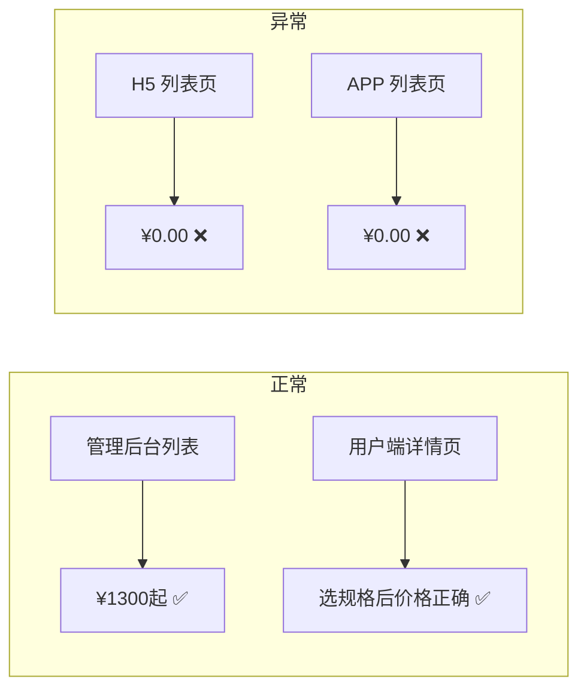
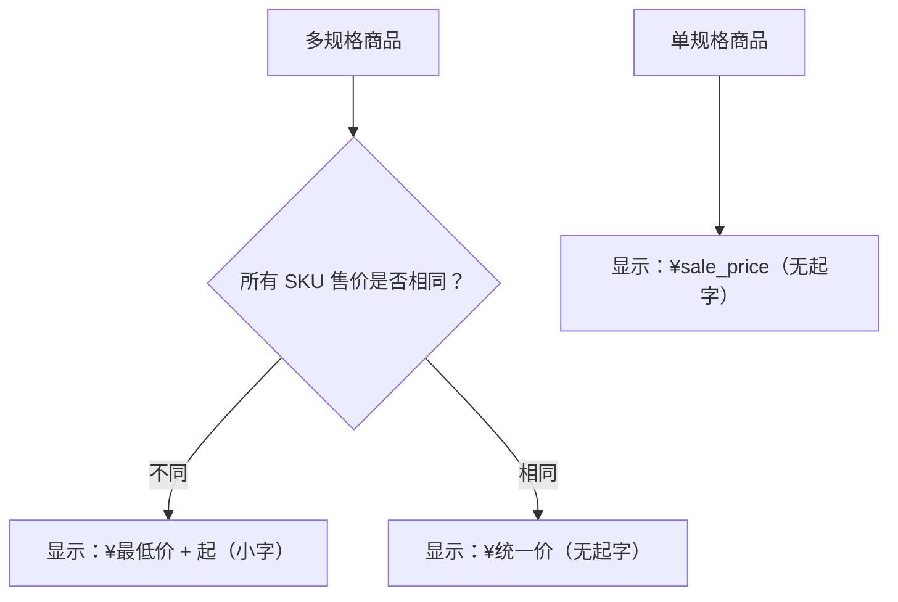
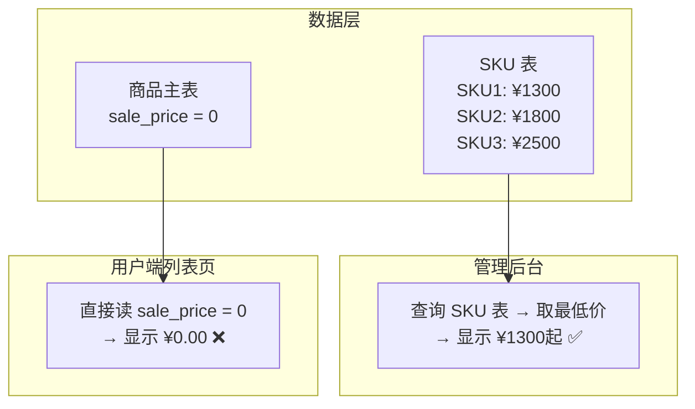

# 多规格商品用户端列表页价格显示为 0 — Bug 修复方案文档

## 1. Bug 发生背景

### 1.1 项目概述

本项目为健康管理电商平台，包含管理后台（Admin Web）、H5 移动端网页、Flutter APP 等多端。商品支持单规格和多规格（多 SKU）两种形态，管理员在后台创建商品并配置规格与价格，用户在前端浏览和购买商品。

### 1.2 涉及功能模块

| 模块 | 说明 |
|------|------|
| 管理后台 - 商家管理 - 商品管理 | 商品创建与编辑，支持配置多规格 SKU 及各规格售价 |
| H5 用户端 - 首页 - 服务列表 | 展示商品卡片，包含商品图片、名称、价格等信息 |
| Flutter APP - 服务列表 | 同上，APP 端的商品浏览列表 |
| 后端 API - 商品列表接口 | 为前端提供商品列表数据，包含价格字段 |

### 1.3 发现方式

管理员在后台创建了一个多规格商品（SKU 最低售价为 ¥1300），在管理后台商品列表中可正常显示「¥1300起」，但切换到用户端的「首页 → 服务」列表页时，发现该商品价格显示为 ¥0.00。

---

## 2. Bug 描述

### 2.1 错误现象

多规格商品在用户端（H5 网页端 + Flutter APP 端）的**服务列表页**中，价格显示为 **¥0.00**，而非正确的 SKU 最低售价。

具体表现：

- **H5 网页端**：「首页 → 服务」列表页，多规格商品价格列显示 ¥0.00（带小数点）
- **Flutter APP 端**：同样的服务列表页，多规格商品价格显示 ¥0.00
- **管理后台**：同一商品在管理后台列表页正常显示「¥1300起」
- **商品详情页**：用户端点进商品详情页后，价格显示正确（选择规格后显示对应 SKU 价格）



### 2.2 重现步骤

| 步骤 | 操作 | 预期结果 | 实际结果 |
|------|------|----------|----------|
| 1 | 在管理后台创建一个多规格商品，配置多个 SKU（最低售价 ¥1300） | 商品创建成功 | 商品创建成功 ✅ |
| 2 | 在管理后台商品列表查看该商品价格 | 显示「¥1300起」 | 显示「¥1300起」 ✅ |
| 3 | 打开 H5 用户端，进入「首页 → 服务」列表页 | 该商品价格显示「¥1300起」 | **显示 ¥0.00** ❌ |
| 4 | 打开 Flutter APP 端，进入服务列表页 | 该商品价格显示「¥1300起」 | **显示 ¥0.00** ❌ |
| 5 | 在 H5 或 APP 端点击该商品进入详情页 | 详情页价格正确 | 详情页价格正确 ✅ |

### 2.3 影响范围

| 维度 | 影响描述 |
|------|----------|
| **受影响的端** | H5 网页端 + Flutter APP 端（双端均受影响） |
| **受影响的页面** | 仅服务列表页（商品详情页不受影响） |
| **受影响的商品类型** | 仅多规格商品（单规格商品价格显示正常） |
| **用户体验影响** | 用户看到商品价格为 ¥0.00，严重影响购买决策和平台可信度 |
| **业务影响** | 可能导致用户误以为商品免费或数据错误，影响转化率 |

---

## 3. 预期正确效果

修复后，用户端（H5 + APP）服务列表页中多规格商品的价格显示应符合以下要求：

### 3.1 价格计算逻辑

- 遍历该商品所有 SKU 的售价，取**最低售价**作为列表展示价格
- 若最低售价与最高售价不同（即存在多个不同价格的规格），价格后方追加**"起"**字
- 若所有 SKU 售价相同，则直接显示该价格，不追加"起"字

### 3.2 显示格式

```
¥1300起
```

- 价格数字部分（如 `¥1300`）：使用前端统一的价格样式
- "起"字：使用**小一号字体**显示，与价格数字形成层次区分



### 3.3 各端效果一致性

| 端 | 修复前 | 修复后 |
|----|--------|--------|
| 管理后台列表 | ¥1300起 ✅ | ¥1300起 ✅（保持不变） |
| H5 列表页 | ¥0.00 ❌ | ¥1300起 ✅ |
| APP 列表页 | ¥0.00 ❌ | ¥1300起 ✅ |
| 用户端详情页 | 正确 ✅ | 正确 ✅（保持不变） |

---

## 4. 根因分析

### 4.1 问题根因

商品数据模型中存在两层价格数据：

1. **商品主表** `sale_price` 字段：存储商品的基础售价。对于多规格商品，该字段在创建时被设为 **0**（因为实际价格由各 SKU 决定）
2. **SKU 表**各记录的售价字段：存储每个规格的实际售价

**管理后台**在列表展示时，会主动查询 SKU 表计算最低价并展示为「¥XXX起」，所以显示正确。

**用户端列表页**（H5 + APP）在展示价格时，**直接读取商品主表的 `sale_price` 字段**，未做多规格商品的最低 SKU 价格计算，因此多规格商品始终显示为 ¥0.00。



### 4.2 修复思路

修复可从以下两个层面入手（建议 **方案 A + 方案 B 配合使用**）：

**方案 A：后端 API 层修复（推荐，治本）**

在商品列表 API 返回数据时，对多规格商品增加价格计算逻辑：

- 查询该商品所有 SKU 的售价
- 计算最低售价，作为 `min_price` 字段返回
- 同时返回一个 `has_multi_spec` 或 `price_prefix` 标识，告知前端是否需要显示"起"字

**方案 B：前端展示层修复（H5 + APP 双端）**

- H5 端：服务列表页组件中，判断商品是否为多规格，若是则使用 `min_price` 字段 + "起"字样式展示
- APP 端：Flutter 服务列表页中，做同样的逻辑适配

---

## 5. 补充说明

- 本 Bug 仅影响**列表页**的价格展示，不涉及下单、支付等核心交易流程，无数据安全风险
- 商品详情页已有正确的多规格价格展示逻辑，可作为修复参考
- 管理后台的多规格价格展示逻辑（取 SKU 最低价 + "起"字）已验证正确，后端修复时可复用该逻辑
- "起"字的小字号样式需要 H5 和 APP 双端同步实现，确保视觉一致性
