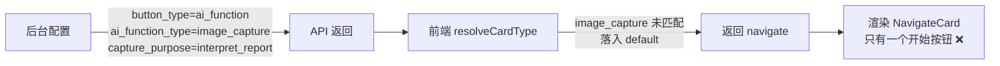
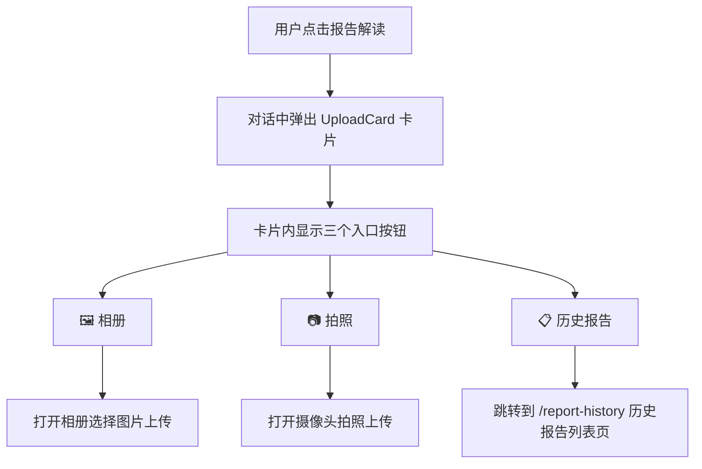

# 报告解读卡片类型映射与历史报告入口缺失 Bug 修复方案文档

## 1. Bug 发生背景

### 1.1 项目概述

本项目为健康管理 AI 对话系统，包含 H5 前端、后端 API、管理后台等多个模块。用户可在 AI 对话页面中通过"报告解读"功能上传并解读体检报告。

### 1.2 涉及功能模块

- **AI 对话首页**（`ai-home`）：功能宫格和胶囊条入口
- **报告解读功能**：用户上传体检报告后由 AI 进行解读
- **历史报告与对比分析**：已开发完成的独立页面模块（列表页、详情页、对比页、分享页）
- **功能按钮管理后台**：管理各功能入口按钮的配置

### 1.3 发现时间与发现方式

2026 年 5 月 23 日，用户在使用报告解读功能时发现两个问题：

1. 报告解读卡片只显示一个"开始"按钮，而不是"相册"和"拍照"两个按钮
2. 看不到"历史报告"按钮入口

## 2. Bug 描述

本次共涉及 **2 个关联 Bug**，根因相同——前端 `resolveCardType` 函数未适配数据迁移后的新子类型。

---

### Bug 1：报告解读卡片渲染为 NavigateCard 而非 UploadCard

#### 2.1.1 错误现象

报告解读功能的卡片在 AI 对话中只显示一个"开始"按钮（NavigateCard 的样式），而不是应有的"相册"和"拍照"两个入口按钮（UploadCard 的样式）。



#### 2.1.2 重现步骤

| 步骤 | 操作 | 预期结果 | 实际结果 |
|------|------|----------|----------|
| 1 | 打开 AI 对话首页 | 页面正常加载 | 正常 |
| 2 | 点击"报告解读"功能按钮 | 弹出 UploadCard 卡片，显示"相册"和"拍照"两个入口 | 弹出 NavigateCard 卡片，只显示一个"开始"按钮 |

#### 2.1.3 根因分析

数据迁移脚本将报告解读按钮的 `ai_function_type` 从旧值 `report_interpret` 改为了新架构下的 `image_capture`。但前端 `resolveCardType` 函数的 switch 分支中**没有处理 `image_capture` 这个新子类型**：

```typescript
// 当前代码（有 Bug）
if (buttonType === 'ai_function') {
    switch (aiFunctionType || '') {
      case 'photo_upload':
      case 'file_upload':
      case 'medicine_recognize':
      case 'report_interpret':      // 旧值，迁移后已不再使用
        return 'upload';
      case 'quick_ask':
        return 'quick_ask';
      case 'ai_dialog_trigger':
      case 'health_self_check':
      default:                       // ← image_capture 落到这里
        return 'navigate';           // ← 错误地返回了 navigate
    }
}
```

`image_capture` 没有匹配任何 case，落入 `default` 分支返回了 `'navigate'`，导致卡片被渲染为 NavigateCard（只有一个"开始"按钮），而不是 UploadCard（"相册"+"拍照"）。

---

### Bug 2：历史报告按钮入口缺失

#### 2.2.1 错误现象

PRD F13 要求在报告解读卡片中显示"历史报告"按钮，作为进入历史报告列表页的入口。但当前 UploadCard 组件的入口按钮被硬编码为只有"相册"和"拍照"两个，无论后台如何配置都不会出现"历史报告"按钮。

#### 2.2.2 重现步骤

| 步骤 | 操作 | 预期结果 | 实际结果 |
|------|------|----------|----------|
| 1 | 后台【功能按钮管理】中配置报告解读按钮，设置 `capture_purpose=interpret_report` | 配置保存成功 | 配置保存成功 |
| 2 | 前端 AI 对话页面点击报告解读 | 卡片应显示"相册"、"拍照"、"历史报告"三个入口 | 卡片只显示"相册"和"拍照"（即使 Bug 1 修复后也只有这两个） |
| 3 | 点击"历史报告"按钮 | 跳转到 `/report-history` 页面 | 按钮不存在，无法操作 |

#### 2.2.3 根因分析

存在 **3 处缺失**：

**缺失 1：`ChatCardButton` 接口未定义 `capturePurpose` 字段**

```typescript
// 当前 ChatCardButton 接口没有 capturePurpose 字段
export interface ChatCardButton {
  key: string;
  buttonType: string;
  title: string;
  // ... 其他字段 ...
  aiFunctionType?: string;
  // ← 缺少 capturePurpose
}
```

**缺失 2：`backendButtonToCardButton` 适配器未透传 `capture_purpose`**

```typescript
export function backendButtonToCardButton(b: BackendFunctionButton): ChatCardButton {
  return {
    // ... 其他字段映射 ...
    aiFunctionType: b.ai_function_type || undefined,
    preCardForNavigate: !!b.pre_card_for_navigate,
    // ← 缺少 capturePurpose: b.capture_purpose || undefined
  };
}
```

同时 `BackendFunctionButton` 接口也没有定义 `capture_purpose` 字段。

**缺失 3：`UploadCard` 组件入口按钮硬编码为 2 个**

```typescript
export function UploadCard({ button, disabled, onAction }: ChatCardProps) {
  // 硬编码只有相册 + 拍照
  const entries: Array<{ key: 'album' | 'camera'; label: string; icon: string }> = [
    { key: 'album', label: '相册', icon: '🖼️' },
    { key: 'camera', label: '拍照', icon: '📷' },
    // ← 缺少根据 capture_purpose 动态添加"历史报告"入口
  ];
}
```

此外，调用 `backendButtonToCardButton` 时也未传入 `capture_purpose` 字段。

### 2.3 影响范围

| 影响对象 | 影响说明 |
|----------|----------|
| 报告解读功能 | 无法正常使用相册/拍照上传报告（只显示一个无效的"开始"按钮） |
| 历史报告入口 | 用户无法通过报告解读卡片进入历史报告列表页 |
| 所有被迁移到 `image_capture` 子类型的按钮 | 识药拍照、照片上传等同类型按钮可能也受影响 |

## 3. 预期正确效果

修复后，报告解读功能的完整交互流程应为：



具体效果：

1. **报告解读卡片正确渲染为 UploadCard**：显示"相册"和"拍照"两个入口按钮（而非 NavigateCard 的"开始"按钮）
2. **新增"历史报告"入口按钮**：当 `capture_purpose=interpret_report` 时，卡片中动态新增第三个入口按钮"历史报告"
3. **点击"历史报告"跳转到列表页**：点击后直接跳转到 `/report-history` 页面
4. **不影响其他 `image_capture` 类型按钮**：识药拍照（`capture_purpose=identify_medicine`）和普通照片上传（`capture_purpose=upload`）不显示"历史报告"按钮，只显示"相册"和"拍照"

## 4. 修复方案

### 4.1 修复点 1：`resolveCardType` 增加 `image_capture` 映射

在 `resolveCardType` 函数的 `ai_function` 分支中，增加 `case 'image_capture'` 使其返回 `'upload'`。

### 4.2 修复点 2：`ChatCardButton` 接口和适配器增加 `capturePurpose` 字段

- 在 `ChatCardButton` 接口中新增 `capturePurpose?: string` 字段
- 在 `BackendFunctionButton` 接口中新增 `capture_purpose?: string | null` 字段
- 在 `backendButtonToCardButton` 适配器中透传该字段

### 4.3 修复点 3：调用 `backendButtonToCardButton` 时传入 `capture_purpose`

在 `ai-home/page.tsx` 中构造 `backendButtonToCardButton` 参数时，把 `btn.capture_purpose` 传入。

### 4.4 修复点 4：`UploadCard` 动态增加"历史报告"入口

在 `UploadCard` 组件中，根据 `button.capturePurpose === 'interpret_report'` 动态在 entries 数组中追加第三个按钮：`{ key: 'history', label: '历史报告', icon: '📋' }`。

grid 布局从 `repeat(2, 1fr)` 动态调整为 `repeat(3, 1fr)`（三列）。

### 4.5 修复点 5：`onAction` 处理 `history` 子动作

在 `ai-home/page.tsx` 的 `onAction` 回调中，upload 卡片的 switch 分支增加 `case 'history'`，执行 `router.push('/report-history')` 跳转到历史报告列表页。

## 5. 补充说明

- `/report-history` 页面（列表页、详情页、对比页、分享页）均已开发完成，无需额外修改
- 本次修复仅涉及 H5 前端代码，后端 API 和管理后台无需改动
- 修复文件集中在 `ChatCards.tsx`（组件与适配器）和 `ai-home/page.tsx`（调用处与事件处理）两个文件
- `chat/[sessionId]/page.tsx` 中的 `handleCapsuleClick` 也调用了 `resolveCardType`，修复点 1 的变更自动对其生效
