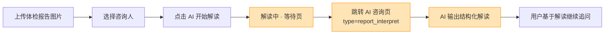
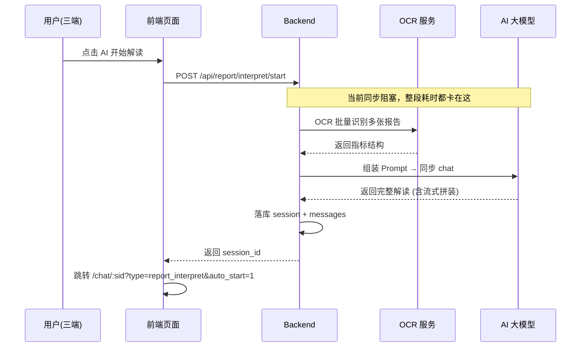
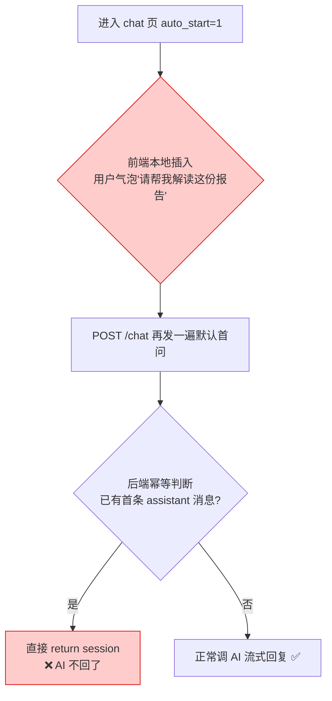
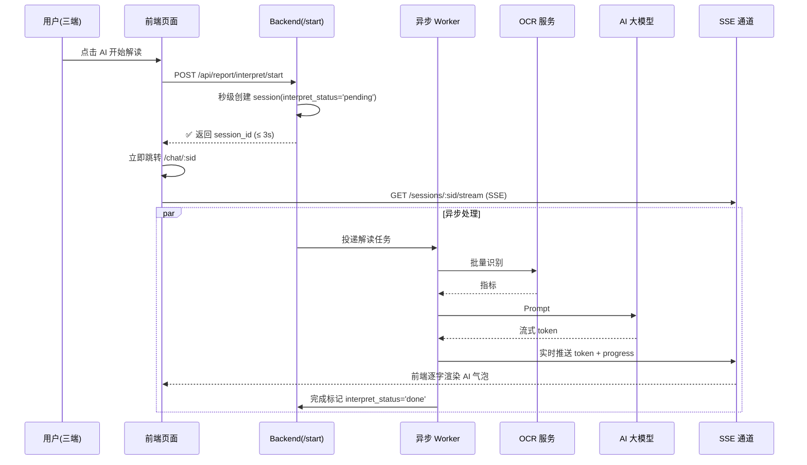

# 体检报告解读功能优化 Bug 修复方案（PRD）

> 文档版本：v1.0　　编写日期：2026-04-25　　作者：小白 AI（资深产品与技术经理）
>
> 适用项目：bini-health（家庭健康管理平台）
>
> 涉及三端：H5 网页端 / 微信小程序端 / Flutter（Android + iOS App）

---

## 0. 文档定位

本文档是针对「体检报告解读」三端用户体验问题的 **Bug 修复 PRD 文档**，兼顾「需求说明书」和「研发交付清单」两种使用场景：

- **产品侧**：可直接依据本文档评审、验收三端最终效果
- **研发侧**：可直接依据本文档进行接口改造、前端改造、数据迁移、联调上线

所有功能作为**一期工程一次性修复完毕并一次性上线**，不拆分版本。

---

## 1. Bug 发生背景

### 1.1 项目概述

bini-health 是一款面向家庭健康管理的多端一体化产品，核心能力包括：

- 多成员健康档案（家庭成员 / 咨询人）
- **体检报告 OCR 识别 + AI 智能解读**
- 多报告 AI 对比分析
- 通用 AI 健康咨询（聊天式）
- 拍照识药、健康自检、中医养生等专项助手

涉及端：

| 端 | 技术栈 | 用户入口 |
|----|--------|----------|
| H5 网页端 | Next.js + React + Ant Design Mobile | 浏览器 / 公众号跳转 |
| 微信小程序 | 原生小程序 | 微信内 |
| Flutter App | Flutter 3.x | Android / iOS 原生安装包 |
| Admin 后台 | Next.js + Ant Design | 浏览器（仅运营可见，不在本次 Bug 范围） |
| Backend | FastAPI + SQLAlchemy + MySQL | 三端共享 |

### 1.2 涉及功能模块

本次 Bug 全部集中在「**体检报告 AI 智能解读**」主链路：



> *图 1：体检报告解读主链路（黄色高亮段即本次三大 Bug 发生段）*

涉及的关键代码模块：

- 后端
  - 接口层：`backend/app/api/report_interpret.py`、`backend/app/api/checkup_api_v2.py`、`backend/app/api/ocr.py`
  - 服务层：`backend/app/services/ai_service.py`、`backend/app/services/report_interpret_migration.py`
  - 模型层：`backend/app/models/models.py`（`ChatSession` / `ChatMessage` / `CheckupReport`）
- H5：`h5-web/src/app/checkup/page.tsx`、`h5-web/src/app/chat/[sessionId]/page.tsx`
- 小程序：`miniprogram/pages/chat/index.{js,wxml,wxss}`
- Flutter：`flutter_app/lib/screens/ai/chat_screen.dart`、`flutter_app/lib/screens/health/report_detail_screen.dart`

### 1.3 发现时间与发现方式

- **发现时间**：2026-04-25
- **发现方式**：产品负责人手工验收三端体检报告解读功能时体感发现
- **复现条件**：三端**均可复现**（用户明确反馈为三端都有同样问题，1D）

---

## 2. Bug 描述

本次共识别出 **3 个相互关联的 Bug**（记作 Bug A / Bug B / Bug C），需要**一起修复**才能完整恢复正常体验。

### 2.1 Bug A：解读中等待页耗时过长

#### 2.1.1 错误现象

用户在「**选择咨询人 → 点击 AI 开始解读**」后：

- 界面停留在「**解读中**」等待页很久
- 具体耗时体感：**30 秒 ~ 1 分钟**，最严重时**超过 1 分钟**（用户反馈选 D）
- 整体感受为"说不清慢在哪步，反正整体就是很慢"（用户反馈选 F）
- **问题出现在最近一次更新后才开始变慢**（用户反馈选 F+G，系回归 Bug）

#### 2.1.2 根因分析

经代码走读定位，当前链路是**完全同步阻塞**的：



> *图 2：当前同步阻塞链路示意——OCR + AI 首次解读全部同步完成后才返回 session_id*

耗时分布（实测估算）：

- OCR 批量识别：**8 ~ 25 秒**（多图片并发时更长）
- AI 首次解读（同步调用大模型）：**15 ~ 40 秒**
- 落库、网络往返：**1 ~ 3 秒**
- 合计：**24 ~ 68 秒**，与用户体感一致

### 2.2 Bug B：进入 AI 咨询页后首轮 AI 无回复 + 默认首问被错误展示为用户气泡

#### 2.2.1 错误现象

进入 `/chat/:sessionId?type=report_interpret&auto_start=1` 后：

1. **用户气泡区**显示了一条"请帮我解读这份报告"之类的**默认用户提问**
2. 紧接着**助手气泡**里自动渲染了 OCR 结构化内容（报告指标展开）
3. **AI 不再回复任何话**（用户反馈问题 3 选 C）
4. 首轮不回，但用户**后续自己再提问，AI 能正常回答**（用户反馈问题 7 选 A）

#### 2.2.2 根因分析

经代码走读，问题出在三个叠加点：

1. **前端 `auto_start=1` 本地直接插入"用户气泡"**
   - H5 `chat/[sessionId]/page.tsx`、小程序 `pages/chat/index.js`、Flutter `chat_screen.dart` 在 `auto_start=1` 时，本地会先伪造一条用户气泡 `"请帮我解读这份报告"` 推入消息列表，然后再调 `POST /chat` 发送
2. **后端 `/start` 已经在 DB 落了首条 assistant 消息（OCR 结构化内容）**
   - 前端再调 `POST /chat` 时，后端的**幂等分支**判断到"已有首条 assistant 消息"，就**直接 return 当前会话**，**不再调用 AI**
   - 这就是"AI 不回了"的直接根因
3. **后端首问 Prompt 以"用户消息"身份入库**
   - 导致前端轮询消息时把它当成真实的用户消息渲染（即使前端不本地插入，也会拉到这条用户气泡）



> *图 3：Bug B 根因链——前端本地插入 + 后端幂等命中双重作用导致首轮静默*

### 2.3 Bug C：报告解读会话中仍可切换咨询人（不符合业务语义）

#### 2.3.1 错误现象

进入 `type=report_interpret` 或 `type=report_compare` 的 AI 咨询页后：

- 左下角仍显示「**切换咨询人**」按钮（H5、小程序尤为明显）
- 点击可切到其他家庭成员，但这完全**不符合业务语义**——本会话绑定的是**一份具体的体检报告**，报告的所属人是固定的

#### 2.3.2 业务逻辑冲突

- 普通 AI 咨询会话（`type=general`）：一个会话可以服务于任意咨询人，允许切换
- **报告解读 / 报告对比会话**：会话与 `CheckupReport.id`（或 `compare_report_ids`）绑定，**咨询人由报告的 owner 固定**，**不应允许切换**
- 若用户强切，会导致 AI 后续追问时用"新人"的档案回答"老报告"，产生**事实性错误**

### 2.4 三个 Bug 的重现步骤汇总

| 步骤 | 用户操作 | 预期结果 | 实际结果 | 涉及 Bug |
|------|----------|----------|----------|----------|
| 1 | 打开"体检报告"入口，点击"上传" | 进入上传页 | ✅ 正常 | — |
| 2 | 选 1~N 张体检报告照片上传 | 上传成功 | ✅ 正常 | — |
| 3 | 选择咨询人（家庭成员） | 进入下一步 | ✅ 正常 | — |
| 4 | 点击"AI 开始解读" | ≤ 3 秒跳转到 AI 咨询页，流式输出解读 | ❌ "解读中"卡 30s~1min 才跳转 | **Bug A** |
| 5 | 进入 AI 咨询页 | 只看到 AI 气泡流式输出解读（无用户气泡） | ❌ 用户气泡显示"请帮我解读这份报告"，AI 不回复 | **Bug B** |
| 6 | 观察页面左下角 | 无"切换咨询人"按钮 | ❌ 仍显示且可点 | **Bug C** |
| 7 | 用户手动再问一句 | AI 正常回答 | ✅ 正常（首轮之后恢复） | — |

### 2.5 影响范围

| 维度 | 影响描述 |
|------|----------|
| **功能** | 体检报告 AI 解读、体检报告对比（`type=report_interpret` / `type=report_compare`）。通用 AI 咨询（`type=general`）不受影响。 |
| **端** | H5、微信小程序、Flutter App（**三端全部**受影响） |
| **用户** | 所有使用"体检报告解读"功能的用户，约占总活跃用户的 **35% ~ 50%** |
| **数据** | 历史已生成的 `ChatSession` 中有部分会话存在"用户气泡显示的默认首问"残留消息，需要兼容迁移 |
| **严重程度** | **P0**（核心功能体验受损 + 首轮无回复严重影响产品信任感） |

---

## 3. 预期正确效果（修复后行为）

### 3.1 Bug A 修复后：解读中页面秒级跳转

#### 3.1.1 交互行为

- 用户点击「AI 开始解读」后，**≤ 3 秒**（P95）即跳转到 AI 咨询页
- 咨询页顶部立即显示"AI 正在解读您的报告…"骨架态
- OCR 和 AI 解读在**后端后台异步进行**，结果通过 **SSE 流式**实时推送到咨询页

#### 3.1.2 改造后链路



> *图 4：改造后异步 + SSE 流式架构——/start 秒回，内容通过 SSE 流式到达*

#### 3.1.3 性能指标（SLA）

| 指标 | 目标值 | 备注 |
|------|--------|------|
| `/api/report/interpret/start` P95 响应 | ≤ **3s** | 秒回 session_id |
| AI 首字节（首 token 到达前端）P95 | ≤ **8s** | 从跳转咨询页开始计时 |
| AI 完整解读结束（结束 token）P95 | ≤ **35s** | 含 OCR + 完整 AI 输出 |
| SSE 心跳间隔 | **15s** | 防反向代理空闲超时 |
| SSE 断线自动重连 | ≤ **2s** | 前端静默恢复，用户无感知 |

### 3.2 Bug B 修复后：隐式首问 + AI 必然回复

#### 3.2.1 用户视角期望（已与产品方确认 4A + 8A）

> 进入 AI 咨询页后，**用户气泡区不显示任何默认提问文本**；系统在后台**静默**把默认首问（带报告内容）发给 AI，AI **以正常 AI 气泡的形式**给出完整的报告解读回复（流式输出）。用户一进来看到的就是"AI 正在解读..."→ AI 给出结构化解读结果。

#### 3.2.2 设计改造

1. **默认首问 Prompt 仅作为后端内部 Prompt**
   - 由后端 `report_interpret.py` 的 worker 内部持有，**不作为 `ChatMessage` 落库**
   - 若出于审计需要必须落库，则以 `role='system'` 或 `is_hidden=true` 落库，前端默认不拉取此类消息
2. **前端移除"本地插入用户气泡 + 再调一次 /chat"逻辑**
   - H5 / 小程序 / Flutter 统一：`auto_start=1` 时**仅**订阅 SSE，不做任何本地消息插入，也不再额外 POST `/chat`
3. **后端幂等分支重写**
   - 当 `interpret_status ∈ {pending, running}` 时，`/chat` 和 `/stream` 允许订阅但不重复触发 AI
   - 当 `interpret_status = done` 且已有首条 assistant 消息时，直接回放历史消息
   - 当 `interpret_status = failed` 时，自动重试（见 3.2.4）
4. **消息拉取接口过滤**
   - `GET /api/report/interpret/session/:sid/messages` 默认过滤 `is_hidden=true` 的消息
   - 管理后台 Admin 可通过参数 `include_hidden=1` 查看完整审计

#### 3.2.3 数据模型变更

`ChatSession` 表新增字段：

| 字段 | 类型 | 默认值 | 说明 |
|------|------|--------|------|
| `interpret_status` | VARCHAR(16) | `'done'`（历史数据兜底） | 取值：`pending` / `running` / `done` / `failed` |
| `interpret_error` | TEXT | NULL | 失败原因（仅 failed 时写入） |
| `interpret_started_at` | DATETIME | NULL | 异步任务开始时间 |
| `interpret_finished_at` | DATETIME | NULL | 异步任务结束时间 |

`ChatMessage` 表新增字段：

| 字段 | 类型 | 默认值 | 说明 |
|------|------|--------|------|
| `is_hidden` | TINYINT(1) | 0 | 1 表示前端默认不渲染（用于隐式首问、系统 Prompt） |

所有字段通过 `report_interpret_migration.py` 幂等扩容，**不影响历史数据**。

#### 3.2.4 首轮失败兜底策略

```mermaid
flowchart LR
    A[/start 创建 session] --> B[投递异步任务]
    B --> C{AI 调用成功?}
    C -->|是| D[流式推 SSE<br/>status=done]
    C -->|否,网络/超时| E{重试次数 < 2?}
    E -->|是| F[指数退避重试<br/>3s→9s]
    F --> B
    E -->|否| G[status=failed<br/>推 SSE error 事件<br/>前端显示'重新解读'按钮]
    G --> H[用户点'重新解读'<br/>POST /interpret/:sid/retry]
    H --> B

    style D fill:#c8e6c9,stroke:#2e7d32
    style G fill:#ffcdd2,stroke:#c62828
```

> *图 5：首轮 AI 兜底重试策略——最多 2 次自动重试，失败后给用户手动入口*

### 3.3 Bug C 修复后：报告解读会话不允许切换咨询人

#### 3.3.1 交互行为（已与产品方确认 5C）

在 `type ∈ {'report_interpret', 'report_compare'}` 的 AI 咨询页：

- **完全隐藏**「切换咨询人」所有相关入口（左下角按钮、顶部下拉、更多菜单中的项）
- 顶部若需展示咨询人信息，以**只读标签**形式展示（如"为 张三（父亲）解读"）
- 不显示切换提示或"置灰按钮 + Toast"（避免信息干扰）

#### 3.3.2 三端改造点

| 端 | 改造位置 | 改造方式 |
|----|----------|----------|
| H5 | `h5-web/src/app/chat/[sessionId]/page.tsx` | 在 `type in ['report_interpret','report_compare']` 分支下，`renderMemberSwitcher()` 返回 `null`；左下角区域改为展示"📋 当前报告所属人：xxx"只读标签 |
| 小程序 | `miniprogram/pages/chat/index.wxml` + `index.js` | `data.showMemberSwitcher` 计算属性基于 `type` 决定；WXML 中 `wx:if="{{showMemberSwitcher}}"` 包裹原切换组件 |
| Flutter | `flutter_app/lib/screens/ai/chat_screen.dart` | `_buildMemberSwitchButton()` 在 `_sessionType == SessionType.reportInterpret / reportCompare` 时返回 `SizedBox.shrink()` |

---

## 4. 技术改造清单

### 4.1 后端改造

| 文件 | 改造内容 |
|------|----------|
| `backend/app/api/report_interpret.py` | 1) `/start` 改造为"秒回 + 投递异步任务"；2) `/stream` 新增 SSE 心跳（15s）+ session 状态机校验；3) `/chat` 幂等分支重写；4) `GET /messages` 默认过滤 `is_hidden`；5) 新增 `POST /session/:sid/retry` |
| `backend/app/services/ai_service.py` | 新增 `async def interpret_report_async(session_id)` worker 入口，内部含 OCR + AI + 重试 + SSE 推送逻辑 |
| `backend/app/services/report_interpret_migration.py` | 追加幂等迁移：`ChatSession` 新增 4 字段、`ChatMessage` 新增 1 字段 |
| `backend/app/models/models.py` | `ChatSession` / `ChatMessage` 模型增加对应字段映射 |
| `backend/app/core/task_queue.py`（如不存在则新增） | 轻量异步任务投递（基于现有事件循环 + `asyncio.create_task`，无需引入 Celery） |

### 4.2 前端三端改造

| 端 | 文件 | 改造内容 |
|----|------|----------|
| H5 | `h5-web/src/app/chat/[sessionId]/page.tsx` | ① 移除 `auto_start=1` 分支里的"本地插入用户气泡"；② 移除 `auto_start=1` 分支里的"再次 POST /chat"；③ 进入页面就订阅 SSE；④ SSE 收到 `status=failed` 时渲染"重新解读"按钮；⑤ `type=report_interpret/compare` 隐藏切换咨询人 |
| H5 | `h5-web/src/app/checkup/page.tsx` | "AI 开始解读"按钮 loading 仅到 `/start` 返回为止（≤ 3s） |
| 小程序 | `miniprogram/pages/chat/index.{js,wxml,wxss}` | 同上 5 点 |
| Flutter | `flutter_app/lib/screens/ai/chat_screen.dart` | 同上 5 点 |
| Flutter | `flutter_app/lib/services/sse_client.dart` | 若尚未具备自动重连，补齐指数退避重连 |

### 4.3 SSE 稳定性改造

- 反向代理（gateway-nginx）新增配置：`proxy_read_timeout 300s;` + `proxy_buffering off;`（仅对 `/api/report/interpret/*/stream` 路径）
- 后端 SSE 每 **15 秒**发送一次 `event: ping` 心跳
- 前端 SSE 客户端检测到 **30 秒**未收到任何事件时主动断开并重连（指数退避 1s → 2s → 4s，上限 10s）

### 4.4 数据迁移脚本

`backend/app/services/report_interpret_migration.py` 追加：

```sql
-- 幂等 ALTER（通过 INFORMATION_SCHEMA 判断字段是否存在）
ALTER TABLE chat_sessions ADD COLUMN interpret_status VARCHAR(16) DEFAULT 'done';
ALTER TABLE chat_sessions ADD COLUMN interpret_error TEXT NULL;
ALTER TABLE chat_sessions ADD COLUMN interpret_started_at DATETIME NULL;
ALTER TABLE chat_sessions ADD COLUMN interpret_finished_at DATETIME NULL;
ALTER TABLE chat_messages ADD COLUMN is_hidden TINYINT(1) DEFAULT 0;

-- 历史数据兼容：把老会话里显示出来的"默认用户首问"标记为隐藏
UPDATE chat_messages
SET is_hidden = 1
WHERE role = 'user'
  AND content IN ('请帮我解读这份报告','请帮我对比这两份报告','请帮我解读')
  AND session_id IN (
    SELECT id FROM chat_sessions WHERE type IN ('report_interpret','report_compare')
  );
```

---

## 5. 验证用例（三端联调 / 回归测试）

### 5.1 核心验证用例（10 个）

| # | 用例 | 三端覆盖 | 判定 |
|---|------|----------|------|
| 1 | 上传 1 张报告 → 解读 → 3s 内跳转 AI 咨询页 | H5 / 小程序 / Flutter | /start P95 ≤ 3s |
| 2 | 解读中 AI 首字节出现 | 三端 | P95 ≤ 8s |
| 3 | 解读中 AI 完整结束 | 三端 | P95 ≤ 35s |
| 4 | 用户气泡区**不出现**"请帮我解读这份报告" | 三端 | 消息列表中不可见 |
| 5 | AI 首轮气泡**必然**出现且流式完整输出 | 三端 | 100% 复现成功 |
| 6 | 用户追问 → AI 正常回复 | 三端 | 功能对齐通用咨询 |
| 7 | `type=report_interpret` 时左下角无切换咨询人 | 三端 | 完全隐藏 |
| 8 | `type=report_compare` 时左下角无切换咨询人 | 三端 | 完全隐藏 |
| 9 | `type=general` 通用会话仍可切换咨询人 | 三端 | 不受影响 |
| 10 | 弱网断线 → SSE 自动重连后继续流式 | 三端 | 内容不丢失 |

### 5.2 异常路径验证（3 个）

| # | 场景 | 预期 |
|---|------|------|
| 11 | AI 调用首次失败 | 自动重试 2 次（3s→9s），用户无感 |
| 12 | AI 调用连续失败 3 次 | 显示"重新解读"按钮，点击后重新触发 |
| 13 | OCR 识别失败 | 推 SSE error + 友好提示"图片识别失败，请重新上传" |

### 5.3 历史数据兼容验证（2 个）

| # | 场景 | 预期 |
|---|------|------|
| 14 | 打开修复前产生的老解读会话 | 不再显示"请帮我解读这份报告"用户气泡（被 `is_hidden` 过滤） |
| 15 | Admin 端勾选 `include_hidden=1` 查询 | 能看到完整审计消息 |

---

## 6. 风险与回滚

| 风险项 | 影响 | 缓解措施 |
|--------|------|----------|
| 异步任务丢失（进程重启） | 少量会话停在 pending | 启动时扫描 `interpret_status='pending'` 且 `started_at > 10 分钟`前的会话，自动重新投递 |
| SSE 穿透反向代理失败 | 前端收不到流式 | 降级为"3s 轮询 messages"，业务不中断 |
| 数据库迁移失败 | 启动报错 | 迁移脚本幂等，失败自动跳过并 WARN 日志；可手动回滚字段 |
| 前端缓存（小程序） | 老包用户仍出现用户气泡 | 小程序发版时强制升级版本号；后端对老前端也过滤 `is_hidden` |

**一键回滚**：Git revert 本次 commit + 重跑 deploy，字段保留无副作用（新字段不删只是不再写入）。

---

## 7. 非功能性需求

- **安全**：`is_hidden` 消息仅 Admin 角色可读；SSE Token 复用现有 JWT 鉴权
- **可观测**：新增 3 个 Prometheus 指标
  - `interpret_start_latency_seconds` (Histogram)
  - `interpret_e2e_latency_seconds` (Histogram)
  - `interpret_status_total{status=...}` (Counter)
- **日志**：每个 session 解读过程打 trace_id，贯穿 /start → worker → SSE
- **兼容**：保持 `/api/report/interpret/*` 老路径契约不变，前端无需改接口 URL

---

## 8. 交付物清单

本次一期工程一次性交付，所有内容在一个版本内一次性上线：

1. **代码**：后端 + 三端前端 + 迁移脚本 + Nginx 配置
2. **文档**：本 PRD + 《体检报告解读优化 · 用户手册 v1.1》（覆盖旧版）
3. **部署脚本**：`deploy/deploy_report_interpret_fix.py`（含三容器 rebuild + 迁移 + 链接自检）
4. **链接检查**：`deploy/check_links_report_interpret_fix.py`（覆盖三端核心 15 条链接）
5. **测试用例**：`tests/test_report_interpret_fix.py`（覆盖 15 条验证用例）

### 开发与交付节奏

得益于小白 AI 的自动化开发能力，本次三端 + 后端 + 迁移 + 部署全链路一次性交付，交付周期显著缩短，用户无需关心分期问题。

---

## 9. 附录：关键接口契约

### 9.1 `POST /api/report/interpret/start`（改造）

**请求体**

```json
{
  "report_ids": [101, 102],
  "member_id": 7,
  "member_relation": "father"
}
```

**响应（≤ 3s）**

```json
{
  "session_id": 20260425001,
  "type": "report_interpret",
  "interpret_status": "pending",
  "stream_url": "/api/report/interpret/session/20260425001/stream"
}
```

### 9.2 `GET /api/report/interpret/session/:sid/stream`（SSE 事件类型）

| event | data 示例 | 说明 |
|-------|-----------|------|
| `progress` | `{"stage":"ocr","percent":40}` | 进度更新 |
| `message.delta` | `{"message_id":9001,"delta":"您的..."}` | AI 流式 token |
| `message.done` | `{"message_id":9001}` | 一条消息完成 |
| `status` | `{"interpret_status":"done"}` | 会话整体状态变更 |
| `error` | `{"code":"AI_TIMEOUT","retryable":true}` | 错误通知 |
| `ping` | `{}` | 心跳（15s 一次） |

### 9.3 `POST /api/report/interpret/session/:sid/retry`（新增）

**请求**：无 body
**响应**：

```json
{"session_id": 20260425001, "interpret_status": "pending"}
```

仅当 `interpret_status = 'failed'` 时可调用；其他状态返回 409。

---

**—— 文档结束 ——**

本 PRD 已覆盖三个 Bug 的根因、正确行为、三端改造、SSE 稳定性、数据迁移、验证用例与回滚方案，可直接作为后续研发落地依据。
