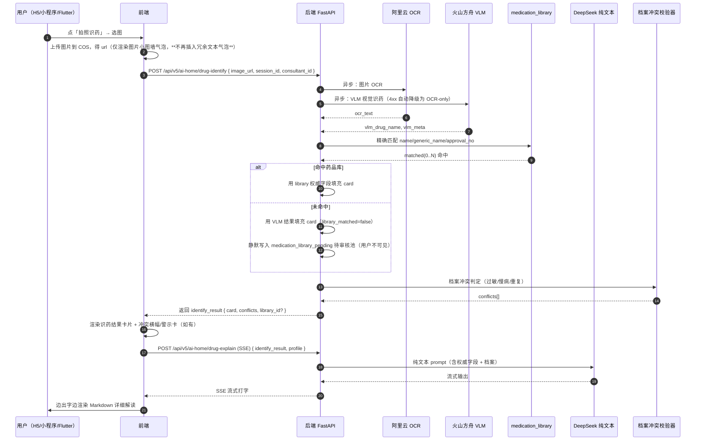
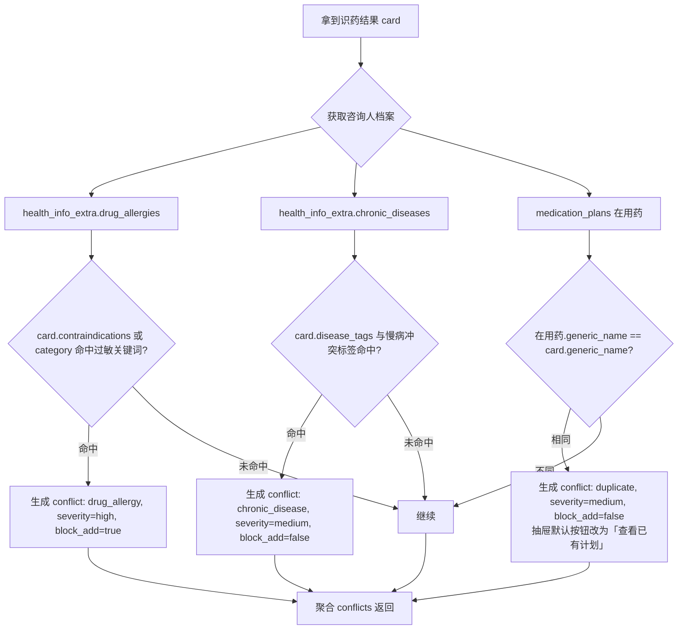
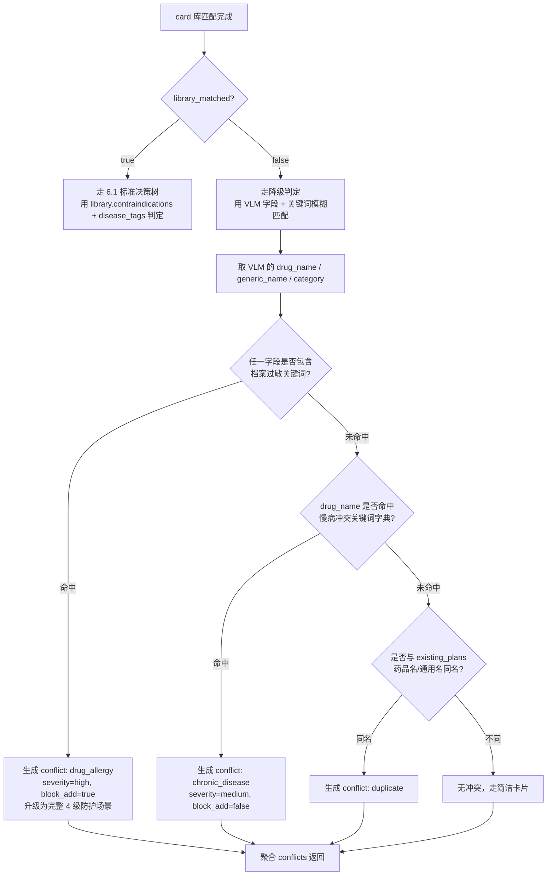
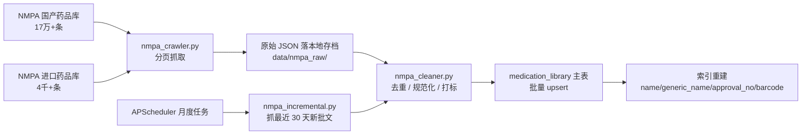
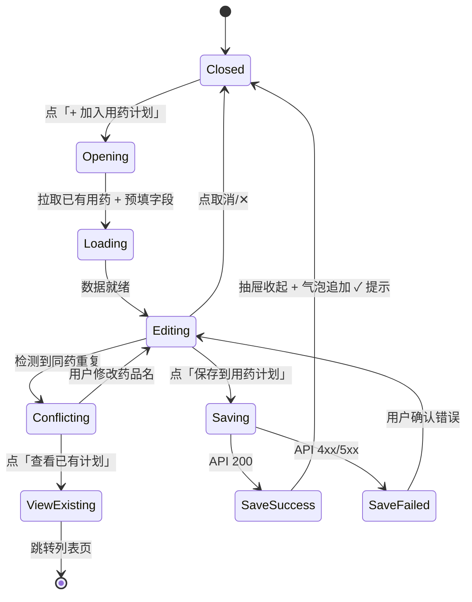

# AI 对话模式「拍照识药」Bug 修复 + 权威药品库接入 方案文档

> 文档版本：v1.0
> 生成时间：2026-05-16 17:05:47
> 适用范围：H5（ai-home）/ 微信小程序 / Flutter App 三端
> 输出格式：Markdown 主文档 + Mermaid 全套流程图 + HTML 适老化视觉规格预览页

---

## 0. 文档使用说明

本文档由「小白 AI」基于与用户的 17 轮结构化对话沉淀而成，聚焦于「AI 对话模式 ai-home → 拍照识药」两个线上 Bug 的根治，并把"权威药品库接入"作为同期 Scope 一并落地。

- **配套 HTML 视觉预览页**：`docs/preview/preview.html`（可直接在浏览器打开查看识药卡片、抽屉、冲突警示卡的实际效果）
- **配套 Mermaid 流程图**：均内联在本文档中（GitLab/GitHub/支持 Mermaid 的 Markdown 渲染器可直接查看）

---

## 1. Bug 发生背景

### 1.1 项目概述

- 项目名称：bini-health（小白健康）
- 业务定位：面向 40-60 岁中老年用户的家庭健康管理平台
- 技术架构：
  - 后端：Python FastAPI（`backend/`）
  - H5 / Web：Next.js（`h5-web/`）
  - 小程序：微信原生小程序（`miniprogram/`）
  - App：Flutter（`flutter_app/`）
  - 数据库：MySQL + Redis
  - AI 大模型：火山方舟 `deepseek-v3-2-251201`（纯文本模型）
- 当前 AI 对话能力：已实现「AI 对话模式 ai-home」+「菜单模式 /drug」两条入口，均支持文字 + 图片上传

### 1.2 涉及功能模块

| 模块 | 路径 / 入口 | 说明 |
|---|---|---|
| AI 对话模式 ai-home | H5：`/ai-home`<br>小程序：`pages/ai/home`<br>Flutter：`lib/pages/ai_home_page.dart` | 本次 Bug 的发生端 |
| 菜单模式 /drug 拍照识药 | `/drug` 入口 + `POST /api/drugs/identify-v2` | 已有完整 OCR + VLM + 兜底链路（本次复用样板） |
| 药品库 | `medication_library` 表 + `app/services/medication_library_service.py` | 当前仅 200-300 条种子数据 |
| 用药计划 | `/health-plan/medications/add` + `POST /api/health-plan/medications` | 抽屉表单 1:1 复用此页字段与接口 |
| 健康档案（咨询人档案） | `health_info` + `health_info_extra` 表 | 用于档案冲突判定的数据源 |
| 后台管理 | `admin-web/` | 新增药品库待审核、医疗咨询热线配置入口 |

### 1.3 发现时间与发现方式

- 发现时间：2026-05-16
- 发现方式：用户在「AI 对话模式 ai-home」点击「拍照识药」上传图片后，AI 对话气泡中出现两个明显异常（详见 2.1）
- 复现频率：**每次必现**、**H5 / 小程序 / Flutter 三端同时出现**

---

## 2. Bug 描述

### 2.1 错误现象

**Bug #1：用户气泡里冗余文本**

用户上传一张药盒图片后，AI 对话流里会**额外**插入一条用户文本气泡，内容形如：

```
[用户上传的图片1张]
1. https://xiaokang-1323135906.cos.ap-guangzhou.myqcloud.com/images/24986102b6e34dea85a14c356dd22f50.jpeg
```

这条文本既被发送到后端，也被当作用户消息渲染到 UI 中，造成视觉冗余、信息泄漏（COS 直链外泄）、且对 40-60 岁用户认知干扰大。

**Bug #2：AI 服务调用 400 Bad Request**

紧接着 AI 回复时报错：

```
AI服务调用失败: Client error '400 Bad Request' for url
'https://ark.cn-beijing.volces.com/api/v3/chat/completions'
```

整条识药对话无任何有效回复。

### 2.2 重现步骤

| 步骤 | 操作 | 预期结果 | 实际结果 |
|------|------|----------|----------|
| 1 | 进入「AI 对话模式 ai-home」 | 正常进入对话首页 | 正常 |
| 2 | 点击底部「拍照识药」按钮 | 弹出图片选择器 | 正常 |
| 3 | 选择一张药盒图片 | 仅显示"图片小图墙"用户气泡 | **多出一条 `[用户上传的图片1张] + URL` 文本气泡** |
| 4 | 等待 AI 回复 | 流式输出识药结构化结果 | **AI 气泡报 400 Bad Request 错误** |

### 2.3 影响范围

| 维度 | 影响详情 |
|---|---|
| 端 | H5（ai-home）+ 微信小程序 + Flutter App，**三端必现** |
| 功能 | AI 对话模式下「拍照识药」功能**完全不可用** |
| 用户 | 全量用户，特别是 40-60 岁中老年主力用户群 |
| 数据 | COS 图片直链泄漏在对话流中（可能进入对话历史存档） |
| 业务 | 识药是平台核心高频功能，直接影响用药计划录入转化 |

### 2.4 根因分析

**Bug #1 根因：** H5 / 小程序 / Flutter 三端在用户上传图片后，前端组件 `composeImageUrls()`（或类似函数）会用 `urlLines.push("[用户上传的图片N张]\n1. URL\n2. URL...")` 拼出一段文本，然后**这段文本既作为 `messages[].content` 发给后端，又被 `handleSend(textBubble)` 当作一条用户气泡渲染到 UI**。三端使用同一套旧版"图文合并"逻辑，所以三端同时出现。

**Bug #2 根因：** 后端在前一次「千图一答」修复中，给火山方舟 `chat/completions` 自动**升级成多模态 `content` 数组**（含 `image_url` 块）；但线上模型 `deepseek-v3-2-251201` 是**纯文本模型**，遇到多模态结构直接返回 400。虽有"4xx 自动降级为纯文本"兜底，但在 SSE 流式 + 个别消息组装顺序下兜底不触发，导致用户看到原始 400 错误。

---

## 3. 预期正确效果（17 项口径完整对齐）

> 以下 17 项口径为本次方案的最终约束，是验收与开发的唯一基准。

### 3.1 口径总览

| # | 类别 | 最终口径 |
|---|---|---|
| 1 | Bug 范围 | H5 + 小程序 + Flutter 三端必现，三端全部修复 |
| 2 | 触发方式 | 点「拍照识药」→ 选图 → 自动发送（不需要用户额外输入文字） |
| 3 | 问题 #1 修复 | **完全删除冗余文本气泡**，UI 只保留"图片小图墙气泡 + AI 回复气泡"，URL 仅在内部 payload 中使用 |
| 4 | 问题 #2 根治 | 抛弃多模态 `content` 数组，**强制走 OCR + 纯文本**链路，与 `/drug` 菜单模式同源 |
| 5 | 整体路线 | **三段式调用**：identify-v2（识药）→ medication_library 匹配（权威化）→ SSE 解读（流式打字） |
| 6 | 渲染形态 | 顶部"识药结果卡片" + 中部"AI Markdown 流式解读" + 底部"操作按钮区"，全面适老化加强 |
| 7 | "加入计划"按钮 | 底部滑出**抽屉表单** + 抽屉内附"已有用药列表"区 + 底部"查看全部用药计划"链接 |
| 8 | 多端范围 | 三端**完全对齐**，UI/交互/接口/兜底文案一致 |
| 9 | 档案融入 | 警示横幅 + AI 解读加粗红字 + 「加入用药计划」按钮**联动置灰** + 独立冲突警示卡 + 「联系医生咨询」按钮 |
| 10 | 咨询人归属 | 识别阶段不区分咨询人；抽屉内手选"为谁加入"，默认填充当前对话的咨询人 |
| 11 | 冲突兜底强度 | 四级防护：① 红底警示横幅 ② AI 解读加粗红字 ③ 加入按钮置灰 ④ 独立冲突警示卡 + 联系医生 |
| 12 | 药品库匹配 | VLM 给出药品名 → 后端按 `name/generic_name/approval_no` 精确匹配 + 按 token 模糊匹配 → 命中用权威字段填充卡片；未命中时**卡片不出现任何"未收录""仅供参考"字样**（用户不关心后台是否收录），按钮仍可点，VLM 结果静默写入待审池 |
| 13 | 抽屉字段 | **1:1 复用** `/health-plan/medications/add` 现有字段与 `POST /api/health-plan/medications` 接口，UI 形态改为底部滑出抽屉 |
| 14 | 冲突判定规则 | 三类：① 药物过敏 vs 药品禁忌/类目 ② 慢病 vs `disease_tags` ③ 在用药物 vs 同药重复检测 |
| 15 | 已有用药展示 | 抽屉内**列出全部用药计划**（不再限 Top 3），区块内可滚动，"在用"排前，"已结束"灰显在后 |
| 16 | 联系医生 | 用药冲突警示卡底部按钮文案为「📞 联系医生咨询」，点击弹出轻量浮层，显示**后台可配置**的热线 + "前往专家咨询" 跳 `/experts` |
| 17 | 权威药品库 | **本期同步落地** NMPA 全量抓取（约 15-18 万条）+ 清洗 + 入库 + 月度增量更新；不分期 |

### 3.2 本期 Scope（一次性交付）

1. Bug 修复：删除三端冗余文本气泡
2. Bug 修复：根治 400 错误（强制 OCR + 文本链路）
3. 三段式调用升级：identify-v2 → 药品库匹配 → SSE 解读
4. 适老化识药结果卡片 + 加入用药计划抽屉 + 已有用药列表
5. 档案冲突四级防护
6. 「联系医生咨询」按钮 + 后台可配置热线
7. 权威药品库接入（NMPA 全量抓取 + 清洗 + 入库 + 增量更新）

### 3.3 不在本期范围

- 完整「家庭医生」模块（医生入驻、资质审核、用户绑定、医患 IM、收费分账等）
- 第三方药典 API 商业授权对接
- 药物相互作用知识库（本期仅做"同名重复"检测）

> 以上两项作为下期独立专项立 PRD，本文档不再附录。

---

## 4. 修复方案详细设计

### 4.1 整体调用时序图



### 4.2 后端改动清单

#### 4.2.1 新增接口

**接口 1：AI 对话模式拍照识药（结构化阶段）**

- 路径：`POST /api/v5/ai-home/drug-identify`
- 入参：
  ```json
  {
    "image_url": "https://.../xxx.jpg",
    "session_id": "uuid",
    "consultant_id": 123,
    "client": "h5|miniprogram|flutter"
  }
  ```
- 出参：
  ```json
  {
    "identify_id": "uuid",
    "card": {
      "library_id": 456,
      "drug_name": "阿莫西林胶囊",
      "generic_name": "阿莫西林",
      "spec": "0.25g × 24 粒",
      "manufacturer": "××制药",
      "rx_type": "OTC",
      "category": "青霉素类抗生素",
      "indications": "...",
      "usage": "...",
      "contraindications": "青霉素过敏者禁用",
      "adverse_reactions": "...",
      "disease_tags": ["呼吸道感染", "细菌性炎症"],
      "library_matched": true,
      "fields_from_library": ["name", "generic_name", "spec", "manufacturer", "category", "indications", "usage", "contraindications", "adverse_reactions", "disease_tags"],
      "fields_from_vlm": []
    },
    "conflicts": [
      {
        "type": "drug_allergy",
        "severity": "high",
        "title": "本药与您档案中【青霉素过敏】冲突",
        "detail": "阿莫西林属于青霉素类抗生素，过敏者可能引发过敏性休克",
        "block_add": true
      }
    ]
  }
  ```
- 内部实现：
  1. 并发调用 OCR 与 VLM（asyncio.gather）
  2. VLM 返回 4xx/超时 → 降级为 OCR-only + 关键词匹配
  3. 调 `medication_library_service.match_by_name(drug_name)` 精确 + 模糊匹配
  4. 未命中 → 调 `medication_library_pending_service.upsert(...)` 写入待审核池
  5. 调 `conflict_checker_service.check(consultant_id, card)` 做档案冲突判定
  6. 返回结构化结果

**接口 2：AI 对话模式识药解读（流式阶段）**

- 路径：`POST /api/v5/ai-home/drug-explain`（SSE）
- 入参：
  ```json
  {
    "identify_id": "uuid",
    "session_id": "uuid",
    "consultant_id": 123
  }
  ```
- 实现要点：
  - 严格使用**纯文本 messages**（`content: string`），**禁止任何多模态结构**
  - Prompt 包含：药品权威信息 + 咨询人档案摘要 + 冲突详情
  - 在 `chat_completions_client.py` 中**移除自动多模态升级逻辑**，仅在显式标记 `enable_vision=True` 的接口才走多模态

**接口 3：药品库 OCR 匹配（已有，需扩展）**

- 路径：`POST /api/v5/medication-library/match`
- 在现有 `recognize` 接口基础上，**新增按 `approval_no` 精确匹配**与 **token 模糊匹配返回 Top 5 候选**

**接口 4：药品库待审核池**

- 表：`medication_library_pending`
  ```sql
  CREATE TABLE medication_library_pending (
    id BIGINT PRIMARY KEY AUTO_INCREMENT,
    drug_name VARCHAR(255) NOT NULL COMMENT 'VLM 识别名',
    generic_name VARCHAR(255) NULL,
    spec VARCHAR(255) NULL,
    manufacturer VARCHAR(255) NULL,
    vlm_raw JSON NULL COMMENT 'VLM 原始结果',
    ocr_text TEXT NULL,
    sample_image_url VARCHAR(500) NULL COMMENT '一张样本图片，供运营审核',
    hit_count INT DEFAULT 1 COMMENT '被识别次数',
    last_hit_at DATETIME NOT NULL,
    status TINYINT DEFAULT 0 COMMENT '0=待审 1=已采纳 2=驳回',
    operator_id BIGINT NULL,
    operated_at DATETIME NULL,
    INDEX idx_status_hit (status, hit_count DESC),
    INDEX idx_drug_name (drug_name)
  );
  ```
- 后台接口：
  - `GET /api/admin/medication-library-pending`：分页列表
  - `POST /api/admin/medication-library-pending/{id}/accept`：采纳并入主库
  - `POST /api/admin/medication-library-pending/{id}/reject`：驳回

**接口 5：医疗咨询联系方式**

- 表：扩展现有 `system_config`，新增三个键值：
  - `doctor_consult_hotline`：电话号码（如 `400-XXX-XXXX`）
  - `doctor_consult_hotline_label`：显示文案（如 `用药咨询专线`）
  - `doctor_consult_hotline_hours`：服务时间（如 `7×24h`）
- 接口：`GET /api/v5/system-config/doctor-consult`（公开读，无需鉴权）

#### 4.2.2 改动文件清单

| 文件 | 改动类型 | 说明 |
|---|---|---|
| `backend/app/api/v5/ai_home.py` | **新增** | 新接口 `drug-identify` + `drug-explain` |
| `backend/app/services/drug_identify_v3_service.py` | **新增** | 三段式编排服务 |
| `backend/app/services/medication_library_service.py` | 改造 | 新增 `match_by_name` / `match_by_approval_no` / `fuzzy_match_topk` |
| `backend/app/services/conflict_checker_service.py` | **新增** | 档案冲突判定核心 |
| `backend/app/services/medication_library_pending_service.py` | **新增** | 待审核池 CRUD |
| `backend/app/clients/chat_completions_client.py` | 改造 | **移除自动多模态升级**，新增 `enable_vision` 显式开关 |
| `backend/app/models/medication_library_pending.py` | **新增** | ORM 模型 |
| `backend/app/api/admin/medication_library_pending.py` | **新增** | 后台审核接口 |
| `backend/app/api/v5/system_config.py` | 改造 | 新增 `doctor-consult` 端点 |
| `backend/scripts/nmpa_crawler.py` | **新建（重写）** | NMPA 真实抓取脚本（替代旧 `drug_crawler.py` 假爬虫） |
| `backend/scripts/nmpa_cleaner.py` | **新建** | 数据清洗 |
| `backend/scripts/nmpa_importer.py` | **新建** | 批量入库 |
| `backend/app/tasks/nmpa_incremental.py` | **新建** | 月度增量定时任务（基于 APScheduler） |
| `backend/migrations/xxxx_pending.sql` | **新建** | 建表脚本 |

### 4.3 H5（Next.js）改动清单

| 文件 | 改动类型 | 说明 |
|---|---|---|
| `h5-web/src/app/ai-home/page.tsx` | 改造 | 删除 `urlLines.push` 拼接 + `handleSend` 重复气泡逻辑 |
| `h5-web/src/app/ai-home/components/DrugIdentifyCard.tsx` | **新增** | 适老化识药结果卡片 |
| `h5-web/src/app/ai-home/components/AddMedicationDrawer.tsx` | **新增** | 加入用药计划抽屉（复用 add 页字段） |
| `h5-web/src/app/ai-home/components/ConflictBanner.tsx` | **新增** | 红底警示横幅 |
| `h5-web/src/app/ai-home/components/ConflictCard.tsx` | **新增** | 独立冲突警示卡 |
| `h5-web/src/app/ai-home/components/ContactDoctorPopup.tsx` | **新增** | 「联系医生咨询」浮层 |
| `h5-web/src/app/ai-home/components/IdentifyFailedTip.tsx` | **新增** | 识别失败兜底提示 |
| `h5-web/src/services/aiHomeDrugApi.ts` | **新增** | 三段式调用编排 |
| `h5-web/src/hooks/useExistingMedications.ts` | **新增** | 拉取当前咨询人已有用药 |

### 4.4 小程序改动清单

| 文件 | 改动类型 | 说明 |
|---|---|---|
| `miniprogram/pages/ai/home/index.js` | 改造 | 同 H5：删除冗余气泡 + 接入新接口 |
| `miniprogram/components/drug-identify-card/` | **新增** | 适老化卡片组件 |
| `miniprogram/components/add-medication-drawer/` | **新增** | 抽屉组件（基于 vant-weapp ActionSheet 扩展） |
| `miniprogram/components/conflict-banner/` | **新增** | |
| `miniprogram/components/conflict-card/` | **新增** | |
| `miniprogram/components/contact-doctor-popup/` | **新增** | |
| `miniprogram/utils/aiHomeDrugApi.js` | **新增** | |

### 4.5 Flutter 改动清单

| 文件 | 改动类型 | 说明 |
|---|---|---|
| `flutter_app/lib/pages/ai_home_page.dart` | 改造 | 删除冗余气泡 + 接入新接口 |
| `flutter_app/lib/widgets/drug_identify_card.dart` | **新增** | |
| `flutter_app/lib/widgets/add_medication_drawer.dart` | **新增** | 使用 `showModalBottomSheet` |
| `flutter_app/lib/widgets/conflict_banner.dart` | **新增** | |
| `flutter_app/lib/widgets/conflict_card.dart` | **新增** | |
| `flutter_app/lib/widgets/contact_doctor_popup.dart` | **新增** | |
| `flutter_app/lib/services/ai_home_drug_api.dart` | **新增** | |

### 4.6 后台管理改动清单

| 文件 | 改动类型 | 说明 |
|---|---|---|
| `admin-web/src/pages/MedicationLibrary/Pending.tsx` | **新增** | 待审核药品列表 + 采纳/驳回操作 |
| `admin-web/src/pages/SystemSettings/DoctorConsult.tsx` | **新增** | 医疗咨询联系方式配置 |
| `admin-web/src/router/index.tsx` | 改造 | 注册新路由 |

---

## 5. 三端 UI 适老化规格

### 5.1 适老化设计参数（全端强制约束）

| 项目 | H5 / 小程序 | Flutter | 说明 |
|---|---|---|---|
| 药品名字号 | ≥ 22px 加粗 | ≥ 22sp 加粗 | 40-60 岁主诉求 |
| 正文字号 | ≥ 16px | ≥ 18sp | 默认 14 太小 |
| 行高 | 1.7-1.8 | 1.7-1.8 | |
| 按钮高度 | ≥ 44px | ≥ 48dp | 手指点击不易点错 |
| 按钮主色 | `#1677FF`（蓝） | `#1677FF` | |
| 危险/警示色 | 红底白字 `#D4380D` / `#FFFFFF` | 同 | 高对比 |
| 成功色 | `#52C41A` | `#52C41A` | |
| 卡片圆角 | 12px | 12dp | |
| 卡片内边距 | 16px | 16dp | |
| 主色与次按钮间距 | ≥ 12px | ≥ 12dp | 避免误点 |

### 5.2 识药结果卡片（命中药品库）

```
┌─────────────────────────────────────┐
│  [✓ 识别成功]                        │ ← 绿色徽章 16px
│                                      │
│  阿莫西林胶囊                         │ ← 22px 加粗黑色
│  通用名：阿莫西林                      │ ← 16px 灰色
│  规格：0.25g × 24 粒                  │
│  厂家：××制药有限公司                  │
│  ─────────────────────────────       │
│  💊 用法用量                          │ ← 18px 加粗
│  口服。成人一次 0.5g，每 6-8 小时 1 次  │
│  ─────────────────────────────       │
│  ⚠️ 用药提醒                          │ ← 红底白字徽章
│  青霉素过敏者禁用。肝肾功能不全者慎用    │ ← 16px 红色加粗
│  ─────────────────────────────       │
│  [ + 加入用药计划 ]                   │ ← 44px 蓝色主按钮
│  [ 📋 查看全部用药计划 ]               │ ← 44px 次按钮
└─────────────────────────────────────┘
```

### 5.3 药品库未命中场景的卡片渲染规则

**核心原则**：用户不关心"是否收录到权威库"，"未收录""未在权威库找到"等都是内部技术词，**严禁出现在 UI 上**。卡片只呈现 VLM 能识别出的客观字段，其余字段交由 SSE 流式解读补全。

**前端渲染规则（命中库 vs 未命中库的差异）**：

| UI 元素 | 命中库 | 未命中库 |
|---|---|---|
| 顶部「✓ 识别成功」绿色徽章 | 显示 | 显示（识别本身并未失败） |
| "未收录""仅供参考""未在权威库找到"等任何标签 | 不显示 | **同样不显示**（用户不关心） |
| 药品名（22px 加粗） | 库内 `name` | VLM 识别名 |
| 规格、厂家、分类等元数据 | 库内权威字段 | 有则显示、无则**整行不渲染**（不要硬塞"未识别"） |
| 用法用量、注意事项区块 | 库内权威字段，结构化展示 | **不在卡片内硬编造**，整段交由下方 SSE 流式解读输出 |
| 用药提醒/禁忌区块 | 库内权威字段，红底高对比 | **不输出禁忌**（合规优先，避免编造致医疗事故） |
| 「+ 加入用药计划」按钮 | 可点（library_id 关联） | **仍可点**（library_id 留空，抽屉手填） |
| 「📋 查看全部用药计划」按钮 | 显示 | 显示 |
| 卡片底部任何小灰字提示 | 无 | **无**（不显示"我们已记录此药""会在 N 天内补录"等任何后台动作） |

**末尾统一谨慎提示**：AI 流式回复结尾会自动追加一段统一的小灰字「以上信息仅供参考，正式服用请遵循药品说明书或咨询药师」（项目已存在的全局收尾约定），**不需要在卡片本身额外重复**。

**待审池静默写入**：未命中库时，后端仍按口径 #12 把 VLM 结果写入 `medication_library_pending`（含药品名、识别次数、最后识别时间），用于后台运营人工审核入库。**该动作对用户完全不可见**，前端不收任何 Pending 相关字段。

### 5.4 档案冲突卡片（4 级防护）

```
┌─────────────────────────────────────┐
│  [✓ 识别成功]                        │
│  ⚠️ 本药与您档案中【青霉素过敏】冲突    │ ← 红底白字横幅，必现
│  ─────────────────────────────       │
│  阿莫西林胶囊                         │
│  规格：0.25g × 24 粒                  │
│  ...                                  │
│  ⚠️ 用药提醒                          │
│  青霉素过敏者禁用                     │
│  ─────────────────────────────       │
│  [ 存在用药风险，无法加入 ]           │ ← 灰色置灰按钮
│  [ 📋 查看全部用药计划 ]               │
└─────────────────────────────────────┘

         ↓ AI Markdown 流式解读 ↓
"考虑到您本人档案中记录了【青霉素过敏】，
而阿莫西林属于青霉素类抗生素，**强烈建议
您不要服用本药**……"

         ↓ 独立冲突警示卡 ↓
┌─────────────────────────────────────┐
│  ⚠️ 用药冲突警示                      │
│  冲突项：青霉素过敏（档案 2024-03 录入）│
│  风险等级：高（可能引发过敏性休克）     │
│  建议：立即停止考虑本药，联系医生        │
│  [ 📞 联系医生咨询 ]                   │ ← 主按钮
└─────────────────────────────────────┘
```

### 5.5 加入用药计划抽屉

```
┌─────────────────────────────────────┐ ← 底部滑出，高度 90vh
│  加入用药计划                  ✕     │
│  ─────────────────────────────       │
│  ▼ 为谁加入                          │
│  ( 本人 ▼ )  ← 默认当前咨询人，可改   │
│  ─────────────────────────────       │
│  ▼ 当前用药计划（可滚动）             │
│  ┌─────────────────────────────┐    │
│  │ 阿莫西林胶囊  ⚠️ 与本次相同  │   │ ← 红色徽章
│  │ 每日3次 / 已开始 / 长期      │    │
│  ├─────────────────────────────┤    │
│  │ 二甲双胍                      │    │
│  │ 每日2次 / 已开始 / 长期      │    │
│  ├─────────────────────────────┤    │
│  │ ... 全部展示，区块内滚动      │    │
│  └─────────────────────────────┘    │
│  ─────────────────────────────       │
│  ▼ 新增用药信息（1:1 复用 add 页）    │
│  药品名：[阿莫西林胶囊]（已预填）      │
│  剂量：[__________]                  │
│  每日次数：( 1 ) ( 2 ) ( 3 ) ( 4 )    │
│  时段：[ 08:00 ] [ 14:00 ] [ 20:00 ]  │
│  起始日期：[ 2026-05-16 ]            │
│  是否长期：[ ●○ ]                    │
│  结束日期：[ 2026-06-16 ]            │
│  关联疾病：[ 呼吸道感染 ] [ + ]       │
│  提醒开关：[ ●○ ]                    │
│  ▼ AI 外呼面板（可折叠）              │
│  备注：[ ____________ ]              │
│  ─────────────────────────────       │
│  [ 取消 ]      [ 保存到用药计划 ]     │ ← 重复时变为「查看已有计划」
│                                      │
│  查看全部用药计划 →                   │ ← 底部固定链接
└─────────────────────────────────────┘
```

### 5.6 联系医生咨询浮层

```
┌─────────────────────────────────────┐
│                              ✕      │
│  📞 用药咨询专线                      │ ← 18px 加粗
│                                      │
│       400-XXX-XXXX                  │ ← 28px 蓝色加粗，tel: 可点
│                                      │
│  服务时间：7×24h                     │ ← 14px 灰色
│  ─────────────────────────────       │
│  [ 前往专家咨询 → ]                   │ ← 次按钮，跳 /experts
└─────────────────────────────────────┘
```

### 5.7 识别失败兜底

```
┌─────────────────────────────────────┐
│  ❌ 未能识别到药品                    │
│                                      │
│  建议：                               │
│  ① 平放药盒拍正面                     │
│  ② 光线充足                           │
│  ③ 距离 20-30cm                       │
│                                      │
│  [ 📷 重新拍一张 ]                    │ ← 44px 主按钮
└─────────────────────────────────────┘
```

---

## 6. 档案冲突判定规则

### 6.1 决策树



### 6.2 具体匹配 SQL / 算法

**过敏冲突（高危）：**

```python
def check_allergy(card: dict, drug_allergies: list[str]) -> Optional[Conflict]:
    """药物过敏 vs 药品禁忌/类目。
    drug_allergies: 例 ["青霉素", "磺胺"]
    card.contraindications + card.category 拼接全文匹配
    """
    haystack = f"{card.get('contraindications', '')} {card.get('category', '')}"
    for allergen in drug_allergies:
        if allergen and allergen in haystack:
            return Conflict(
                type="drug_allergy",
                severity="high",
                title=f"本药与您档案中【{allergen}过敏】冲突",
                detail=f"本药品类目/禁忌包含「{allergen}」，过敏者可能引发严重反应",
                block_add=True,
            )
    return None
```

**慢病冲突（中危）：**

```python
CHRONIC_CONFLICT_MAP = {
    "高血压": ["伪麻黄碱", "麻黄碱", "升压"],
    "糖尿病": ["糖浆", "蔗糖", "葡萄糖"],
    "肝功能不全": ["肝毒性"],
    "肾功能不全": ["肾毒性"],
    # ... 由药学顾问维护
}
```

**重复用药（中危）：**

```python
def check_duplicate(card, existing_plans):
    for plan in existing_plans:
        if plan.end_date and plan.end_date < today():
            continue  # 已结束的跳过
        if plan.generic_name and plan.generic_name == card.get("generic_name"):
            return Conflict(type="duplicate", severity="medium", block_add=False, ...)
        if plan.drug_name == card.get("drug_name"):
            return Conflict(type="duplicate", ...)
    return None
```

### 6.3 药品库未命中时的从严冲突判定降级流程

**核心原则**（兜底从严，过敏宁可误报不可漏报）：当药品库未命中时（`library_matched=false`），`card.contraindications` 和 `card.disease_tags` 等权威字段**全部为空**，常规的"过敏 vs 禁忌"匹配会失效，从而成为冲突防护盲区。本节定义降级判定算法，确保**未收录场景下仍可触发档案冲突的 4 级防护**。



**降级判定的从严匹配算法（过敏专用）：**

```python
def check_allergy_fallback(card: dict, drug_allergies: list[str]) -> Optional[Conflict]:
    """药品库未命中时的从严过敏冲突判定。
    宁可错杀（弹冲突），也不漏过（漏报过敏药可能致命）。

    匹配源：VLM 给的 drug_name / generic_name / category
    匹配规则：只要档案任何一个过敏关键词作为 substring 出现在三者拼接的 haystack 里，
             立即触发 high 级冲突 + block_add=True
    """
    haystack_parts = [
        card.get("drug_name", "") or "",
        card.get("generic_name", "") or "",
        card.get("category", "") or "",
    ]
    haystack = " ".join(haystack_parts)
    for allergen in drug_allergies:
        if allergen and allergen in haystack:
            return Conflict(
                type="drug_allergy",
                severity="high",
                title=f"本药与您档案中【{allergen}过敏】可能存在冲突",
                detail=(
                    f"VLM 识别到本药品名/通用名/类目中包含「{allergen}」相关字样，"
                    f"该药未在权威库中找到，无法精确比对禁忌信息，"
                    f"基于安全考虑建议您先咨询医生再决定是否服用。"
                ),
                block_add=True,
                source="fallback",  # 标识为降级判定，便于后台审计
            )
    return None
```

**降级判定的关键设计要点：**

- ✅ **从严**：哪怕只是 VLM 识别名字面包含过敏关键词（如"阿莫西林胶囊"包含"莫西林"则视同青霉素类命中），也触发 high 级冲突
- ✅ **冲突警示卡的描述要诚实**：详情文案中需要说明"该药未在权威库找到，无法精确比对禁忌信息"，避免误导用户以为是权威结论（但用户视角看到的仍是统一的"冲突警示"形态，不暴露"未收录"这种内部词）
- ✅ **`source="fallback"` 字段仅供后台统计**，前端不展示
- ✅ **慢病冲突的降级**：仅做关键词字典比对（`drug_name` 含"伪麻黄碱"等），命中即生成 medium 级冲突
- ✅ **降级判定的优先级**：高于"无冲突→简洁卡片"分支，即一旦命中过敏关键词，UI 立刻从场景 2（简洁卡片）切换到场景 3（4 级防护）

---

## 7. NMPA 权威药品库接入

### 7.1 总体架构



### 7.2 字段映射

| NMPA 字段 | medication_library 字段 | 说明 |
|---|---|---|
| 药品通用名称 | `generic_name` | |
| 药品商品名/英文名 | `name`（优先商品名，无则通用名） | |
| 剂型 | `dosage_form` | 新增字段 |
| 规格 | `spec` | |
| 上市许可持有人/生产企业 | `manufacturer` | |
| 批准文号 | `approval_no` | 新增字段，**唯一索引** |
| 批准日期 | `approved_at` | |
| 药品类别（化学/中药/生物） | `category_l1` | 新增字段 |
| OTC/Rx 标识 | `rx_type` | |

### 7.3 数据清洗规则

1. **去重**：以 `approval_no` 为唯一键，同批文号保留最新更新时间记录
2. **同名异厂保留**：同 `name` 不同 `manufacturer` 视为不同记录
3. **规格规范化**：统一为「数值 + 单位 + ×数量」格式（如 `0.25g × 24 粒`）
4. **disease_tags 自动打标**：基于 `indications` 全文匹配关键词字典（高血压/糖尿病/...）
5. **抗生素类目识别**：基于 `name`/`generic_name` 命中"青霉素/头孢/磺胺/喹诺酮/大环内酯"等关键词，写入 `category` 字段

### 7.4 合规与限速

- 严格遵守 `robots.txt`
- 单 IP **1-2 QPS**，分批多日抓完
- User-Agent 标识为友好爬虫
- 数据来源标注："数据来源：国家药品监督管理局 NMPA 公开数据"
- 说明书全文字段（适应症、禁忌等）**只抓摘要 + 关键词**，全文跳转至官方说明书链接，规避版权风险
- 抓完后**人工抽样审核 100 条**，确保数据质量再上线

### 7.5 增量更新机制

- 每月 1 号凌晨 02:00 通过 APScheduler 触发 `nmpa_incremental.py`
- 抓取「最近 35 天内」新批准的药品（覆盖延迟公示）
- 走同一套清洗 → upsert 流程
- 抓取结果写入 `admin_logs`，运营可在后台查看

---

## 8. 抽屉表单状态机



---

## 9. 三端 UI 调用层级

```mermaid
flowchart TD
    subgraph H5
        H1[ai-home/page.tsx] --> H2[ImageUploader]
        H1 --> H3[DrugIdentifyCard]
        H3 --> H4[ConflictBanner]
        H3 --> H5[AddMedicationDrawer]
        H1 --> H6[ConflictCard]
        H6 --> H7[ContactDoctorPopup]
        H1 --> H8[IdentifyFailedTip]
    end
    subgraph 小程序
        M1[pages/ai/home] --> M2[drug-identify-card]
        M2 --> M3[conflict-banner]
        M2 --> M4[add-medication-drawer]
        M1 --> M5[conflict-card]
        M5 --> M6[contact-doctor-popup]
    end
    subgraph Flutter
        F1[AiHomePage] --> F2[DrugIdentifyCard]
        F2 --> F3[ConflictBanner]
        F2 --> F4[AddMedicationDrawer]
        F1 --> F5[ConflictCard]
        F5 --> F6[ContactDoctorPopup]
    end

    API[后端 v5/ai-home/drug-identify<br>v5/ai-home/drug-explain SSE<br>health-plan/medications<br>system-config/doctor-consult]
    H1 --> API
    M1 --> API
    F1 --> API
```

---

## 10. 测试用例

| # | 用例 | 前置条件 | 操作步骤 | 预期结果 |
|---|---|---|---|---|
| TC01 | 正常识药命中库 | 药品在 NMPA 已收录 | 拍照 → 上传 | 卡片显示库内权威字段，按钮可点 |
| TC02 | 药品库未命中（简洁卡片） | 库中无该药 | 拍照 → 上传 | 卡片**不出现**"未收录""仅供参考"等任何字样；用药提醒/禁忌段不渲染；按钮仍可点；后端可观察到 `medication_library_pending` 静默新增 1 条 |
| TC03 | 过敏冲突（高危） | 档案有"青霉素过敏" | 上传阿莫西林 | 红底横幅 + 加入按钮置灰 + 独立警示卡 + 联系医生按钮 |
| TC04 | 慢病冲突（中危） | 档案有"糖尿病" | 上传含糖浆药 | 红底横幅 + 加入按钮可点 + 独立警示卡 |
| TC05 | 重复用药 | 已在用阿莫西林 | 再次上传阿莫西林 | 抽屉内现有列表对应条目红色徽章 + 默认按钮变为「查看已有计划」 |
| TC06 | 同药已结束 | 历史在用现已结束 | 上传同药 | 不触发重复，正常加入 |
| TC07 | OCR 完全失败 | 模糊图 / 非药品图 | 上传 | 显示识别失败兜底，「重新拍一张」按钮可用 |
| TC08 | VLM 4xx | VLM 服务返回错误 | 上传 | 自动降级为 OCR-only，仍能给出识别结果 |
| TC09 | 网络异常 | 切断网络 | 上传 | 友好错误提示 + 自动重试 1 次 |
| TC10 | 冗余气泡（**回归 Bug #1**） | 任意识药 | 上传 | UI 中**不应出现** `[用户上传的图片N张] + URL` 文本气泡 |
| TC11 | 400 错误（**回归 Bug #2**） | 任意识药 | 上传 | **不应出现** 400 Bad Request 错误，AI 正常流式回复 |
| TC12 | 三端一致性 | 同一账号、同一药 | 在 H5/小程序/Flutter 分别上传 | 三端识药结果、冲突判定、抽屉字段完全一致 |
| TC13 | 咨询人切换 | 切到家人 A 后上传 | 抽屉「为谁加入」预填家人 A | 保存后正确归属家人 A |
| TC14 | 后台热线配置 | 修改 `doctor_consult_hotline` | 触发冲突浮层 | 浮层显示新热线，无需重新发版 |
| TC15 | NMPA 抓取断点续抓 | 抓取中断后重启 | 触发任务 | 从断点继续，不重复抓 |
| TC16 | 待审核池采纳 | 待审池中有 VLM 识别后静默写入的药 | 后台运营手动进入"药品库待审核"页 → 点采纳 | 该药入主库；同药再次识别时走标准库匹配链路 |
| TC17 | 未命中库 + 档案过敏（**从严降级冲突**） | 档案有"青霉素过敏"，库中无"某地方厂家阿莫西林胶囊" | 拍照 → 上传 | VLM 识别名包含"莫西林"字样 → 触发降级判定 → 升级为 4 级冲突防护：红底横幅 + AI 加粗红字 + 加入按钮置灰 + 独立警示卡 + 联系医生按钮（与 TC03 视觉一致） |

---

## 11. 风险与回滚预案

### 11.1 风险清单

| 风险项 | 等级 | 缓解措施 |
|---|---|---|
| NMPA 反爬导致抓取中断 | 中 | 分批多日抓 + UA + 限速 + 失败队列重试 |
| 全量入库 15-18 万条对 MySQL 压力 | 中 | 分批 upsert（每批 1000 条）+ 高峰错峰执行 |
| VLM 模型偶发超时 | 低 | OCR-only 兜底链路始终可用 |
| 档案冲突误报（慢病关键词匹配过宽） | 中 | 关键词字典由药学顾问 review；误报时支持用户「我已知悉，仍要加入」二次确认 |
| 抽屉与 add 页字段不同步 | 低 | 通过共用同一 `useMedicationForm` Hook 保证 |
| 后台热线未配置时浮层空白 | 低 | 兜底硬编码"暂未开通在线咨询，请联系平台客服" |

### 11.2 灰度发布策略

1. **Stage 1**：后台先完成 NMPA 入库 + 待审池审核流程上线（不影响前端）
2. **Stage 2**：H5 灰度 10% → 50% → 100%（监控 400 错误率、识药成功率、卡片渲染率）
3. **Stage 3**：小程序灰度（按版本号灰度发布）
4. **Stage 4**：Flutter 灰度（按 App 版本灰度推送）

### 11.3 回滚预案

| 模块 | 回滚动作 |
|---|---|
| 后端新接口 | feature flag `enable_ai_home_drug_v3=false` → 前端回退旧调用 |
| 前端识药卡片 | 配置中心切换 `ai_home_drug_ui_version=v2` → 回退到旧 UI |
| NMPA 入库 | 主表 `medication_library` 备份了灰度前快照，可一键 DROP/RESTORE |
| 热线配置 | 后台直接清空 / 改回旧值，前端立即生效 |

---

## 12. 验收清单（DoD）

- [ ] H5 / 小程序 / Flutter 三端**冗余文本气泡完全消失**（TC10 通过）
- [ ] H5 / 小程序 / Flutter 三端**400 Bad Request 错误消失**（TC11 通过）
- [ ] 三段式调用：identify → 库匹配 → SSE 解读链路全通
- [ ] 适老化卡片满足字号/行高/按钮高度规格
- [ ] 档案冲突四级防护全部生效（TC03/TC04 通过）
- [ ] 重复用药检测生效（TC05 通过）
- [ ] 加入用药计划抽屉与 `/health-plan/medications/add` 接口/字段 1:1 对齐
- [ ] 「联系医生咨询」浮层显示后台可配置的热线
- [ ] NMPA 入库≥15 万条，索引完整，月度增量任务跑通一轮
- [ ] 17 条测试用例全部通过
- [ ] 配套 HTML 视觉预览页可在浏览器打开查看全部 6 类场景（已在场景 2 落实"卡片不出现未收录/仅供参考字样"修订）
- [ ] 灰度发布方案与回滚预案确认可执行

---

## 附录 A：相关文件路径速查

- 配套 HTML 预览：`docs/preview/preview.html`
- 本文档：`docs/BUG_FIX_拍照识药_20260516_170547.md`
- 已有菜单模式 /drug 样板：`backend/app/api/drugs/identify_v2.py`
- 加入用药计划现有页：`h5-web/src/app/health-plan/medications/add/page.tsx`
- 药品库服务：`backend/app/services/medication_library_service.py`
- 健康档案表：`backend/app/models/health_info.py` + `health_info_extra.py`

---

## 附录 B：修订记录

| 版本 | 日期 | 修订内容 | 备注 |
|---|---|---|---|
| v1.0 | 2026-05-16 17:05 | 初版生成（17 项口径全量对齐） | - |
| v1.1 | 2026-05-16 17:24 | **去除"未收录""仅供参考"等内部技术词在 UI 上的所有出现**：① 5.3 节重写为"库未命中场景的卡片渲染规则"（不显示任何"未收录/仅供参考"字样，用药提醒/禁忌段不硬塞，统一由 SSE 解读 + AI 末尾固定收尾承担谨慎提示）；② 接口 card 字段 `is_uncollected`/`uncollected_tip` 改为 `library_matched`/`fields_from_library`/`fields_from_vlm`，更中性；③ 新增 6.3 节「库未命中时的从严冲突判定降级流程」：当 VLM 识别名/通用名/类目字面包含档案过敏关键词时，立即触发完整 4 级冲突防护，避免成为防护盲区；④ 测试用例 TC02 表述按新口径改写，新增 TC17「未命中库 + 档案过敏 → 触发降级 4 级冲突」；⑤ HTML 预览页场景 2 同步重制，删除冗余徽章与硬编造文案，改为 SSE 流式解读样例 + 末尾统一谨慎提示。 | 用户口径：① 卡片不要提示未收录库；② 后台运营定期手动查看待审池（无主动提醒）；③ 过敏冲突判定从严（宁可误报不漏报）。 |

---

> **请点击查看左下角的 Bug 修复方案文档**
