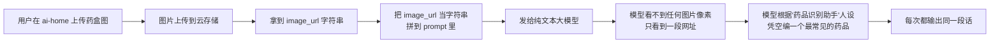
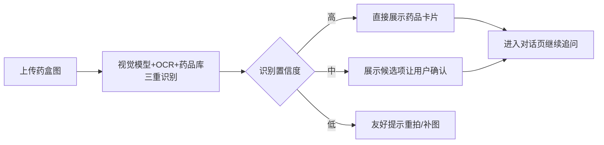
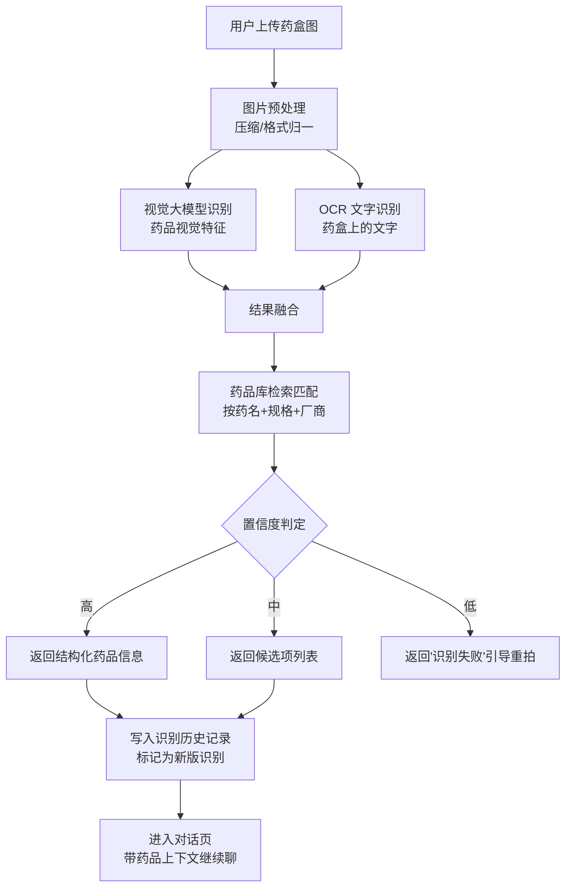

# 用药识别（AI 对话首页 ai-home）"千图一答" Bug 修复方案文档

> 文档版本：v1.0  
> 输出时间：2026-05-16  
> 优先级：**P0 极紧急**  
> 修复批次：**一期工程，一次性全量修复完毕**

---

## 1. Bug 发生背景

### 1.1 项目概述

bini-health 是一款面向慢病管理、用药安全与日常健康咨询的多端健康服务平台，覆盖：

- AI 对话首页（ai-home）
- H5 网页
- 微信小程序
- 安卓 / 苹果 App（Flutter）
- 后端服务（统一接口层）

"AI 对话首页"中的**用药识别 / 拍照识药**是核心入口功能之一，承担"用户上传药盒图 → 识别药品 → 进入用药咨询"的关键链路，是平台最关键的"AI × 健康"价值出口。

### 1.2 涉及功能模块

| 模块 | 子模块 | 与本 Bug 关系 |
|------|--------|--------------|
| AI 对话首页 ai-home | 拍照识药入口 | 直接入口 |
| 后端服务 | 图片上传 / 云存储 | 中间链路 |
| 后端服务 | AI 对话接口（含识药 prompt 拼装） | **根因所在** |
| 后端服务 | 大模型调用层 | 模型选型错误 |
| 后端服务 | 药品库 | 当前**未被调用**（应被接入） |
| H5 / 小程序 / Flutter App | 拍照识药 UI 与上传 | 表现一致，非根因端 |
| 历史数据 | 用药识别历史记录表 | 需清理"假识别"脏数据 |

### 1.3 发现时间与发现方式

- **发现方式**：用户在多端反复测试用药识别功能时，发现**无论上传什么药盒图片，AI 返回的识别结果一字不差完全相同**
- **发现时间**：长期问题，自该功能上线以来**从未正常工作过**
- **影响时长**：自功能上线至今全周期受影响

---

## 2. Bug 描述

### 2.1 错误现象

**核心现象一句话总结**：

> 用户上传任意药盒图片，AI 都返回**同一种药品**的详细说明，三端表现完全一致，相当于"千图一答"。

**详细表现**：

- 不管换什么药盒图片，AI 回复的文字内容（药名、成分、用法、注意事项）**一字不差完全相同**
- 返回内容像是被钉死在某一种特定药品上（如总是返回阿莫西林胶囊或布洛芬的说明）
- 上传图片缩略图能正确显示（即图片本身上传链路是 OK 的）
- H5、小程序、App 三端**表现完全一致**
- **从该功能上线以来从未正常过**

### 2.2 根因分析（已 100% 确认）

#### 实现链路还原

#### 关键错误点

| 序号 | 错误点 | 影响 |
|------|--------|------|
| ① | 调用的是**纯文本大模型**，不是视觉大模型（VLM / 多模态） | 模型根本"看不见"图片 |
| ② | 图片仅作为 URL 字符串拼进 prompt（伪代码：`请：{image_url}`） | 模型只读到一串网址 |
| ③ | **未调用 OCR**，未识别药盒上的任何文字 | 没有任何真实信息输入 |
| ④ | **未调用药品库**，没有任何检索 / 匹配过程 | 不是"查错药品库"，而是"压根没查" |
| ⑤ | 模型在缺信息状态下，被 system prompt 引导只能"凭印象编一个最常见的药" | 每次都编同一个 |

#### 与"查错药品库"假设的对比

用户最初怀疑是"查错了药品库" —— 实际情况**比这更糟**：

- ❌ **不是**药品库查错了
- ❌ **不是** OCR 识别错了
- ❌ **不是**视觉模型识别错了
- ✅ **是**：根本没走识别、没查库、没用 OCR、没用视觉模型，纯粹是文本模型在"胡编"

### 2.3 重现步骤

| 步骤 | 操作 | 预期结果 | 实际结果 |
|------|------|----------|----------|
| 1 | 进入 AI 对话首页（ai-home） | 看到"拍照识药"入口 | ✅ 正常 |
| 2 | 上传药盒 A 的实拍图（如某品牌感冒药） | 识别并返回药品 A 的真实信息 | 返回固定药品 X 的信息 |
| 3 | 重新上传完全不同的药盒 B 的实拍图（如某品牌降压药） | 识别并返回药品 B 的真实信息 | **仍然返回与药品 X 一字不差的信息** |
| 4 | 在 H5 / 小程序 / App 三端各重复上述步骤 | 三端均返回真实识别结果 | **三端均返回同一段固定话术** |
| 5 | 上传完全无关图片（风景图）做对照（可选） | 提示"未识别到药品"或要求重拍 | 仍然返回那段固定药品说明 |

### 2.4 影响范围

| 维度 | 影响详情 |
|------|----------|
| **功能** | AI 对话首页的拍照识药功能（核心入口）**完全失效** |
| **终端** | H5、微信小程序、安卓 App、苹果 App **全部受影响** |
| **用户** | 所有使用该功能的用户都被误导，**可能基于错误识别结果做出错误用药决策**，存在用药安全隐患 |
| **数据** | 用药识别历史记录表中**全部为"假识别"脏数据**，需清理 |
| **业务** | 直接动摇平台的"AI × 健康"核心价值承诺，**对品牌信任度造成严重伤害** |
| **合规** | 涉及健康/医疗信息，提供错误识别结果存在**合规风险** |

### 2.5 严重等级

**P0 极紧急** —— 必须立即全量修复并上线。

---

## 3. 预期正确效果

### 3.1 功能能力目标

修复后用药识别需达到 **A + B + C 三级能力**全覆盖：

#### A. 真正"看图"识药（基础能力）

- 上传药盒实拍图后，能基于图片**真实视觉信息**识别出：
  - 药品名称（通用名 + 商品名）
  - 药品分类（处方药 / 非处方药、剂型等）
  - 成分 / 规格
  - 用法用量
  - 注意事项 / 禁忌
  - 适应症
- 识别结果必须基于图片真实内容，**不同药图 → 不同识别结果**

#### B. 多药识别能力（增强能力）

- 同一张图里有多个药品时，能逐一识别并分别给出信息
- 支持一次上传 2~3 张图，合并识别为同一会话的多药咨询场景

#### C. 识别后可继续对话（场景闭环）

- 识别完成后，直接进入用药咨询对话页，用户可针对识别结果继续追问，例如：
  - "这个药孕妇能吃吗？"
  - "能和阿司匹林一起吃吗？"
  - "饭前还是饭后吃？"
  - "和我之前那个降压药会冲突吗？"
- 对话上下文需带上**本次识别结果**作为基础，让 AI 给出有针对性、连贯的回答

### 3.2 体验目标

- 用户上传图 → **3 秒内**给出识别结果
- 识别置信度低时**不胡编**，而是友好引导用户重拍
- 多端体验完全一致

---

## 4. 修复方案

### 4.1 修复思路总览

整体替换当前"伪识别"实现，引入"**视觉模型 + OCR 文字识别 + 药品库结构化匹配**"三重识别机制。

### 4.2 后端修复要点

#### ① AI 对话接口（识药 prompt 拼装层）

- 拆除"把 image_url 当字符串拼进文本 prompt"的旧实现
- 改为**真正的多模态消息结构**，把图片以二进制 / base64 / 多模态 message 形式传给视觉模型
- 完全废弃旧的 system prompt（"你是药品识别 AI 助手……"），改用结构化识别流程，不再依赖纯文本模型"凭印象瞎猜"

#### ② 引入视觉大模型 / OCR

- 接入**支持视觉输入的多模态大模型**作为药品识别主力
- 接入 OCR 能力识别药盒上的文字（药名、批号、生产厂商、规格等）
- 视觉特征 + OCR 文字 → 联合作为药品库检索的输入

#### ③ 药品库检索与匹配

- 建立 / 接入药品库表（如已有则修复检索逻辑）
- 按"药名 + 规格 + 厂商"做模糊匹配 + 精确匹配混合策略
- 输出统一结构化的药品对象（包含通用名、商品名、成分、用法、禁忌等）

#### ④ 识别结果结构化输出

- 由后端统一定义识别结果的数据结构（如 `MedicineRecognitionResult`），包含：
  - `recognized: bool`
  - `confidence: float`
  - `medicines: [{name, brand, spec, manufacturer, ...}]`
  - `raw_ocr_text: string`
  - `next_action: 'show_card' | 'pick_candidate' | 'retake'`

#### ⑤ 多药 / 多图支持

- 接口层支持一次传入多张图片或同图多药
- 返回结构按药品列表组织

#### ⑥ 识别→对话上下文联动

- 识别成功后，自动构造一条"系统消息"把药品结构化信息塞入对话上下文
- 用户后续追问时，AI 基于该上下文回答，不必再次重复描述药品

### 4.3 三端（H5 / 小程序 / Flutter App）修复要点

- 调用新版识别接口
- 适配新的结构化返回（药品卡片、候选项列表、识别失败引导）
- 识别成功后跳转到对话页时**自动带上药品上下文**
- 适配多图上传 UI
- 三端 UI 与交互保持一致

### 4.4 历史数据清理

按用户确认，**需清理老的"假识别"历史记录**：

- 后端数据迁移脚本：删除旧逻辑产生的全部用药识别历史记录
  - 判定依据：识别时间在新版上线之前 + 关联到旧识别接口的记录
- 清理前**做一次完整备份**（导出归档表），避免误删不可恢复
- 清理后向用户端推送一次"用药识别功能已升级，老的识别记录已清理，请用新功能体验"的提示（可选）

### 4.5 兜底与安全策略

- 识别失败 / 置信度低时**严禁瞎编**，必须明确返回"识别失败，请重拍/换角度"
- 涉及处方药、特殊药品（管制类）时增加风险提示
- 关键场景输出"AI 识别结果仅供参考，具体用药请遵医嘱"的标准免责语

---

## 5. 测试与验收要点

### 5.1 功能回归测试

| 编号 | 测试场景 | 通过标准 |
|------|----------|----------|
| T1 | 上传 10 种不同药盒图（常见 OTC） | 至少 9 种识别正确 |
| T2 | 上传同一药品的不同角度照片 | 均能识别为同一药品 |
| T3 | 上传完全无关图片（风景/人物） | 返回"识别失败"，不胡编 |
| T4 | 上传一张图里包含 2~3 个药品 | 能识别出多个药品 |
| T5 | 上传 2~3 张分别的药品图 | 合并为多药识别结果 |
| T6 | 识别后追问"孕妇能吃吗" | 基于本次识别药品给出针对性回答 |
| T7 | 识别后追问"能和阿司匹林一起吃吗" | 能结合识别结果做联合用药判断 |
| T8 | H5 / 小程序 / 安卓 / 苹果 四端各跑一遍 T1~T7 | 四端表现一致 |

### 5.2 数据清理验收

- 历史"假识别"记录已全部清理
- 备份归档表存在且可恢复
- 新版识别产生的记录正常写入且数据完整

### 5.3 性能与体验验收

- 端到端识别耗时（上传完成 → 出结果）≤ 3 秒（一般情况）
- 弱网环境下有合理的 loading 与超时提示
- 识别失败的引导话术友好、明确

---

## 6. 影响面与发布注意事项

### 6.1 影响面

- 接口契约会有变化（新版结构化返回），三端需同步升级
- 历史数据会被清理，需提前沟通公告
- 涉及大模型调用成本会变化（视觉模型成本通常高于纯文本模型）

### 6.2 发布方式

- **一次性全量上线**：后端 + H5 + 小程序 + 安卓 App + 苹果 App + 数据清理脚本统一发布
- 不做灰度分批，避免"新老识别结果共存"造成用户困惑

### 6.3 上线前检查清单

- [ ] 后端新识别链路在测试环境完整跑通
- [ ] 视觉模型 / OCR 服务配额与稳定性验证通过
- [ ] 药品库覆盖度盘点
- [ ] 三端调用新接口并通过 T1~T8 全量回归
- [ ] 数据清理脚本在测试库演练通过，且备份方案确认无误
- [ ] 用户端"功能升级"提示文案确认
- [ ] 免责声明文案确认

---

## 7. 补充说明

- 本次 Bug 的本质是"**用文本模型解决多模态问题**"的实现失误，属于架构层错误，单纯修补 prompt 不可能根治，必须切换到多模态识别链路。
- 由于该功能从未真正工作过，本次修复**等同于重新实现一遍**，但收益是把"千图一答"的反价值功能，升级为真正可用的"AI × 用药安全"核心入口。
- 用户已确认：**P0 优先级**、**一次性全量修复并上线**、**历史脏数据清理**。
- 本方案为**单一版本一次性交付**，不拆分一期/二期。

---

## 8. 后续动作

本文档为修复方案的完整规划。后续实际的代码修复、联调、自动化测试与上线工作，请在**新的会话**中执行，不在本会话内进行实际编码。
