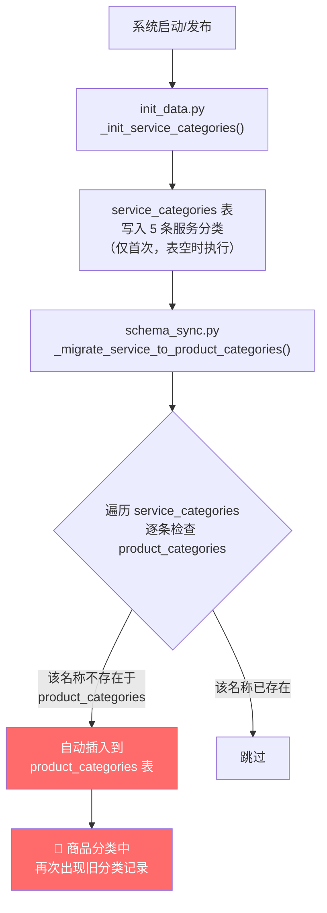
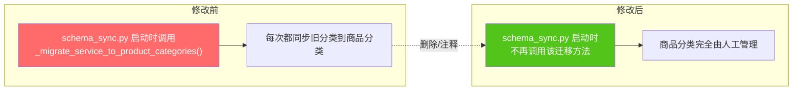

# Bini-Health 系统发布自动插入旧商品分类 Bug 修复方案

## 1. Bug 发生背景

### 1.1 项目概述

Bini-Health 是一个健康服务平台，包含后端（FastAPI + SQLAlchemy + MySQL）、管理后台（Next.js + Ant Design）、H5 前端、Flutter 移动端及微信小程序等多端应用。

### 1.2 涉及功能模块

- **商品体系 — 商品分类**（`product_categories` 表）
- **服务管理 — 服务分类**（`service_categories` 表）
- **系统启动初始化**（`init_data.py`）
- **数据库结构迁移**（`schema_sync.py`）

### 1.3 发现方式

运营人员在管理后台手动删除"专家咨询"分类后，每次系统发布/重启，该分类都会再次自动出现在「商品体系 → 商品分类」列表中。

---

## 2. Bug 描述

### 2.1 错误现象

系统每次发布（即容器重启）后，「商品体系 → 商品分类」列表中都会重新出现以下 5 条旧分类记录：

| 序号 | 分类名称 |
|------|----------|
| 1 | 专家咨询 |
| 2 | 健康食品 |
| 3 | 口腔服务 |
| 4 | 体检服务 |
| 5 | 养老服务 |

即使运营人员在后台手动删除了这些分类，下一次发布后它们又会"复活"。

### 2.2 重现步骤

| 步骤 | 操作 | 预期结果 | 实际结果 |
|------|------|----------|----------|
| 1 | 在管理后台「商品体系 → 商品分类」中删除"专家咨询"等旧分类 | 分类被永久删除，不再出现 | 删除成功，暂时不再显示 |
| 2 | 系统发布/重启（Docker 容器重建） | 商品分类列表维持删除后的状态 | "专家咨询"等 5 条旧分类再次自动出现 |
| 3 | 重复步骤 1-2 | 分类不再自动恢复 | 每次发布都会重复插入 |

### 2.3 影响范围

- **运营管理**：运营人员反复删除无效分类，造成管理困扰
- **数据整洁性**：商品分类列表中充斥不需要的旧分类，影响正常的分类管理
- **用户体验**：如果前端展示了商品分类，用户可能看到无意义的空分类

---

## 3. 根因分析

**问题根源**：`schema_sync.py` 中的 `_migrate_service_to_product_categories()` 方法在**每次系统启动时都会执行**，它遍历 `service_categories` 表中的所有记录，检查 `product_categories` 表中是否存在同名记录，如果不存在就自动插入。

这导致了一个恶性循环：

1. 运营在后台删除商品分类中的"专家咨询"
2. 系统重启时，迁移逻辑发现 `service_categories` 中有"专家咨询"但 `product_categories` 中没有
3. 自动将"专家咨询"重新插入到 `product_categories`
4. 回到步骤 1

---

## 4. 预期正确效果

修复后，系统应满足以下行为：

1. **系统启动/发布时不再自动将 `service_categories` 表的数据同步到 `product_categories` 表**
2. 运营在后台删除商品分类后，该分类不会因系统重启而"复活"
3. 商品分类完全由运营人员在管理后台手动管理，系统不再自动初始化任何商品分类
4. 旧的 `service_categories` 表数据保留不动（该表仍被"服务管理"模块的 API 正常使用）

---

## 5. 修复方案

### 5.1 修复策略

| 修复项 | 操作 | 影响范围 |
|--------|------|----------|
| **核心修复** | 删除/注释掉 `schema_sync.py` 中 `_migrate_service_to_product_categories()` 的调用 | 仅影响启动时的自动迁移逻辑 |
| **可选加固** | 同时删除/注释掉 `init_data.py` 中对 `product_categories` 表的初始化逻辑（如有） | 防止任何自动初始化商品分类的行为 |

### 5.2 具体修改点

#### 修改 1：`schema_sync.py` — 去掉自动迁移调用

在 `schema_sync.py` 文件中，找到调用 `_migrate_service_to_product_categories()` 的位置，将其**注释掉或删除整个方法及其调用**。

#### 修改 2：确认 `init_data.py` 不会初始化 `product_categories`

检查 `init_data.py` 中是否有直接向 `product_categories` 表插入初始数据的逻辑，如果有，一并移除。当前分析显示 `init_data.py` 仅初始化 `service_categories` 表（且仅在表为空时执行），因此可保留不动。

#### 修改 3：同步调整相关单元测试

- `test_services.py` 和 `test_server_services.py` 中有对"5 个服务分类"的断言，需要根据实际情况调整测试预期（因为迁移逻辑被去掉后，`product_categories` 表不再自动填充）

### 5.3 不需要修改的部分

| 保留项 | 原因 |
|--------|------|
| `service_categories` 表中的 5 条数据 | 用户明确要求旧表数据保留不动 |
| `init_data.py` 的 `_init_service_categories()` 方法 | 该方法仅初始化服务分类表，且仅在表为空时执行，不影响商品分类 |
| `product_categories` 表中已存在的旧记录 | 用户选择手动清理，不需要代码自动删除 |
| 服务管理相关 API（`service.py`、`admin.py`） | 这些接口正常读写 `service_categories` 表，与商品分类无关 |

---

## 6. 补充说明

### 6.1 用户需要手动操作的部分

修复上线后，运营人员需要在管理后台「商品体系 → 商品分类」中**手动删除**已经存在的 5 条旧分类记录（专家咨询、健康食品、口腔服务、体检服务、养老服务）。此后系统不会再自动插入。

### 6.2 回滚方案

如果修复后发现有意料之外的影响，只需将 `schema_sync.py` 中被注释的迁移调用恢复即可，对数据无任何破坏性影响。

### 6.3 代码引用关系总结

| 文件 | 引用方式 | 修复是否需要变更 |
|------|----------|------------------|
| `schema_sync.py` | 核心迁移逻辑（每次启动执行） | ✅ 需要删除迁移调用 |
| `init_data.py` | 初始化 `service_categories`（仅首次） | ❌ 保留不动 |
| `service.py` | 用户端读取服务分类 API | ❌ 不影响 |
| `admin.py` | 管理端服务分类 CRUD | ❌ 不影响 |
| `test_services.py` | 单元测试断言 | ⚠️ 需同步调整测试预期 |
| `test_server_services.py` | 集成测试断言 | ⚠️ 需同步调整测试预期 |
| 文档/原型图脚本 | 文字引用（不影响运行） | ❌ 无需变更 |
