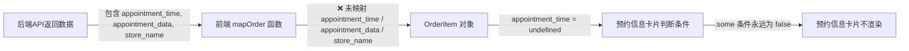

# Admin管理后台 - 订单详情预约信息不显示 Bug 修复方案文档

## 1. Bug 发生背景

### 1.1 项目概述

本项目为健康类商城系统，包含后端 API 服务（Python/FastAPI）和管理后台前端（Next.js + Ant Design）。管理后台中的「商品体系 → 订单明细」模块用于管理员查看和管理所有订单，包含订单详情抽屉组件。

### 1.2 涉及功能模块

- **后端**：统一订单 API（`unified_orders`），返回订单详情数据，包含 `appointment_data`、`appointment_time`、`store_name` 等字段
- **前端**：管理后台订单明细页面的**订单详情 Drawer**，其中包含预约信息卡片展示区域

### 1.3 发现时间与发现方式

管理员在后台打开订单详情时，发现**预约信息卡片始终不显示**，即使该订单确实包含预约数据。

---

## 2. Bug 描述

### 2.1 错误现象

管理员在 Admin 后台「商品体系 → 订单明细」中打开某条含有预约信息的订单的详情后，**预约信息卡片完全不显示**——看不到预约日期、预约时段、预约状态、关联门店名称等任何预约相关信息。



### 2.2 重现步骤

| 步骤 | 操作 | 预期结果 | 实际结果 |
|------|------|----------|----------|
| 1 | 登录 Admin 管理后台 | 正常进入后台 | ✅ 正常 |
| 2 | 进入「商品体系 → 订单明细」 | 展示订单列表 | ✅ 正常 |
| 3 | 点击某条包含预约信息的订单「详情」按钮 | 打开详情 Drawer，显示预约信息卡片 | ❌ 预约信息卡片完全不显示 |

### 2.3 影响范围

- **直接影响**：管理员无法在后台查看任何订单的预约信息，无法确认用户的预约日期、时段和状态
- **业务影响**：门店核销人员无法通过后台确认预约详情，需要依赖其他渠道查询
- **数据完整性**：数据本身正常存储在数据库中且后端 API 正确返回，仅为前端展示遗漏

---

## 3. 预期正确效果

修复后，管理员在订单详情中应能看到完整的预约信息，具体包含以下字段：

| 展示字段 | 数据来源 | 说明 |
|----------|----------|------|
| 预约日期 | `item.appointment_time` | 格式化为 YYYY年MM月DD日 |
| 预约时段 | `item.appointment_data.time_slot` 或 `appointment_time` 中的时间部分 | 如 "10:00-11:00" |
| 预约状态 | 根据订单 `status` 字段推断 | 待支付 / 待核销 / 已完成 / 已取消 |
| 关联门店名称 | `order.store_name` | 显示预约所属门店 |

修复后效果示意：

```
┌───────────────────────────────────────────────┐
│  📋 预约信息                                    │
├───────────────────────────────────────────────┤
│  关联门店：XX旗舰店                              │
│  预约日期：2026年4月30日                         │
│  预约时段：10:00-11:00                          │
│  预约状态：[待核销]                              │
└───────────────────────────────────────────────┘
```

---

## 4. 根因分析

### 4.1 后端数据返回（正常）

后端 `OrderItemResponse` schema 中已包含：

```python
appointment_data: Optional[Any] = None
appointment_time: Optional[datetime] = None
```

后端 `UnifiedOrderResponse` schema 中已包含：

```python
store_name: Optional[str] = None
```

后端 API 正确返回了这些字段，**后端无需修改**。

### 4.2 前端问题定位（3 处需修复）

**问题点 ①：`OrderItem` 接口缺少预约字段**

当前定义（第 21-33 行）中缺少 `appointment_data` 和 `appointment_time`：

```typescript
interface OrderItem {
  id: number;
  product_id: number;
  product_name: string;
  product_image: string | null;
  product_price: number;
  quantity: number;
  subtotal: number;
  fulfillment_type: string;
  verification_code: string | null;
  total_redeem_count: number;
  used_redeem_count: number;
  // ❌ 缺少 appointment_data 和 appointment_time
}
```

**问题点 ②：`UnifiedOrder` 接口缺少 `store_name` 字段**

当前定义（第 35-59 行）中缺少 `store_name`。

**问题点 ③：`mapOrder` 函数未映射预约相关字段**

当前 `mapOrder`（第 131-173 行）在映射 items 时未包含 `appointment_data` 和 `appointment_time`，在映射订单级字段时未包含 `store_name`。

---

## 5. 修复方案

### 5.1 修复 `OrderItem` 接口

在 `OrderItem` 接口中新增两个字段：

```typescript
interface OrderItem {
  // ... 现有字段保持不变 ...
  appointment_data: any | null;
  appointment_time: string | null;
}
```

### 5.2 修复 `UnifiedOrder` 接口

在 `UnifiedOrder` 接口中新增字段：

```typescript
interface UnifiedOrder {
  // ... 现有字段保持不变 ...
  store_name: string | null;
}
```

### 5.3 修复 `mapOrder` 函数

在 items 映射中增加预约字段：

```typescript
raw.items.map((it: any) => ({
  // ... 现有映射保持不变 ...
  appointment_data: it.appointment_data ?? null,
  appointment_time: it.appointment_time ? String(it.appointment_time) : null,
}))
```

在订单级映射中增加 `store_name`：

```typescript
return {
  // ... 现有映射保持不变 ...
  store_name: raw.store_name ? String(raw.store_name) : null,
};
```

### 5.4 增强预约信息卡片展示（新增门店名称展示）

在现有预约信息卡片的展示代码中，增加**关联门店名称**的展示：

```typescript
{currentOrder?.items?.some((item: any) => item.appointment_time) && (
  <Card size="small" title="预约信息" style={{ marginTop: 16 }}>
    <Descriptions column={2} size="small">
      {/* 新增：展示关联门店 */}
      {currentOrder.store_name && (
        <Descriptions.Item label="关联门店" span={2}>
          {currentOrder.store_name}
        </Descriptions.Item>
      )}
      {currentOrder.items.filter((item: any) => item.appointment_time).map((item: any, idx: number) => (
        <React.Fragment key={idx}>
          <Descriptions.Item label="预约日期" span={1}>
            {/* 保持现有逻辑 */}
          </Descriptions.Item>
          <Descriptions.Item label="预约时段" span={1}>
            {/* 保持现有逻辑 */}
          </Descriptions.Item>
          <Descriptions.Item label="预约状态" span={1}>
            {/* 保持现有逻辑 */}
          </Descriptions.Item>
        </React.Fragment>
      ))}
    </Descriptions>
  </Card>
)}
```

---

## 6. 修复文件清单

| 序号 | 文件 | 修改内容 |
|------|------|----------|
| 1 | admin-web 订单明细页面 | `OrderItem` 接口新增 `appointment_data`、`appointment_time` 字段 |
| 2 | admin-web 订单明细页面 | `UnifiedOrder` 接口新增 `store_name` 字段 |
| 3 | admin-web 订单明细页面 | `mapOrder` 函数中 items 映射增加 `appointment_data`、`appointment_time` |
| 4 | admin-web 订单明细页面 | `mapOrder` 函数中订单级映射增加 `store_name` |
| 5 | admin-web 订单明细页面 | 预约信息卡片展示代码中增加「关联门店名称」展示 |

---

## 7. 验证方案

修复完成后，按以下步骤验证：

1. 打开管理后台「商品体系 → 订单明细」
2. 找到一条已知包含预约信息的订单，点击「详情」
3. 确认预约信息卡片正常显示，包含：预约日期、预约时段、预约状态、关联门店名称
4. 确认无预约信息的订单详情中不显示预约信息卡片（避免空卡片展示）
5. 确认其他订单信息展示不受影响
