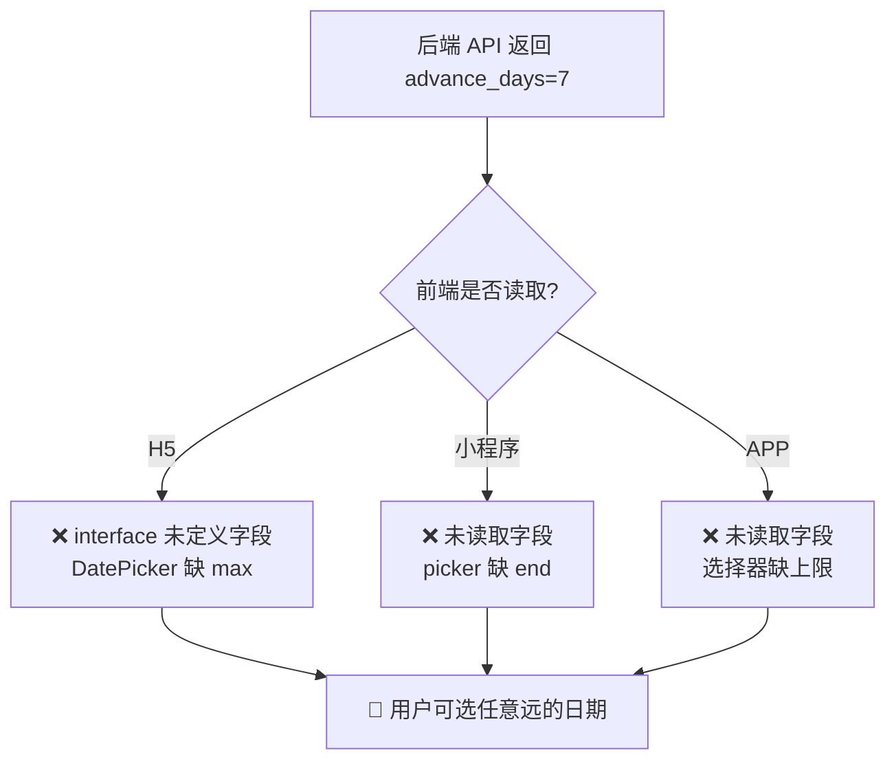
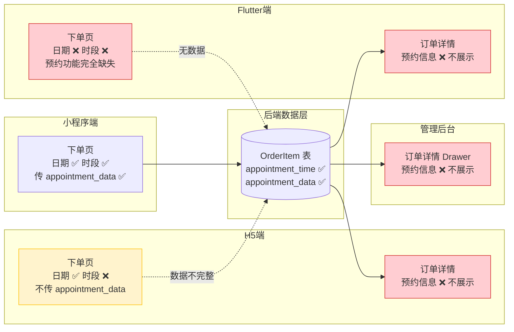
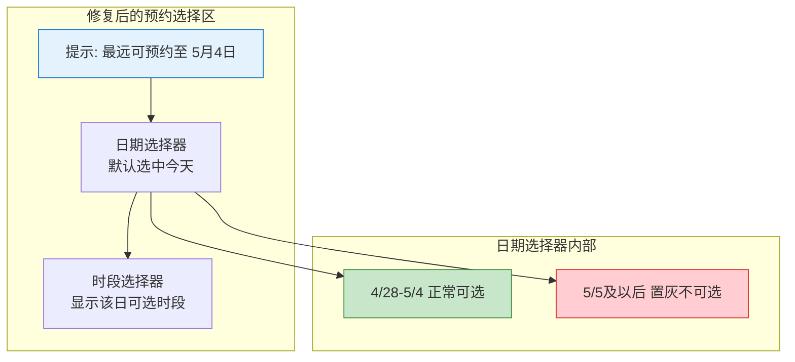
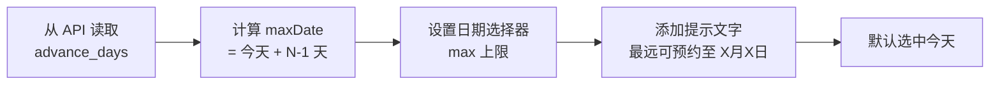
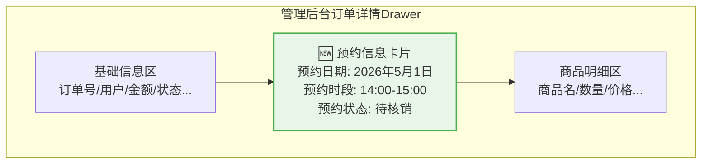

# 预约功能修复与补全方案

## 1. Bug 发生背景

### 1.1 项目概述

bini-health 是一个综合健康服务平台，包含管理后台（admin-web）、H5 网页端（h5-web）、微信小程序（miniprogram）和 Flutter APP（flutter_app）四个客户端。用户可以通过各端浏览健康服务商品并进行预约下单。

### 1.2 涉及功能模块

本方案涵盖「预约下单」核心流程的 **两大问题**：

- **问题 A**：预约日期选择器未限制最远可选日期（`advance_days` 字段未被前端使用）
- **问题 B**：预约信息（日期、时段）在多端下单和订单详情中存在不同程度的缺失

```mermaid
flowchart TD
    subgraph 问题A：日期选择器无上限
        A1[运营设置 advance_days=7] --> A2[后端 API 返回字段]
        A2 --> A3[三端前端均未读取]
        A3 --> A4[❌ 用户可选任意远日期]
    end
    subgraph 问题B：预约信息缺失
        B1[小程序端 ✅ 完整] --> B5[各端实现参差不齐]
        B2[H5端 ⚠️ 缺时段] --> B5
        B3[Flutter端 ❌ 完全缺失] --> B5
        B4[管理后台 ❌ 不展示] --> B5
        B5 --> B6[❌ 预约信息断链]
    end
    style A3 fill:#ff6b6b,stroke:#c92a2a,color:#fff
    style A4 fill:#ff6b6b,stroke:#c92a2a,color:#fff
    style B5 fill:#ff6b6b,stroke:#c92a2a,color:#fff
    style B6 fill:#ff6b6b,stroke:#c92a2a,color:#fff
```

*图 1：两大问题概览*

### 1.3 发现方式

用户（运营人员）在使用过程中发现两个问题：
1. 设置「提前可预约天数」为 7 天后，日期选择器中仍可选超过 7 天的日期
2. 订单创建和查看时发现预约时间、时段信息在多端不完整

---

## 2. Bug 描述

### 2.1 问题 A：预约日期选择器未限制最远可选日期

#### 错误现象

管理后台设置商品的「提前可预约天数」为 7 天后，三端前端的日期选择器**没有限制最远可选日期**：

| 终端 | 具体表现 |
|------|----------|
| **H5 网页端** | `DatePicker` 只设了 `min={new Date()}`，**未设 `max`**；`ProductInfo` interface 未定义 `advance_days` 字段 |
| **微信小程序** | `picker` 只设了 `start={{minDate}}`，**未设 `end`**；未从 API 响应读取 `advance_days` |
| **Flutter APP** | 日期选择器未读取 `advance_days` 进行上限控制 |



*图 2：问题 A 根因链路*

#### 重现步骤

| 步骤 | 操作 | 预期结果 | 实际结果 |
|------|------|----------|----------|
| 1 | 管理后台 → 编辑商品 → 预约模式选"预约日期" → 提前可预约天数设为 **7** → 保存 | 设置成功 | ✅ 设置成功 |
| 2 | 用户端 → 商品详情 → 点击"立即预约"进入下单页 | 进入预约下单页 | ✅ 正常进入 |
| 3 | 点击日期选择器，尝试选择 **8 天后**的日期 | 该日期应**置灰不可选** | ❌ 可正常选择 |
| 4 | 选择超出范围的日期并提交订单 | 应被阻止 | ❌ 可正常提交 |

### 2.2 问题 B：预约信息在多端缺失

#### 各端现状对比

| 终端 | 下单页：日期选择 | 下单页：时段选择 | 下单时传 appointment_data | 订单详情：展示预约信息 |
|------|:---:|:---:|:---:|:---:|
| **微信小程序** | ✅ 有 | ✅ 有（时间选择器） | ✅ 传日期+备注 | — 无独立订单详情页 |
| **H5 网页端** | ✅ 有（DatePicker） | ❌ 缺失 | ❌ 只传 appointment_time | ⚠️ 商户端有展示 appointment_time |
| **Flutter APP** | ❌ 完全缺失 | ❌ 完全缺失 | ❌ 不传 | ❌ 订单详情不展示 |
| **管理后台** | — | — | — | ❌ 订单详情 Drawer 不展示 |



*图 3：各端预约信息完整度对比（红色=缺失，黄色=不完整，绿色=完整）*

#### 具体缺失详情

**H5 网页端下单页**：
- 只有一个 `DatePicker` 用于选择日期，没有时段选择器
- 下单时只传 `appointment_time`（日期的 ISO 字符串），不传 `appointment_data`（含时段等结构化数据）

**Flutter APP 下单页**：
- `checkout_screen.dart` 中完全没有预约相关的 UI 组件和逻辑
- 不传任何预约相关字段

**管理后台订单详情**：
- 订单详情 Drawer 中的 `Descriptions` 组件只展示了订单号、用户、金额、状态等基础字段
- 没有 `appointment_time` 和 `appointment_data` 的展示

**H5 端用户订单详情**：
- 用户侧无独立订单详情页展示预约信息（商户端订单详情有展示 `appointment_time`，但缺少时段信息）

### 2.3 影响范围

- **受影响终端**：H5 网页端、微信小程序端、Flutter APP 端、管理后台（四端）
- **受影响页面**：各端 checkout（下单）页面 + 订单详情页面
- **受影响用户**：所有使用预约类商品的终端用户 + 运营管理人员
- **业务影响**：
  - 问题 A：用户可预约超出运营预期的远期日期，破坏服务排期
  - 问题 B：预约时段信息丢失，运营无法在订单中查看用户预约的具体时段

### 2.4 附加问题：日期非必选 + 无默认值

当前下单流程中，预约日期字段**不是必选的**且**没有默认值**，用户可以不选日期直接提交。这在业务上不合理——预约本质是"约定具体时间"，没有日期的预约在业务上不成立。

---

## 3. 预期正确效果

### 3.1 日期范围限制（问题 A 修复后）

采用**包含今天**的主流计算方式：

> 设置 `advance_days = N` 时，可选日期范围 = **今天 ~ 今天 + (N-1) 天**，共 **N 个自然日**

示例（今天 4 月 28 日、`advance_days = 7`）：

| 日期 | 是否可选 |
|------|----------|
| 4月28日（今天） | ✅ 可选 |
| 4月29日 ~ 5月3日 | ✅ 可选 |
| 5月4日（第7天） | ✅ 可选 |
| 5月5日及以后 | ❌ 置灰不可选 |

用户交互效果（三端统一）：



*图 4：修复后日期选择器的预期交互效果*

### 3.2 预约信息完整性（问题 B 修复后）

修复后各端应达到的状态：

| 终端 | 下单页：日期选择 | 下单页：时段选择 | 提交数据 | 订单详情展示 |
|------|:---:|:---:|:---:|:---:|
| **微信小程序** | ✅ 保持 | ✅ 保持 | ✅ 保持 | — |
| **H5 网页端** | ✅ 保持 + 限制上限 | ✅ **补全** | ✅ **补全** appointment_data | ✅ **补全**展示 |
| **Flutter APP** | ✅ **补全** | ✅ **补全** | ✅ **补全**提交 | ✅ **补全**展示 |
| **管理后台** | — | — | — | ✅ **补全**"预约信息"卡片 |

### 3.3 日期默认值与必选

- 预约日期改为**必选字段**
- **默认选中今天**，用户可手动切换到范围内的其他日期
- 未选日期时阻止提交并给出提示

---

## 4. 修复方案

### 4.1 问题 A：三端日期选择器补充上限限制

#### 统一修复逻辑



*图 5：统一修复步骤*

#### H5 网页端

| 修复项 | 说明 |
|--------|------|
| `ProductInfo` interface 补字段 | 新增 `advance_days?: number` |
| `DatePicker` 补 `max` 属性 | `max={maxDate}`，`maxDate` 基于 `advance_days` 计算 |
| 新增提示文字 | 日期选择器上方显示"最远可预约至 X月X日" |
| 默认值 | 日期默认选中今天 |

#### 微信小程序端

| 修复项 | 说明 |
|--------|------|
| 读取 `advance_days` | 从商品 API 响应中取出 |
| 计算 `endDate` | `今天 + (advance_days - 1) 天`，格式化为 `YYYY-MM-DD` |
| `picker` 补 `end` | `end="{{endDate}}"` |
| 新增提示文字 | 日期选择器上方显示"最远可预约至 X月X日" |
| 默认值 | 日期默认选中今天 |

#### Flutter APP 端

| 修复项 | 说明 |
|--------|------|
| 商品模型补字段 | 新增 `advanceDays` |
| 日期选择器补上限 | `lastDate: maxDate` |
| 新增提示文字 | 日期选择器上方显示"最远可预约至 X月X日" |
| 默认值 | 日期默认选中今天 |

### 4.2 问题 B：补全各端预约信息

#### 4.2.1 H5 网页端下单页 — 补全时段选择器

当前 H5 下单页只有日期选择（`DatePicker`），需要新增**时段选择器**：

| 修复项 | 说明 |
|--------|------|
| 新增时段选择器组件 | 用户选择日期后，根据商品配置的时段数据展示可选时段列表 |
| 下单数据补全 | 提交时同时传 `appointment_time`（日期+时段拼接）和 `appointment_data`（含日期、时段、备注的结构化 JSON） |
| 时段数据来源 | 从商品 API 响应中读取预约时段配置 |

参考小程序端已有的实现：小程序端已完整实现日期 + 时段选择 + `appointment_data` 传递。

#### 4.2.2 Flutter APP 下单页 — 补全整个预约功能

当前 Flutter APP 的 `checkout_screen.dart` 完全没有预约相关功能，需要整体补全：

| 修复项 | 说明 |
|--------|------|
| 新增预约日期选择器 | 当商品 `appointment_mode` 不为 `none` 时显示，含日期范围限制 |
| 新增预约时段选择器 | 根据商品配置展示可选时段 |
| 新增预约备注输入 | 可选的备注输入框 |
| 下单数据补全 | 提交时传 `appointment_time` 和 `appointment_data` |

#### 4.2.3 H5 端订单详情 — 补全预约信息展示

| 修复项 | 说明 |
|--------|------|
| 用户端订单详情补全 | 展示预约日期、预约时段（从 `appointment_time` 和 `appointment_data` 中读取） |
| 商户端订单详情补全 | 已有 `appointment_time` 展示，需补充时段信息（从 `appointment_data` 解析） |

#### 4.2.4 Flutter APP 订单详情 — 补全预约信息展示

| 修复项 | 说明 |
|--------|------|
| 统一订单详情页补全 | `unified_order_detail_screen.dart` 和 `order_detail_screen.dart` 中新增预约信息展示区域 |
| 数据模型补全 | `unified_order.dart` 和 `order.dart` 中已有 `appointment` 相关字段定义，需在 UI 层读取并渲染 |

#### 4.2.5 管理后台订单详情 — 新增"预约信息"卡片区块

当前管理后台订单详情 Drawer 中只有基础订单信息，缺少预约信息。需新增一个**独立的"预约信息"卡片区块**：



*图 6：管理后台订单详情新增"预约信息"卡片*

卡片内容包含：

| 字段 | 数据来源 | 说明 |
|------|----------|------|
| 预约日期 | `appointment_time` | 格式化为 `YYYY年MM月DD日` |
| 预约时段 | `appointment_data` 中的时段信息 | 格式化为 `HH:mm - HH:mm` |
| 预约状态 | 根据订单状态和核销状态推算 | 待预约 / 已确认 / 已完成 / 已取消 |
| 预约备注 | `appointment_data` 中的 note 字段 | 用户填写的备注信息（如有） |

仅当订单包含预约信息时才显示该卡片（即 `appointment_time` 不为空）。

### 4.3 后端校验加固

| 修复项 | 说明 |
|--------|------|
| 下单接口日期范围校验 | 预约下单时校验提交的日期是否在 `advance_days` 范围内，超出则返回错误提示 |
| 日期必填校验 | 预约类商品下单时，`appointment_time` 为必填字段 |
| 订单详情 API 补全 | 确保订单详情接口返回 `appointment_time` 和 `appointment_data` 完整数据 |

---

## 5. 修复文件清单

### 5.1 H5 网页端

| 文件 | 修复内容 |
|------|----------|
| `h5-web/src/app/checkout/page.tsx` | ① `ProductInfo` 补 `advance_days` 字段 ② `DatePicker` 补 `max` ③ 新增时段选择器 ④ 补全 `appointment_data` 提交 ⑤ 日期默认今天+必选 ⑥ 添加"最远可预约至"提示 |
| `h5-web/src/app/merchant/m/orders/[id]/page.tsx` | 补充预约时段展示（从 `appointment_data` 解析） |

### 5.2 微信小程序端

| 文件 | 修复内容 |
|------|----------|
| `miniprogram/pages/checkout/index.js` | ① 读取 `advance_days` ② 计算 `endDate` ③ 日期默认今天+必选 |
| `miniprogram/pages/checkout/index.wxml` | ① `picker` 补 `end` 属性 ② 添加"最远可预约至"提示文字 |

### 5.3 Flutter APP 端

| 文件 | 修复内容 |
|------|----------|
| `flutter_app/lib/screens/product/checkout_screen.dart` | ① 新增完整预约选择 UI（日期+时段+备注） ② 日期范围限制 ③ 默认今天+必选 ④ 补全提交数据 |
| `flutter_app/lib/models/product.dart` | 确保 `advanceDays` 等预约字段已映射 |
| `flutter_app/lib/screens/order/unified_order_detail_screen.dart` | 新增预约信息展示区域 |
| `flutter_app/lib/screens/order/order_detail_screen.dart` | 新增预约信息展示区域 |

### 5.4 管理后台

| 文件 | 修复内容 |
|------|----------|
| `admin-web/src/app/(admin)/product-system/orders/page.tsx` | 订单详情 Drawer 中新增"预约信息"卡片区块 |

### 5.5 后端

| 文件 | 修复内容 |
|------|----------|
| 下单相关 service/router | 新增 `appointment_time` 必填校验 + `advance_days` 日期范围校验 |

---

## 6. 三端一致性要求

所有修复必须确保三端（H5 + 小程序 + Flutter APP）在以下方面保持一致：

| 一致性维度 | 具体要求 |
|------------|----------|
| 日期范围计算 | 包含今天，共 N 个自然日 |
| 日期默认值 | 默认选中今天 |
| 日期必选 | 预约类商品必须选择日期才能提交 |
| 超出范围处理 | 置灰不可选 + 上方显示"最远可预约至 X月X日" |
| 时段选择 | 三端均需支持时段选择（以小程序端为参考标准） |
| 提交数据格式 | 统一传 `appointment_time` + `appointment_data` |
| 向后兼容 | `advance_days` 为 0 或空时不限制日期上限 |

---

## 7. 补充说明

- **以小程序端为标杆**：小程序端的预约功能实现最完整（日期+时段+`appointment_data`），H5 和 Flutter 端应以此为参考标准进行补全
- **时区处理**：日期计算应基于用户所在时区的当天零点，避免跨时区边界偏差
- **动态更新**：运营修改 `advance_days` 后，用户端下次进入下单页应自动获取最新值
- **预约时段模式兼容**：本修复同时覆盖「预约日期」和「预约时段」两种模式下的日期选择器
- **后端 API 已就绪**：后端 `OrderItem` 模型已有 `appointment_time` 和 `appointment_data` 字段，API 创建和返回均已支持，无需新增字段
