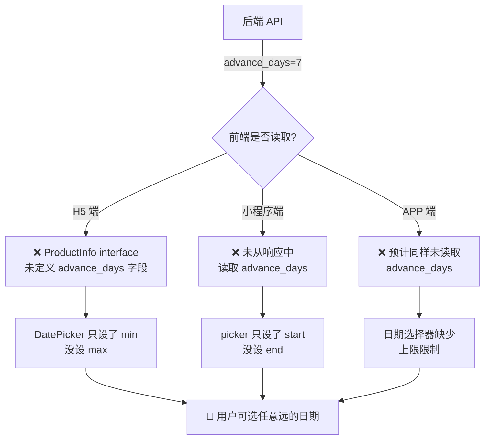
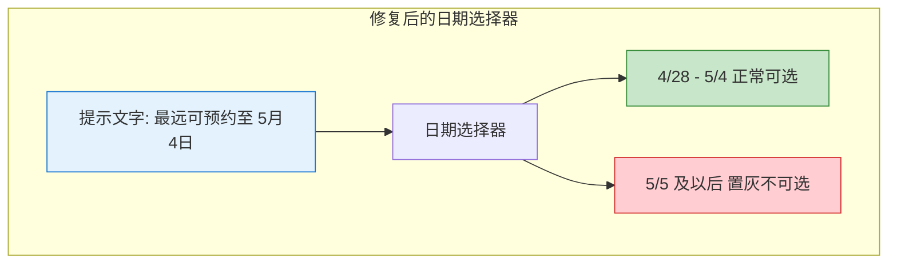

# 预约日期选择超出"提前可预约天数"限制 — Bug 修复方案文档

## 1. Bug 发生背景

### 1.1 项目概述

bini-health 是一个综合健康服务平台，包含管理后台（admin-web）、H5 网页端（h5-web）、微信小程序（miniprogram）和 Flutter APP（flutter_app）四个客户端。用户可以通过各端浏览健康服务商品并进行预约下单。

### 1.2 涉及功能模块

**预约日期选择功能** —— 属于「预约下单」核心流程的一环。

在管理后台中，运营可以为商品配置「预约日期」模式，其中有一个关键参数 **「提前可预约天数」**（对应后端字段 `advance_days`）。该参数用于限制用户最远可以预约到哪一天。例如设置为 7 天，则用户只能在今天起的 7 个自然日内选择预约日期。

*图 1：预约天数限制的正常数据流（红色部分为当前断裂环节）*

### 1.3 发现方式

用户（运营人员）在管理后台设置「提前可预约天数」为 7 天后，前往用户端测试，发现日期选择器中可以选择超出 7 天范围的日期，怀疑为 Bug。经代码排查确认。

## 2. Bug 描述

### 2.1 错误现象

在管理后台设置商品的「提前可预约天数」为 7 天（或任意值）后，用户端（H5 网页端、微信小程序端、Flutter APP 端）的预约日期选择器**没有对最远可选日期做限制**，用户可以选择任意远的未来日期。

具体表现：

- **H5 网页端**：`DatePicker` 组件只设置了 `min={new Date()}`（最早可选今天），但 **没有设置 `max` 属性**，导致未来任意日期均可选择

- **微信小程序端**：`picker` 组件只设置了 `start={{minDate}}`（今天），但 **没有设置 `end` 属性**，同样无日期上限

- **Flutter APP 端**：预计存在相同问题，日期选择器未读取 `advance_days` 进行上限控制

### 2.2 重现步骤

| 步骤 | 操作 | 预期结果 | 实际结果 |
|------|------|----------|----------|
| 1 | 管理后台 → 商品管理 → 编辑某商品 → 预约模式选"预约日期" → 提前可预约天数设为 **7** → 保存 | 设置成功 | ✅ 设置成功 |
| 2 | 用户端 → 进入该商品详情 → 点击"立即预约"进入 checkout 页 | 进入预约下单页 | ✅ 正常进入 |
| 3 | 点击日期选择器，尝试选择 **8 天后**的日期（如今天 4/28，选 5/6） | 5/5 及以后的日期应**置灰不可选** | ❌ 5/6 及更远日期仍可正常选择 |
| 4 | 选择一个超出范围的日期并提交 | 应被阻止 | ❌ 可正常提交（后端也未做校验拦截） |

### 2.3 影响范围

- **受影响终端**：H5 网页端、微信小程序端、Flutter APP 端（三端全部受影响）
- **受影响页面**：各端的 checkout（预约下单）页面
- **受影响用户**：所有使用"预约日期"模式商品进行预约的终端用户
- **业务影响**：用户可预约到远超运营预期的日期，导致商家无法按预期进行服务排期和容量管理

### 2.4 根因分析

*图 2：Bug 根因链路分析*

**核心根因**：后端 API 已正确返回 `advance_days` 字段，但三端前端均未读取该字段并用于计算日期选择器的最大可选日期上限。

涉及的关键代码文件：

| 终端 | 文件 | 问题 |
|------|------|------|
| H5 网页端 | `h5-web/src/app/checkout/page.tsx` | `DatePicker` 组件缺少 `max` 属性 |
| H5 网页端 | `h5-web/src/app/checkout/page.tsx` | `ProductInfo` interface 未定义 `advance_days` 字段 |
| 微信小程序 | `miniprogram/pages/checkout/index.js` | 未读取 `advance_days` 计算 `end` 日期 |
| 微信小程序 | `miniprogram/pages/checkout/index.wxml` | `picker` 组件缺少 `end` 绑定 |
| Flutter APP | `flutter_app/lib/screens/checkout/` | 日期选择器预计缺少最大日期限制 |

## 3. 预期正确效果

修复后，三端的预约日期选择功能应表现如下：

### 3.1 日期范围计算规则

采用**包含今天**的主流计算方式：

> 设置 `advance_days = N` 时，可选日期范围 = **今天 ~ 今天 + (N-1) 天**，共 **N 个自然日**

示例（假设今天为 4 月 28 日、`advance_days = 7`）：

| 日期 | 是否可选 |
|------|----------|
| 4月28日（今天） | ✅ 可选 |
| 4月29日 | ✅ 可选 |
| 4月30日 | ✅ 可选 |
| 5月1日 | ✅ 可选 |
| 5月2日 | ✅ 可选 |
| 5月3日 | ✅ 可选 |
| 5月4日（第7天） | ✅ 可选 |
| 5月5日及以后 | ❌ 置灰不可选 |

### 3.2 用户交互效果

修复后用户端的交互效果需同时满足以下两点：

**效果 A — 超出范围的日期置灰不可选**：日期选择器中，超出「提前可预约天数」范围的日期直接**置灰（禁用态）**，用户无法点击选中

**效果 C — 显示最远可预约日期提示**：在日期选择器**上方**显示一行文字提示，格式为：

> 最远可预约至 X月X日

*图 3：修复后日期选择器的预期交互效果*

### 3.3 三端一致性要求

H5 网页端、微信小程序端、Flutter APP 端的预约日期选择功能**必须保持一致**：

- 相同的日期范围计算逻辑（包含今天，共 N 个自然日）
- 相同的置灰不可选交互
- 相同的"最远可预约至 X月X日"文字提示

## 4. 修复方案

### 4.1 三端统一修复逻辑

所有终端的修复逻辑一致，分为以下步骤：

**步骤 1**：从商品详情 API 响应中读取 `advance_days` 字段

**步骤 2**：计算最大可选日期 `maxDate = 今天 + (advance_days - 1) 天`

**步骤 3**：将 `maxDate` 设置为日期选择器组件的上限属性

**步骤 4**：在日期选择器上方添加提示文字「最远可预约至 X月X日」

**步骤 5**：若 `advance_days` 字段不存在或为 0，则不限制日期上限（向后兼容）

### 4.2 各端具体修复点

#### H5 网页端

| 修复项 | 说明 |
|--------|------|
| `ProductInfo` interface 补充字段 | 新增 `advance_days?: number` |
| `DatePicker` 组件补充 `max` 属性 | `max={maxDate}` |
| 新增提示文字 | 日期选择器上方显示"最远可预约至 X月X日" |

#### 微信小程序端

| 修复项 | 说明 |
|--------|------|
| JS 数据层读取 `advance_days` | 从商品详情接口响应中取出 |
| 计算 `endDate` | `endDate = 今天 + (advance_days - 1) 天`，格式化为 `YYYY-MM-DD` |
| `picker` 组件补充 `end` 属性 | `end="{{endDate}}"` |
| 新增提示文字 | 日期选择器上方显示"最远可预约至 X月X日" |

#### Flutter APP 端

| 修复项 | 说明 |
|--------|------|
| 商品模型补充字段 | 新增 `advanceDays` 字段 |
| 日期选择器补充上限 | `lastDate: maxDate` |
| 新增提示文字 | 日期选择器上方显示"最远可预约至 X月X日" |

### 4.3 后端校验加固（建议）

虽然本 Bug 的根因在前端，但建议同步在后端预约下单接口中增加校验：

- 当用户提交的预约日期超出 `advance_days` 范围时，返回明确的错误提示（如"所选日期超出可预约范围"）
- 防止绕过前端直接调用 API 提交非法日期

## 5. 补充说明

- **向后兼容**：若商品未配置 `advance_days`（值为 0 或 null），则日期选择器不限制上限，保持当前行为
- **时区处理**：日期计算应基于用户所在时区的当天零点，避免跨时区导致的边界日期偏差
- **动态更新**：当运营在后台修改 `advance_days` 后，用户端下次进入 checkout 页面应自动获取最新值（无需缓存旧值）
- **与预约时段模式的关系**：预约时段模式同样依赖日期选择（先选日期再选时段），因此本修复也应覆盖预约时段模式下的日期选择器，确保两种预约模式下的日期范围限制行为一致
