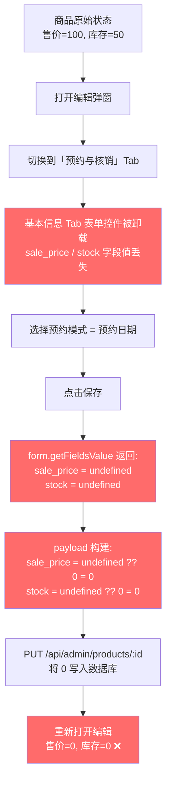
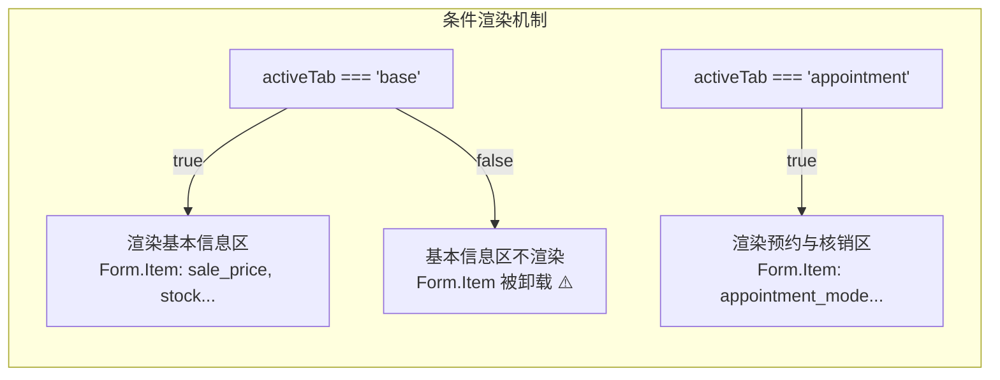
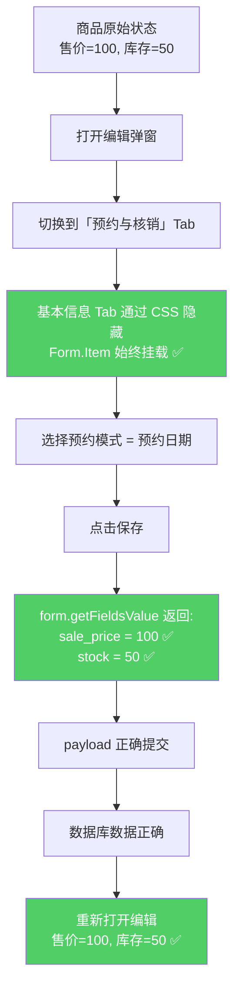

# 商品编辑 — 切换预约模式导致售价和库存归零 Bug 修复方案

## 1. Bug 发生背景

### 1.1 项目概述

bini-health 健康管理平台，包含管理后台（admin-web）、用户端 H5、Flutter APP、微信小程序等多端应用。技术栈为 Next.js + React + Ant Design（前端）、FastAPI + SQLAlchemy + MySQL（后端）。

### 1.2 涉及功能模块

- **商品体系 → 商品分类 → 商品信息编辑弹窗**
- 具体涉及"基本信息" Tab 和"预约与核销" Tab 的交互

### 1.3 发现方式

用户在管理后台编辑已有商品时发现：只要切换预约模式为「预约日期」并保存，再次打开编辑即发现售价和库存均变为 0。

---

## 2. Bug 描述

### 2.1 错误现象

在管理后台编辑一个**统一规格**的商品时，只要切换到"预约与核销" Tab 修改预约模式为「预约日期」，然后保存，再重新打开该商品的编辑界面，会发现：

- **售价（sale_price）** 从原本的正常值变为 **0**
- **库存（stock）** 从原本的正常值变为 **0**

此现象**每次**操作都会出现，**100% 稳定复现**，保存过程中无任何报错。



### 2.2 重现步骤

| 步骤 | 操作 | 预期结果 | 实际结果 |
|------|------|----------|----------|
| 1 | 打开管理后台 → 商品体系 → 商品分类，选择一个**统一规格**商品点击编辑 | 弹窗显示商品信息，售价和库存为正常值 | ✅ 正常 |
| 2 | 点击左侧"预约与核销" Tab | 切换到预约相关设置区域 | ✅ 正常（但此时"基本信息"Tab 中的表单控件被卸载） |
| 3 | 将"预约模式"下拉框改为「预约日期」 | 出现预约设置子区域 | ✅ 正常 |
| 4 | 填写预约相关配置（如提前天数、单日限额等），点击"保存" | 保存成功，售价和库存保持不变 | ❌ 保存成功，但售价和库存被写入 0 |
| 5 | 重新点击编辑该商品 | 售价和库存显示为原来的值 | ❌ 售价=0，库存=0 |

### 2.3 影响范围

- **影响端**：管理后台（admin-web）
- **影响场景**：所有统一规格商品在编辑时切换 Tab 后保存的场景
- **数据风险**：已正确设置的商品价格和库存数据会被**错误覆盖为 0**，导致：
  - 用户端看到商品售价为 ¥0（可被 0 元下单）
  - 库存为 0 导致商品无法下单（用户端显示缺货）
  - 如果保存时选择"保存并上架"，库存为 0 会被上架校验拦截，但如果是"仅保存"则会直接写入错误数据
- **潜在扩散**：不仅限于预约模式切换——**任何从"基本信息"Tab 切到其他 Tab 再保存**，都可能丢失基本信息 Tab 中的字段值（如售价、库存、原价等）

### 2.4 关于「下单预约方式」配置的澄清

经代码分析确认：「下单预约方式」（下单即预约 / 先下单后预约）选项**不影响**价格和库存的归零现象。无论选择哪种下单预约方式，只要发生了 Tab 切换，Bug 都会触发。「下单预约方式」属于预约流程的独立配置，与价格库存字段完全无关。

---

## 3. 根因分析

### 3.1 核心问题：Tab 条件渲染导致 Form.Item 卸载丢值

商品编辑弹窗的 Tab 切换使用的是**手动 if/else 条件渲染**模式：



当 `activeTab` 从 `'base'` 切换到 `'appointment'` 时：

1. "基本信息"区域的所有 React 组件被**完全卸载**（unmount）
2. `sale_price`、`stock` 等 `Form.Item` 从 DOM 中移除
3. 虽然 Ant Design Form 的 `preserve` 属性默认为 `true`，但在特定的组件树重建场景下，`form.getFieldsValue()` 可能拿不到已卸载字段的值，返回 `undefined`

### 3.2 payload 构建的防御不足

提交时的 payload 构建使用了空值合并运算符（`??`），但 fallback 值直接写死为 0：

```
sale_price = values.sale_price ?? 0    →  undefined ?? 0 = 0  ❌
stock      = values.stock ?? 0          →  undefined ?? 0 = 0  ❌
```

当字段值因 Tab 卸载变为 `undefined` 时，直接被替换成 0 提交到后端。

### 3.3 后端未做防御

后端 `PUT /api/admin/products/:id` 接口直接将前端传来的 `sale_price` 和 `stock` 写入数据库，没有对"编辑时价格/库存从非零变为零"的异常情况做额外校验或告警。

---

## 4. 预期正确效果

修复后应满足以下行为：

1. **切换 Tab 后表单值不丢失**：无论用户在哪个 Tab 之间切换，所有已填写的表单字段值都应完整保留

2. **保存时 payload 数据正确**：保存提交的 `sale_price` 和 `stock` 应为用户实际填写/编辑的值，不会因为 Tab 切换而被意外清零

3. **编辑→保存→重新打开**：售价和库存与保存前一致

4. **同类字段的防御**：不仅 `sale_price` 和 `stock`，其他分布在不同 Tab 中的字段（如 `original_price`、`selling_point` 等）也应有同等保障



---

## 5. 修复方案

### 5.1 方案一（推荐·根治）：将条件渲染改为 CSS display 控制

将 `renderTabContent()` 中的 `if/else` 条件渲染改为**所有 Tab 内容始终渲染**，通过 `display: none / display: block` 控制可见性：

```
修改前：if (activeTab === 'base') return <基本信息区 />     ← 只渲染当前 Tab，其他被卸载
修改后：<div style={{ display: activeTab === 'base' ? 'block' : 'none' }}>
           <基本信息区 />
        </div>                                              ← 所有 Tab 始终挂载，仅通过 CSS 隐藏
```

所有 Tab 的内容区域（基本信息、标签、积分、预约与核销、排序与营销）全部改为始终渲染、CSS 控制显隐的模式。

**优点**：

- 彻底根治问题，所有 Tab 的所有表单字段值永远不会丢失
- 切换 Tab 时的表单校验也能正常工作
- 修改范围集中在 `renderTabContent()` 函数，风险极低

### 5.2 方案二（辅助防御·兜底）：payload 构建时 fallback 到编辑前的原始值

在 payload 构建时，如果 `form.getFieldsValue()` 拿到的值为 `undefined`/`null`/`NaN`，则回退到编辑前从接口获取的原始值，而不是回退到 0：

```
修改前：sale_price = values.sale_price ?? 0
修改后：sale_price = values.sale_price ?? editingRecord?.sale_price ?? 0
```

`stock` 字段同理。

**建议同时实施方案一和方案二**——方案一治根，方案二做兜底防御，双保险。

### 5.3 修改文件清单

| 文件 | 修改内容 |
|------|----------|
| admin-web 商品管理页面 | `renderTabContent()` 函数：将 if/else 条件渲染改为 CSS display 控制 |
| admin-web 商品管理页面 | `handleSubmit()` 函数：payload 构建增加 fallback 到原始值的防御 |

---

## 6. 补充说明

- **不仅限于预约模式**：任何导致用户从"基本信息" Tab 切走再保存的操作路径都会触发此 Bug。预约模式只是最常见的触发场景，因为用户必须切到"预约与核销" Tab 才能修改预约设置。

- **多规格商品不受影响**：多规格模式下，售价和库存由 SKU 列表（`skuList` 状态变量）管理，不通过 `Form.Item` 存储，因此不受 Tab 切换影响。

- **修复优先级：🔴 紧急** — 此 Bug 会导致商品价格数据被错误清零，存在严重的业务和财务风险（商品可能被 ¥0 购买）。

- **「下单预约方式」与本 Bug 无关** — 无论选择"下单即预约"还是"先下单后预约"，都不会影响价格和库存的数据完整性。真正的触发条件是 Tab 切换导致表单控件卸载。
