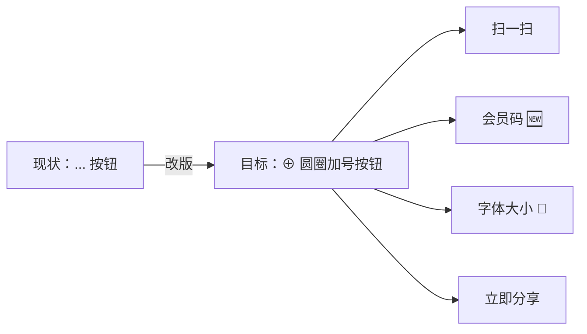
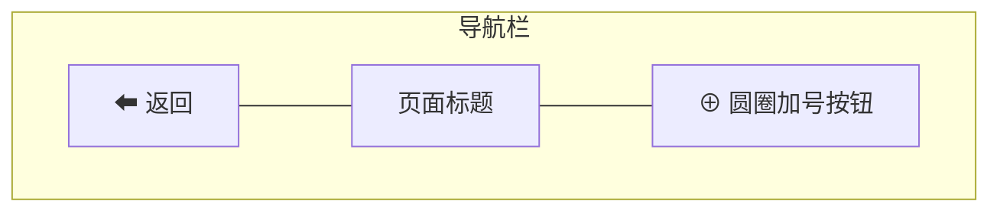
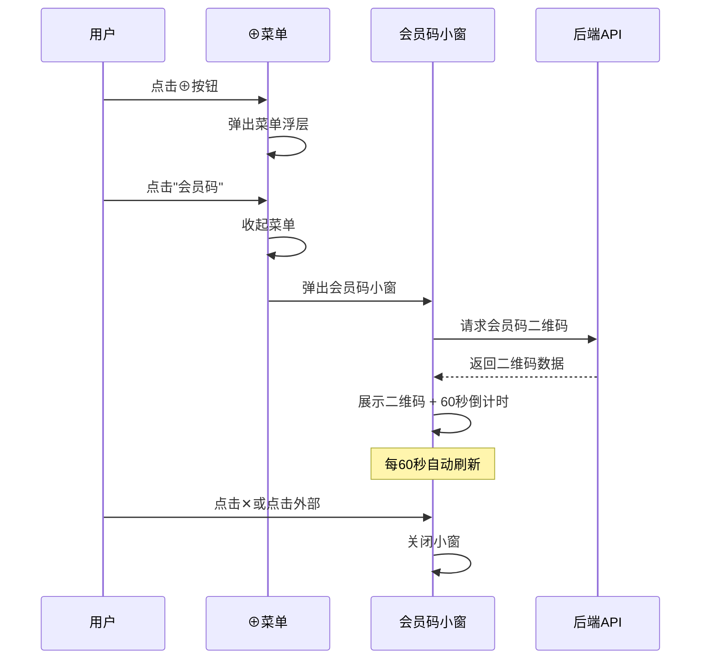
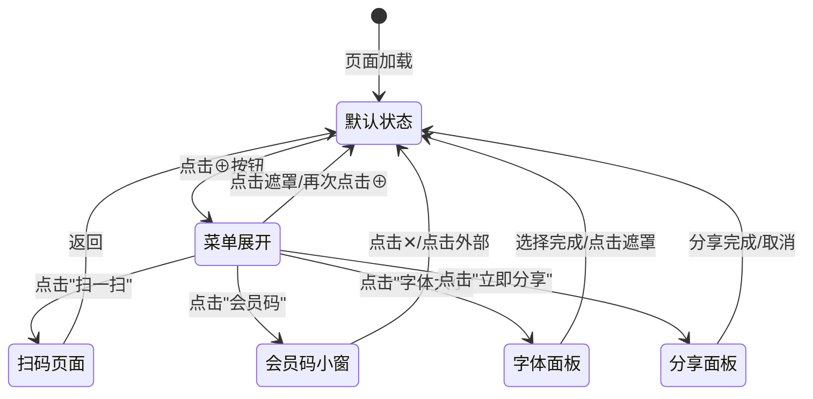

# AI 对话页圆圈加号菜单改版 产品需求文档（PRD）

## 1. 需求概述

### 1.1 背景与目的

当前 bini-health 用户端 AI 对话页面右上角的"..."菜单存在以下问题：

- **入口图标不够直观**：使用"..."作为更多菜单的入口，辨识度低，用户不易发现
- **菜单功能不完整**：现有菜单仅包含"扫一扫"、"字体大小"、"立即分享"三项，缺少"会员码"这一高频使用功能
- **部分功能未接入**："字体大小"功能的点击事件没有正确绑定，点击后无响应

本次改版旨在将右上角入口图标升级为类似微信的**圆圈加号（⊕）**样式，新增"会员码"功能项，并修复字体大小功能，打造更直观、更完善的菜单体验。



### 1.2 目标用户

bini-health 平台的所有 H5 端用户（包括普通用户和会员用户），主要使用场景为 AI 健康对话页面。

### 1.3 核心价值

- **提升入口辨识度**：⊕ 图标比"..."更醒目，用户更容易发现和使用
- **补齐高频功能**：会员码直接在菜单中弹窗展示，无需跳转，操作更便捷
- **修复已知缺陷**：字体大小功能正式上线，提升可访问性
- **统一设计语言**：菜单视觉风格跟随蓝紫主题（#5B6CFF），保持整体一致性

---

## 2. 功能需求

### 2.1 功能清单总览

| 编号 | 功能模块 | 功能点 | 优先级 | 说明 |
|------|----------|--------|--------|------|
| F01 | 入口图标改版 | 右上角"..."改为⊕圆圈加号 | P0 | 参考微信右上角加号风格 |
| F02 | 菜单弹出样式 | 蓝紫主题下拉菜单 | P0 | 从按钮下方弹出，颜色跟随蓝紫主题 |
| F03 | 扫一扫 | 跳转已有扫码页面 | P0 | 复用已有扫码功能，无需新开发 |
| F04 | 会员码 | 菜单内弹窗展示二维码 | P0 | 新增功能，含60秒自动刷新 |
| F05 | 字体大小 | 四档选项列表调节 | P0 | 修复现有功能并接入交互 |
| F06 | 立即分享 | 保留现有分享功能 | P0 | 无需改动，保持现有逻辑 |

### 2.2 功能详细描述

#### F01：入口图标改版 — 圆圈加号（⊕）

**改动描述**：将 AI 对话页面右上角的"..."图标替换为圆圈加号（⊕）图标。

**设计要求**：

- 图标样式：圆形边框 + 居中加号，线条风格，参考微信右上角加号按钮
- 图标颜色：白色（与导航栏配合），在蓝紫色导航栏背景上清晰可见
- 图标大小：与当前"..."图标占位大小一致，点击热区不小于 44×44px
- 点击反馈：点击时有轻微的按压缩放动画（scale 0.95）



#### F02：菜单弹出样式 — 蓝紫主题下拉浮层

**改动描述**：点击⊕按钮后，从按钮下方弹出下拉菜单浮层。

**设计要求**：

- **弹出方向**：从⊕按钮正下方向下弹出（参考微信右上角加号菜单的位置关系）
- **菜单背景**：蓝紫渐变半透明背景（基于主题色 #5B6CFF），带毛玻璃效果（backdrop-filter: blur）
- **菜单圆角**：12px 圆角
- **菜单阴影**：柔和投影，增加浮层层次感
- **菜单箭头**：顶部右侧有一个小三角箭头指向⊕按钮
- **弹出动画**：从上往下展开 + 透明度渐入，时长约 200ms
- **收起动画**：从下往上收起 + 透明度渐出，时长约 150ms
- **遮罩层**：菜单弹出时，底部内容区覆盖一层半透明黑色遮罩（opacity 0.3），点击遮罩可关闭菜单

**菜单项布局**：

- 每个菜单项为一行，左侧图标 + 右侧文字，水平排列
- 菜单项之间有细分割线（白色半透明 opacity 0.2）
- 菜单项高度：48px
- 图标大小：20×20px
- 文字大小：15px，白色
- 点击菜单项时有高亮反馈（背景色变浅）

```
┌──────────────────────┐
│  🔍  扫一扫           │
│─ ─ ─ ─ ─ ─ ─ ─ ─ ─ ─│
│  📱  会员码           │
│─ ─ ─ ─ ─ ─ ─ ─ ─ ─ ─│
│  🔤  字体大小         │
│─ ─ ─ ─ ─ ─ ─ ─ ─ ─ ─│
│  📤  立即分享         │
└──────────────────────┘
```

#### F03：扫一扫

**行为描述**：点击"扫一扫"菜单项后：

1. 关闭菜单浮层
2. 跳转到已有的扫码页面（二维码扫描功能）
3. 复用现有扫码功能的全部逻辑，无需额外开发

**图标要求**：扫描框样式图标，白色

#### F04：会员码（新增功能）

**行为描述**：点击"会员码"菜单项后：

1. **不关闭菜单**，而是在菜单上方（或屏幕中央）弹出一个会员码小窗
2. 底部菜单自动收起，只保留会员码小窗 + 遮罩层

**图标要求**：

- 图标样式：QR 码风格图标，参考"我的"页面右上角的二维码图标
- 图标颜色：蓝紫色（#5B6CFF）图标配白色文字

**会员码小窗设计**：

| 属性 | 规格 |
|------|------|
| 窗口尺寸 | 宽 280px，高度自适应 |
| 背景色 | 白色，圆角 16px |
| 阴影 | 较大投影，突出浮层效果 |
| 弹出位置 | 屏幕垂直居中偏上 |
| 弹出动画 | 缩放弹入（scale 0.8 → 1.0）+ 透明度渐入 |

**小窗内容布局**（从上到下）：

1. **关闭按钮**：右上角 ✕ 按钮，灰色，点击可关闭
2. **用户昵称**：居中显示，字号 16px，颜色 #333
3. **二维码区域**：居中显示，尺寸 200×200px
4. **倒计时提示**：二维码下方居中，"XX 秒后自动刷新"，字号 12px，灰色

**二维码刷新机制**：

- 与"我的"页面的会员码保持一致，**60 秒自动刷新**
- 倒计时从 60 秒开始递减，到 0 秒时自动请求新的二维码
- 刷新时二维码区域短暂显示 loading 状态（旋转动画），获取成功后替换新二维码
- 调用与会员码页面相同的后端接口获取二维码数据

**关闭方式**（两种均支持）：

- 点击小窗右上角 ✕ 关闭按钮 → 关闭小窗 + 遮罩层
- 点击小窗外的任意遮罩区域 → 关闭小窗 + 遮罩层



#### F05：字体大小（修复 + 新交互）

**行为描述**：点击"字体大小"菜单项后：

1. 关闭菜单浮层
2. 从屏幕底部弹出字体大小选项面板（底部弹出式面板，类似 ActionSheet）

**图标要求**：文字大小调节图标（如 "A" 大小切换样式），白色

**选项面板设计**：

| 属性 | 规格 |
|------|------|
| 面板背景 | 白色，顶部圆角 16px |
| 弹出方向 | 从屏幕底部向上滑出 |
| 面板标题 | "字体大小"，居中，字号 16px，加粗 |
| 关闭方式 | 下滑关闭 / 点击遮罩关闭 |

**四档选项**：

| 档位 | 显示名称 | 预览字号 | 实际 CSS 缩放比例 |
|------|----------|----------|-------------------|
| 1 | 小 | 14px | 0.875（基准的 87.5%） |
| 2 | 标准 | 16px | 1.0（基准，默认值） |
| 3 | 大 | 18px | 1.125（基准的 112.5%） |
| 4 | 超大 | 20px | 1.25（基准的 125%） |

**交互细节**：

- 四个档位纵向排列，每项左侧显示档位名称，右侧显示对应字号的示例文字（如"示例文字"）
- 当前选中的档位高亮显示（蓝紫色背景 + 白色文字），未选中的为灰色文字
- 点击某个档位后**即时生效**，AI 对话页面的文字大小立刻变化（用户可实时预览效果）
- 选择结果保存到本地存储（localStorage），下次进入页面自动应用

**生效范围**：

- **仅影响 AI 对话页面的文字大小**，包括：
  - 对话气泡中的文字
  - 推荐问题/快捷回复的文字
- 不影响导航栏、菜单、按钮等系统级 UI 元素的字号

#### F06：立即分享

**行为描述**：保留现有的分享功能逻辑，无需任何改动。

**图标要求**：分享/转发样式图标，白色

---

## 3. 页面/界面设计

### 3.1 页面结构与导航

本次改版**不涉及新页面的增加**，所有改动集中在 AI 对话页面的右上角菜单组件上。

涉及的页面/组件：

| 组件 | 改动类型 | 说明 |
|------|----------|------|
| AI 对话页导航栏 | 修改 | 右上角图标从"..."改为⊕ |
| MoreMenu 菜单组件 | 重构 | 菜单样式、动画、菜单项全面升级 |
| 会员码小窗组件 | 新增 | 菜单内弹出的二维码展示小窗 |
| 字体大小面板组件 | 新增 | 底部弹出的四档字体选择面板 |

### 3.2 各页面功能说明

#### AI 对话页面 — 菜单交互流程



#### 会员码小窗 — 界面布局示意

```
┌─────────────────────────┐
│                     ✕   │
│                         │
│      用户昵称/用户名     │
│                         │
│    ┌─────────────────┐  │
│    │                 │  │
│    │    二维码区域     │  │
│    │   200 × 200px   │  │
│    │                 │  │
│    └─────────────────┘  │
│                         │
│    45秒后自动刷新        │
│                         │
└─────────────────────────┘
```

#### 字体大小面板 — 界面布局示意

```
┌─────────────────────────────┐
│         字体大小             │
│─ ─ ─ ─ ─ ─ ─ ─ ─ ─ ─ ─ ─ ─│
│  小        示例文字 (14px)   │
│─ ─ ─ ─ ─ ─ ─ ─ ─ ─ ─ ─ ─ ─│
│  ✅ 标准   示例文字 (16px)   │  ← 当前选中，蓝紫高亮
│─ ─ ─ ─ ─ ─ ─ ─ ─ ─ ─ ─ ─ ─│
│  大        示例文字 (18px)   │
│─ ─ ─ ─ ─ ─ ─ ─ ─ ─ ─ ─ ─ ─│
│  超大      示例文字 (20px)   │
└─────────────────────────────┘
```

---

## 4. 非功能性需求

### 4.1 性能要求

- 菜单弹出/收起动画流畅，无卡顿（60fps）
- 会员码二维码请求响应时间不超过 1 秒
- 字体大小切换即时生效，无需页面刷新
- 二维码 60 秒自动刷新机制不阻塞主线程

### 4.2 安全要求

- 会员码二维码的生成和刷新必须经过用户身份校验（复用已有会员码接口的鉴权机制）
- 二维码数据传输走 HTTPS 加密通道

### 4.3 兼容性要求

- 适配主流移动端浏览器（微信内置浏览器、Safari、Chrome）
- 适配 iOS 和 Android 系统
- 毛玻璃效果（backdrop-filter）在不支持的浏览器上优雅降级为纯色半透明背景

---

## 5. 业务规则与约束

| 编号 | 规则描述 |
|------|----------|
| R01 | 菜单项固定排序：扫一扫 → 会员码 → 字体大小 → 立即分享，不可由用户自定义 |
| R02 | 字体大小设置仅影响 AI 对话页面，不影响其他页面和系统 UI |
| R03 | 字体大小选择持久化到 localStorage，跨会话保持 |
| R04 | 会员码二维码 60 秒自动刷新，与"我的"页面会员码使用同一套后端接口 |
| R05 | 会员码小窗中仅显示二维码 + 用户昵称，不显示会员等级等额外信息 |
| R06 | 未登录用户点击"会员码"时，应引导跳转登录页面 |
| R07 | 菜单弹出时，⊕按钮应有视觉状态变化（如旋转 45° 变成 ✕），提示可点击关闭 |

---

## 6. 权限设计

| 角色 | 权限说明 |
|------|----------|
| 已登录用户 | 可使用菜单全部功能（扫一扫、会员码、字体大小、立即分享） |
| 未登录用户 | 可使用"字体大小"和"立即分享"；点击"扫一扫"和"会员码"时引导登录 |
| 管理员（Admin） | 无需在管理后台新增配置项，菜单内容前端固定 |

---

## 7. 异常处理与边界情况

| 场景 | 处理方式 |
|------|----------|
| 会员码接口请求失败 | 小窗中显示"获取失败，点击重试"按钮，用户点击后重新请求 |
| 会员码自动刷新失败 | 保持上一个有效二维码显示，同时倒计时归零后自动重试 |
| 网络断开时点击"扫一扫" | 由扫码页面自身处理网络异常提示 |
| localStorage 不可用（隐私模式） | 字体大小设置仅在当前会话内生效，页面关闭后恢复默认 |
| 用户快速连续点击⊕按钮 | 防抖处理，避免菜单反复弹出/收起 |
| 会员码小窗打开时收到新消息 | 小窗保持打开状态，不受对话消息影响 |
| 菜单弹出后横屏/竖屏切换 | 自动关闭菜单，用户需重新点击打开 |

---

## 8. 补充说明

### 8.1 与现有功能的关系

本次改版基于已有的 `MoreMenu` 菜单组件进行升级重构，需注意：

- **扫一扫**：复用已有的扫码页面和扫码逻辑
- **会员码**：复用已有的会员码后端接口（与"我的"页面会员码使用同一套 API）
- **立即分享**：保持现有分享逻辑不变
- **字体大小**：属于新增交互，但功能入口之前已存在，本次为首次完整实现

### 8.2 视觉规范速查

| 元素 | 色值 |
|------|------|
| 主题色 | #5B6CFF（蓝紫色） |
| 菜单背景 | 基于 #5B6CFF 的半透明渐变 |
| 菜单文字 | #FFFFFF（白色） |
| 菜单分割线 | rgba(255, 255, 255, 0.2) |
| 会员码图标 | #5B6CFF（蓝紫色） |
| 会员码小窗背景 | #FFFFFF（白色） |
| 遮罩层 | rgba(0, 0, 0, 0.3) |

### 8.3 开发说明

本系统将基于小白 AI 进行自动化开发，并部署至小白 AI 云服务器。所有功能将在一个版本内完成开发并一次性上线。
