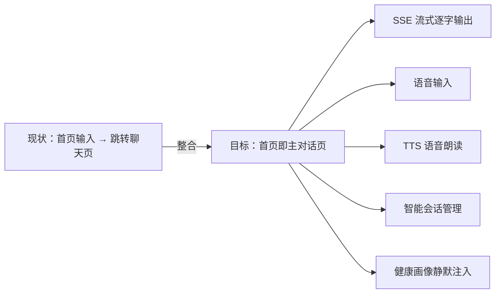
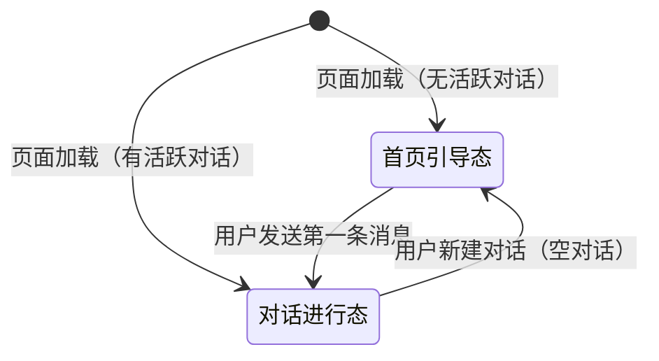
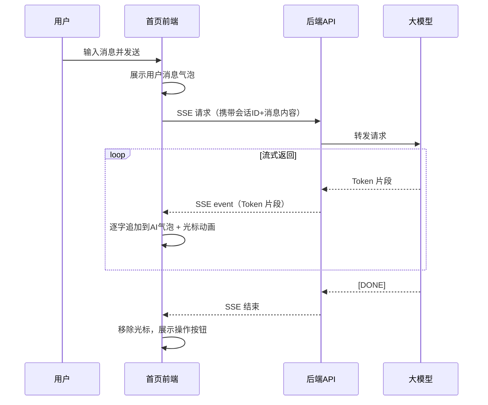
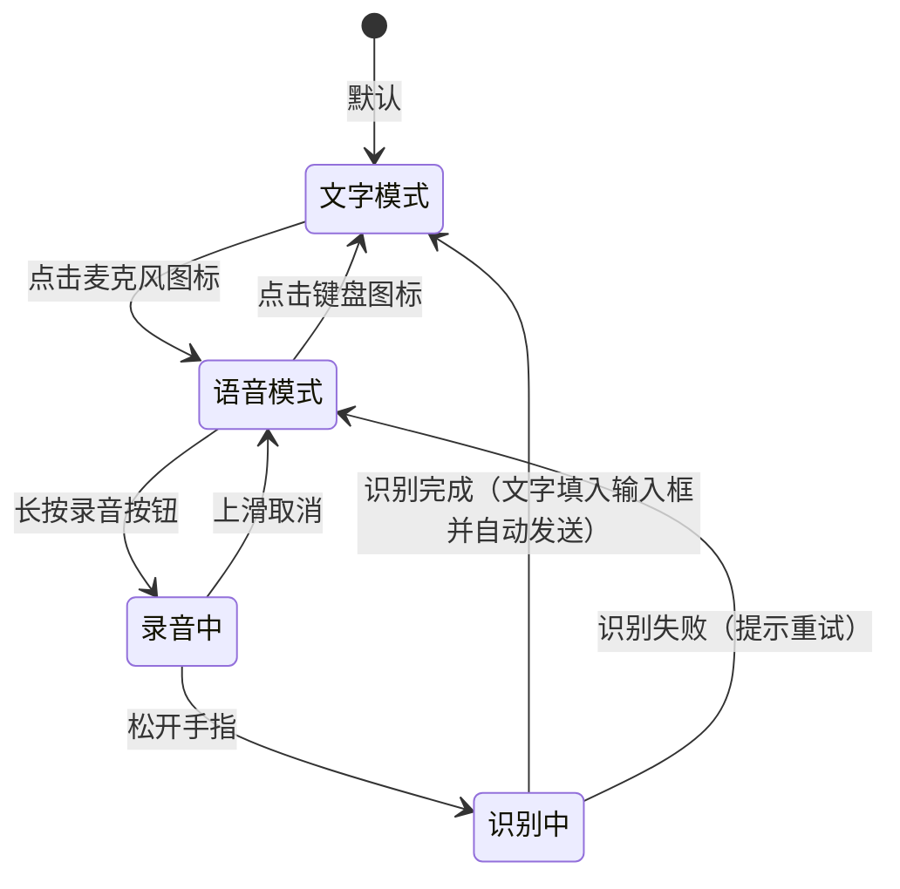
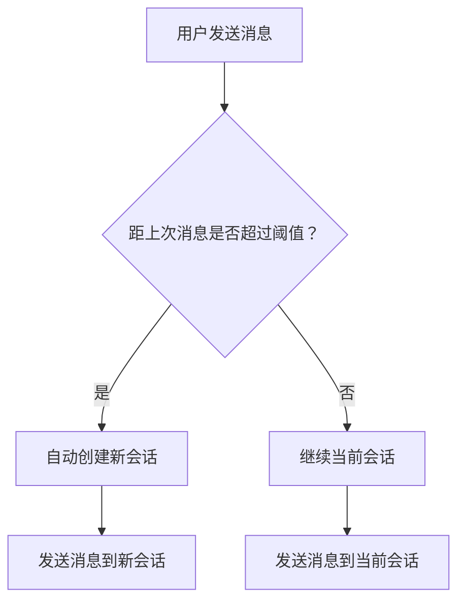
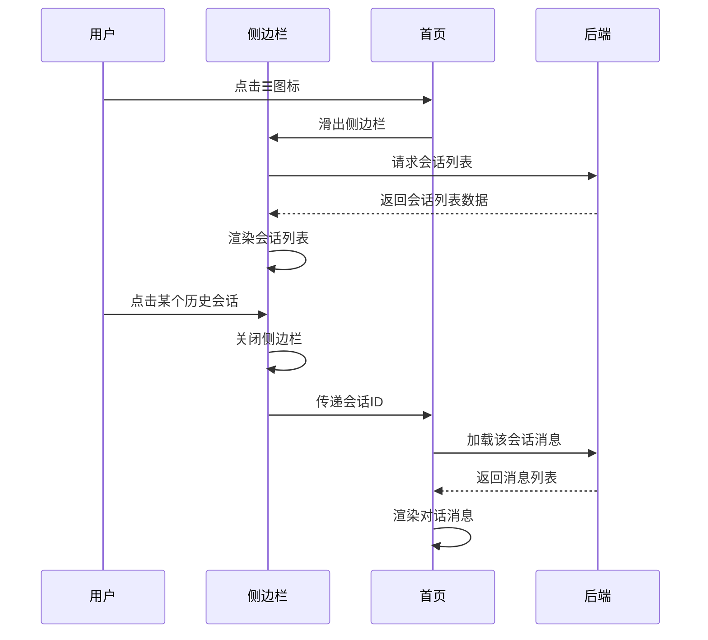
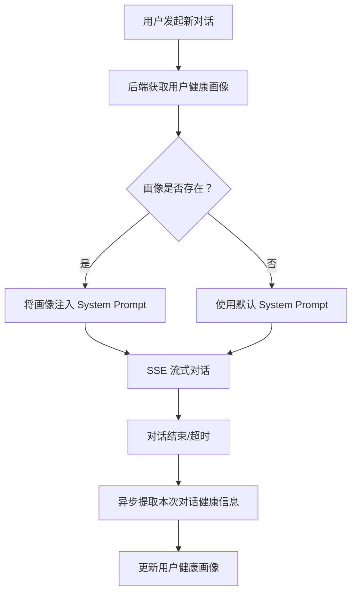

# AI 对话首页功能整合与对话体验升级 产品需求文档（PRD）

## 1. 需求概述

### 1.1 背景与目的

当前 bini-health 用户端的 AI 对话体验分散在两个页面：

- **AI 对话首页**（`/ai-home`）：具备轮播图、功能菜单、推荐问题卡片和一个简单的输入框，发送消息后跳转到独立聊天页面
- **AI 健康咨询聊天页**（`/chat/[sessionId]`）：具备完整的 SSE 流式对话、语音输入、TTS 语音朗读等高级能力

用户每次提问都需要跳转页面，体验割裂。参考蚂蚁阿福、讯飞晓医等行业标杆产品，AI 健康对话产品的趋势是**"对话即入口"**——首页本身就是主对话页面，用户打开即可直接聊天。

本次改版旨在将 AI 健康咨询聊天页的核心对话能力**整合到 AI 对话首页**，实现首页就地对话、流式输出、语音输入、TTS 朗读，并引入智能会话管理机制（空闲超时自动新建对话、历史会话侧边栏、健康画像静默注入），打造一站式 AI 健康对话体验。



### 1.2 目标用户

bini-health 平台的所有 H5 端用户（包括普通用户和会员用户），主要使用场景为 AI 健康对话首页。

### 1.3 核心价值

- **消除页面跳转**：用户在首页直接完成完整的 AI 对话，无需跳转到独立聊天页
- **升级对话体验**：SSE 流式逐字输出，像跟真人聊天一样自然流畅
- **多模态输入**：文字输入 + 语音输入（按住说话、语音识别转文字），覆盖更多使用场景
- **智能朗读**：TTS 语音朗读 AI 回复，适合老年用户或不便阅读的场景
- **智能会话管理**：空闲超时自动新建、历史会话侧边栏、健康画像跨会话延续
- **行业对齐**：对标蚂蚁阿福、讯飞晓医的"对话即入口"产品范式

### 1.4 与上一版PRD的关系

本PRD是对 `PRD_AI对话页圆圈加号菜单改版_20260427_200100.md` 的功能延伸。上一版PRD中定义的圆圈加号菜单（⊕）、会员码弹窗、字体大小面板等功能保持不变，本次在此基础上新增对话能力整合和会话管理功能。

---

## 2. 功能需求

### 2.1 功能清单总览

| 编号 | 功能模块 | 功能点 | 优先级 | 说明 |
|------|----------|--------|--------|------|
| F01 | 输入框替换 | 首页输入框替换为完整对话输入栏 | P0 | 从聊天页迁移完整输入组件 |
| F02 | SSE 流式对话 | 对话消息流式逐字输出 | P0 | 迁移已有 SSE 流式能力 |
| F03 | 语音输入 | 按住说话 + 语音识别转文字 | P0 | 迁移已有语音输入能力 |
| F04 | TTS 语音朗读 | AI 回复语音播报 | P1 | 迁移已有 TTS 能力 |
| F05 | 对话持久化 | 对话创建正式会话并保存 | P0 | 新增，参考蚂蚁阿福 |
| F06 | 空闲自动新建 | 超时自动新建对话 | P0 | 新增，后台可配置阈值 |
| F07 | 历史会话侧边栏 | 左侧/顶部入口查看历史 | P1 | 新增，参考讯飞晓医 |
| F08 | 健康画像静默注入 | 新对话携带用户健康画像 | P1 | 新增，参考蚂蚁阿福 |

### 2.2 功能详细描述

#### F01：输入框替换 — 完整对话输入栏

**改动描述**：将 AI 对话首页当前的简单输入框，替换为从 AI 健康咨询聊天页（`/chat/[sessionId]`）迁移过来的**完整对话输入栏组件**。

**需要迁移的输入栏功能**：

- 文字输入框（多行自适应高度）
- 发送按钮（蓝紫主题色）
- 语音输入切换按钮（麦克风图标，点击切换到语音模式）
- 输入框占位提示文字

**设计要求**：

- 输入栏固定在页面底部，与当前聊天页的输入栏布局保持一致
- 输入栏上方为对话消息区域（可滚动）
- 首次进入页面时（无对话记录），保留当前首页的轮播图、功能菜单、推荐问题卡片等内容
- 用户发送第一条消息后，轮播图和功能菜单区域自动收起/隐藏，切换为对话消息列表视图

**首页状态切换逻辑**：



| 状态 | 页面内容 |
|------|----------|
| 首页引导态 | 显示轮播图/健康贴士、功能菜单、推荐问题卡片 + 底部输入栏 |
| 对话进行态 | 显示对话消息列表 + 底部输入栏（轮播图/菜单隐藏） |

#### F02：SSE 流式对话 — 逐字输出

**改动描述**：将聊天页已实现的 SSE 流式对话能力迁移到首页，实现 AI 回复逐字输出效果。

**已有实现能力（直接迁移）**：

- SSE（Server-Sent Events）流式接口对接
- 流式光标动画（打字机效果，闪烁光标跟随最新文字）
- 断线重连机制（连接中断自动重试）
- Fallback 到非流式 API（SSE 连接失败时降级为普通 HTTP 请求，一次性返回完整回复）
- Markdown 渲染（AI 回复支持标题、列表、加粗等格式）

**对话消息展示规范**：

| 元素 | 规格 |
|------|------|
| 用户消息气泡 | 右对齐，蓝紫主题色背景（#5B6CFF），白色文字 |
| AI 回复气泡 | 左对齐，浅灰背景（#F5F5F5），深色文字 |
| AI 头像 | 左侧显示 AI 助手头像 |
| 时间戳 | 每组消息间隔超过5分钟时显示时间 |
| 流式光标 | AI 回复过程中，文字末尾显示闪烁竖线光标 |



#### F03：语音输入 — 按住说话

**改动描述**：将聊天页已实现的语音输入能力迁移到首页输入栏。

**已有实现能力（直接迁移）**：

- 麦克风图标切换按钮（文字模式 ↔ 语音模式）
- 按住说话交互（长按录音按钮开始录音，松开发送）
- MediaRecorder API 录音
- ASR 语音识别转文字（调用后端 `/api/tts/synthesize` 相关接口）
- 音量可视化动画（录音时显示声波动画效果）
- 上滑取消功能（按住后上滑可取消本次录音）
- 录音时长限制与提示

**交互流程**：



#### F04：TTS 语音朗读 — AI 回复播报

**改动描述**：将聊天页已实现的 TTS 语音朗读能力迁移到首页。

**已有实现能力（直接迁移）**：

- 云端 TTS（调用 `/api/tts/synthesize` 接口合成语音）
- 浏览器 Web Speech API 兜底（云端 TTS 失败时使用浏览器原生语音合成）
- "播报/停止播报"按钮

**展示规则**：

- **仅在最新一条 AI 回复**下方显示操作按钮（复制 / 播报）
- 之前的历史 AI 回复不显示操作按钮，保持界面简洁
- 当用户发送新消息并收到新的 AI 回复后，操作按钮自动转移到最新回复下方
- 播报进行中时，按钮显示"停止播报"状态，点击可中断

| 操作按钮 | 图标 | 行为 |
|----------|------|------|
| 复制 | 📋 | 复制 AI 回复文本到剪贴板，提示"已复制" |
| 播报 | 🔊 | 调用 TTS 朗读该条 AI 回复 |
| 停止播报 | ⏹ | 中断正在进行的 TTS 朗读 |

#### F05：对话持久化 — 正式会话管理

**改动描述**：首页对话从"临时对话"升级为"正式会话"，对话记录持久化保存，用户下次回来能看到历史。

**行为规范**：

- 用户在首页发送第一条消息时，系统自动创建一个新的 `ChatSession`（复用现有的会话创建接口）
- 后续同一会话内的消息自动归属到该 `ChatSession`
- 会话数据存储在后端数据库，与聊天页的会话使用同一套数据模型和 API
- 用户下次打开首页时，自动加载最近一次活跃对话的完整消息记录

**与现有聊天页的关系**：

- 首页创建的会话和聊天页（`/chat/[sessionId]`）创建的会话使用同一套数据结构
- 用户可以在首页查看和继续之前在聊天页创建的对话（通过历史会话侧边栏）
- 两个页面的会话数据完全互通

#### F06：空闲自动新建对话 — 智能会话分割

**改动描述**：参考蚂蚁阿福和讯飞晓医的做法，当用户空闲超过一定时间后重新发送消息，系统自动创建新对话，而不是继续追加到旧对话中。

**核心机制**：



**阈值配置**：

| 配置项 | 说明 | 默认值 |
|--------|------|--------|
| `chat_idle_timeout` | 空闲自动新建对话的时间阈值 | 30 分钟 |
| 可选值 | 后台可配置 | 30 分钟 / 60 分钟 |

**后台配置要求**：

- 在 Admin 后台的"AI 咨询配置"或"应用设置"中新增配置项
- 支持两个可选值：30 分钟、60 分钟
- 默认值为 30 分钟
- 修改后即时生效，无需重启服务

**判断逻辑（前端实现）**：

1. 记录当前会话最后一条消息的时间戳（`lastMessageTime`）
2. 用户发送新消息时，用当前时间减去 `lastMessageTime`
3. 如果差值 ≥ 配置阈值，自动创建新会话
4. 如果差值 < 配置阈值，继续使用当前会话

**边界情况处理**：

| 场景 | 处理方式 |
|------|----------|
| 用户首次进入（无任何历史会话） | 直接创建新会话 |
| 用户回到首页，距上次对话未超时 | 自动加载并继续上次对话 |
| 用户回到首页，距上次对话已超时 | 显示首页引导态（轮播图+菜单），发消息时创建新会话 |
| 用户主动点击"新建对话" | 无视超时判断，直接创建新会话 |

#### F07：历史会话侧边栏 — 会话管理入口

**改动描述**：参考讯飞晓医左上角的"三道杠"图标，在 AI 对话首页增加历史会话入口，用户可以查看和切换历史对话。

**入口位置**：

- 导航栏左侧区域（返回按钮旁边或替代返回按钮位置），增加一个"三道杠"（☰）图标
- 点击后从左侧滑出历史会话侧边栏

**侧边栏设计**：

| 属性 | 规格 |
|------|------|
| 滑出方向 | 从左侧向右滑出 |
| 宽度 | 屏幕宽度的 75%（约 280px） |
| 背景色 | 白色 |
| 遮罩层 | 右侧剩余区域覆盖半透明黑色遮罩 |
| 关闭方式 | 点击遮罩 / 左滑关闭 / 点击某个会话跳转后自动关闭 |

**侧边栏内容布局**（从上到下）：

1. **顶部区域**：
   - "新建对话" 按钮（蓝紫主题色，醒目位置）
   - 点击后创建新的空白对话，侧边栏自动关闭，首页切换到引导态

2. **会话列表区域**：
   - 按时间倒序排列（最新的在最上面）
   - 每个会话项展示：
     - 会话标题（取自第一条用户消息的前 20 个字，超出截断加"..."）
     - 最后消息时间（如"今天 14:30"、"昨天"、"4月25日"）
     - 最后一条消息预览（截取前 30 个字）
   - 当前活跃的会话高亮显示（左侧蓝紫色竖条标识）
   - 支持上下滚动浏览更多历史会话

3. **底部区域**：
   - "清空全部对话" 按钮（灰色文字，需二次确认）

**切换会话行为**：

- 点击某个历史会话 → 侧边栏关闭 → 首页加载该会话的完整消息记录 → 进入对话进行态
- 加载历史消息时显示 loading 状态

**复用现有接口**：

- 会话列表：复用 `/api/chat-sessions` 接口
- 批量删除：复用 `/api/chat-sessions/batch-delete` 接口
- 清空全部：复用 `/api/chat-sessions/clear-all` 接口



#### F08：健康画像静默注入 — 跨会话个性化

**改动描述**：参考蚂蚁阿福的做法，从用户历史对话中提取关键健康信息形成健康画像，新对话时AI底层自动携带这些信息，实现个性化但不混淆话题。

**核心机制**：

- 系统在后台维护一份**用户健康画像**（从历史对话中自动提取）
- 每次新建对话时，健康画像作为 **System Prompt** 的一部分注入，AI 回答时自动参考
- AI **不会主动提及**历史信息（如"根据您上次的记录..."），除非用户自己提到相关话题

**健康画像包含的信息类型**：

| 信息类别 | 示例 | 提取方式 |
|----------|------|----------|
| 基础信息 | 年龄、性别、BMI | 从健康档案模块获取 |
| 慢病标签 | 高血压、糖尿病 | 从对话中AI提取 + 档案数据 |
| 过敏史 | 青霉素过敏 | 从对话中AI提取 |
| 常用药物 | 降压药、二甲双胍 | 从对话中AI提取 |
| 家族史 | 家族高血压 | 从对话中AI提取 |
| 关注领域 | 睡眠、减重 | 从高频对话主题提取 |

**注入方式**：

- 后端在创建新的 SSE 流式请求时，将用户健康画像信息拼接到 System Prompt 中
- 格式示例：`"用户健康画像：男性，45岁，BMI 26.5，高血压（服用缬沙坦），青霉素过敏。请在回答健康问题时参考以上信息，但不要主动提及这些信息，除非与用户当前问题直接相关。"`

**画像更新机制**：

- 每次对话结束（会话空闲超时后），后端异步任务分析本次对话内容，提取新的健康信息
- 新信息与已有画像合并（增量更新，不覆盖）
- 画像信息可在用户的"健康档案"页面查看和修改（复用已有健康档案模块）



---

## 3. 页面/界面设计

### 3.1 页面结构与导航

本次改版**不新增独立页面**，所有改动集中在 AI 对话首页（`/ai-home`）的功能升级上。

涉及的页面/组件：

| 组件 | 改动类型 | 说明 |
|------|----------|------|
| AI 对话首页（`/ai-home`） | 重构 | 核心改造页面 |
| 输入栏组件 | 替换 | 从聊天页迁移完整输入栏（含语音切换） |
| 对话消息列表组件 | 新增 | 首页就地展示对话消息 |
| SSE 流式引擎 | 迁移 | 从聊天页迁移流式对话逻辑 |
| TTS 播报组件 | 迁移 | 从聊天页迁移语音朗读能力 |
| 历史会话侧边栏组件 | 新增 | 左侧滑出的会话管理面板 |
| 导航栏 | 修改 | 左侧新增☰历史会话入口 |

### 3.2 首页布局 — 引导态（无活跃对话）

```
┌────────────────────────────────┐
│ ☰   AI 健康助手           ⊕   │  ← 导航栏（左：历史入口，右：加号菜单）
├────────────────────────────────┤
│                                │
│  ┌──────────────────────────┐  │
│  │     轮播图 / 健康贴士     │  │  ← 保留现有轮播图
│  └──────────────────────────┘  │
│                                │
│  ┌────┐ ┌────┐ ┌────┐ ┌────┐  │
│  │菜单│ │菜单│ │菜单│ │菜单│  │  ← 保留现有功能菜单
│  └────┘ └────┘ └────┘ └────┘  │
│                                │
│  ┌──────────────────────────┐  │
│  │   #标签1  #标签2  #标签3  │  │  ← 推荐问题快捷标签
│  └──────────────────────────┘  │
│                                │
│                                │
├────────────────────────────────┤
│  ┌───────────────────┐ 🎤 📤  │  ← 完整输入栏（文字+语音+发送）
│  │ 请输入健康问题...   │        │
│  └───────────────────┘        │
└────────────────────────────────┘
```

### 3.3 首页布局 — 对话进行态（有活跃对话）

```
┌────────────────────────────────┐
│ ☰   AI 健康助手           ⊕   │  ← 导航栏
├────────────────────────────────┤
│                                │
│         今天 14:30             │  ← 时间戳
│                                │
│              ┌──────────────┐  │
│              │ 我最近头疼    │  │  ← 用户消息（右对齐，蓝紫色）
│              └──────────────┘  │
│                                │
│  🤖 ┌──────────────────────┐  │
│     │ 头疼的原因有很多，    │  │  ← AI回复（左对齐，浅灰色）
│     │ 常见的包括：          │  │
│     │ 1. 紧张性头痛...     │  │
│     │ 2. 偏头痛...         │  │
│     │                      │  │
│     │   📋复制  🔊播报     │  │  ← 仅最新回复显示操作按钮
│     └──────────────────────┘  │
│                                │
│                                │
├────────────────────────────────┤
│  ┌───────────────────┐ 🎤 📤  │  ← 完整输入栏
│  │ 继续提问...        │        │
│  └───────────────────┘        │
└────────────────────────────────┘
```

### 3.4 历史会话侧边栏

```
┌──────────────────┬─────────────┐
│                  │             │
│  ＋ 新建对话      │             │
│                  │   遮罩层     │
│ ─ ─ ─ ─ ─ ─ ─ ─│  (半透明)    │
│                  │             │
│ ▎我最近头疼...    │             │  ← 当前会话（蓝紫竖条高亮）
│   今天 14:30     │             │
│   头疼的原因有... │             │
│                  │             │
│ ─ ─ ─ ─ ─ ─ ─ ─│             │
│                  │             │
│  减肥饮食建议...  │             │
│   昨天           │             │
│   建议您每天...   │             │
│                  │             │
│ ─ ─ ─ ─ ─ ─ ─ ─│             │
│                  │             │
│  失眠怎么办...    │             │
│   4月25日        │             │
│   改善睡眠可以... │             │
│                  │             │
│                  │             │
│  清空全部对话     │             │
│                  │             │
└──────────────────┴─────────────┘
    75%宽度            25%宽度
```

---

## 4. 后端接口需求

### 4.1 新增接口

| 方法 | 路径 | 说明 |
|------|------|------|
| GET | `/api/admin/app-settings/chat-idle-timeout` | 获取空闲超时配置 |
| PUT | `/api/admin/app-settings/chat-idle-timeout` | 更新空闲超时配置 |
| GET | `/api/app-settings/chat-idle-timeout` | 前端获取当前超时阈值（公开） |
| GET | `/api/user/health-profile` | 获取用户健康画像 |
| PUT | `/api/user/health-profile` | 更新用户健康画像 |
| POST | `/api/user/health-profile/extract` | 从对话中异步提取健康信息 |

### 4.2 空闲超时配置接口

**GET `/api/app-settings/chat-idle-timeout`**

Response:
```json
{
  "code": 200,
  "data": {
    "timeout_minutes": 30,
    "options": [30, 60]
  }
}
```

**PUT `/api/admin/app-settings/chat-idle-timeout`**

Request:
```json
{
  "timeout_minutes": 30
}
```

### 4.3 健康画像接口

**GET `/api/user/health-profile`**

Response:
```json
{
  "code": 200,
  "data": {
    "basic_info": {
      "age": 45,
      "gender": "male",
      "bmi": 26.5
    },
    "chronic_diseases": ["高血压"],
    "allergies": ["青霉素"],
    "medications": ["缬沙坦"],
    "family_history": ["家族高血压"],
    "focus_areas": ["睡眠", "减重"],
    "last_updated": "2026-04-27T14:30:00Z"
  }
}
```

**POST `/api/user/health-profile/extract`**

Request:
```json
{
  "session_id": "xxx-xxx-xxx"
}
```

触发异步任务，从指定会话的对话内容中提取健康信息并更新画像。

### 4.4 复用现有接口

| 接口 | 用途 |
|------|------|
| `/api/chat-sessions` | 创建/获取会话列表 |
| `/api/chat-sessions/{id}/messages` | 获取会话消息列表 |
| `/api/chat/stream` | SSE 流式对话 |
| `/api/chat-sessions/batch-delete` | 批量删除会话 |
| `/api/chat-sessions/clear-all` | 清空全部会话 |
| `/api/tts/synthesize` | TTS 语音合成 |
| ASR 语音识别接口 | 语音转文字 |

---

## 5. 非功能性需求

### 5.1 性能要求

- SSE 流式首字响应时间不超过 2 秒
- 语音识别转文字延迟不超过 3 秒
- TTS 语音合成首音播放延迟不超过 2 秒
- 历史会话列表加载不超过 1 秒
- 会话消息历史加载不超过 2 秒（支持分页，默认加载最近 50 条）
- 页面状态切换（引导态 ↔ 对话态）动画流畅，无卡顿

### 5.2 安全要求

- 对话数据传输走 HTTPS 加密
- 健康画像数据属于用户隐私，仅用户本人和后端 AI 模型可访问
- 健康画像数据不对外暴露，不出现在任何公开接口中

### 5.3 兼容性要求

- 适配主流移动端浏览器（微信内置浏览器、Safari、Chrome）
- 适配 iOS 和 Android 系统
- MediaRecorder API（语音输入）在不支持的浏览器上隐藏语音按钮，仅保留文字输入
- Web Speech API（TTS 兜底）在不支持的浏览器上仅使用云端 TTS

---

## 6. 业务规则与约束

| 编号 | 规则描述 |
|------|----------|
| R01 | 首页对话创建正式会话（ChatSession），对话记录持久化保存到数据库 |
| R02 | 空闲超时自动新建对话，阈值后台可配置（30分/60分），默认30分钟 |
| R03 | 新对话自动携带用户健康画像（System Prompt 注入），但 AI 不主动提及历史 |
| R04 | 仅当用户主动提到相关话题时，AI 才关联历史健康信息 |
| R05 | 操作按钮（复制/播报）仅在最新一条 AI 回复下方显示 |
| R06 | 首页输入栏与聊天页输入栏功能完全一致（文字+语音+发送） |
| R07 | SSE 流式输出失败时自动降级为非流式请求 |
| R08 | 首页引导态（轮播图+菜单）在用户发送第一条消息后自动隐藏 |
| R09 | 用户主动新建对话时，首页恢复引导态 |
| R10 | 历史会话侧边栏会话列表按最后消息时间倒序排列 |
| R11 | 本次迁移的功能来源于 AI 健康咨询聊天页已有代码，不涉及新的大模型接口开发 |
| R12 | 健康画像从历史对话中异步提取，不阻塞用户正常对话 |
| R13 | 与上一版PRD（圆圈加号菜单改版）的功能并行生效，互不冲突 |

---

## 7. 权限设计

| 角色 | 权限说明 |
|------|----------|
| 已登录用户 | 可使用全部功能（对话、语音、TTS、历史会话、健康画像） |
| 未登录用户 | 可使用文字对话和 TTS 朗读；语音输入、历史会话、健康画像需登录后使用 |
| 管理员 | 可在后台配置空闲超时阈值（30分/60分） |

---

## 8. 异常处理与边界情况

| 场景 | 处理方式 |
|------|----------|
| SSE 连接中断 | 自动重连最多 3 次，重连失败后降级为非流式请求 |
| SSE 连接超时 | 30 秒无数据返回，中断连接并显示"回复超时，请重试" |
| 语音录音权限被拒绝 | 提示"请在浏览器设置中开启麦克风权限"，自动切回文字模式 |
| 语音识别失败 | 提示"识别失败，请重试或使用文字输入" |
| TTS 云端合成失败 | 自动降级到浏览器 Web Speech API |
| TTS 两种方式都失败 | 隐藏播报按钮，不影响其他功能 |
| 空闲超时判断时本地时间被修改 | 以服务端返回的最后消息时间为准，不依赖纯前端计时 |
| 健康画像提取失败 | 静默失败，不影响用户正常对话，下次会话再重试 |
| 健康画像数据为空（新用户） | 使用默认 System Prompt，不注入任何画像信息 |
| 用户在对话进行中切后台 | 保持当前对话状态，回来后可继续 |
| 网络断开时发送消息 | 消息标记为"发送失败"，显示重试按钮 |
| 历史消息过多（>200条） | 分页加载，先加载最近 50 条，上滑加载更多 |
| 用户快速连续发送消息 | 队列处理，按发送顺序依次请求后端 |

---

## 9. 数据模型变更

### 9.1 新增数据模型

**UserHealthProfile（用户健康画像）**

| 字段 | 类型 | 说明 |
|------|------|------|
| id | UUID | 主键 |
| user_id | UUID | 关联用户，唯一 |
| basic_info | JSON | 基础信息（年龄、性别、BMI等） |
| chronic_diseases | JSON Array | 慢病标签列表 |
| allergies | JSON Array | 过敏史列表 |
| medications | JSON Array | 常用药物列表 |
| family_history | JSON Array | 家族史列表 |
| focus_areas | JSON Array | 关注领域列表 |
| created_at | DateTime | 创建时间 |
| updated_at | DateTime | 最后更新时间 |

### 9.2 现有模型扩展

**AppSetting（应用设置）新增配置项**

| 配置键 | 值类型 | 默认值 | 说明 |
|--------|--------|--------|------|
| `chat_idle_timeout_minutes` | Integer | 30 | 空闲自动新建对话的阈值（分钟） |

---

## 10. 补充说明

### 10.1 迁移策略

本次改版的核心工作是**代码迁移**而非新功能开发。以下三项功能在 AI 健康咨询聊天页（`/chat/[sessionId]`）中已有完整实现：

| 功能 | 源文件位置 | 迁移目标 |
|------|-----------|----------|
| SSE 流式对话 | `/chat/[sessionId]` 页面组件 | `/ai-home` 页面组件 |
| 语音输入 | `/chat/[sessionId]` 输入栏组件 | `/ai-home` 输入栏组件 |
| TTS 语音朗读 | `/chat/[sessionId]` 消息组件 | `/ai-home` 消息组件 |

建议开发时将这些能力抽取为**独立的可复用组件/Hook**，供首页和聊天页共同调用，避免代码重复。

### 10.2 与圆圈加号菜单改版的关系

本PRD与 `PRD_AI对话页圆圈加号菜单改版_20260427_200100.md` 定义的功能**同时生效**：

- 圆圈加号（⊕）菜单位于导航栏右侧 → 不变
- 历史会话（☰）入口位于导航栏左侧 → 本次新增
- 菜单功能（扫一扫/会员码/字体大小/分享）→ 不变
- 输入栏和对话区域 → 本次升级

### 10.3 开发说明

本系统将基于小白 AI 进行自动化开发，并部署至小白 AI 云服务器。所有功能将在一个版本内完成开发并一次性上线。
