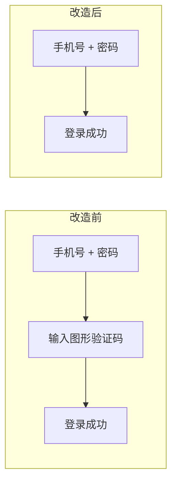
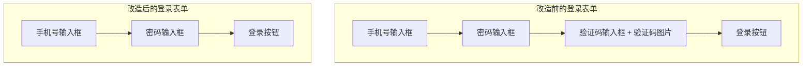
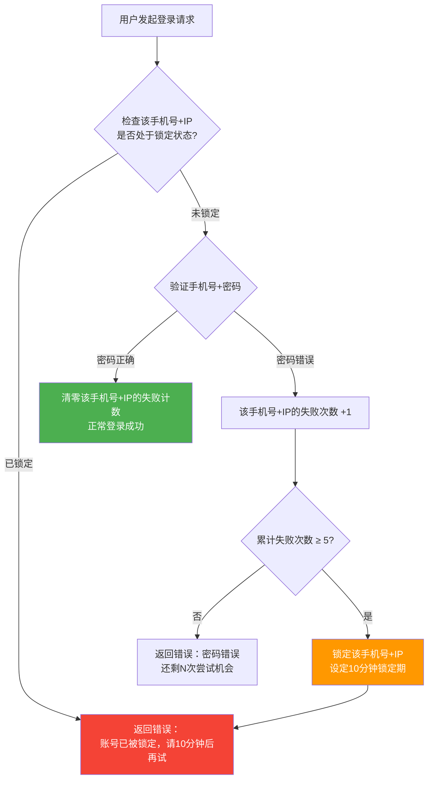
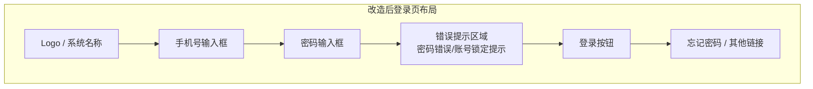
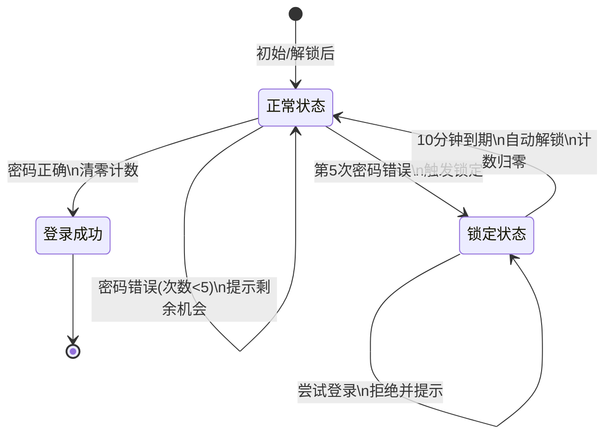

# 删除登录页图形验证码 & 新增登录失败锁定机制 — 产品需求文档（PRD）

## 1. 需求概述

### 1.1 背景与目的

当前系统的所有登录页面（H5 用户端、H5 商家端、Admin 后台）以及修改密码页面均集成了图形验证码功能。经业务评估，图形验证码对用户登录体验造成了一定程度的阻碍，且维护成本较高。为简化登录流程、提升用户体验，决定在所有端统一移除图形验证码，同时引入"登录失败锁定"机制以保障基本的账号安全。

### 1.2 目标用户

| 用户角色 | 使用端 | 说明 |
|---------|-------|------|
| 普通用户 | H5 用户端 | 通过手机浏览器访问的 C 端用户 |
| 商家 | H5 商家端（PC + 移动） | 管理店铺和商品的商家用户 |
| 管理员 | Admin 后台 | 系统运营管理人员 |

### 1.3 核心价值

- **简化登录流程**：去掉图形验证码环节，用户只需输入手机号和密码即可一步登录，降低登录门槛
- **统一体验**：所有端保持一致的登录体验，减少用户认知负担
- **安全兜底**：通过登录失败锁定机制（5 次失败锁定 10 分钟），有效防止暴力破解密码的攻击

---

## 2. 功能需求

### 2.1 功能清单总览

| 编号 | 功能模块 | 功能点 | 优先级 | 说明 |
|------|---------|--------|--------|------|
| F01 | 前端-登录页改造 | H5 用户端登录页移除图形验证码 | P0 | 删除验证码输入框、刷新按钮及相关交互 |
| F02 | 前端-登录页改造 | H5 商家端登录页（PC版）移除图形验证码 | P0 | 同上 |
| F03 | 前端-登录页改造 | H5 商家端登录页（移动版）移除图形验证码 | P0 | 同上 |
| F04 | 前端-登录页改造 | Admin 后台登录页移除图形验证码 | P0 | 同上 |
| F05 | 前端-修改密码页 | 修改密码页面移除图形验证码 | P0 | 删除验证码输入框及相关交互 |
| F06 | 后端-登录接口改造 | 登录接口取消验证码校验 | P0 | 不再要求和校验图形验证码参数 |
| F07 | 后端-修改密码接口改造 | 修改密码接口取消验证码校验 | P0 | 同上 |
| F08 | 后端-登录失败锁定 | 新增登录失败计数与锁定逻辑 | P0 | 5 次失败锁定 10 分钟，账号+IP 双重维度 |
| F09 | 前端-登录失败提示 | 密码错误时提示剩余尝试次数 | P0 | 显示"密码错误，还剩 N 次尝试机会" |
| F10 | 前端-锁定提示 | 账号锁定时的提示信息 | P0 | 显示"账号已被锁定，请 10 分钟后再试" |

### 2.2 功能详细描述

#### F01~F04：登录页移除图形验证码

**涉及页面**：H5 用户端登录页、H5 商家端登录页（PC 版）、H5 商家端登录页（移动版）、Admin 后台登录页

**改造内容**：

- 删除登录表单中的"图形验证码输入框"
- 删除"验证码图片展示区域"
- 删除"点击刷新验证码"按钮或交互
- 前端登录请求不再携带验证码相关参数（如 `captcha_code`、`captcha_key` 等）
- 登录表单布局在移除验证码后需重新调整，确保页面美观

#### F05：修改密码页面移除图形验证码

**改造内容**：

- 删除修改密码流程中的图形验证码输入环节
- 前端修改密码请求不再携带验证码相关参数
- 页面布局调整以适应移除验证码后的表单结构

#### F06~F07：后端接口取消验证码校验

**改造内容**：

- 登录接口：不再校验请求中的图形验证码参数，即使前端传了也忽略
- 修改密码接口：同上
- **后端验证码生成服务和相关代码暂不删除**，保留备用（前端不再调用即可）
- 接口的其他参数校验（手机号格式、密码非空等）保持不变

#### F08：登录失败锁定机制（核心新增功能）

**业务规则详细说明**：

**锁定维度**：

- 以 **手机号 + 客户端 IP** 作为联合维度进行锁定
- 同一手机号在 IP-A 被锁定后，在 IP-B 仍可尝试登录（各自独立计数）
- 同一 IP 上不同手机号的失败计数互不影响

**失败计数规则**：

| 场景 | 计数行为 |
|------|---------|
| 密码输入错误 | 该手机号+IP 的失败次数 +1 |
| 密码输入正确，登录成功 | 该手机号+IP 的失败次数立即清零 |
| 账号被锁定，10 分钟到期自动解锁 | 该手机号+IP 的失败次数完全重置为 0 |
| 锁定期间尝试登录 | 直接拒绝，不增加也不重置失败计数 |

**锁定规则**：

| 规则项 | 说明 |
|-------|------|
| 触发条件 | 同一手机号+IP 累计失败 ≥ 5 次 |
| 锁定时长 | 10 分钟 |
| 解锁方式 | 自然过期，10 分钟后自动解锁，无需用户操作 |
| 锁定级别 | 固定 10 分钟，不做累进加码 |
| 解锁后 | 失败次数完全重置，用户重新获得 5 次尝试机会 |

#### F09：密码错误时的前端提示

**提示规则**：

| 失败次数 | 提示内容 |
|---------|---------|
| 第 1 次 | 密码错误，还剩 4 次尝试机会 |
| 第 2 次 | 密码错误，还剩 3 次尝试机会 |
| 第 3 次 | 密码错误，还剩 2 次尝试机会 |
| 第 4 次 | 密码错误，还剩 1 次尝试机会 |
| 第 5 次 | 触发锁定，切换为锁定提示 |

**提示样式**：

- 以 Toast 消息或表单顶部错误提示区域展示
- 文字颜色为醒目的警告色（如红色/橙色）

#### F10：账号锁定时的前端提示

**提示内容**：`账号已被锁定，请 10 分钟后再试`

**触发场景**：

- 第 5 次密码输入错误时，立即显示此提示
- 锁定期间用户再次尝试登录时，直接显示此提示

**提示样式**：

- 与密码错误提示使用相同的展示区域
- 不显示倒计时，只提示固定的"10 分钟后再试"

---

## 3. 页面/界面设计

### 3.1 页面结构与导航

本次改造涉及的页面均为已有页面，不新增页面，只做表单元素的删减和提示信息的调整。

### 3.2 各页面功能说明

#### 3.2.1 登录页面（所有端统一）

**改造前元素**：

- 手机号输入框
- 密码输入框
- 图形验证码输入框 ← **删除**
- 图形验证码图片 ← **删除**
- 刷新验证码按钮 ← **删除**
- 登录按钮
- 忘记密码链接
- 其他辅助链接

**改造后元素**：

- 手机号输入框
- 密码输入框
- 登录按钮
- 忘记密码链接
- 其他辅助链接
- **新增**：错误提示区域（用于显示密码错误提示和锁定提示）

#### 3.2.2 修改密码页面

**改造内容**：

- 移除图形验证码相关的输入框和图片
- 保留其他所有表单元素不变
- 页面布局微调以适应删减后的结构

---

## 4. 非功能性需求

### 4.1 性能要求

| 指标 | 要求 |
|------|------|
| 登录接口响应时间 | 移除验证码校验后，响应时间应更快或持平，不得因新增锁定逻辑而明显变慢 |
| 失败计数查询 | 每次登录请求的锁定状态查询应在 50ms 内完成 |
| 并发处理 | 同一账号+IP 的并发登录请求需正确处理计数，避免竞态条件 |

### 4.2 安全要求

| 要求项 | 说明 |
|-------|------|
| 防暴力破解 | 通过 5 次失败锁定 10 分钟机制实现基本防护 |
| IP 获取准确性 | 需正确获取客户端真实 IP（考虑反向代理、CDN 等场景的 `X-Forwarded-For` 头处理） |
| 计数数据安全 | 失败计数和锁定状态数据不可被客户端篡改 |
| 后端验证码代码 | 保留但前端不再调用，确保不存在未移除的暗调用 |

### 4.3 兼容性要求

- 所有端（H5 用户端、H5 商家端 PC/移动、Admin 后台）行为完全一致
- 已登录用户不受本次改造影响，只有下次重新登录时才走新流程
- 现有登录态（Token / Session）机制保持不变

---

## 5. 业务规则与约束

### 5.1 登录失败计数规则汇总

### 5.2 核心业务规则

1. **锁定维度**：手机号 + 客户端 IP 的组合作为唯一标识
2. **失败阈值**：5 次
3. **锁定时长**：10 分钟，固定不累进
4. **解锁方式**：自然过期，自动解锁
5. **解锁后计数**：完全重置为 0
6. **登录成功**：立即清零该组合的失败计数
7. **锁定期内行为**：拒绝登录，返回锁定提示，不增减计数
8. **所有端一致**：H5 用户端、H5 商家端、Admin 后台执行完全相同的规则

### 5.3 后端存储建议

- 失败计数和锁定状态建议使用 **Redis** 存储（如项目中已有 Redis）
- Key 设计示例：`login:fail:{phone}:{ip}` → 值为失败次数，设置 TTL 为 10 分钟
- 锁定 Key 示例：`login:lock:{phone}:{ip}` → 值为锁定时间戳，TTL 为 10 分钟
- 利用 Redis TTL 自动实现"10 分钟到期自动解锁 + 计数归零"

---

## 6. 权限设计

本次改造不涉及新的权限变更。

| 角色 | 权限说明 |
|------|---------|
| 所有用户 | 登录流程统一改造，无角色差异 |
| 已登录用户 | 不受影响，无需重新登录 |

---

## 7. 异常处理与边界情况

| 编号 | 场景 | 处理方式 |
|------|------|---------|
| E01 | 用户输入的手机号不存在 | 按现有逻辑处理（通常提示"手机号或密码错误"），不计入失败次数 |
| E02 | Redis 服务不可用 | 降级处理：跳过锁定检查，允许正常登录（确保核心登录功能不因锁定服务故障而完全不可用） |
| E03 | 并发登录请求竞态 | 使用 Redis 原子操作（如 INCR）确保计数准确 |
| E04 | IP 地址获取失败 | 使用默认值"unknown"作为 IP，此时退化为仅按手机号维度锁定 |
| E05 | 用户在锁定期间频繁刷新页面 | 前端展示锁定提示即可，不产生额外的后端请求负担（前端可做本地缓存判断） |
| E06 | 锁定期间通过其他 IP 登录成功 | 不影响原 IP 的锁定状态，原 IP 仍需等 10 分钟解锁 |
| E07 | 修改密码成功后 | 不影响登录失败计数（两者独立） |

---

## 8. 补充说明

### 8.1 改造范围确认

| 项目 | 是否改造 | 说明 |
|------|---------|------|
| H5 用户端登录页 | ✅ 是 | 删除验证码 + 新增锁定机制 |
| H5 商家端登录页（PC） | ✅ 是 | 同上 |
| H5 商家端登录页（移动） | ✅ 是 | 同上 |
| Admin 后台登录页 | ✅ 是 | 同上 |
| 修改密码页面 | ✅ 是 | 仅删除验证码 |
| 后端验证码生成服务代码 | ❌ 否 | 保留不删，前端不再调用即可 |

### 8.2 接口变更摘要

| 接口 | 变更说明 |
|------|---------|
| 登录接口 | 移除 `captcha_code`、`captcha_key` 参数的必填校验；新增失败计数和锁定逻辑；响应体新增 `remaining_attempts` 字段（密码错误时返回） |
| 获取验证码接口 | 前端不再调用，接口本身保留不删 |
| 修改密码接口 | 移除验证码参数的必填校验 |

### 8.3 对已登录用户的影响

- 本次改造上线后，**已登录用户完全不受影响**
- 现有登录态（Token / Session）保持有效
- 用户在下次主动退出或 Token 过期后重新登录时，才会走新的无验证码登录流程
