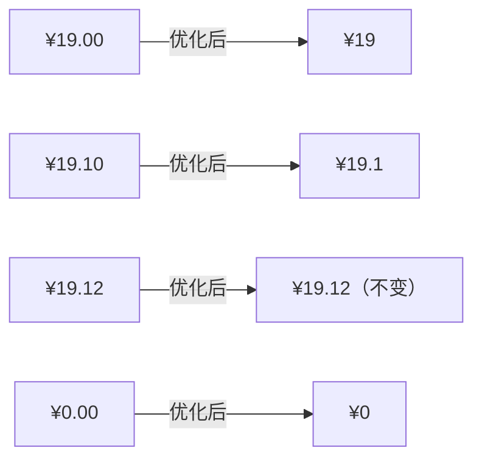
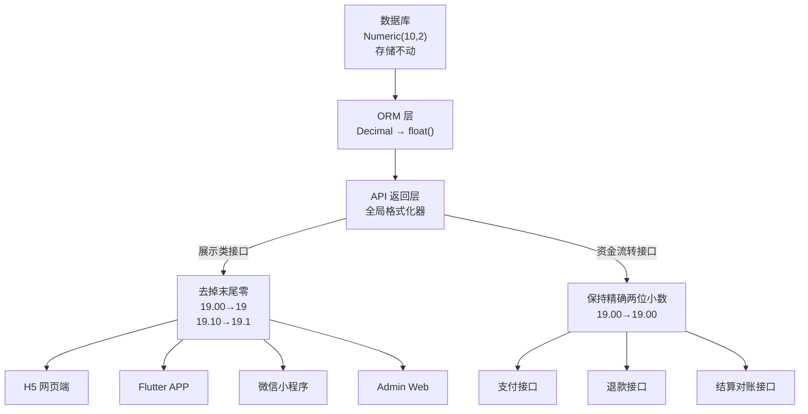
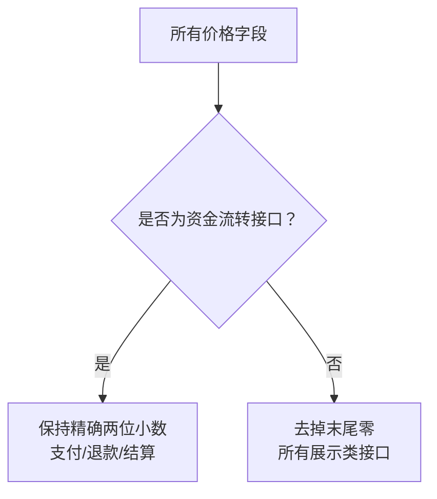
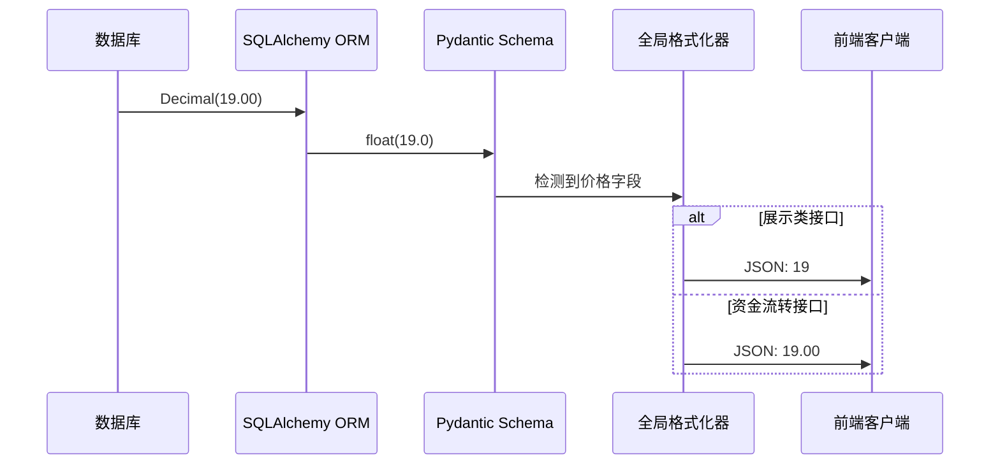

# 前端价格显示优化 产品需求文档（PRD）

## 1. 需求概述

### 1.1 背景与目的

当前 bini-health 健康管理系统中，所有价格字段在前端展示时均保留两位小数（如 `¥19.00`、`¥19.10`），导致价格看起来冗长且不够简洁。用户反馈价格末尾的零影响阅读体验，希望进行优化。

本次需求的目标是：**去掉价格小数点后面多余的零**，让价格展示更简洁清爽，提升全端用户体验。



### 1.2 目标用户

- **C 端用户**：通过 H5 网页、Flutter APP、微信小程序访问系统的终端消费者
- **B 端管理员**：通过 Admin Web 管理后台操作的运营管理人员

### 1.3 核心价值

| 价值维度 | 说明 |
|----------|------|
| 用户体验 | 价格更简洁易读，减少视觉噪音 |
| 一致性 | 全端统一处理，避免各端展示差异 |
| 可维护性 | 后端统一格式化，一处修改全端生效 |

### 1.4 优先级与上线时间

- **优先级**：紧急
- **期望**：尽快上线
- 本系统将基于小白 AI 进行自动化开发，所有功能在一个版本内完成并一次性上线

---

## 2. 功能需求

### 2.1 功能清单总览

| 编号 | 功能模块 | 功能点 | 优先级 | 说明 |
|------|----------|--------|--------|------|
| F01 | 后端全局格式化器 | API 返回层统一去掉价格字段末尾零 | P0 | 核心功能，全端依赖 |
| F02 | 资金流转接口豁免 | 支付/退款/结算接口保持精确两位小数 | P0 | 资金安全保障 |
| F03 | H5 网页端适配 | 验证并确保 H5 端价格显示正常 | P0 | 用户端覆盖 |
| F04 | Flutter APP 端适配 | 验证并确保 Flutter 端价格显示正常 | P0 | 用户端覆盖 |
| F05 | 微信小程序端适配 | 验证并确保小程序端价格显示正常 | P0 | 用户端覆盖 |
| F06 | Admin Web 端适配 | 验证并确保管理后台价格显示正常 | P0 | 管理端覆盖 |

### 2.2 功能详细描述

#### F01：后端全局格式化器

**目标**：在 FastAPI 的 JSON 序列化返回层，统一对所有价格类型的 `float` 字段去掉末尾多余的零。

**格式化规则**：

| 原始值 | 格式化后 | 说明 |
|--------|----------|------|
| 19.00 | 19 | 整数，去掉 `.00` |
| 19.10 | 19.1 | 去掉末尾的 `0` |
| 19.12 | 19.12 | 无多余零，保持不变 |
| 0.00 | 0 | 零值，去掉 `.00` |
| 0.50 | 0.5 | 去掉末尾的 `0` |
| 100.00 | 100 | 整数，去掉 `.00` |

**实现方式**：后端统一加全局格式化器，在 API 返回层处理，格式化后以**数字形式**返回（JSON 中是 `19` 而非 `"19"`）。

**涉及的价格字段清单**：

| 模块 | 字段名 |
|------|--------|
| 商品 | `sale_price`、`original_price`、`points` |
| SKU | `sale_price`、`origin_price` |
| 订单 | `total_amount`、`paid_amount`、`coupon_discount` |
| 订单项 | `product_price`、`subtotal` |
| 退款（展示接口） | `refund_amount` |
| 服务项目 | `price`、`original_price` |
| 优惠券 | `condition_amount`、`discount_value` |
| 结算（展示接口） | `settlement_amount` |
| 到店记录 | `consumption_amount` |



#### F02：资金流转接口豁免

**目标**：涉及真实资金流转的接口，保持价格精确到分（两位小数），不做格式化。

**豁免接口范围**：

| 接口类型 | 说明 | 豁免原因 |
|----------|------|----------|
| 支付下单接口 | 微信支付、支付宝等第三方支付对接 | 支付平台要求金额精确到分 |
| 退款接口 | 退款操作的金额字段 | 退款金额必须与支付金额精确匹配 |
| 结算对账接口 | 商户结算、平台对账 | 财务对账需要精确金额 |

**规则**：以上接口中的金额字段继续保持 `Numeric(10,2)` → `float` 的原有精度，不经过全局格式化器处理。

#### F03-F06：各端适配验证

由于格式化在后端统一完成，各端（H5、Flutter、小程序、Admin Web）理论上**无需代码修改**，只需验证以下场景：

**验证清单**：

| 验证项 | 验证内容 |
|--------|----------|
| 商品列表页 | 价格显示是否正常去掉末尾零 |
| 商品详情页 | 售价、原价显示是否正常 |
| 购物车页 | 单价、小计、总价显示是否正常 |
| 订单确认页 | 商品价格、优惠金额、应付金额显示是否正常 |
| 订单列表页 | 订单金额显示是否正常 |
| 订单详情页 | 各项金额显示是否正常 |
| 支付页面 | 支付金额显示是否正常 |
| 优惠券页面 | 满减条件、优惠金额显示是否正常 |
| 服务项目页 | 服务价格、原价显示是否正常 |
| 管理后台商品管理 | 商品列表、编辑页的价格显示是否正常 |
| 管理后台订单管理 | 订单列表、详情页的金额显示是否正常 |
| 管理后台数据统计 | 营收、金额类统计数据显示是否正常 |

**特别注意**：如果前端有自行对价格做 `.toFixed(2)` 等强制格式化处理的地方，需要一并移除，否则会与后端格式化冲突（后端返回 `19`，前端又格式化为 `19.00`）。

---

## 3. 页面/界面设计

### 3.1 页面结构与导航

本需求不涉及页面结构或导航变更，仅影响页面内价格文本的显示格式。

### 3.2 各页面价格显示效果对比

以下为各类场景的优化前后对比：

| 场景 | 优化前 | 优化后 |
|------|--------|--------|
| 商品列表 — 售价 | ¥19.00 | ¥19 |
| 商品列表 — 原价（划线价） | ~~¥39.00~~ | ~~¥39~~ |
| 商品详情 — 售价 | ¥19.10 | ¥19.1 |
| 商品详情 — 原价 | ~~¥39.00~~ | ~~¥39~~ |
| 购物车 — 单价 | ¥19.00 × 2 | ¥19 × 2 |
| 购物车 — 小计 | ¥38.00 | ¥38 |
| 订单 — 商品金额 | ¥38.00 | ¥38 |
| 订单 — 优惠金额 | -¥5.00 | -¥5 |
| 订单 — 实付金额 | ¥33.00 | ¥33 |
| 优惠券 — 满减条件 | 满¥50.00可用 | 满¥50可用 |
| 优惠券 — 优惠面额 | ¥10.00 | ¥10 |
| 服务项目 — 价格 | ¥199.00 | ¥199 |
| 零元价格 | ¥0.00 | ¥0 |

### 3.3 货币符号与样式

- 货币符号 `¥` 保持现有样式不变
- 仅对数字部分做末尾零的去除
- 字体大小、颜色、粗细等视觉样式均保持不变

---

## 4. 非功能性需求

### 4.1 性能要求

- 格式化逻辑在 API 序列化层完成，不应增加明显的接口响应延迟
- 单次格式化操作的耗时应控制在微秒级，对整体性能无感知影响

### 4.2 安全要求

- 资金流转类接口（支付、退款、结算）**严禁**参与格式化，确保金额精度不受影响
- 数据库存储层保持 `Numeric(10,2)` 不动，确保数据精度不丢失

### 4.3 兼容性要求

| 端 | 技术栈 | 兼容性要求 |
|----|--------|-----------|
| H5 网页端 | Next.js + React | 适配主流浏览器（Chrome、Safari、微信内置浏览器） |
| Flutter APP | Flutter | 适配 Android 5.0+ / iOS 12.0+ |
| 微信小程序 | 原生小程序 | 适配微信基础库 2.0+ |
| Admin Web | Next.js + React + Ant Design | 适配 Chrome 最新版 |

---

## 5. 业务规则与约束

### 5.1 核心格式化规则

```
规则：去掉价格数字末尾的多余零

输入 → 输出：
  19.00  → 19
  19.10  → 19.1
  19.12  → 19.12（不变）
  0.00   → 0
  0.50   → 0.5
  100.00 → 100
```

### 5.2 格式化作用范围



### 5.3 数据层约束

| 层级 | 处理方式 | 说明 |
|------|----------|------|
| 数据库 | 不动 | 继续以 `Numeric(10,2)` 精确存储 |
| ORM 层 | 不动 | 继续以 `Decimal` → `float()` 转换 |
| Pydantic Schema 层 | 不动 | 字段类型保持 `float` |
| API 序列化层 | **新增格式化** | 在 JSON 序列化时去掉末尾零 |

### 5.4 零值处理

- 当价格为 0 时（如 `0.00`），格式化后显示为 `0`
- 不需要替换为"免费"等文案，保持数字展示

---

## 6. 权限设计

本需求不涉及权限变更。格式化逻辑在 API 层全局生效，对所有角色一视同仁：

| 角色 | 影响 |
|------|------|
| 普通用户（C 端） | 所有展示类接口返回格式化后的价格 |
| 管理员（B 端） | 所有展示类接口返回格式化后的价格 |
| 系统内部（支付/退款/结算） | 保持精确两位小数，不受格式化影响 |

---

## 7. 异常处理与边界情况

| 场景 | 处理方式 |
|------|----------|
| 价格为 `null` 或不存在 | 不做格式化，保持原有的 `null` 处理逻辑 |
| 价格为 0（`0.00`） | 格式化为 `0` |
| 价格为负数（如退款 `-5.00`） | 格式化为 `-5`，负号保留 |
| 价格小数位无多余零（`19.12`） | 不做任何处理，保持原样 |
| 非价格的 `float` 字段 | 格式化器仅作用于已明确标识为价格的字段，不影响其他 `float` 字段（如评分、重量等） |
| 前端有 `.toFixed(2)` 硬编码 | 需排查并移除，避免与后端格式化冲突 |

---

## 8. 技术实现方案概要

### 8.1 后端实现思路

在 FastAPI 的响应模型序列化环节，为所有已标识的价格字段添加自定义序列化器：



### 8.2 前端排查要点

各端需排查是否存在以下会导致格式化失效的代码：

- `.toFixed(2)` — 强制保留两位小数
- `Number.prototype.toLocaleString()` 配置了固定小数位
- 模板中硬编码的价格格式化函数
- CSS 中与数字宽度相关的固定样式（可能因数字位数变化而错位）

---

## 9. 补充说明

### 9.1 改动影响评估

| 影响维度 | 评估 |
|----------|------|
| 后端改动范围 | API 序列化层新增全局格式化器，改动集中且可控 |
| 前端改动范围 | 理论上无需改动，需验证并移除可能的 `.toFixed(2)` |
| 数据库影响 | 无 |
| 第三方对接影响 | 无（支付/退款/结算接口已豁免） |
| 风险等级 | **低风险** — 仅影响数字展示格式，不涉及业务逻辑变更 |

### 9.2 回归测试要点

1. 全端价格显示验证（H5、Flutter、小程序、Admin Web）
2. 支付流程端到端验证（确保支付金额精确到分）
3. 退款流程验证（确保退款金额精确）
4. 结算对账验证（确保对账金额精确）
5. 价格为 0 的商品/服务展示验证
6. 有小数的价格（如 `19.12`）展示验证
