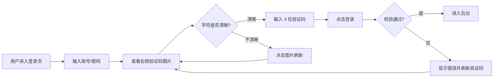

# bini-health 后台四项体验优化 产品需求文档（PRD）

> 文档版本：v1.0  
> 创建时间：2026-04-25 22:22  
> 适用项目：bini-health  
> 影响端：admin（平台后台）/ 商家 PC 后台 / 商家 H5 后台 / 后端 API

---

## 1. 需求概述

### 1.1 背景与目的

近期生产环境用户走查中，针对**登录页验证码、商家账号管理、修改密码页**三个高频功能反馈了 4 项体验与功能缺陷，集中表现为：

- 验证码字符过小，影响识别效率；
- 商家账号管理缺少 DELETE 接口，删除直接报 405 错误；
- 商家账号列表"角色"列口径错误，且产品定位本身需要收敛为"只展示老板"；
- 修改密码页存在与实时校验提示重复的冗余说明文案。

本次优化目标是一次性修复上述 4 项问题，使后台账号体系的产品口径、视觉清晰度、操作流畅度全面达标。

### 1.2 目标用户

| 用户角色 | 说明 |
|---|---|
| 平台运营人员 | 使用 admin 后台进行商家管理 |
| 商家老板 | 使用商家 PC 后台 / H5 后台管理自家业务 |
| 商家员工 | 使用商家 H5 后台执行核销、巡店等任务 |

### 1.3 核心价值

- **看得清**：验证码字号显著放大，降低误识别率；
- **改得动**：商家账号删除功能补齐，老板/员工区别处理；
- **看得准**：admin 商家账号列表只展示老板，口径与业务定位一致；
- **不啰嗦**：修改密码页移除冗余文案，保留实时校验提示即可。

---

## 2. 功能需求

### 2.1 功能清单总览

| 编号 | 功能模块 | 功能点 | 优先级 | 影响端 |
|---|---|---|---|---|
| F-01 | 登录图形验证码 | 字号放大到 48px（画布尺寸不变） | P0 | admin / 商家 PC / 商家 H5 |
| F-02 | 商家账号管理 | 补齐 DELETE 接口，老板禁删、员工软删 | P0 | admin（前后端） |
| F-03 | 商家账号列表 | 列表只展示老板账号；6399 数据回滚为 owner | P0 | admin（前后端 + 数据） |
| F-04 | 修改密码页 | 移除顶部冗余说明，保留实时校验提示 | P1 | admin / 商家 PC / 商家 H5 |

### 2.2 功能详细描述

---

#### F-01：登录图形验证码字号放大

**改造范围**：admin 后台、商家 PC 后台、商家 H5 后台**三端登录页**统一改造。

**详细要求**：

| 项 | 现状 | 调整后 |
|---|---|---|
| 画布尺寸 | 160 × 60 | **160 × 60（保持不变）** |
| 字符字号 | 38px | **48px** |
| 字符数量 | 4 位 | 4 位（不变） |
| 字符旋转 | ±15° | ±10°（轻微收敛，避免大字旋转后裁切） |
| 字符间距 | 当前默认 | **同步加宽**，确保 48px 字号下 4 位字符不粘连、不溢出 |
| 干扰曲线 | 2~3 条 | **降至 1~2 条**，减少对大字的视觉干扰 |
| 噪点密度 | 当前默认 | **略降**，提升大字辨识度 |
| 字符颜色对比度 | ≥ 4.5:1 | ≥ 4.5:1（不变） |
| 渲染清晰度 | 标准像素 | **支持 Retina/高 DPI 二倍图**渲染，避免缩放糊化 |

**业务规则**：

- 字号 48px 是 60px 画布高度下的物理上限，再大会触发上下边界裁切；
- 三端**必须同步发布**，避免不同端验证码视觉风格不一致。

**前端展示**：

- 验证码图片在登录页的展示容器尺寸保持与画布等比，不得做 CSS 拉伸（保证清晰度）；
- 点击验证码图片刷新一张新验证码（保留原有交互）。

---

#### F-02：商家账号管理 DELETE 接口

**问题定位**：当前点击"删除商家账号"按钮，后端响应 `405 Method Not Allowed`，原因是 DELETE 路由根本未实现。

**接口设计**：

```
DELETE /api/admin/merchant-accounts/{id}
```

**业务规则**：

| 账号类型 | 删除策略 | 提示文案 |
|---|---|---|
| 老板（owner） | **禁止删除** | "老板账号不可删除，如需停用请使用『停用』功能或先转移老板身份" |
| 员工（store_manager / cashier / finance / staff） | **软删除** | 删除前二次确认；删除后失效该账号所有登录态 |

**软删除细节**：

- 数据库不做物理删除，仅置 `is_deleted=1` + `deleted_at=NOW()`；
- 主动失效该账号在 Redis / JWT 黑名单中的所有 token，已登录会话立即下线；
- 保留所有业务外键（核销流水、操作日志、订单关联人等）的引用完整性，便于历史追溯。

**关联数据校验**：

- 若被删账号名下存在未完成的核销记录或操作流水，提示用户："该账号尚有 N 条未完成业务，是否仍要删除？"
- 用户确认后允许强制删除（管理员权限）。

**前端要求**：

- 删除按钮点击后弹出二次确认框：「确认删除账号 XXX？此操作不可恢复，已登录会话将立即下线。」；
- 把 4xx / 5xx 错误码统一翻译成中文提示，**严禁**直接展示 `Method Not Allowed`、`Internal Server Error` 等英文原文；
- 删除成功后列表自动刷新，移除被删行。

---

#### F-03：商家账号列表只展示老板 + 6399 数据修正

**产品定位调整（核心变化）**：

> admin → 商家管理 → 商家账号 列表，**仅展示每家商家的老板账号**，每家商家原则上一条记录。员工账号完全不在 admin 这里管理，员工只在商家端 PC / H5 自己的"员工管理"模块里维护。

**修改点 1：列表查询口径**

- 后端列表接口 `GET /api/admin/merchant-accounts` 增加过滤条件：`WHERE role = 'owner' AND is_deleted = 0`；
- 列表"角色"列固定显示为"**老板**"（因为已经过滤掉非 owner，不再需要显示真实 role 字段）；
- 列表数量统计、分页、搜索、排序均基于过滤后结果。

**修改点 2：数据修正（一次性脚本）**

| 账号 | 现状 | 期望状态 | 处理 |
|---|---|---|---|
| 6399 | role 字段被错设为 `store_manager`（店长） | role = `owner`（老板） | 一次性 SQL 修正 |
| 6366 | role = 员工（数据本身正确） | role = 员工（不动） | 无需修改 |

**修正脚本要求**：

- SQL 必须在事务中执行，先 `SELECT` 校验"该商家下没有其他 owner"再 `UPDATE`；
- 执行前后均打印日志（账号 ID、原 role、新 role、商家 ID）；
- 已确认 6399 所属商家**不存在**其他 owner，可直接修正，无需走人工核对。

**修改点 3：前端展示**

- 列表"角色"列直接固定文案"老板"，不再调用 role 字段做映射；
- 6366（员工）从 admin 列表中**自动消失**（被 WHERE 过滤）；
- 列表标题区域增加一行说明文字："本列表仅展示商家老板账号，员工账号请在商家端自行管理。"

**潜在副作用与处理**：

- admin 此前的"添加账号"入口若允许添加员工，则需同步限制为只允许添加 owner（或保留但仅展示新增的 owner）；
- 若 admin 此前对员工账号有"启用/停用/重置密码"操作入口，本次一并隐藏（因为员工已不在 admin 范围）。

---

#### F-04：修改密码页移除冗余提示

**改造范围**：

| 端 | 页面 |
|---|---|
| admin 后台 | 修改密码页 |
| 商家 PC 后台 | 修改密码页 |
| 商家 H5 后台 | 修改密码页 |
| 商家 H5 后台 | 强制改密页（首次登录强制修改） |

**改动**：

- **删除**页面顶部/输入框上方那条总说明文字："密码至少 8 位，须同时包含字母和数字"；
- **保留**输入框下方的实时校验提示（输入时根据规则实时显示红/绿小字，例如"✓ 已包含字母"、"✗ 至少 8 位"等）。

**校验规则保持不变**：

- 长度 ≥ 8；
- 必须同时包含字母和数字；
- 校验失败时，提交按钮禁用 + 实时提示标红。

---

## 3. 页面/界面设计

### 3.1 登录页（三端通用）



**关键变化点**：验证码图片中字符明显增大（38px → 48px），用户无需眯眼辨认。

---

### 3.2 admin 商家账号列表页

**页面结构**：

```
┌─────────────────────────────────────────────────────────────┐
│ 商家管理 / 商家账号                                         │
├─────────────────────────────────────────────────────────────┤
│ ⓘ 本列表仅展示商家老板账号，员工账号请在商家端自行管理。     │
├─────────────────────────────────────────────────────────────┤
│ [搜索账号/商家]  [+ 新增老板账号]                           │
├──────┬──────────┬────────┬────────┬──────────┬─────────────┤
│ 账号 │ 商家名称 │ 角色   │ 状态   │ 创建时间 │ 操作        │
├──────┼──────────┼────────┼────────┼──────────┼─────────────┤
│ 6399 │ XX 商家  │ 老板   │ 正常   │ ...      │ 编辑 停用 删除 │
└──────┴──────────┴────────┴────────┴──────────┴─────────────┘
```

**关键变化点**：

- 列表只剩 owner 行，6366 等员工账号不再出现；
- 角色列固定显示"老板"；
- 删除按钮点击后正常工作（不再 405），但点击老板的"删除"会弹出"老板账号不可删除"提示。

---

### 3.3 商家账号删除二次确认弹窗

```
┌─────────────────────────────────────┐
│ ⚠ 确认删除                          │
├─────────────────────────────────────┤
│ 确认删除账号 XXX？                  │
│ 此操作不可恢复，已登录会话将立即下线。│
├─────────────────────────────────────┤
│              [取消]  [确认删除]     │
└─────────────────────────────────────┘
```

> 说明：本次因列表只剩 owner，正常路径下点删除会被后端拦截提示"老板账号不可删除"。员工删除入口在商家端 PC/H5 的员工管理页（不在本次 admin 改造范围内，但 DELETE 接口需要支持员工软删，便于商家端调用）。

---

### 3.4 修改密码页（三端通用）

**改造前**：

```
┌─────────────────────────────────────┐
│ 修改密码                            │
│ ⓘ 密码至少 8 位，须同时包含字母和数字 ← 删除这条
├─────────────────────────────────────┤
│ 原密码   [____________]             │
│ 新密码   [____________]             │
│         ✗ 至少 8 位                 │
│         ✗ 包含字母                  │
│         ✗ 包含数字                  │
│ 确认密码 [____________]             │
└─────────────────────────────────────┘
```

**改造后**：

```
┌─────────────────────────────────────┐
│ 修改密码                            │
├─────────────────────────────────────┤
│ 原密码   [____________]             │
│ 新密码   [____________]             │
│         ✓ 至少 8 位                 │
│         ✓ 包含字母                  │
│         ✗ 包含数字                  │
│ 确认密码 [____________]             │
│         [    确认修改    ]          │
└─────────────────────────────────────┘
```

---

## 4. 非功能性需求

### 4.1 性能要求

- 验证码生成接口单次响应 ≤ 200ms（受字号放大影响极小）；
- DELETE 接口单次响应 ≤ 500ms（含 token 失效与级联校验）；
- 商家账号列表查询单次响应 ≤ 500ms（增加 WHERE 过滤后预期更快）。

### 4.2 安全要求

- DELETE 接口必须校验当前操作者具备 admin 权限（platform_admin 或 super_admin）；
- 软删除时主动失效被删账号的所有 token，避免删除后旧 token 仍可访问；
- 数据修正脚本必须在事务中执行，失败回滚。

### 4.3 兼容性要求

- 验证码图片在 Chrome / Edge / Safari / 微信浏览器 / 主流移动端浏览器均能清晰显示；
- 修改密码页的实时校验提示在低端 Android 设备 webview 上能正常渲染；
- DELETE 接口对历史数据兼容，已存在的脏数据不会导致接口报错。

---

## 5. 业务规则与约束

| 规则编号 | 规则内容 |
|---|---|
| R-01 | 一家商家在系统中**只允许有 1 个 owner**，新增/修正时必须做唯一性校验 |
| R-02 | owner 账号不可被任何人（包括平台 admin）通过 DELETE 接口删除，需走"停用"或"老板转移"流程 |
| R-03 | 员工账号删除一律采用**软删除**，物理数据保留，便于追溯 |
| R-04 | admin → 商家账号列表仅展示 `role=owner` 的账号，**不展示员工** |
| R-05 | 验证码字符 4 位、字号 48px、画布 160×60 为本期固定参数，三端必须一致 |
| R-06 | 修改密码校验规则：长度 ≥ 8 + 必须包含字母 + 必须包含数字（规则不变，仅展示文案精简） |

---

## 6. 权限设计

| 角色 | 验证码登录 | 商家账号列表 | 删除老板账号 | 删除员工账号 | 修改密码 |
|---|---|---|---|---|---|
| 平台超管（super_admin） | ✓ | ✓ 查看所有 | ✗ 拒绝 | ✓ 软删 | ✓ 自己 |
| 平台管理员（platform_admin） | ✓ | ✓ 查看所有 | ✗ 拒绝 | ✓ 软删 | ✓ 自己 |
| 商家老板（owner） | ✓ | ✗ 无入口 | ✗ 无入口 | ✓ 自己商家的员工 | ✓ 自己 |
| 商家员工（staff/cashier/...） | ✓ | ✗ 无入口 | ✗ 无入口 | ✗ 无入口 | ✓ 自己 |

---

## 7. 异常处理与边界情况

| 场景 | 系统行为 |
|---|---|
| 验证码刷新过快（1s 内 >5 次） | 沿用现有 IP 限流策略，返回"请稍后再试" |
| 删除老板账号 | 后端返回 403 + 中文文案"老板账号不可删除……"，前端弹 toast |
| 删除已被删除的账号（重复删除） | 后端返回 404 + "账号不存在或已删除"，前端列表自动刷新 |
| 删除接口请求时 token 失效 | 返回 401，前端跳回登录页 |
| 6399 数据修正后该商家出现 ≥2 个 owner（极端兜底） | 修正脚本预校验拦截，输出告警日志，本次不修正，转人工 |
| 修改密码时新密码不满足规则 | 提交按钮禁用，输入框下方实时红字提示具体未满足项 |
| admin 列表过滤后某商家 0 个 owner（数据异常） | 该商家不出现在列表中，平台运营可在后台运维工具排查 |

---

## 8. 补充说明

### 8.1 与近期已上线功能的关系

- **2026-04-25 后台登录页改造为 4 位图形验证码**：本次 F-01 是在该改造基础上的字号微调，画布尺寸保持不变，仅调整渲染参数；
- **AI 报告解读链路 4 个 Bug 修复**：与本次需求无依赖关系，独立发布。

### 8.2 数据修正回滚预案

6399 的 role 字段修正前：

```sql
-- 备份
SELECT id, account, role, merchant_id FROM users WHERE account = '6399';
-- 假设备份结果：role = 'store_manager'

-- 修正
UPDATE users SET role = 'owner', updated_at = NOW() WHERE account = '6399';

-- 回滚（如需）
UPDATE users SET role = 'store_manager', updated_at = NOW() WHERE account = '6399';
```

### 8.3 验收清单

| 验收项 | 预期结果 |
|---|---|
| admin 登录页验证码字号 | 字符肉眼明显比改造前大，4 位字符清晰可辨 |
| 商家 PC 登录页验证码 | 同 admin |
| 商家 H5 登录页验证码 | 同 admin，移动端清晰 |
| admin 商家账号列表 | 只看到老板账号，6366 不再出现，6399 显示"老板" |
| 删除一个员工账号（接口层验证） | 返回 200，软删成功，登录态失效 |
| 删除一个老板账号 | 返回 403 + 中文文案，前端弹提示 |
| admin 修改密码页 | 顶部无"密码至少 8 位……"说明，输入时实时校验正常 |
| 商家 PC 修改密码页 | 同 admin |
| 商家 H5 修改密码页 + 强制改密页 | 同 admin |

### 8.4 上线方式

所有 4 项需求一次性开发完毕、统一回归、统一发布。后端 + 三端前端同步部署到 bini-health 测试服务器，验证通过后给出验证链接。

---

> **备注**：本 PRD 锁定本次优化的最终方案，开发阶段如发现技术细节需要微调，将以本文为基准做最小变更并同步说明。
