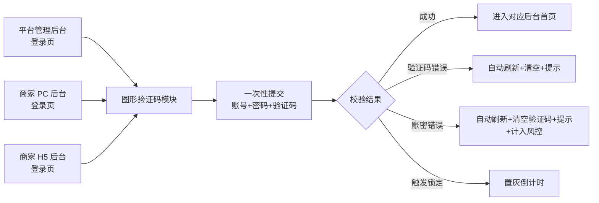
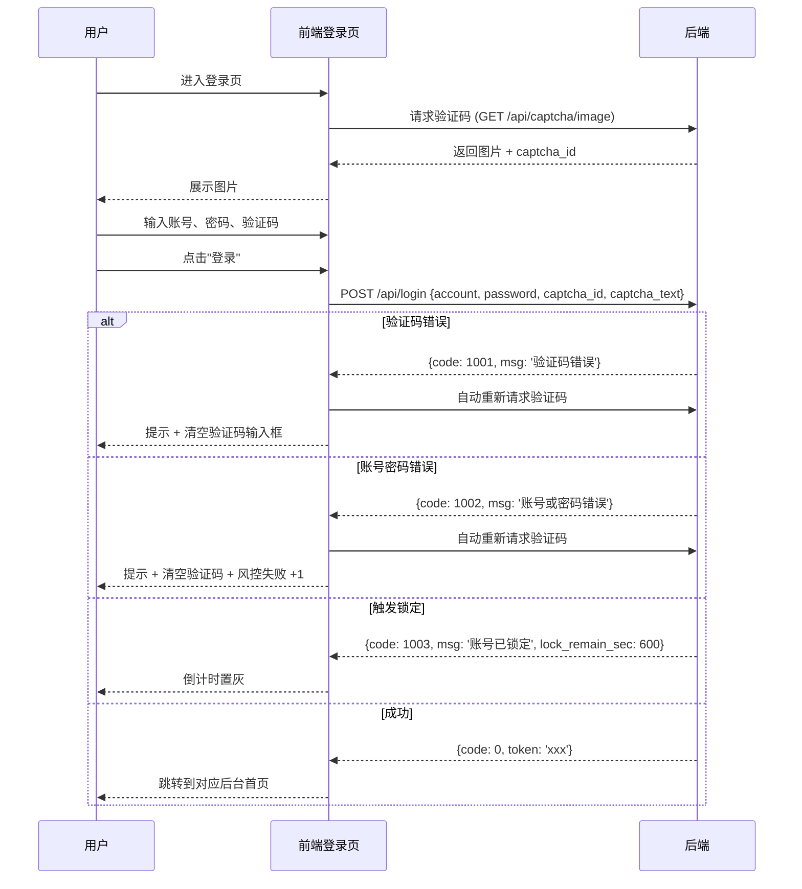

# 后台登录图形验证码改造 产品需求文档（PRD）

> 文档版本：v1.0
> 编制日期：2026-04-25
> 编制人：小白 AI（产品经理）

---

## 1. 需求概述

### 1.1 背景与目的

当前项目下属的三个后台登录入口（**平台管理后台、商家 PC 后台、商家 H5 后台**）目前统一使用**滑块拼图验证码**作为登录前的人机校验方案。

实际使用中存在以下问题：

- 滑块验证码在部分浏览器、低端机型与触屏设备上拖动手感不一致，老年用户和操作不熟练用户难以一次完成
- 滑块校验依赖前端动画与后端轨迹比对，链路较长，登录耗时偏高
- 早期版本曾使用过的"4 位字符 + 干扰线"图形验证码，因图片尺寸过小、字号偏小，存在**看不清**的痛点

为改善登录体验、降低登录门槛、同时保持必要的安全防护，本次将**滑块验证码统一替换为放大版的字符图形验证码**，并配套保留登录失败风控策略。

### 1.2 目标用户

| 用户角色 | 使用入口 | 典型特征 |
|---|---|---|
| 平台运营 / 超级管理员 | 平台管理后台登录页 | PC 端为主，对验证码识别能力较强 |
| 商家 PC 端用户 | 商家 PC 后台登录页 | PC 端为主，年龄跨度大，含中老年商家 |
| 商家 H5 端用户 | 商家 H5 后台登录页 | 移动端浏览器，屏幕较小，操作环境复杂（强光、弱网、抖动） |

### 1.3 核心价值

- **更易识别**：通过加大图片尺寸、加大字号、放大字符间距，显著降低识别难度
- **更易输入**：取消滑动手势，仅需键盘/小键盘输入 4 位字符，对各年龄层用户都友好
- **链路更短**：单次提交即完成校验，登录耗时下降
- **安全可控**：保留账号风控（同 IP / 同手机号 5 分钟失败 5 次锁定 10 分钟），守住安全底线

---

## 2. 功能需求

### 2.1 功能清单总览

| 编号 | 功能模块 | 功能点 | 优先级 | 说明 |
|------|----------|--------|--------|------|
| F-01 | 验证码生成 | 字符图形验证码生成（4 位大写字母+数字组合） | P0 | 后端生成图片与会话标识 |
| F-02 | 验证码校验 | 图形验证码校验（不区分大小写） | P0 | 与登录请求一次性提交 |
| F-03 | 验证码刷新 | 点击图片刷新 + "看不清？换一张"文字链刷新 | P0 | 前端主动获取新验证码 |
| F-04 | 验证码视觉规格 | PC 端 160×60px、字号 38px；H5 端 rem/vw 自适应 | P0 | 解决"看不清"痛点 |
| F-05 | 错误处理 | 校验失败自动刷新新验证码并清空输入框 | P0 | 避免反复输错同一张 |
| F-06 | 登录风控 | 同 IP / 同手机号 5 分钟失败 5 次 → 锁定 10 分钟 | P0 | 安全防护 |
| F-07 | 三端登录页接入 | 平台管理后台 / 商家 PC / 商家 H5 三个登录页全部接入 | P0 | 范围统一 |
| F-08 | 旧滑块验证码下线 | 彻底删除滑块验证码相关接口与前端代码 | P0 | 代码干净 |

### 2.2 功能详细描述

#### F-01 验证码生成

- **触发时机**：
  - 用户进入登录页时自动调用一次
  - 用户点击验证码图片时调用
  - 用户点击"看不清？换一张"文字链时调用
  - 用户提交登录失败（无论账号密码错误或验证码错误）时由前端自动调用
- **生成规则**：
  - **字符长度**：4 位
  - **字符集**：数字 `2~9` + 大写字母 `A~Z`，**排除易混淆字符** `0、O、1、I、L`
    - 最终可用字符集：`23456789ABCDEFGHJKMNPQRSTUVWXYZ`（共 31 个字符）
  - **大小写**：仅生成大写字母（用户输入端不区分大小写）
  - **干扰元素**：2~3 条随机干扰线 + 适量噪点（密度适中，不影响识别）
  - **图片尺寸**：160 × 60 像素（PC 端原始尺寸）
  - **字符字号**：38px
  - **字符间距**：相邻字符间距 ≥ 字符宽度 × 0.3，整体字符串水平居中
  - **字符颜色**：字符随机深色（黑、深蓝、深红、深绿等高对比度色），干扰线使用浅灰/浅色
  - **背景**：浅色纯色或浅色渐变，避免与字符色冲突
- **接口形式**：
  - 复用旧的图形验证码接口（如 `/api/captcha/image`）
  - 返回内容：图片二进制流（或 base64） + 验证码会话标识 `captcha_id`（用于校验时关联）
  - 验证码答案在**服务端**存储（Redis 等缓存），**不下发到前端**
- **有效期**：5 分钟
  - 同一 `captcha_id` 在 5 分钟内有效
  - 5 分钟内同一 `captcha_id` 仅可成功校验**一次**，校验后立即作废
  - 重新获取一次验证码即作废上一张

#### F-02 验证码校验

- **校验时机**：与登录请求**一次性提交**给后端
  - 登录请求体包含：账号、密码、`captcha_id`、`captcha_text`
- **校验规则**：
  - 不区分大小写：用户输入 `abcd` 与 `ABCD` 在校验时都按大写比对
  - 自动去除前后空格
  - 中间不允许包含空格、特殊字符（前端拦截）
- **校验顺序（推荐）**：
  1. 先校验 `captcha_id` 是否存在 / 未过期
  2. 校验 `captcha_text` 是否正确
  3. 上述任一失败 → 直接返回"验证码错误"，**不再校验账号密码**，**不计入账号密码错误次数**
  4. 验证码通过后，再校验账号密码 → 失败则计入风控失败次数
- **作废机制**：
  - 验证码无论校验成功还是失败，**一经使用立即作废**
  - 防止同一验证码被暴力重放

#### F-03 验证码刷新

- **刷新触发方式**（三选一即可）：
  1. 用户点击验证码图片
  2. 用户点击图片旁边的"**看不清？换一张**"文字链
  3. 校验失败后由前端自动触发
- **交互效果**：
  - 点击后图片即时切换，并清空输入框
  - 切换过程加 200ms 内的淡入淡出过渡
  - 鼠标悬停在图片上时显示 `pointer` 手型，并有"点击刷新"的提示文字（title 属性）

#### F-04 验证码视觉规格

| 端 | 图片尺寸 | 字符字号 | 备注 |
|---|---|---|---|
| 平台管理后台（PC） | 160 × 60 px | 38px | 桌面端原始尺寸 |
| 商家 PC 后台 | 160 × 60 px | 38px | 桌面端原始尺寸 |
| 商家 H5 后台 | 后端仍生成 160 × 60 px 原图，前端使用 **rem / vw 自适应**展示，目标显示宽度约为屏幕宽度的 **40%**（最小 110px、最大 180px），图片高度按原图比例自动缩放，字号视觉效果跟随图片整体缩放 | 视觉等比例 | 利用 CSS 缩放保持清晰度，不同手机自适应 |

- 图片必须使用**清晰渲染策略**（如 `image-rendering: -webkit-optimize-contrast` / `crisp-edges`），避免移动端缩放后模糊
- 图片输出格式建议 PNG，避免 JPEG 压缩在小字符上的伪影

#### F-05 错误处理

- **验证码错误**：
  - 文案：`验证码错误，请重新输入`
  - 行为：自动刷新一张新验证码 + 清空输入框 + 输入框获得焦点
  - 不计入账号密码错误次数
- **验证码过期**：
  - 文案：`验证码已过期，已为您刷新，请重新输入`
  - 行为：自动刷新 + 清空输入框 + 获得焦点
- **账号或密码错误**（验证码已通过）：
  - 文案：`账号或密码错误`
  - 行为：自动刷新一张新验证码 + 清空验证码输入框 + 计入失败次数
- **网络异常 / 接口超时**：
  - 文案：`网络异常，请稍后重试`
  - 行为：保留输入框已填内容，但自动刷新验证码（避免短时间重放）
- **触发风控锁定**：
  - 文案：`登录失败次数过多，账号已锁定 X 分 Y 秒后再试`（动态展示剩余时间）
  - 行为：登录按钮置灰、输入框置灰，倒计时结束后自动恢复

#### F-06 登录风控

- **风控维度**（任一命中即触发）：
  - 同一 **IP** 在 5 分钟滚动窗口内累计失败 ≥ 5 次
  - 同一 **手机号 / 登录账号** 在 5 分钟滚动窗口内累计失败 ≥ 5 次
- **统计口径**：
  - 仅统计**账号密码错误**导致的失败（验证码错误**不计入**）
  - 计数窗口为滚动 5 分钟（最近 300 秒）
- **锁定行为**：
  - 命中后该 IP / 该账号被锁定 **10 分钟**
  - 锁定期内即使提交正确账号密码、验证码也直接返回"账号已锁定，请 X 分 Y 秒后重试"
  - 锁定时长固定 10 分钟，期间不会因继续尝试而延长
- **解锁机制**：
  - 锁定到期后自动解锁，失败计数清零
  - 平台管理后台提供管理员手动解锁入口（按账号/IP 解锁），供客服处理误锁

#### F-07 三端登录页接入

- **平台管理后台登录页**：在原账号、密码输入框下方插入图形验证码模块
- **商家 PC 后台登录页**：同上
- **商家 H5 后台登录页**：同上，按 H5 自适应规格展示
- 三个登录页验证码模块的**布局结构、交互行为、文案口径**保持完全一致

#### F-08 旧滑块验证码下线

- **后端**：
  - 删除滑块验证码生成接口（如 `/api/captcha/slide/generate`）
  - 删除滑块验证码校验接口（如 `/api/captcha/slide/verify`）
  - 删除滑块图片资源、轨迹分析逻辑、相关缓存键
- **前端**（三端登录页）：
  - 移除滑块验证码组件、相关样式、相关脚本依赖
  - 移除滑块验证码资源（拼图底图、滑块小图等）
- **配置**：
  - 移除与滑块相关的开关项、阈值项配置
- **验收**：全局检索无任何滑块相关代码残留

---

## 3. 页面/界面设计

### 3.1 页面结构与导航

本次改造**不新增页面**，仅在以下三个已有登录页中新增/替换"图形验证码"模块：



### 3.2 各页面功能说明

#### 3.2.1 登录页验证码模块（PC 端，三端结构一致）

**布局示意（自上而下）**：

| 区域 | 内容 |
|---|---|
| 上方 | 账号输入框（已有） |
| 中部 | 密码输入框（已有） |
| **新增区域** | **验证码输入框 + 验证码图片 + "看不清？换一张"文字链** |
| 下方 | 登录按钮（已有） |

**新增模块详细元素**：

| 元素 | 规格 / 行为 |
|---|---|
| 验证码输入框 | 占位符 `请输入验证码`；只允许输入字母数字（前端正则过滤）；最大长度 4 位；自动转为大写显示（可选，仅显示层处理） |
| 验证码图片 | PC 端 160×60px，字号 38px；可点击刷新；鼠标悬停显示手型 + tooltip"点击刷新" |
| 文字链 | 文案 `看不清？换一张`；字体灰色 12~13px；点击刷新验证码 |
| 错误提示 | 在输入框下方红色文案展示，触发条件见 F-05 |

**交互流程**：



#### 3.2.2 登录页验证码模块（H5 端）

- 与 PC 端结构一致，但布局更紧凑：
  - 验证码输入框宽度占容器约 55%
  - 验证码图片宽度占容器约 40%（按 rem/vw 自适应）
  - "看不清？换一张"文字链放在验证码图片下方居中，字号比 PC 略小
- 触屏点击图片即可刷新（无需 hover 提示）
- 输入框 `inputmode="text"` 弹出英文键盘，避免唤起中文输入法

---

## 4. 非功能性需求

### 4.1 性能要求

- 验证码图片接口响应时间：P95 ≤ 200ms
- 登录接口响应时间（含验证码校验 + 账号密码校验）：P95 ≤ 500ms
- 验证码图片大小：单张 ≤ 8KB
- 单实例每秒可生成验证码数：≥ 200 QPS

### 4.2 安全要求

- 验证码答案**仅存服务端**（缓存），不允许通过任何接口下发到前端
- 同一 `captcha_id` 一经校验立即作废，防止重放
- 后端必须对验证码输入做长度与字符集白名单校验（防 SQL/脚本注入）
- 风控失败次数与锁定状态使用服务端可信存储，不依赖前端 Cookie
- 接口必须开启防爬、防刷的常规手段（IP 限流、UA 校验等）

### 4.3 兼容性要求

| 维度 | 要求 |
|---|---|
| 浏览器（PC） | Chrome / Edge / Firefox / Safari **最近 2 个大版本**，IE 不支持 |
| 浏览器（H5） | 微信内置浏览器、Safari (iOS 13+)、Chrome (Android 8+) |
| 屏幕尺寸（H5） | 320px ~ 768px 自适应 |
| 高分屏 | Retina / 2x / 3x 显示器下图片清晰，无锯齿 |

---

## 5. 业务规则与约束

| 规则编号 | 规则内容 |
|---|---|
| BR-01 | 验证码字符集固定为 31 个字符（已排除易混淆字符），不允许在生产配置中再启用 `0、O、1、I、L` |
| BR-02 | 验证码长度固定为 4 位，不提供动态配置 |
| BR-03 | 验证码不区分大小写校验 |
| BR-04 | 验证码有效期固定 5 分钟 |
| BR-05 | 同一验证码使用一次后必须立即作废 |
| BR-06 | 风控锁定时长固定 10 分钟，不因继续尝试而延长 |
| BR-07 | 风控失败计数仅统计"账号密码错误"，不统计"验证码错误" |
| BR-08 | 三个后台共用同一套验证码生成与校验接口，避免重复实现 |
| BR-09 | 滑块验证码相关代码全部下线，不保留任何回滚开关 |

---

## 6. 权限设计

| 角色 | 权限说明 |
|---|---|
| 未登录访客 | 可访问验证码生成接口与登录接口；受 IP 风控限制 |
| 平台运营 / 超级管理员 | 登录平台管理后台；拥有"风控解锁管理"页面权限，可手动解锁误锁的账号 / IP |
| 商家用户 | 登录商家 PC 后台或 H5 后台；无解锁权限，遇误锁需联系客服处理 |
| 客服 | 通过平台管理后台的解锁入口辅助商家解锁 |

---

## 7. 异常处理与边界情况

| 编号 | 场景 | 预期处理 |
|---|---|---|
| E-01 | 用户从未请求过验证码就直接提交登录 | 后端返回"请先获取验证码"，前端引导刷新 |
| E-02 | 用户提交的 `captcha_id` 在服务端不存在 | 视同验证码过期，返回 1001 + 自动刷新 |
| E-03 | 用户在 5 分钟内提交多次同一 `captcha_id`（已被作废） | 返回 1001 + 自动刷新 |
| E-04 | 用户输入超过 4 位字符 | 前端拦截，截断到 4 位 |
| E-05 | 用户输入包含空格、汉字、特殊字符 | 前端实时过滤，仅保留字母数字 |
| E-06 | 用户在锁定期间继续点击登录 | 前端按钮置灰拦截；如绕过前端，后端直接返回 1003 |
| E-07 | 验证码图片接口失败 | 前端展示占位图 + "加载失败，点击重试"，点击触发重新请求 |
| E-08 | 用户网络不稳定，验证码图片显示空白 | 前端 3 秒未加载完则自动重试一次，仍失败展示占位图 |
| E-09 | H5 端弱光环境字符识别困难 | 由于已统一加大字号 + 高对比度配色，原则上不再需要单独深色模式；如后续反馈再行评估 |
| E-10 | 同 IP 多账号并发登录被锁 | 锁定按 IP 维度生效，会影响该 IP 下其他账号；管理员可手动解锁 |
| E-11 | 测试 / 压测环境绕过验证码 | 提供环境变量开关 `CAPTCHA_BYPASS_FOR_TEST`（仅非生产环境生效），生产环境强制关闭 |

---

## 8. 补充说明

### 8.1 接口契约草案（供研发参考）

**获取验证码图片**

```
GET /api/captcha/image
Response (200):
{
  "code": 0,
  "data": {
    "captcha_id": "c_8f2a1b9e",
    "image": "data:image/png;base64,iVBORw0KGgo..."
  }
}
```

**登录（三端共用，按渠道字段区分）**

```
POST /api/login
Body:
{
  "account": "13800000000",
  "password": "******",
  "captcha_id": "c_8f2a1b9e",
  "captcha_text": "A3KP",
  "channel": "platform_admin | merchant_pc | merchant_h5"
}

Response 成功 (200):
{ "code": 0, "data": { "token": "xxx", "user_info": {...} } }

Response 失败:
{ "code": 1001, "msg": "验证码错误" }
{ "code": 1002, "msg": "账号或密码错误", "remain_attempts": 3 }
{ "code": 1003, "msg": "账号已锁定", "lock_remain_sec": 538 }
```

### 8.2 验收要点

- [ ] 三个后台登录页均成功展示新版图形验证码，视觉规格符合 F-04
- [ ] 验证码大小写不敏感
- [ ] 错误验证码触发自动刷新与输入框清空
- [ ] 同 IP 5 分钟连续失败 5 次（账号密码错误），第 6 次起被锁定 10 分钟
- [ ] 同手机号 5 分钟连续失败 5 次，第 6 次起被锁定 10 分钟
- [ ] 验证码错误次数**不计入**风控
- [ ] 全局代码检索无任何滑块验证码残留
- [ ] H5 端在 iPhone SE / iPhone 15 / Android 主流机型上验证码图片清晰可识别
- [ ] 平台管理后台拥有手动解锁入口

### 8.3 上线方式

- 所有功能在一个版本内一次性开发并上线，无需分期
- 上线前需完成三端登录冒烟测试，并在生产灰度 1 小时观察登录成功率与验证码通过率
