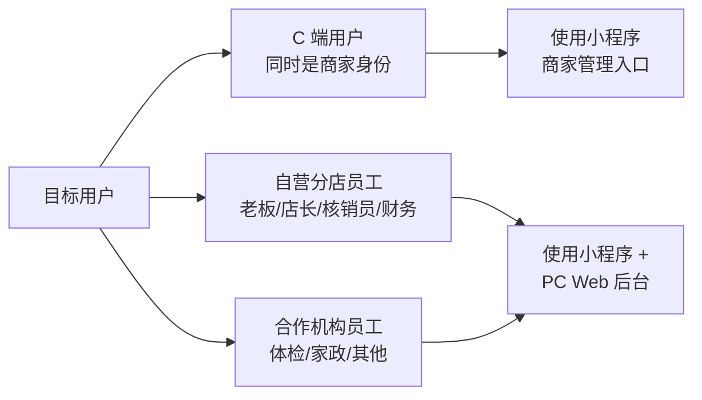
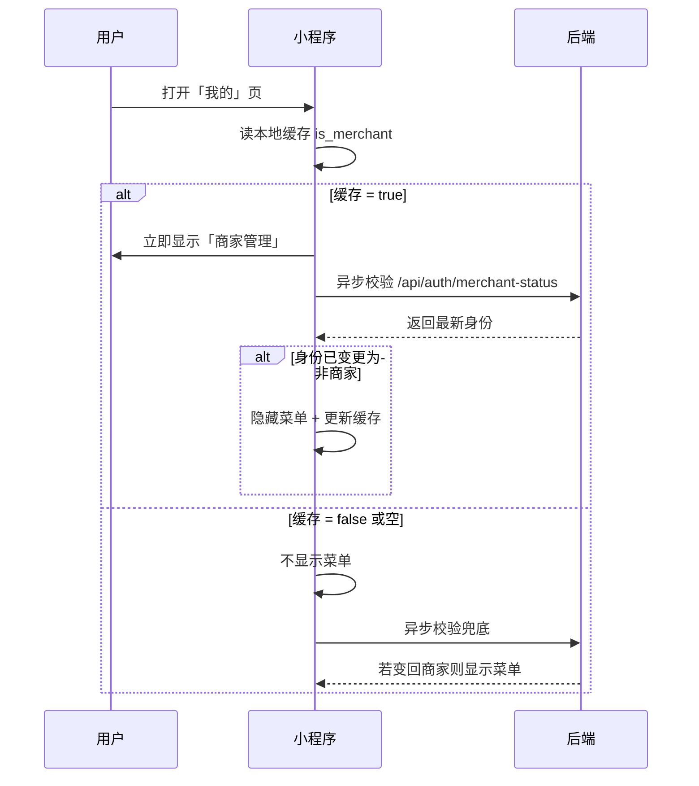
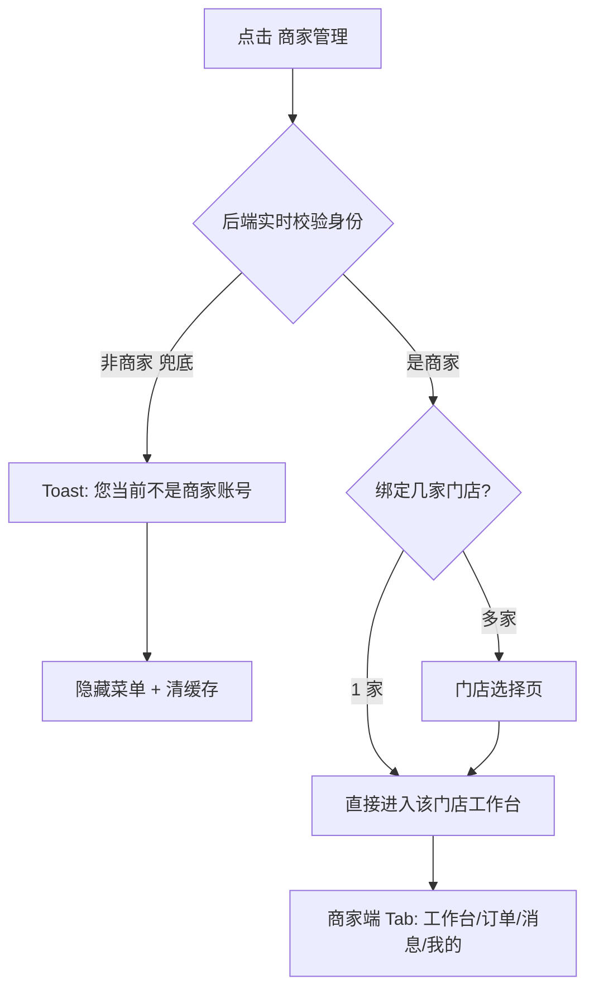
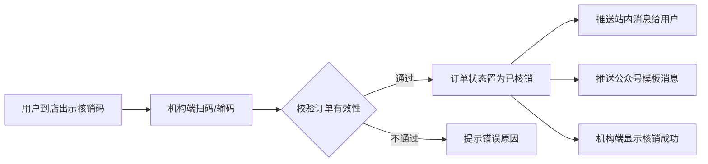
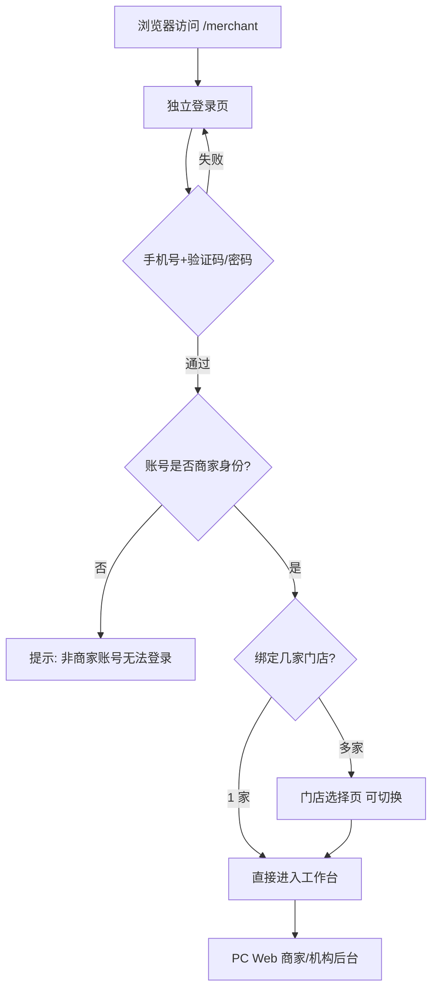
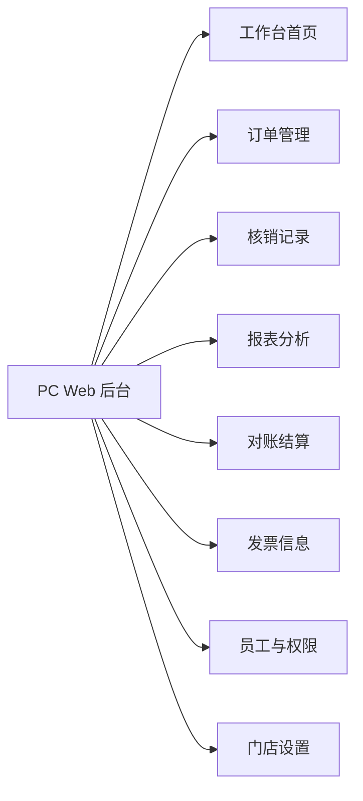
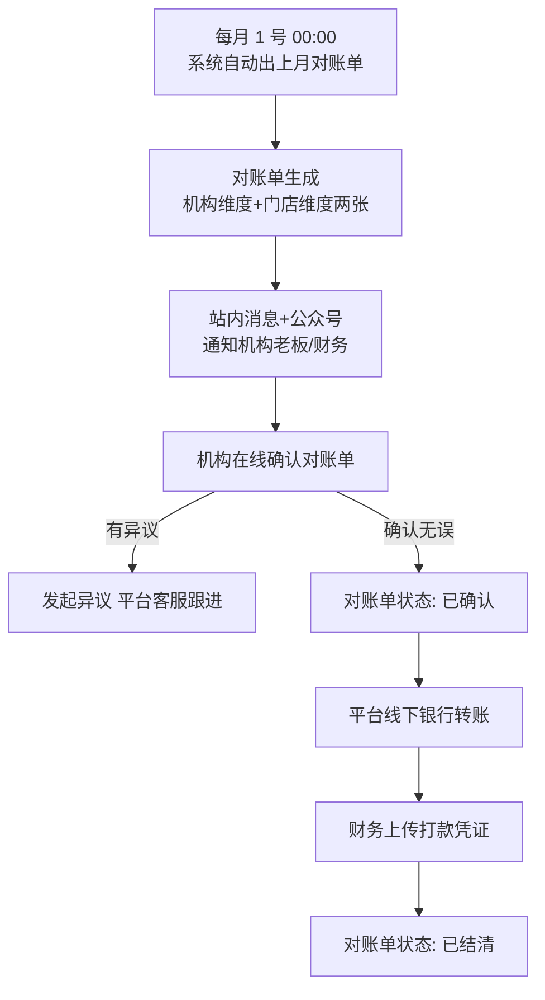
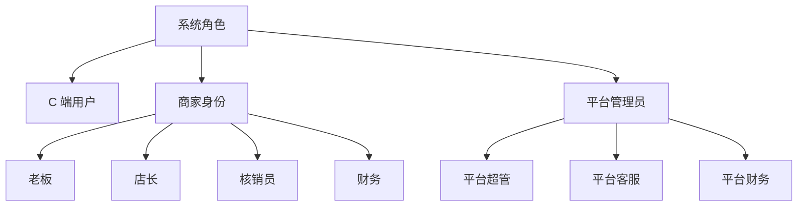

# 商家 / 合作机构后台 + 小程序商家管理入口 产品需求文档（PRD）

> 文档版本：v1.0  
> 文档作者：小白 AI（产品经理）  
> 需求类型：多端新增 + 小程序现有页面增强  
> 上线策略：**所有功能一次性全量上线**（单版本）

---

## 0. 文档摘要

本次需求围绕三条主线展开：

1. **小程序 C 端「我的」页新增「商家管理」入口**：让已有商家身份的用户能从 C 端自然进入商家工作台。
2. **新增 PC Web「商家/机构后台」**：独立子路径 `/merchant`，面向自营分店 + 合作机构（体检、家政、其他），提供报表、对账、导出、打印、附件上传等能力。
3. **合作机构并入现有商家体系**：复用 `MerchantProfile / MerchantStore` 表结构，新增可运营配置的机构类别表，支持体检、家政、其他等多种机构类型。

**专家模块**本期保持现状（静态名片，不做登录/接诊/核销）。

---

## 1. 需求概述

### 1.1 背景与目的

当前系统已具备较完整的"商家 → 门店 → 员工"三层结构（`MerchantProfile` / `MerchantStore` / `MerchantStoreMembership` / `MerchantStorePermission`），分店店员可通过小程序商家模式完成核销、签到、消息等日常操作。但仍存在以下痛点：

- C 端用户进入商家模式的路径不够直观，缺少一个显性的"商家管理"入口
- 合作机构（体检、家政等第三方服务商）尚无专属入口与后台，核销、对账、上传服务附件等刚需无法满足
- 分店老板、机构老板缺少 PC 端的报表/对账/导表/打印能力，在电脑前办公时体验不佳

本期目标是在**最小改动现有架构**的前提下，打通 C 端入口、扩展机构类型、补齐 PC Web 后台三件事，让"商家/机构经营"在平台内形成闭环。

### 1.2 目标用户



| 角色 | 主要使用端 | 主要场景 |
|---|---|---|
| C 端用户（双身份）| 小程序 | 从「我的」进入商家工作台 |
| 分店老板 | 小程序 + PC Web | 经营管理、看报表、对账 |
| 分店店长 | 小程序 + PC Web | 门店日常管理 |
| 分店核销员 | 小程序 | 日常核销、签到 |
| 分店财务 | PC Web | 对账、导表、打印 |
| 合作机构老板 | 小程序 + PC Web | 同上，跨多门店维度 |
| 合作机构员工 | 小程序 | 核销 + 附件上传 |

### 1.3 核心价值

- **入口清晰**：C 端用户一眼就能找到"商家管理"入口，减少客服咨询
- **覆盖完整**：合作机构与自营分店在同一体系内被管理，平台侧运营效率提升
- **办公友好**：PC Web 提供报表、对账、导表、打印等"电脑场景刚需"
- **数据安全**：机构端只能看到自己的数据，且不能随意变更订单状态，平台风险可控

---

## 2. 功能需求

### 2.1 功能清单总览

| 编号 | 功能模块 | 功能点 | 优先级 | 说明 |
|------|----------|--------|--------|------|
| F1 | 小程序「我的」商家管理入口 | 菜单显示与身份判定 | P0 | 仅商家账号可见 |
| F2 | 小程序「我的」商家管理入口 | 点击跳转商家工作台 | P0 | 1 家直进 / 多家选店 |
| F3 | 小程序商家端 | 切回用户端入口 | P0 | 商家端「我的」提供 |
| F4 | 机构类别体系 | 新增可运营配置的机构类别表 | P0 | 支持体检/家政/其他扩展 |
| F5 | 机构类别体系 | 小程序界面按类别轻度差异化 | P1 | 标题/图标/附件字段 |
| F6 | 合作机构核销 | 小程序核销 + 签到（共用现有能力）| P0 | 沿用分店核销能力 |
| F7 | 订单附件 | 机构端上传图片/PDF 附件 | P0 | ≤20MB，最多 5 个 |
| F8 | 订单附件 | 用户端查看 + 下载附件 | P0 | 订单详情中呈现 |
| F9 | PC Web 机构后台 | 独立子路径 `/merchant` 登录页 | P0 | 商家账号登录 |
| F10 | PC Web 机构后台 | 工作台首页 | P0 | 核心指标概览 |
| F11 | PC Web 机构后台 | 订单管理（查看 + 附件上传）| P0 | 不可改订单状态 |
| F12 | PC Web 机构后台 | 报表分析（日/周/月）| P0 | 多维度经营数据 |
| F13 | PC Web 机构后台 | 对账单管理（机构 + 门店双维度）| P0 | 月度出账，线下打款 |
| F14 | PC Web 机构后台 | 发票信息管理 | P0 | 开票抬头、税号等 |
| F15 | PC Web 机构后台 | 数据导出（Excel / 打印）| P0 | ≤1 年 / 每分钟 1 次 |
| F16 | PC Web 机构后台 | 权限矩阵（老板/店长/核销员/财务）| P0 | 四档角色 |
| F17 | 消息通知 | 站内消息 + 公众号推送 | P0 | 不发短信 |
| F18 | 核销通知 | 核销后站内消息 + 公众号推送通知用户 | P0 | 机构扫码即核销 |

### 2.2 功能详细描述

#### F1 / F2 / F3：小程序「我的」商家管理入口

**2.2.1 菜单显示规则**

- **位置**：C 端「我的」页面，"功能服务"区块内，与"我的订单"、"我的档案"等并列
- **文案**：`商家管理`
- **显示逻辑**：
  - 登录后读取本地缓存判断当前账号是否为商家身份（`is_merchant: true`）
  - 仅当是商家身份时，菜单项显示
  - 非商家账号该菜单项**完全不显示**

**2.2.2 身份判定策略（E5-c 双保险）**



**2.2.3 点击后跳转逻辑**



**2.2.4 商家端 → C 端的回切**

- 商家端「我的」页面顶部显示"切回用户端"按钮
- 点击后切换自定义 TabBar，回到 C 端首页

#### F4 / F5：机构类别体系

**2.2.5 机构类别表（新增）**

新增可运营配置的分类表 `merchant_category`，字段建议：

| 字段 | 类型 | 说明 |
|---|---|---|
| `id` | int PK | 主键 |
| `code` | varchar(32) | 编码，如 `self_store` / `medical` / `homeservice` / `other` |
| `name` | varchar(64) | 显示名，如"自营门店"、"体检机构"、"家政机构" |
| `icon` | varchar(255) | 图标 URL |
| `description` | text | 类别描述 |
| `allowed_attachment_types` | JSON | 允许的附件类型，如 `["image","pdf"]` |
| `sort` | int | 排序 |
| `status` | varchar(16) | `active` / `disabled` |

`MerchantProfile` 新增字段 `category_id` 外键指向上表。平台管理员可在后台"机构类别管理"菜单增删改这些类别。

**2.2.6 小程序界面差异化**

不同类别在小程序商家端的差异**仅限于以下轻度展示项**：

- 工作台页标题（如"体检工作台" vs "家政工作台"）
- 类别图标（展示在工作台头部）
- 订单详情中"附件"字段的标签（体检显示"检查报告"、家政显示"服务工单"）
- 其余功能模块（核销、订单、消息、签到）保持**完全一致**的模板

#### F6 / F7 / F8：订单核销 + 附件

**2.2.7 核销流程（P3-c）**



**关键规则**：

- 机构扫码/输码后，订单立即核销（**用户无感知、无需二次确认**）
- 核销完成后，**事后**向用户推送：
  - 站内消息（小程序订阅消息 + 站内通知中心）
  - 公众号模板消息
  - **不发送短信**

**2.2.8 附件上传规则**

- **上传入口**：小程序商家端 + PC Web 机构后台 订单详情页
- **允许类型**：图片（JPG/PNG/WebP）+ PDF
- **大小限制**：单文件 ≤ **20 MB**，单订单最多 **5 个**
- **上传时机**：**核销前 / 核销后均可**（附件仅为附加信息，不影响订单状态流转）
- **用户可见**：用户在自己订单详情中查看附件，**可下载、可本地保存**
- **机构不可改订单状态**：即使上传附件，也不能改订单的 `status` 字段，附件仅写入独立的 `order_attachments` 表

**2.2.9 附件数据模型建议**

新增 `order_attachment` 表：

| 字段 | 类型 | 说明 |
|---|---|---|
| `id` | int PK | |
| `order_id` | int FK | 所属订单 |
| `store_id` | int FK | 上传门店 |
| `uploader_user_id` | int FK | 上传员工 |
| `file_type` | varchar(16) | `image` / `pdf` |
| `file_url` | varchar(500) | COS 或 OSS 地址 |
| `file_name` | varchar(255) | 原始文件名 |
| `file_size` | int | 字节数 |
| `created_at` | datetime | 上传时间 |

#### F9 ~ F16：PC Web 机构后台

**2.2.10 登录入口**

- **路径**：`/merchant`（独立子路径，与平台 Admin `/admin` 解耦）
- **登录方式**：商家账号手机号 + 密码 / 手机号 + 短信验证码
- **账号来源**：与小程序商家端共用一套账号体系（`MerchantStoreMembership` 表中的成员）
- **严格隔离**：机构账号无法访问 `/admin` 平台后台；平台管理员无法以机构身份登 `/merchant`



**2.2.11 左侧菜单结构**



**2.2.12 工作台首页**

- 头部：机构 Logo + 机构名 + 当前登录人 + 门店切换器
- 核心指标卡片：今日订单数、今日核销数、本月 GMV、待对账金额、待处理附件订单数
- 快捷入口：核销记录、今日订单、待上传附件列表
- 消息中心入口（红点提醒未读数）

**2.2.13 订单管理**

列表字段：订单号、用户昵称/手机号、商品/套餐、下单时间、预约时间、门店、状态、附件数、操作

操作列**只保留**：

- 查看详情（只读）
- 上传附件
- 下载附件

**严格禁止**：取消、改期、退款、修改状态等一切变更类操作。

**2.2.14 报表分析（G5-d + N3-d）**

时间维度：日 / 周 / 月 切换

内容维度：

- 订单维度：新增订单、已支付、已核销、已取消（平台客服操作产生）
- GMV 维度：订单金额、实际收款、已结算、待结算
- 商品维度：TOP 商品排行
- 用户维度：新增用户、复购率（机构口径）

**对账维度切换器**（双视图）：

- **机构维度**：一个机构一张合并报表
- **门店维度**：一个机构下的每个门店分别出表

**2.2.15 对账结算（P5-a + Q2-a）**



**关键规则**：

- 月结（每月 1 号出上月账单）
- **仅出对账单，不走线上打款**，打款走线下对公银行转账
- 平台财务完成打款后，上传打款凭证（图片/PDF），状态置为"已结清"
- 机构端可随时下载打印对账单 PDF 与明细 Excel

**2.2.16 发票信息**

机构可维护自己的开票信息：

- 抬头、税号、开户行、开户账号、注册地址、注册电话、收票地址、邮箱
- 平台开票时按此信息开具增值税发票（纸质/电子）

**2.2.17 数据导出与打印（F15）**

- 所有列表、报表、对账单均支持：
  - **导出 Excel**（.xlsx）
  - **打印**（调用浏览器打印，优化打印样式）
- 导出限制（P6-c + P6-d 叠加）：
  - 单次导出时间范围 ≤ **1 年**，超过则提示分批导
  - 同一机构 **每分钟最多导出 1 次**（防抖限流）
- 大数据量导出采用异步任务 + 下载中心：任务完成后站内通知

**2.2.18 员工与权限（P1-b 四档角色）**

| 角色 | 工作台 | 订单管理 | 核销记录 | 报表分析 | 对账结算 | 发票信息 | 员工权限 | 门店设置 |
|---|---|---|---|---|---|---|---|---|
| **老板** | ✅ | ✅ | ✅ | ✅ 跨多店合并 | ✅ | ✅ | ✅ | ✅ |
| **店长** | ✅ | ✅ | ✅ | ✅ 本店 | ❌ | ❌ | ✅ 本店 | ✅ 本店 |
| **核销员** | ✅ 简化版 | 仅只读 | ✅ 本店本人 | ❌ | ❌ | ❌ | ❌ | ❌ |
| **财务** | ✅ | 仅只读 | ✅ 全店 | ✅ 全店 | ✅ | ✅ | ❌ | ❌ |

说明：

- **老板**：MerchantProfile 的创建者 / 机构法人，有所有权限，且在多门店时可跨店合并数据
- **店长**：门店 Leader，管理本店日常运营，但不涉及财务
- **核销员**：只能做核销和签到，订单和报表只可看不可改
- **财务**：专管对账和报表，看全店数据，但不能增删员工

权限由**平台 Admin** 配置（分店老板不自助管权限，见 D2），机构老板可以在 PC 后台"员工与权限"菜单**查看**自己的员工，但不能自行增删改权限——需要联系平台客服。

#### F17 / F18：消息通知体系

**2.2.19 通知触发点**

| 编号 | 触发事件 | 接收人 | 渠道 |
|---|---|---|---|
| MSG-1 | 用户下单预约 | 机构老板 + 店长 | 站内消息 + 公众号 |
| MSG-2 | 平台客服改期 | 机构老板 + 店长 | 站内消息 + 公众号 |
| MSG-3 | 用户到店签到 | 机构核销员 + 店长 | 站内消息 |
| MSG-4 | 订单被核销 | 用户 | 站内消息 + 公众号 |
| MSG-5 | 对账单已出账 | 机构老板 + 财务 | 站内消息 + 公众号 |
| MSG-6 | 对账单已结清 | 机构老板 + 财务 | 站内消息 + 公众号 |

**所有场景一律不发短信。**

**2.2.20 公众号推送前置条件**

- 需要用户/机构员工已关注平台公众号并完成 UnionID 绑定
- 未关注者仅收到站内消息，不降级到短信

---

## 3. 页面/界面设计

### 3.1 页面结构与导航

#### 3.1.1 小程序端变更页面一览

| 页面 | 变更类型 | 说明 |
|---|---|---|
| C 端「我的」 | 修改 | 新增"商家管理"菜单 |
| 商家端「我的」 | 修改 | 顶部新增"切回用户端"按钮 |
| 门店选择页 | 复用 | 多门店时显示 |
| 商家端工作台 | 修改 | 根据机构类别轻度差异化（标题/图标/附件标签）|
| 订单详情页（机构端）| 修改 | 新增"上传附件"区块 |
| 订单详情页（C 端）| 修改 | 新增"服务附件"区块，可下载 |

#### 3.1.2 PC Web 新增页面一览

```mermaid
flowchart LR
    A[/merchant 登录页] --> B[/merchant/login]
    A --> C[/merchant/select-store]
    C --> D[/merchant/dashboard 工作台]
    D --> E[/merchant/orders 订单管理]
    D --> F[/merchant/orders/:id 订单详情]
    D --> G[/merchant/verifications 核销记录]
    D --> H[/merchant/reports 报表分析]
    D --> I[/merchant/settlement 对账结算]
    D --> J[/merchant/settlement/:id 对账单详情]
    D --> K[/merchant/invoice 发票信息]
    D --> L[/merchant/staff 员工与权限]
    D --> M[/merchant/store-settings 门店设置]
    D --> N[/merchant/downloads 下载中心]
    D --> O[/merchant/messages 消息中心]
```

### 3.2 各页面功能说明

#### 3.2.1 PC Web 登录页

- 品牌头部：平台品牌 + "商家/机构工作台"文案
- 登录方式：
  - 手机号 + 密码
  - 手机号 + 短信验证码
- 辅助功能：忘记密码、联系客服

#### 3.2.2 工作台首页

- 顶部横幅：欢迎语 + 机构名 + 门店切换器
- 核心数据卡片（4 张）：
  - 今日订单数（环比昨日 + 百分比）
  - 今日核销数
  - 本月 GMV
  - 待对账金额
- 快捷入口区：
  - 今日订单、待上传附件、核销记录、对账单
- 公告区：平台发布的机构端公告

#### 3.2.3 订单管理页

- 筛选区：订单号、手机号、门店、状态、时间范围
- 列表区：主表字段如 2.2.13 所述
- 详情抽屉：查看详情 + 上传附件 + 下载附件

#### 3.2.4 核销记录页

- 筛选区：时间、门店、核销员、用户手机号
- 列表字段：核销时间、订单号、商品/套餐、用户、门店、核销员
- 支持按任意筛选项导出 Excel

#### 3.2.5 报表分析页

- 顶部：时间维度切换（日/周/月）+ 维度切换（机构/门店）
- 图表区：
  - 订单趋势折线图
  - GMV 柱状图
  - TOP 10 商品横向柱状图
  - 用户来源饼图
- 底部：数据表格（可导出）

#### 3.2.6 对账结算页

- 列表：对账单号、账单周期、机构维度/门店维度、应结金额、状态（待确认/已确认/已结清）
- 详情页：
  - 对账单基本信息
  - 订单明细列表
  - 打款凭证（已结清状态显示）
  - 操作按钮：确认对账、发起异议、下载 PDF、下载明细 Excel、打印

#### 3.2.7 下载中心

异步导出任务列表，字段：任务名、创建时间、状态（排队/处理中/已完成/已失败）、下载按钮、有效期（7 天）。

---

## 4. 非功能性需求

### 4.1 性能要求

- 小程序「商家管理」菜单显示响应：**缓存优先 < 100ms**，异步兜底校验 < 1s
- PC Web 页面首屏加载：**< 2s**（主流宽带环境）
- 报表查询响应：1 个月数据 < 2s；1 年数据 < 10s（大数据走异步导出）
- 附件上传：20MB 文件上传 < 10s（取决于网络）
- 对账单月度自动生成：每月 1 号 00:00~00:30 内完成所有机构的对账单出账

### 4.2 安全要求

- **账号隔离**：`/merchant` 与 `/admin` 完全隔离，无法越权登录
- **数据隔离**：机构员工只能查看自己所属机构及其门店的订单和报表，服务端强校验
- **附件安全**：附件 URL 带签名（预签名 URL），有效期可配（建议 7 天，过期重新申请）
- **敏感数据脱敏**：用户手机号在机构端显示为 `138****1234` 样式，仅核销环节显示完整手机号
- **操作日志**：所有附件上传、对账单确认、打款凭证上传等关键操作写入审计日志
- **限流**：导出每机构每分钟 1 次；登录接口增加图形验证码/滑块验证

### 4.3 兼容性要求

- **浏览器**：Chrome 90+、Edge 90+、Safari 14+、Firefox 90+（不兼容 IE）
- **小程序**：微信最新版 + 前两个主版本
- **屏幕**：PC Web 最小支持 **1366 × 768**，主推 **1920 × 1080**
- **移动端查看 PC Web**：提供基本响应式（但不作为主力场景）

---

## 5. 业务规则与约束

### 5.1 硬边界（D1~D4，已确认不可突破）

- **D1**：分店员工日常操作**只用小程序**（核销、签到、看订单、收消息），PC Web 仅用于报表/对账/导表/打印等辅助场景
- **D2**：分店员工账号、门店归属、模块权限**全部由平台管理员在 Admin 配置**，分店老板/机构老板**不自助管**
- **D3**：一个员工可属于多家分店/门店，登录后可在门店间切换
- **D4**：分店/机构**不做独立品牌化**（不独立域名、不独立 App）

### 5.2 订单管理边界

- 机构端**不可**改订单状态（不能取消、改期、退款、修改备注影响状态的字段）
- 机构端**可**上传附件（独立数据，不改订单主表状态）
- 用户端**可以**下载并本地保存附件（包括体检报告）

### 5.3 结算与打款

- 系统**仅出对账单**，不承担线上打款职责
- 打款走线下对公银行转账，财务上传凭证后闭环

### 5.4 专家模块

- 本期不做任何改动，维持"静态名片 + 平台 Admin 维护主数据 + C 端展示预约"的现状

---

## 6. 权限设计

### 6.1 角色总览



### 6.2 角色权限矩阵（机构/分店端）

| 角色 | 登录端 | 可见数据范围 | 关键能力 |
|---|---|---|---|
| **老板** | 小程序 + PC Web | 本机构全部门店 | 全部业务 + 员工查看 + 门店设置 |
| **店长** | 小程序 + PC Web | 所属门店 | 订单、核销、报表（本店） |
| **核销员** | 小程序 + PC Web（只读报表除外）| 所属门店 | 核销、签到、附件上传 |
| **财务** | 小程序 + PC Web | 本机构全部门店 | 对账、发票、报表、导出、打印 |
| **平台客服** | 平台 Admin | 全平台 | 订单改期、取消、退款 |
| **平台超管** | 平台 Admin | 全平台 | 所有 |

### 6.3 权限配置归属

- 权限在 **平台 Admin** 配置：员工角色分配、门店绑定、启用/停用
- 机构端在 PC Web 只能**查看**员工和权限，不能修改

---

## 7. 异常处理与边界情况

### 7.1 小程序商家管理入口

| 场景 | 处理方式 |
|---|---|
| 用户本地缓存 `is_merchant=true`，但后端实际已取消商家身份 | 异步校验发现后立即隐藏菜单 + 清缓存；若用户已点击进入商家端，下一次操作时 Toast 提示"您当前不是商家账号"并跳回 C 端 |
| 商家账号但**无任何门店**（刚创建还没绑定）| 进入商家端后显示引导页"您还未被绑定到任何门店，请联系平台客服" |
| 网络异常导致后端兜底校验失败 | 不改变本地缓存状态，但记录失败日志；下次进入时重试 |

### 7.2 核销异常

| 场景 | 处理方式 |
|---|---|
| 核销码已过期 | 机构端提示"核销码已过期"，订单不变 |
| 订单已核销（重复扫码）| 机构端提示"订单已于 XX 时间被核销" |
| 订单已取消 | 机构端提示"订单已取消，无法核销" |
| 跨门店扫码（订单不属于当前门店）| 机构端提示"该订单不属于本门店" |
| 扫码时网络异常 | 机构端支持"离线暂存"：本地先记录，恢复网络后自动同步后端（需二次校验避免重复核销）|

### 7.3 附件上传异常

| 场景 | 处理方式 |
|---|---|
| 文件超过 20MB | 上传前前端拦截，提示"单文件不可超过 20MB" |
| 文件类型不在白名单 | 前端拦截，提示"仅支持图片和 PDF" |
| 单订单附件数已达 5 个 | 上传按钮置灰，提示"每单最多 5 个附件，请先删除旧附件" |
| 上传中断网 | 自动重试 3 次，失败后提示手动重试 |
| COS 返回 4xx/5xx | 记录错误日志，提示"上传失败，请稍后重试" |

### 7.4 对账单异常

| 场景 | 处理方式 |
|---|---|
| 月度自动出账任务失败 | 平台财务收到告警，手动触发补出 |
| 机构发起异议 | 对账单状态流转为"异议中"，不结清；平台客服介入处理；异议解决后修订账单重新出 |
| 打款凭证上传失败 | 重试机制 + 审计日志 |
| 对账单在"已确认"后又发现错误 | 需平台超管介入撤销确认，修订后重新出账 |

### 7.5 导出异常

| 场景 | 处理方式 |
|---|---|
| 导出时间范围超过 1 年 | 前端拦截，提示"单次导出范围最多 1 年，请分批导出" |
| 同机构 1 分钟内重复点击导出 | 提示"导出过于频繁，请稍后再试" |
| 异步导出任务失败 | 下载中心显示"失败"状态 + 失败原因，可重试 |
| 导出文件超过系统限制（如 10 万行）| 自动分文件打包为 ZIP |

### 7.6 门店切换

| 场景 | 处理方式 |
|---|---|
| 员工被临时调去其他门店 | 下次登录时门店列表自动刷新 |
| 员工所属门店全部被停用 | 登录时提示"您当前无可用门店，请联系平台" |

---

## 8. 数据模型变更概要

### 8.1 新增表

- `merchant_category`：机构类别配置表（见 2.2.5）
- `order_attachment`：订单附件表（见 2.2.9）
- `settlement_statement`：对账单主表（账单号、机构、维度、周期、金额、状态等）
- `settlement_statement_item`：对账单明细行（关联订单）
- `settlement_payment_proof`：打款凭证表
- `merchant_invoice_profile`：机构开票信息表
- `export_task`：异步导出任务表
- `merchant_message`：商家/机构站内消息表（若现有 `商家消息中心` 已支持则扩展而非新建）

### 8.2 变更表

- `MerchantProfile`：新增 `category_id` 外键、`invoice_profile_id` 外键（可选）
- `MerchantStoreMembership`：确保 `role` 字段支持 `owner / store_manager / verifier / finance` 四档
- `MerchantStorePermission`：按新四档角色预置默认权限模板

### 8.3 接口变更概要（列举主要端点）

```text
小程序端
  GET  /api/auth/merchant-status            // 实时校验商家身份
  GET  /api/merchant/stores                 // 当前员工所属门店列表
  POST /api/merchant/orders/:id/attachments // 上传附件
  GET  /api/orders/:id/attachments          // C 端查看附件
  
PC Web 机构端（/merchant 前缀）
  POST /api/merchant/auth/login
  GET  /api/merchant/dashboard/metrics
  GET  /api/merchant/orders
  GET  /api/merchant/verifications
  GET  /api/merchant/reports?dim=merchant|store&period=day|week|month
  GET  /api/merchant/settlements
  POST /api/merchant/settlements/:id/confirm
  POST /api/merchant/settlements/:id/dispute
  GET  /api/merchant/invoice-profile
  PUT  /api/merchant/invoice-profile
  POST /api/merchant/exports
  GET  /api/merchant/exports
  GET  /api/merchant/messages

平台 Admin 端
  GET/POST/PUT /api/admin/merchant-categories
  POST /api/admin/settlements/:id/payment-proof
  POST /api/admin/settlements/generate-monthly
```

---

## 9. 补充说明

### 9.1 本期交付范围

- 小程序 C 端「我的」商家管理入口（F1~F3）
- 机构类别体系（F4/F5）+ 小程序商家端类别差异化
- 合作机构核销全流程（F6/F17/F18）
- 订单附件（F7/F8）
- PC Web 商家/机构后台 `/merchant`（F9~F16）
- 消息通知（F17/F18）
- 平台 Admin 端对机构类别、对账单、打款凭证等管理能力

### 9.2 不在本期范围

- 专家登录与接诊/核销能力（L1-a，本期不做）
- 分店老板自助权限管理（D2 明确不做）
- 独立品牌化（独立 App、独立域名）（D4 明确不做）
- 分店自建优惠券、分店专属活动、分店自有商品
- 线上打款、发票自动开具、企业分账
- 独立的商家小程序 / 独立的机构小程序

### 9.3 实施与上线方式

- 本系统将基于小白 AI 进行自动化开发，并部署至小白 AI 云服务器
- **所有功能在一个版本内完成开发并一次性上线**，不拆分多期
- 数据库迁移通过 `schema_sync` + 手动 SQL 兜底脚本完成，按现有项目惯例执行

### 9.4 验收标准

本期需求验收通过的关键标准：

1. C 端用户（非商家）无法看到「商家管理」菜单；商家用户必见
2. 商家点击菜单可进入商家工作台，多门店可切换
3. `/merchant` PC Web 可用手机号 + 验证码登录，按四档角色呈现对应菜单
4. 机构端可上传图片/PDF 附件，用户端可见并可下载
5. 对账单每月 1 号自动生成，机构可在线确认并下载
6. 所有导出限制（≤1 年 / 1 分钟 1 次）生效
7. 核销成功后用户收到站内消息 + 公众号推送（不发短信）
8. 权限矩阵严格按 P1-b 四档执行，越权请求被后端拦截

---

## 附录 A：与现有系统的关系

本期需求**不破坏**现有以下功能：

- 现有分店小程序商家模式（核销、签到、订单核验、商家消息中心）继续可用
- 现有平台 Admin 的商家管理、门店管理、商家账号功能继续可用
- 现有专家管理（平台管理员维护静态名片 + C 端展示预约）保持不变
- 现有商品-门店关联（`ProductStore`）逻辑保持不变

## 附录 B：历史决策记录（需求讨论过程中的关键选择）

为保证后续开发、测试、运维对"为什么这么设计"有据可查，列出关键决策：

| 决策点 | 最终选择 | 备注 |
|---|---|---|
| 分店是否需要独立登录入口 | B1（沿用现状） | 小程序商家模式已满足 |
| 分店硬边界 | D1~D4 全部认可 | 不做 PC 工作台、不自助管权限、多店可切换、不品牌化 |
| 小程序商家管理入口组合 | E1-b + E2-b + E3-a + E4-a + E5-c + E6-a + E7-a | 见 2.2 节详述 |
| 合作机构入口 | H-b（小程序为主 + PC 兜底）| 覆盖体检/家政/其他 |
| 机构账号复用分店表结构 | G3-a | 新增 `merchant_category` 做类型区分 |
| 机构类型界面差异 | M2-b + k2-b | 可运营配置 + 轻度差异 |
| 订单管理边界 | J1-b + J2-a + M1-a | 不可改状态，可传附件，随时可传 |
| 专家模块 | L1-a | 本期不动 |
| PC Web 登录路径 | N1-b | `/merchant` 独立子路径 |
| PC Web 登录范围 | N2-b | 所有员工都能登，按权限过滤 |
| 对账维度 | N3-d | 机构 + 门店双视图 |
| 分店是否共用 PC 后台 | N4-a | 共用 |
| 附件规格 | N5-b | 图片 + PDF，≤20MB，最多 5 |
| 权限矩阵 | P1-b | 老板 / 店长 / 核销员 / 财务 四档 |
| 附件用户侧 | P2-b | 可下载保存 |
| 核销用户侧 | P3-c | 即刻核销 + 事后站内消息 |
| 通知渠道 | P4-d → Q1-a | 站内消息 + 公众号（不发短信）|
| 对账周期 | P5-a | 月结 |
| 打款方式 | Q2-a | 仅出账单，线下打款 |
| 导出限制 | P6-c + P6-d | ≤1 年 + 每分钟 1 次 |

---

**文档结束**
