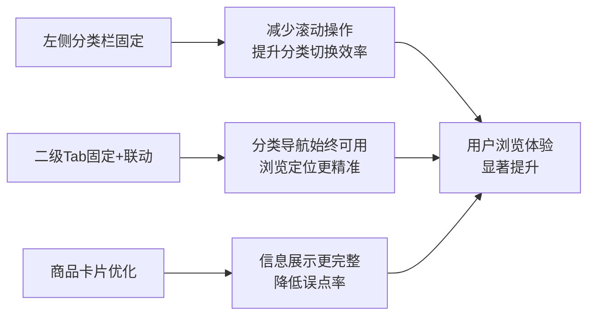
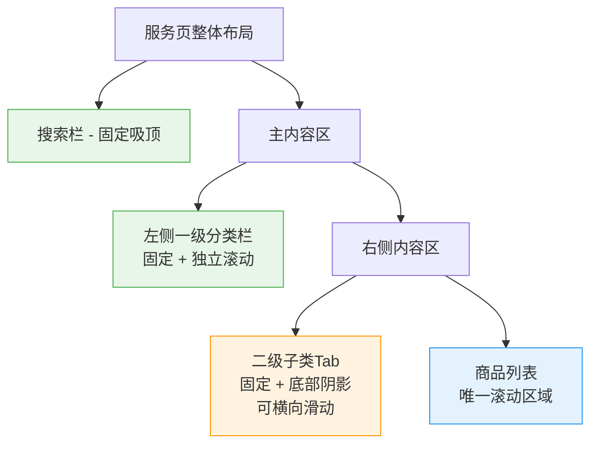
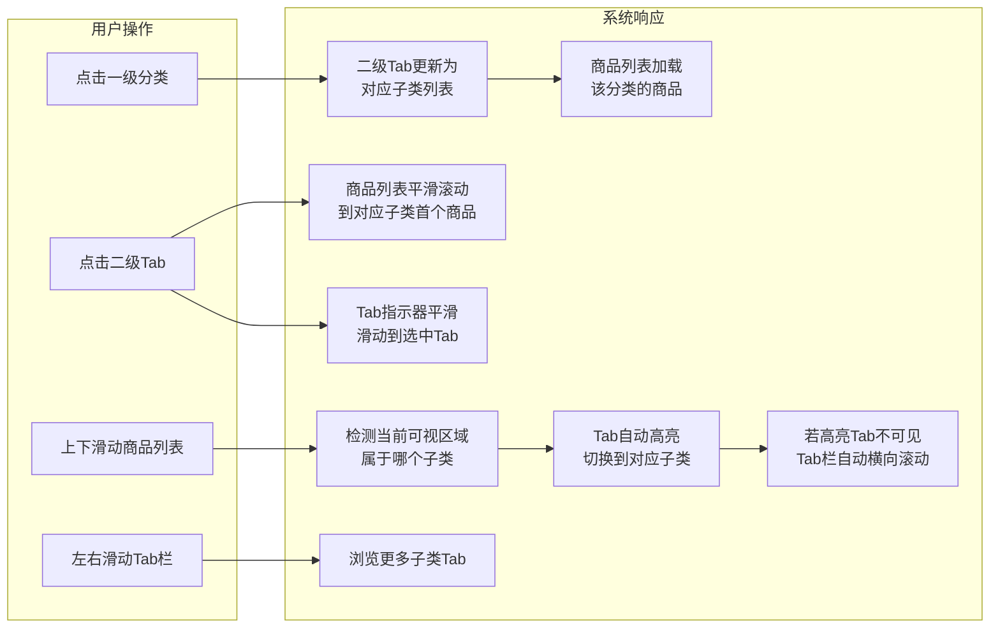
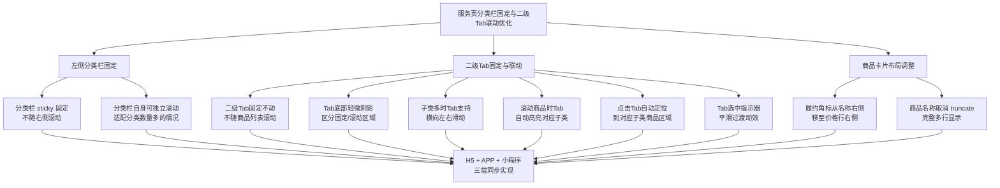

# 用户端服务页分类栏固定与二级Tab联动优化 产品需求文档（PRD）

## 1. 需求概述

### 1.1 背景与目的

当前 bini-health 用户端「首页 → 服务」页面采用经典的「左侧一级大类竖列 + 右侧（二级子类横向Tab + 商品列表）」布局。存在以下体验问题：

- **左侧分类栏不固定**：当右侧商品列表较长时，用户往下滑动后左侧分类栏会随页面滚出视野，想切换分类必须手动滚回顶部，操作路径长
- **二级子类Tab不固定**：用户向下滑动商品列表时，二级子类横向Tab也会随之滚出视野，无法快速切换子分类
- **Tab与商品列表缺乏联动**：滚动商品列表时，Tab不会自动高亮当前所在子类；点击Tab时，商品列表也不会自动定位
- **履约类型角标占据商品名称空间**：履约类型角标（到店/快递/虚拟）位于商品名称右侧，与名称争夺横向空间，导致较长的商品名称被截断
- **商品名称单行截断**：当前商品名称限制为单行显示（`truncate`），名称较长时无法完整展示，影响用户对服务内容的理解

本次优化旨在提升用户在服务页面的浏览效率、分类导航体验和信息获取质量。

### 1.2 目标用户

所有使用 bini-health 用户端浏览服务/商品的终端用户，覆盖：

- H5 网页端
- Flutter APP 端（iOS / Android）
- 微信小程序端

### 1.3 核心价值



| 优化点 | 体验收益 |
|--------|----------|
| 左侧分类栏固定 | 任意滚动位置均可一键切换分类，减少 80% 以上无效回滚操作 |
| 二级子类Tab固定 | 用户滑动商品时Tab始终可见，随时可切换子分类 |
| Tab与商品滚动联动 | 滑动到某子类商品区域时Tab自动高亮，点击Tab自动定位对应商品 |
| 履约角标下移 | 商品名称获得完整行宽，中长名称不再被截断 |
| 名称不限行数 | 用户一眼即可获取服务全称，降低误点率 |

## 2. 功能需求

### 2.1 功能清单总览

| 编号 | 功能模块 | 功能点 | 优先级 | 说明 |
|------|----------|--------|--------|------|
| F1 | 分类导航 | 左侧分类栏（含一级大类）固定不动 | P0 | 右侧内容滚动时左侧栏始终可见 |
| F2 | 分类导航 | 左侧分类栏自身可独立滚动 | P0 | 分类数量多时左侧栏支持独立上下滑动 |
| F3 | 分类导航 | 二级子类横向Tab固定不动 | P0 | 用户滑动商品时Tab始终固定在商品列表上方 |
| F4 | 分类导航 | 二级子类Tab横向滑动 | P0 | 子类过多时支持左右滑动，始终一行展示 |
| F5 | 分类导航 | 二级子类Tab底部阴影分界 | P1 | Tab栏底部加轻微阴影，区分固定区域与滚动区域 |
| F6 | 分类导航 | 滚动联动Tab高亮 | P0 | 商品列表滚动到某子类区域时，Tab自动高亮切换 |
| F7 | 分类导航 | 点击Tab定位商品区域 | P0 | 点击某个子类Tab后，商品列表自动滚动到该子类的第一个商品 |
| F8 | 分类导航 | Tab高亮平滑过渡动效 | P1 | Tab选中状态切换时，下划线/背景色以平滑动画过渡 |
| F9 | 商品卡片 | 履约类型角标从名称右侧移至价格行右侧 | P0 | 释放名称展示空间 |
| F10 | 商品卡片 | 商品名称取消单行截断限制 | P0 | 名称完整显示，不限行数 |
| F11 | 多端适配 | H5 + APP + 小程序三端同步改动 | P0 | 三端统一体验 |

### 2.2 功能详细描述

#### F1 / F2：左侧分类栏固定与独立滚动

**现状：**

当前左侧分类栏使用 `overflow-y: auto` 但未做吸顶固定。当右侧商品列表滚动时，整个页面（含左侧栏）一起滚动，分类栏会移出视野。

**目标效果：**

```
滚动前：                            滚动后（商品区域已向下滑动）：
┌──────┬──────────────────┐        ┌──────┬──────────────────┐
│ 搜索栏（固定吸顶）       │        │ 搜索栏（固定吸顶）       │
├──────┼──────────────────┤        ├──────┼──────────────────┤
│ 推荐 │ [子类1][子类2]... │        │ 推荐 │ [子类1][子类2]... │
│ ────│═══════ 阴影 ══════│        │ ────│═══════ 阴影 ══════│
│ 美容 │ 商品A             │        │ 美容 │ 商品D             │
│      │ 商品B             │   →    │      │ 商品E             │
│ 养生 │ 商品C             │        │ 养生 │ 商品F             │
│      │ ...               │        │      │ ...               │
│ 居家 │                   │        │ 居家 │                   │
└──────┴──────────────────┘        └──────┴──────────────────┘
  ↑ 始终可见               ↑ Tab固定     ↑ 始终可见            ↑ Tab固定
    可独立滚动         商品列表滚动        可独立滚动        商品列表滚动
```

**交互规则：**

1. 左侧一级分类栏始终固定在屏幕左侧，不随右侧内容滚动
2. 搜索栏固定吸顶（维持现有行为）
3. 当一级分类数量超出左侧栏可视高度时，左侧栏自身支持独立上下滑动
4. 左侧栏与右侧滚动互不干扰

**实现要点：**

- 左侧分类栏使用 `position: sticky` 或独立滚动容器，使其固定在视口内
- 右侧内容区域设置独立的滚动上下文
- 确保左侧栏与右侧滚动互不干扰

#### F3 / F4 / F5：二级子类Tab固定、横向滑动与阴影分界

**现状：**

当前二级子类横向Tab与商品列表同属一个滚动区域，用户向下滑动商品列表时，Tab会随之滚出视野。

**目标效果：**

用户上下滑动商品列表时：

- 左侧一级分类栏 → **固定不动**
- 右侧二级子类横向Tab → **固定不动**，始终显示在商品列表上方
- 商品列表 → **唯一滚动区域**

```
┌──────┬──────────────────────────┐
│ 搜索栏（固定吸顶）                │  ← 固定
├──────┼──────────────────────────┤
│ 推荐 │ [子类1] [子类2] [子类3]→  │  ← 固定 + 可横向滑动
│ ────│═══════════ 底部阴影 ══════│  ← 轻微阴影，增强层次
│ 美容 │ ▼ 商品列表（可滚动）      │  ← 唯一的滚动区域
│      │ 商品D                    │
│ 养生 │ 商品E                    │
│      │ 商品F                    │
│ 居家 │ ...                      │
└──────┴──────────────────────────┘
  ↑ 固定       ↑ Tab固定 + 商品滚动
```

**交互规则：**

1. 二级子类横向Tab始终固定在商品列表上方，不随商品列表滚动
2. 切换一级分类时，二级Tab内容更新为对应分类的子类列表，但Tab区域的固定位置不变
3. 当某分类的子类数量较多（横向放不下）时，Tab支持**横向左右滑动**，始终**一行展示**，不换行
4. Tab栏底部添加**轻微的底部阴影**效果（类似搜索栏吸顶的效果），让用户能清晰感知"Tab是固定的，下方内容在滚动"

**阴影样式参考：**

- 阴影方向：向下投射
- 阴影颜色：`rgba(0, 0, 0, 0.06)` ~ `rgba(0, 0, 0, 0.1)`
- 阴影模糊半径：`4px` ~ `6px`
- 阴影偏移：`0 2px`

#### F6：滚动联动Tab高亮

**现状：**

当前滚动商品列表时，Tab不会自动更新选中状态。

**目标效果：**

用户上下滑动商品列表时，当商品列表滚动到某个二级子类的商品区域，对应的二级子类Tab自动高亮为选中状态。

**交互规则：**

1. 监听商品列表的滚动位置，判断当前可视区域内的商品属于哪个二级子类
2. 当可视区域内的商品跨越两个子类时，以**占据可视区域面积更大**的子类为当前选中子类
3. Tab高亮状态实时跟随滚动更新
4. 如果当前高亮的Tab不在可视范围内（子类多，Tab已横向滑出），Tab栏应**自动横向滚动**将当前高亮的Tab滚动到可视区域

**实现要点：**

- 使用 `IntersectionObserver`（H5）或各端等价的可见性监听机制
- 设置合理的防抖/节流策略（建议 `100ms` 节流），避免频繁触发Tab切换导致性能问题
- Tab横向自动滚动应使用平滑动画（`scroll-behavior: smooth`）

#### F7：点击Tab定位商品区域

**现状：**

当前点击二级子类Tab后，重新加载该子类的商品列表。

**目标效果：**

点击某个二级子类Tab后，商品列表**自动平滑滚动**到该子类的第一个商品位置。

**交互规则：**

1. 点击Tab后，商品列表以**平滑滚动动画**定位到该子类的第一个商品
2. 滚动定位完成后，该子类的第一个商品应出现在**商品列表可视区域的顶部**
3. 点击已选中的Tab（当前高亮Tab），不做任何操作
4. 滚动动画时长建议 `300ms` ~ `500ms`，使用缓动曲线（如 `ease-out`）

**实现要点：**

- 使用 `scrollIntoView({ behavior: 'smooth', block: 'start' })`（H5）或各端等价API
- 在滚动定位过程中，暂时**禁用F6的滚动联动高亮**，避免动画过程中Tab在多个子类之间跳动，待滚动动画结束后再重新启用

#### F8：Tab高亮平滑过渡动效

**现状：**

当前Tab选中状态为直接切换，无过渡动画。

**目标效果：**

Tab选中状态切换时，下划线（或背景色指示器）从上一个Tab**平滑滑动过渡**到当前Tab，而不是直接跳变。

**交互规则：**

1. Tab下方的选中指示器（下划线/高亮条）以**平滑滑动动画**从前一个位置移动到新位置
2. 动画时长建议 `200ms` ~ `300ms`，使用缓动曲线（如 `ease-in-out`）
3. 指示器的宽度应跟随Tab文字宽度自适应
4. 无论是用户**手动点击Tab**还是**滚动联动自动切换**，都使用平滑过渡动效

**实现参考：**

- 使用一个独立的指示器元素，通过 `transform: translateX()` + `width` 的过渡动画实现
- 或使用 CSS `transition` 属性对指示器位置和宽度添加过渡效果

#### F9：履约类型角标位置调整

**现状：**

```
┌─────┬────────────────────────────────┐
│     │ 肩颈推拿 60分钟舒缓...  [到店] │  ← 角标在名称右侧，挤压名称空间
│ 图片│ 专业技师手法按摩               │
│     │ ¥168                           │
└─────┴────────────────────────────────┘
```

**目标效果：**

```
┌─────┬────────────────────────────────┐
│     │ 肩颈推拿 60分钟舒缓放松套餐    │  ← 名称独占整行，完整显示
│ 图片│ 专业技师手法按摩               │
│     │ ¥168                    [到店] │  ← 角标移至价格行右侧
└─────┴────────────────────────────────┘
```

**交互规则：**

1. 履约类型角标（到店/快递/虚拟）从商品名称行的右侧移至**价格行的最右侧**
2. 角标与价格同行显示，角标靠右对齐
3. 角标的样式（颜色、圆角、字号）保持不变：
   - 到店服务（in_store）→ 暖橙 `#FF8A3D`，白字
   - 快递配送（delivery）→ 科技蓝 `#3B82F6`，白字
   - 虚拟商品（virtual）→ 尊贵紫 `#8B5CF6`，白字
4. 无履约类型时该位置为空，不影响价格显示

#### F10：商品名称完整显示

**现状：**

商品名称使用 `truncate`（CSS `text-overflow: ellipsis; white-space: nowrap; overflow: hidden`），超出一行的部分被省略号截断。

**目标效果：**

1. 移除名称的单行截断限制（去掉 `truncate` 样式）
2. 商品名称完整显示，不限制行数
3. 名称自然换行，多行显示
4. 不设置行数上限（即使名称超过 3 行也全部展示）

**字体与样式：**

- 保持现有字体大小（`text-sm`，14px）和字重（`font-medium`，500）不变
- 行高保持默认或略微放松以提升多行可读性

## 3. 页面/界面设计

### 3.1 页面结构与导航

本次改动不涉及页面级别的结构变更，维持现有的「左侧一级大类 + 右侧（子类Tab + 商品列表）」三栏式布局不变。

改动涉及的区域层级关系如下：



| 区域 | 固定行为 | 滚动行为 |
|------|----------|----------|
| 搜索栏 | 吸顶固定（维持现有） | 不滚动 |
| 左侧一级分类栏 | 固定不动 | 自身可独立上下滚动 |
| 二级子类Tab | 固定不动 | 可横向左右滑动 |
| 商品列表 | 不固定 | 上下滚动（页面唯一垂直滚动区域） |

### 3.2 二级子类Tab联动交互流程



### 3.3 商品卡片布局变更

改动前后的卡片信息区对比：

```
【改动前】                              【改动后】
┌─────────────────────────┐            ┌─────────────────────────┐
│ 商品名称(truncate) [角标]│            │ 商品名称（完整显示，     │
│ 卖点描述                │            │ 可多行自然换行）         │
│ ¥价格                   │            │ 卖点描述                │
└─────────────────────────┘            │ ¥价格            [角标] │
                                       └─────────────────────────┘
```

## 4. 非功能性需求

### 4.1 性能要求

- 左侧分类栏固定不应引入额外的性能开销（使用 CSS `position: sticky` 等原生方案，避免 JS 监听滚动）
- 二级Tab固定同样优先使用 CSS 原生方案
- 滚动联动高亮的监听需做好**节流处理**（建议 `100ms`），避免高频触发导致卡顿
- 商品名称取消截断后，卡片高度会因名称长度而不固定，需确保列表滚动的流畅性不受影响
- Tab过渡动效使用 GPU 加速的属性（`transform`、`opacity`），避免触发重排

### 4.2 安全要求

本次改动为纯前端 UI 调整，不涉及数据安全相关变更。

### 4.3 兼容性要求

| 终端 | 要求 |
|------|------|
| H5 网页端 | 兼容 iOS Safari 12+、Android WebView (Chrome 80+)、微信内置浏览器 |
| Flutter APP | iOS 12+ / Android 5.0+ |
| 微信小程序 | 基础库 2.10.0+ |

## 5. 业务规则与约束

1. **三端一致性**：H5、APP、小程序三端的改动效果必须视觉一致，避免端到端体验差异
2. **搜索结果页不涉及**：本次改动仅针对服务页常态列表视图，搜索结果页的商品卡片布局暂不调整
3. **管理后台不涉及**：本次为用户端优化，管理后台页面无需改动
4. **向下兼容**：改动不影响现有的商品数据结构和后端 API，纯前端调整
5. **滚动联动与点击定位互斥**：点击Tab触发的滚动动画期间，暂停滚动联动高亮，动画结束后恢复

## 6. 权限设计

| 角色 | 权限说明 |
|------|----------|
| 普通用户 | 可浏览优化后的服务页，享受新交互体验 |
| 管理员 | 无需操作，管理后台不涉及改动 |

本次改动不引入新的权限控制逻辑。

## 7. 异常处理与边界情况

| 场景 | 处理方式 |
|------|----------|
| 一级分类数量为 0 | 左侧栏显示为空白，右侧显示空状态，与现有行为一致 |
| 一级分类数量超多（如 20+） | 左侧栏独立滚动，用户可上下滑动查看全部分类 |
| 某分类下无二级子类 | 不显示二级Tab栏，商品列表直接从Tab栏位置开始展示 |
| 某分类下二级子类极多（如 15+） | Tab一行展示，支持横向左右滑动浏览所有子类 |
| 某子类下无商品 | 该子类区域显示"暂无商品"占位，不影响其他子类的滚动联动 |
| 商品名称极长（如 100+ 字符） | 完整展示，卡片高度自适应，不设上限 |
| 商品无履约类型 | 价格行右侧为空，不显示角标，价格正常展示 |
| 屏幕宽度极窄（如 320px） | 左侧栏宽度保持 88px 不变，右侧自适应缩小 |
| 快速切换分类 | 分类栏固定不动，仅右侧内容区刷新，交互流畅 |
| 快速连续点击不同Tab | 取消前一次滚动动画，以最后一次点击为准 |
| 滚动动画中用户手动滑动 | 立即中断滚动动画，以用户手动操作为准，恢复滚动联动高亮 |

## 8. 补充说明

### 8.1 涉及终端与同步要求

| 终端 | 是否涉及 | 说明 |
|------|----------|------|
| H5 网页端 | 是 | 主要改动端，优先实现 |
| Flutter APP（iOS/Android） | 是 | 同步改动，保持与 H5 一致 |
| 微信小程序 | 是 | 同步改动，保持与 H5 一致 |
| 管理后台（Admin Web） | 否 | 不涉及 |

### 8.2 改动范围总结



### 8.3 开发方式

本系统基于小白 AI 进行自动化开发，并部署至小白 AI 云服务器。三端同步开发，一次性全量上线。
