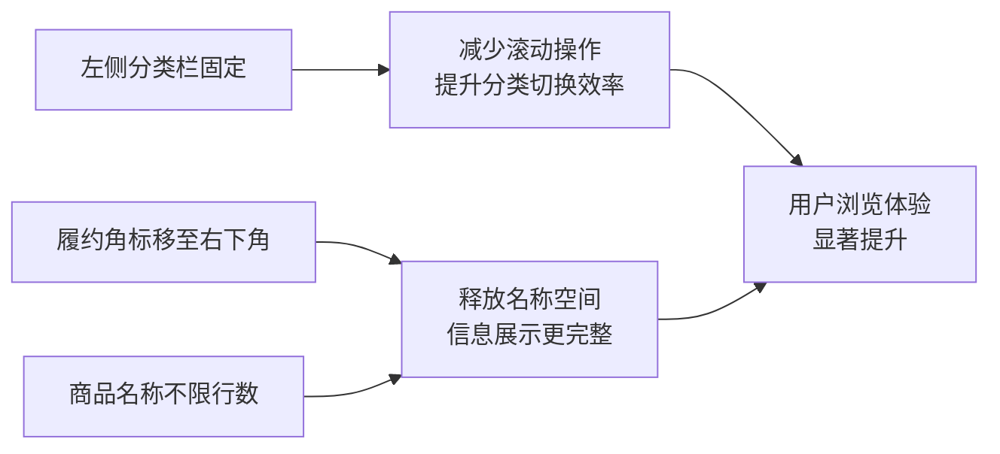
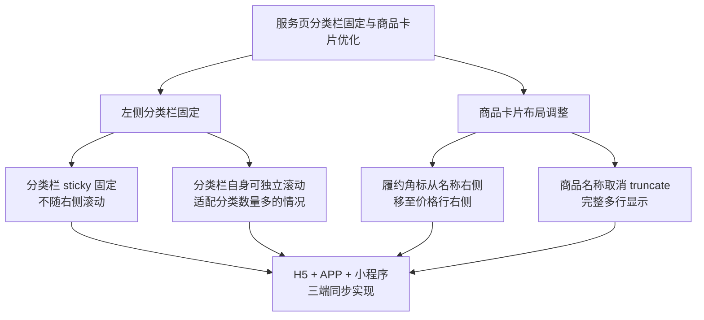

# 用户端服务页分类栏固定与商品卡片优化 产品需求文档（PRD）

## 1. 需求概述

### 1.1 背景与目的

当前 bini-health 用户端「首页 → 服务」页面采用经典的「左侧一级大类竖列 + 右侧（二级子类横向Tab + 商品列表）」布局。存在以下体验问题：

- **左侧分类栏不固定**：当右侧商品列表较长时，用户往下滑动后左侧分类栏会随页面滚出视野，想切换分类必须手动滚回顶部，操作路径长
- **履约类型角标占据商品名称空间**：履约类型角标（到店/快递/虚拟）位于商品名称右侧，与名称争夺横向空间，导致较长的商品名称被截断
- **商品名称单行截断**：当前商品名称限制为单行显示（`truncate`），名称较长时无法完整展示，影响用户对服务内容的理解

本次优化旨在提升用户在服务页面的浏览效率和信息获取质量。

### 1.2 目标用户

所有使用 bini-health 用户端浏览服务/商品的终端用户，覆盖：

- H5 网页端
- Flutter APP 端（iOS / Android）
- 微信小程序端

### 1.3 核心价值



| 优化点 | 体验收益 |
|--------|----------|
| 左侧分类栏固定 | 任意滚动位置均可一键切换分类，减少 80% 以上无效回滚操作 |
| 履约角标下移 | 商品名称获得完整行宽，中长名称不再被截断 |
| 名称不限行数 | 用户一眼即可获取服务全称，降低误点率 |

## 2. 功能需求

### 2.1 功能清单总览

| 编号 | 功能模块 | 功能点 | 优先级 | 说明 |
|------|----------|--------|--------|------|
| F1 | 分类导航 | 左侧分类栏（含一级大类）固定不动 | P0 | 右侧内容滚动时左侧栏始终可见 |
| F2 | 分类导航 | 左侧分类栏自身可独立滚动 | P0 | 分类数量多时左侧栏支持独立上下滑动 |
| F3 | 商品卡片 | 履约类型角标从名称右侧移至价格行右侧 | P0 | 释放名称展示空间 |
| F4 | 商品卡片 | 商品名称取消单行截断限制 | P0 | 名称完整显示，不限行数 |
| F5 | 多端适配 | H5 + APP + 小程序三端同步改动 | P0 | 三端统一体验 |

### 2.2 功能详细描述

#### F1 / F2：左侧分类栏固定与独立滚动

**现状：**

当前左侧分类栏使用 `overflow-y: auto` 但未做吸顶固定。当右侧商品列表滚动时，整个页面（含左侧栏）一起滚动，分类栏会移出视野。

**目标效果：**

```
滚动前：                            滚动后（商品区域已向下滑动）：
┌──────┬──────────────────┐        ┌──────┬──────────────────┐
│ 搜索栏（固定吸顶）       │        │ 搜索栏（固定吸顶）       │
├──────┼──────────────────┤        ├──────┼──────────────────┤
│ 推荐 │ [子类1][子类2]... │        │ 推荐 │ [子类1][子类2]... │
│ ────│───────────────── │        │ ────│───────────────── │
│ 美容 │ 商品A             │        │ 美容 │ 商品D             │
│      │ 商品B             │   →    │      │ 商品E             │
│ 养生 │ 商品C             │        │ 养生 │ 商品F             │
│      │ ...               │        │      │ ...               │
│ 居家 │                   │        │ 居家 │                   │
└──────┴──────────────────┘        └──────┴──────────────────┘
  ↑ 始终可见、可独立滚动              ↑ 始终可见、可独立滚动
```

**交互规则：**

1. 左侧一级分类栏始终固定在屏幕左侧，不随右侧内容滚动
2. 搜索栏固定吸顶（维持现有行为）
3. 右侧区域（二级子类横向Tab + 商品列表）独立滚动
4. 当一级分类数量超出左侧栏可视高度时，左侧栏自身支持独立上下滑动
5. 二级子类横向Tab 维持现有的横向排列方式不变

**实现要点：**

- 左侧分类栏使用 `position: sticky` 或独立滚动容器，使其固定在视口内
- 右侧内容区域设置独立的滚动上下文
- 确保左侧栏与右侧滚动互不干扰

#### F3：履约类型角标位置调整

**现状：**

```
┌─────┬────────────────────────────────┐
│     │ 肩颈推拿 60分钟舒缓...  [到店] │  ← 角标在名称右侧，挤压名称空间
│ 图片│ 专业技师手法按摩               │
│     │ ¥168                           │
└─────┴────────────────────────────────┘
```

**目标效果：**

```
┌─────┬────────────────────────────────┐
│     │ 肩颈推拿 60分钟舒缓放松套餐    │  ← 名称独占整行，完整显示
│ 图片│ 专业技师手法按摩               │
│     │ ¥168                    [到店] │  ← 角标移至价格行右侧
└─────┴────────────────────────────────┘
```

**交互规则：**

1. 履约类型角标（到店/快递/虚拟）从商品名称行的右侧移至**价格行的最右侧**
2. 角标与价格同行显示，角标靠右对齐
3. 角标的样式（颜色、圆角、字号）保持不变：
   - 到店服务（in_store）→ 暖橙 `#FF8A3D`，白字
   - 快递配送（delivery）→ 科技蓝 `#3B82F6`，白字
   - 虚拟商品（virtual）→ 尊贵紫 `#8B5CF6`，白字
4. 无履约类型时该位置为空，不影响价格显示

#### F4：商品名称完整显示

**现状：**

商品名称使用 `truncate`（CSS `text-overflow: ellipsis; white-space: nowrap; overflow: hidden`），超出一行的部分被省略号截断。

**目标效果：**

1. 移除名称的单行截断限制（去掉 `truncate` 样式）
2. 商品名称完整显示，不限制行数
3. 名称自然换行，多行显示
4. 不设置行数上限（即使名称超过 3 行也全部展示）

**字体与样式：**

- 保持现有字体大小（`text-sm`，14px）和字重（`font-medium`，500）不变
- 行高保持默认或略微放松以提升多行可读性

## 3. 页面/界面设计

### 3.1 页面结构与导航

本次改动不涉及页面结构变更，维持现有的「左侧一级大类 + 右侧（子类Tab + 商品列表）」布局不变。

改动仅涉及：

- 左侧栏的固定定位行为
- 商品卡片内部的元素位置调整

### 3.2 商品卡片布局变更

改动前后的卡片信息区对比：

```
【改动前】                              【改动后】
┌─────────────────────────┐            ┌─────────────────────────┐
│ 商品名称(truncate) [角标]│            │ 商品名称（完整显示，     │
│ 卖点描述                │            │ 可多行自然换行）         │
│ ¥价格                   │            │ 卖点描述                │
└─────────────────────────┘            │ ¥价格            [角标] │
                                       └─────────────────────────┘
```

## 4. 非功能性需求

### 4.1 性能要求

- 左侧分类栏固定不应引入额外的性能开销（使用 CSS `position: sticky` 等原生方案，避免 JS 监听滚动）
- 商品名称取消截断后，卡片高度会因名称长度而不固定，需确保列表滚动的流畅性不受影响

### 4.2 安全要求

本次改动为纯前端 UI 调整，不涉及数据安全相关变更。

### 4.3 兼容性要求

| 终端 | 要求 |
|------|------|
| H5 网页端 | 兼容 iOS Safari 12+、Android WebView (Chrome 80+)、微信内置浏览器 |
| Flutter APP | iOS 12+ / Android 5.0+ |
| 微信小程序 | 基础库 2.10.0+ |

## 5. 业务规则与约束

1. **三端一致性**：H5、APP、小程序三端的改动效果必须视觉一致，避免端到端体验差异
2. **搜索结果页不涉及**：本次改动仅针对服务页常态列表视图，搜索结果页的商品卡片布局暂不调整
3. **管理后台不涉及**：本次为用户端优化，管理后台页面无需改动
4. **向下兼容**：改动不影响现有的商品数据结构和后端 API，纯前端调整

## 6. 权限设计

| 角色 | 权限说明 |
|------|----------|
| 普通用户 | 可浏览优化后的服务页，享受新交互体验 |
| 管理员 | 无需操作，管理后台不涉及改动 |

本次改动不引入新的权限控制逻辑。

## 7. 异常处理与边界情况

| 场景 | 处理方式 |
|------|----------|
| 一级分类数量为 0 | 左侧栏显示为空白，右侧显示空状态，与现有行为一致 |
| 一级分类数量超多（如 20+） | 左侧栏独立滚动，用户可上下滑动查看全部分类 |
| 商品名称极长（如 100+ 字符） | 完整展示，卡片高度自适应，不设上限 |
| 商品无履约类型 | 价格行右侧为空，不显示角标，价格正常展示 |
| 屏幕宽度极窄（如 320px） | 左侧栏宽度保持 88px 不变，右侧自适应缩小 |
| 快速切换分类 | 分类栏固定不动，仅右侧内容区刷新，交互流畅 |

## 8. 补充说明

### 8.1 涉及终端与同步要求

| 终端 | 是否涉及 | 说明 |
|------|----------|------|
| H5 网页端 | 是 | 主要改动端，优先实现 |
| Flutter APP（iOS/Android） | 是 | 同步改动，保持与 H5 一致 |
| 微信小程序 | 是 | 同步改动，保持与 H5 一致 |
| 管理后台（Admin Web） | 否 | 不涉及 |

### 8.2 改动范围总结



### 8.3 开发方式

本系统基于小白 AI 进行自动化开发，并部署至小白 AI 云服务器。三端同步开发，一次性全量上线。
