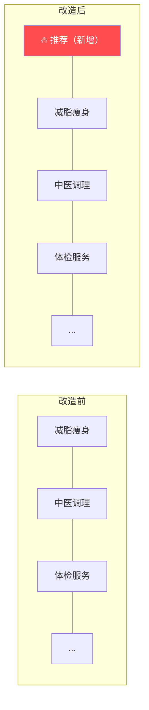
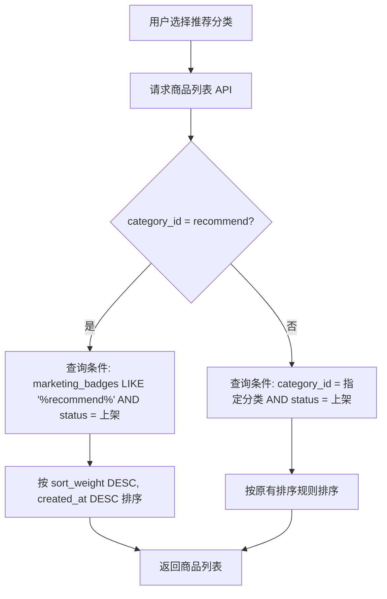
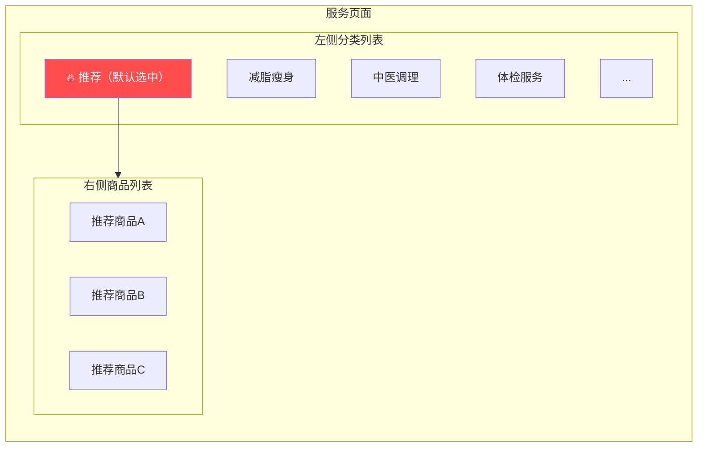
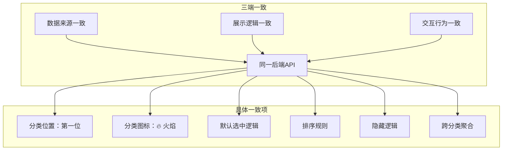

# 用户端「首页 → 服务」推荐分类 产品需求文档（PRD）

## 1. 需求概述

### 1.1 背景与目的

当前 bini-health 系统的用户端「首页 → 服务」页面，左侧分类列表仅展示数据库中的真实商品分类（如减脂瘦身、中医调理、体检服务等）。系统管理后台已有「营销角标」功能，商品可勾选"限时、热销、新品、推荐"四种角标，但在用户端缺少一个入口来集中展示被标记为"推荐"的商品。

本次需求旨在用户端「首页 → 服务」页面的分类列表最前方新增一个「推荐」虚拟分类，聚合展示所有被打了「推荐」营销角标的商品，提升优质商品的曝光率与用户发现效率。

### 1.2 目标用户

- **C 端用户**：通过 H5 网页端、Flutter APP 端、微信小程序端访问服务页面的所有用户

### 1.3 核心价值

- 让被运营标记为"推荐"的优质商品获得优先曝光入口
- 用户进入服务页面即可看到平台精选推荐内容，缩短决策路径
- 无需新增管理后台配置，复用已有「营销角标 → 推荐」机制，运营零学习成本



---

## 2. 功能需求

### 2.1 功能清单总览

| 编号 | 功能模块 | 功能点 | 优先级 | 说明 |
|------|----------|--------|--------|------|
| F01 | 后端 API | 推荐商品查询接口适配 | P0 | 支持按 `marketing_badges` 包含 `recommend` 筛选商品 |
| F02 | 后端 API | 分类列表接口适配 | P0 | 在分类列表响应中注入虚拟"推荐"分类（有推荐商品时） |
| F03 | H5 网页端 | 推荐分类展示与交互 | P0 | 分类列表首位展示推荐分类，支持点击切换 |
| F04 | Flutter APP 端 | 推荐分类展示与交互 | P0 | 同 H5，三端一致 |
| F05 | 微信小程序端 | 推荐分类展示与交互 | P0 | 同 H5，三端一致 |
| F06 | 全端 | 推荐分类为空时自动隐藏 | P0 | 无推荐商品时分类列表不显示推荐入口 |
| F07 | 全端 | 默认选中逻辑 | P0 | 有推荐商品时默认选中推荐分类 |

### 2.2 功能详细描述

#### F01 — 后端 API：推荐商品查询接口适配

**业务规则：**

- 当商品列表接口收到分类参数为"推荐"（约定特殊标识，如 `category_id=recommend`）时，查询条件改为：`marketing_badges` 字段包含 `recommend` 且商品状态为已上架
- 排序规则：按商品表的「排序权重」字段（`sort_weight` / `sort_order`）从高到低排序；权重相同时按创建时间倒序
- 返回数据格式与正常分类查询保持一致，无需额外字段

**数据来源示意：**



#### F02 — 后端 API：分类列表接口适配

**业务规则：**

- 分类列表接口在返回真实分类之前，先查询是否存在至少一个已上架且 `marketing_badges` 包含 `recommend` 的商品
- 若存在：在分类列表数组的**第一个位置**插入一个虚拟分类对象，字段如下：

| 字段 | 值 | 说明 |
|------|----|------|
| `id` | `"recommend"` | 特殊标识，与真实分类 ID 区分 |
| `name` | `"推荐"` | 分类名称 |
| `icon` | `"🔥"` 或约定的火焰图标资源标识 | 分类图标 |
| `is_virtual` | `true` | 标记为虚拟分类（可选，用于前端判断） |

- 若不存在推荐商品：不插入虚拟分类，分类列表保持原样

#### F03 — H5 网页端：推荐分类展示与交互

**展示规则：**

- 推荐分类显示在左侧分类列表的**第一个位置**
- 分类名称为「推荐」，名称前显示 🔥 火焰图标
- 样式与其他正常分类保持一致（字体、间距、选中态等），仅在名称前多一个火焰图标作为区分

**交互规则：**

- 点击「推荐」分类后，右侧商品列表展示所有营销角标含 `recommend` 的已上架商品
- 商品按推荐权重从高到低排序
- 商品卡片样式与其他分类下的商品卡片完全一致

**默认选中逻辑：**

- 用户进入「首页 → 服务」页面时：
  - 若推荐分类存在（有推荐商品）→ 默认选中推荐分类，右侧展示推荐商品列表
  - 若推荐分类不存在（无推荐商品）→ 默认选中第一个正常分类（保持现有逻辑）

**跨分类展示逻辑：**

- 推荐分类是一个**聚合视图**，商品同时出现在原所属分类和推荐分类中
- 例：「减脂瘦身」分类下的商品 A 被打了推荐标签 → 商品 A 同时出现在「推荐」和「减脂瘦身」两个分类下

```mermaid
flowchart TB
    subgraph 推荐分类（聚合视图）
        P1[商品A - 减脂瘦身]
        P2[商品B - 中医调理]
        P3[商品C - 体检服务]
    end
    subgraph 减脂瘦身
        Q1[商品A]
        Q2[商品D]
    end
    subgraph 中医调理
        R1[商品B]
        R2[商品E]
    end
    P1 -.->|同一商品| Q1
    P2 -.->|同一商品| R1
```

#### F04 — Flutter APP 端：推荐分类展示与交互

- 所有展示规则、交互规则、默认选中逻辑、跨分类展示逻辑与 H5 端完全一致
- 🔥 火焰图标在 Flutter 中使用对应的 emoji 或 Icon widget 实现

#### F05 — 微信小程序端：推荐分类展示与交互

- 所有展示规则、交互规则、默认选中逻辑、跨分类展示逻辑与 H5 端完全一致
- 🔥 火焰图标在小程序中使用 emoji 文本或自定义图标组件实现

#### F06 — 全端：推荐分类为空时自动隐藏

**业务规则：**

- 当系统中没有任何已上架商品的 `marketing_badges` 包含 `recommend` 时：
  - 后端分类列表接口不返回推荐虚拟分类
  - 前端三端的分类列表中不显示推荐入口
  - 页面表现与当前完全一致，用户无感知

- 当运营人员给某商品新增或移除「推荐」角标后：
  - 用户下次刷新/进入服务页面时，推荐分类自动出现或消失
  - 无需额外的"发布"或"生效"操作，实时生效

#### F07 — 全端：默认选中逻辑

| 场景 | 行为 |
|------|------|
| 推荐分类有商品 | 进入页面默认选中「推荐」分类，右侧展示推荐商品 |
| 推荐分类无商品（推荐分类不显示） | 进入页面默认选中第一个正常分类，保持现有行为 |
| 用户手动切换到其他分类后返回 | 保持用户最后选中的分类（页面内状态） |

---

## 3. 页面/界面设计

### 3.1 页面结构与导航

本次需求不新增页面，仅在现有「首页 → 服务」页面的分类列表和商品列表区域进行调整。



### 3.2 各页面功能说明

#### 分类列表区域

| 元素 | 说明 |
|------|------|
| 🔥 推荐 | 位于分类列表第一位，名称前带 🔥 火焰图标 |
| 选中态 | 与其他分类使用相同的选中态样式（如背景色变化、字体加粗等） |
| 未选中态 | 与其他分类使用相同的未选中态样式 |

#### 商品列表区域

| 元素 | 说明 |
|------|------|
| 商品卡片 | 与其他分类下的商品卡片完全一致（含图片、名称、价格、营销角标等） |
| 排序 | 按推荐权重从高到低，权重相同按创建时间倒序 |
| 空状态 | 推荐分类下无商品时不显示该分类，因此不存在空状态 |

---

## 4. 非功能性需求

### 4.1 性能要求

- 推荐商品查询需利用 `marketing_badges` 字段索引（若为 JSON 字段则考虑应用层过滤或增加辅助索引），确保查询响应时间 < 200ms
- 分类列表接口增加推荐分类判断逻辑后，整体响应时间增量 < 50ms

### 4.2 安全要求

- 推荐分类仅用于商品展示，不涉及新的数据写入接口，无额外安全风险
- 复用现有的商品列表查询权限，无需新增权限控制

### 4.3 兼容性要求

| 端 | 兼容范围 |
|----|----------|
| H5 网页端 | 主流移动端浏览器（Chrome、Safari、微信内置浏览器） |
| Flutter APP 端 | iOS 12+、Android 6.0+ |
| 微信小程序端 | 微信基础库 2.20.0+ |

---

## 5. 业务规则与约束

| 编号 | 规则 | 说明 |
|------|------|------|
| BR01 | 推荐标签数据来源 | 以商品表 `marketing_badges` 字段包含 `recommend` 为准，不新增独立字段 |
| BR02 | 推荐分类是虚拟分类 | 不在数据库分类表中新增记录，由后端 API 在接口层动态注入 |
| BR03 | 跨分类聚合展示 | 推荐商品同时保留在原所属分类中，推荐分类是聚合视图 |
| BR04 | 实时生效 | 运营在管理后台修改商品的推荐角标后，用户端下次请求即可生效 |
| BR05 | 排序规则 | 推荐分类下的商品按 `sort_weight`（推荐权重）降序排列，权重相同按 `created_at` 降序 |
| BR06 | 仅展示已上架商品 | 推荐分类中只展示状态为"已上架"的商品，下架/草稿状态的不展示 |
| BR07 | 自动隐藏 | 当无任何已上架商品携带推荐角标时，三端均不展示推荐分类入口 |

---

## 6. 权限设计

| 角色 | 权限说明 |
|------|----------|
| C 端用户 | 可查看推荐分类及其商品列表（只读） |
| 管理员（Admin） | 通过管理后台商品编辑页的「营销角标」勾选/取消「推荐」来控制哪些商品出现在推荐分类中（复用现有功能，无需新增权限） |

---

## 7. 异常处理与边界情况

| 编号 | 场景 | 处理方式 |
|------|------|----------|
| E01 | 所有推荐商品均被下架 | 推荐分类自动隐藏，页面默认选中第一个正常分类 |
| E02 | 推荐商品只有 1 个 | 正常展示推荐分类，右侧商品列表仅显示 1 个商品 |
| E03 | 同一商品属于多个分类且被标记推荐 | 商品在推荐分类中只出现一次，在各原始分类中也正常出现 |
| E04 | 管理员取消某商品的推荐角标 | 用户下次刷新后，该商品从推荐分类中消失；若推荐分类下无其他商品则分类隐藏 |
| E05 | 分类接口异常 | 前端兜底：若分类列表请求失败，展示错误提示并支持重试（复用现有错误处理逻辑） |
| E06 | 推荐商品数量极多（100+） | 复用现有分页/滚动加载逻辑，推荐分类下的商品列表同样支持分页 |

---

## 8. 补充说明

### 8.1 与现有功能的关联

- **营销角标功能**：本需求完全复用管理后台已有的「营销角标 → 推荐」功能，运营人员无需学习新操作，在商品编辑中勾选/取消「推荐」角标即可控制推荐分类的内容
- **商品分类功能**：推荐分类为虚拟分类，不影响现有分类体系，不在分类表中新增数据
- **商品排序功能**：推荐分类内的排序复用商品表已有的排序权重字段

### 8.2 三端一致性要求

H5 网页端、Flutter APP 端、微信小程序端的推荐分类功能在以下方面保持完全一致：



### 8.3 无需变更的部分

- 管理后台无需任何改动（复用现有营销角标功能）
- 商品详情页无需改动
- 购物/预约流程无需改动
- 数据库表结构无需新增字段或新增表
