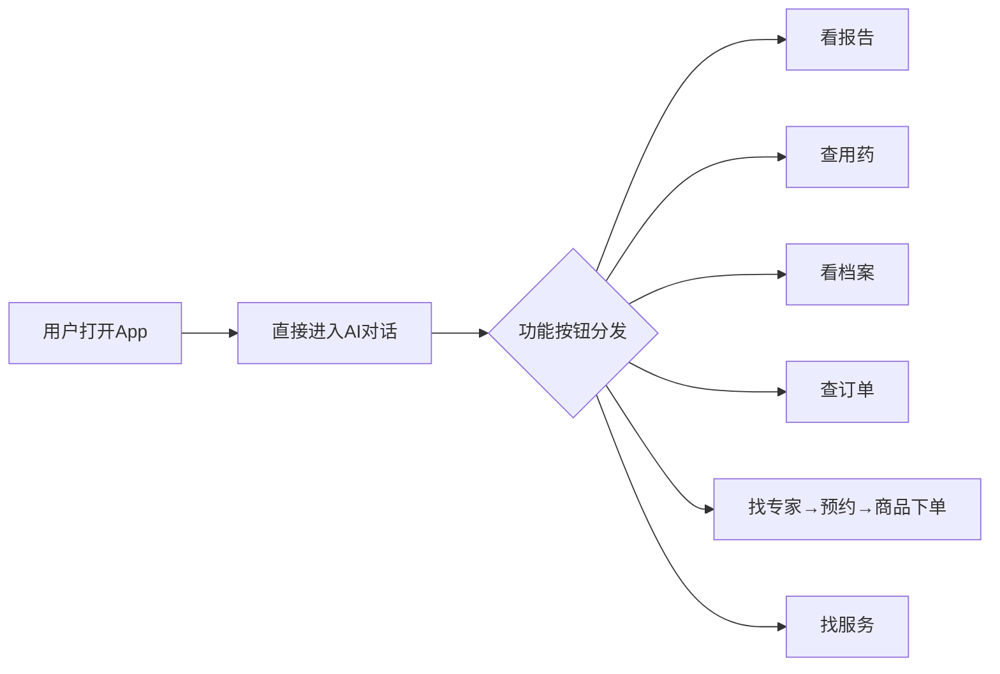
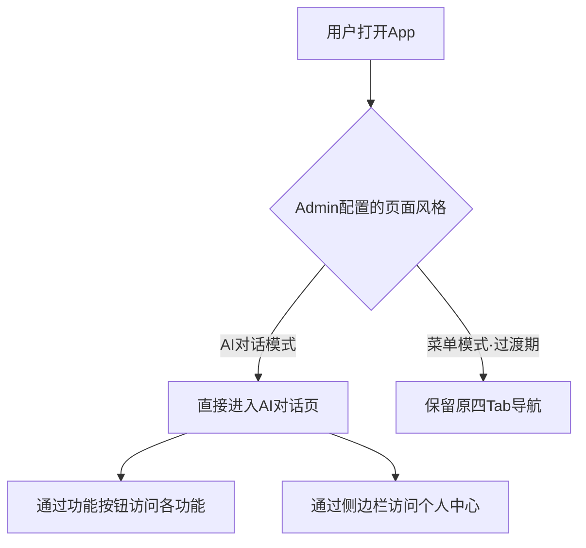
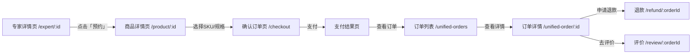
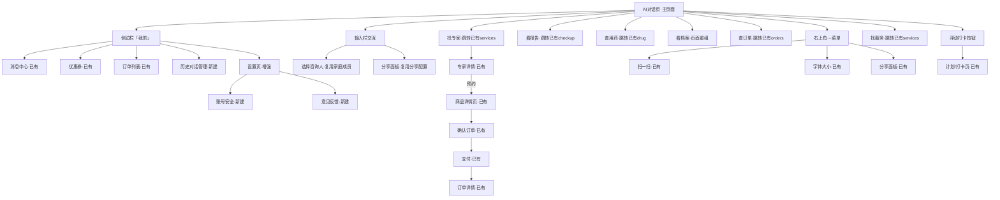
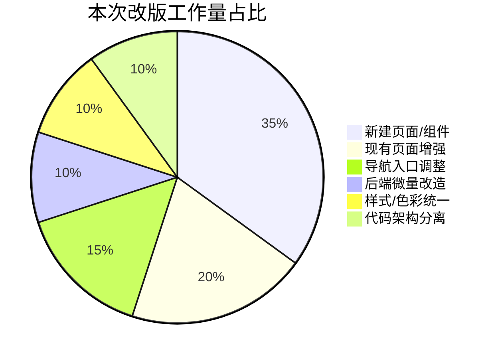

# 小康健康 用户端全面改版 产品需求文档（PRD）

> 基于小白 AI 自动化开发，所有功能将在一个版本内完成开发并一次性上线，部署至小白 AI 云服务器。

---

## 1. 需求概述

### 1.1 背景与目的

小康健康（bini-health）用户端目前采用传统的四Tab底部导航架构（咨询/档案/计划/服务），交互效率较低，用户不易感知AI健康助手的核心价值。本次改版参考讯飞晓医的设计理念，将用户端从"菜单模式"转变为"AI对话优先模式"——用户打开App即进入AI对话界面，所有功能通过对话中的功能按钮分发跳转，大幅降低用户学习成本、提升活跃度。

同时，Admin管理后台需新增视频客服配置能力，并将专家详情页的"在线咨询"按钮改为"预约"，对接系统已有的商品下单流程，实现专家服务与商品体系的完整闭环。

**核心原则：最大化复用现有系统已有功能**，本次改版只做架构层面的导航重组和新增场景补齐，不重复建设已有能力。

> ⚠️ **Admin后台管理功能全量复用（最高优先级约束）**
>
> 本次改版明确约定：Admin后台现有的**全部管理功能**均为本次改版的"基础设施"，**只接入不重建**。包括但不限于：
>
> - **健康档案管理** — 复用现有 Admin 健康档案管理页面，零改造
> - **订单管理** — 复用现有 Admin 统一订单管理（含核销、退款、到店记录等），零改造
> - **商品管理** — 复用现有 Admin 商品管理全套（商品/分类/SKU/结算/数据统计等），零改造
> - **优惠券管理** — 复用现有 Admin 优惠券管理、新人券管理，零改造
> - **消息管理** — 复用现有 Admin 系统消息、短信配置、微信推送、邮件通知等，零改造
> - **积分管理** — 复用现有 Admin 积分规则、积分商城管理、会员等级管理，零改造
>
> 上述模块在Admin侧**不新建任何管理页面**，用户端改版产生的数据（专家服务订单、积分变更、优惠券使用等）全部汇入现有管理体系中统一管理。开发过程中严禁为改版需求另建管理后台页面。

### 1.2 目标用户

| 角色 | 说明 |
|------|------|
| C端用户 | 使用H5/小程序/App的健康管理用户，通过AI对话获取健康咨询、管理档案、预约专家服务 |
| Admin管理员 | 后台运营人员，负责页面风格切换、功能按钮配置、视频客服配置、专家管理等 |

### 1.3 核心价值



- **降低操作路径**：从"找Tab→进子页面→操作"缩短为"对话中一键直达"
- **提升AI感知**：用户首屏即为AI对话，强化AI健康助手的品牌心智
- **商品闭环**：专家服务纳入商品体系，预约→下单→核销全链路打通
- **运营灵活**：Admin后台可配置功能按钮展示位置与组合，支持A/B测试不同运营策略
- **零重复建设**：充分复用系统已有的商品管理、订单、优惠券、积分、健康计划、AI咨询等全部能力

---

## 2. 现有系统功能复用全景图

> **本章为本次改版的核心约束：以下所有已有功能仅做导航入口调整或页面嵌入，不重新开发。**

### 2.1 现有系统功能盘点

```mermaid
flowchart TD
    subgraph 用户端已有功能【全部复用】
        U1[AI健康咨询对话 /chat]
        U2[体检报告上传与AI解读 /checkup]
        U3[用药参考与拍照识药 /drug]
        U4[健康档案 /health-profile]
        U5[健康计划与打卡 /health-plan]
        U6[中医体质辨识 /tcm]
        U7[症状自查 /symptom]
        U8[商品列表与详情 /products /product/:id]
        U9[结算与下单 /checkout]
        U10[统一订单管理 /unified-orders]
        U11[退款申请 /refund]
        U12[订单评价 /review]
        U13[积分中心 /points]
        U14[积分商城 /points/mall]
        U15[优惠券中心 /coupon-center /my-coupons]
        U16[专家详情 /expert/:id]
        U17[服务页 /services]
        U18[消息中心 /messages /notifications]
        U19[个人中心 /profile]
        U20[个人信息编辑 /profile/edit]
        U21[设置页 /settings]
        U22[家庭成员管理 /family-bindlist /family-auth /family-invite]
        U23[搜索与结果 /search/result]
        U24[文章与资讯 /articles /news]
        U25[数字人视频通话 /digital-human-call]
        U26[客服 /customer-service]
        U27[会员卡 /member-card]
        U28[邀请有礼 /invite]
        U29[城市选择 /city-select]
        U30[扫一扫 /scan]
        U31[分享对话 /shared/chat/:token]
        U32[我的收藏 /my-favorites]
        U33[收货地址 /my-addresses]
        U34[健康指南 /health-guide]
        U35[登录 /login]
    end

    subgraph Admin后台已有功能【全部复用】
        A1[商品管理 product-system/products]
        A2[商品分类 product-system/categories]
        A3[订单管理 product-system/orders]
        A4[核销管理 product-system/redemptions]
        A5[预约表单库 product-system/appointment-forms]
        A6[数据统计 product-system/statistics]
        A7[到店记录 product-system/visits]
        A8[合作伙伴 product-system/partners]
        A9[优惠券管理 product-system/coupons]
        A10[新人券管理 product-system/new-user-coupons]
        A11[积分规则 points/rules]
        A12[积分商城管理 points/mall]
        A13[会员等级 points/levels]
        A14[AI咨询配置 ai-config]
        A15[AI中心-提示词/免责/敏感词 ai-center]
        A16[提示词模板 prompt-templates]
        A17[功能按钮管理 function-buttons]
        A18[首页菜单管理 home-menus]
        A19[首页设置 home-settings]
        A20[首页轮播图 home-banners]
        A21[公告管理 notices]
        A22[底部导航管理 bottom-nav]
        A23[分享配置 share-config]
        A24[专家管理 experts]
        A25[用户管理 users]
        A26[健康档案管理 health-records]
        A27[家庭管理 family-management]
        A28[关系类型管理 relation-types]
        A29[聊天记录管理 chat-records]
        A30[商家管理 merchant]
        A31[系统消息 system-messages]
        A32[短信配置 sms]
        A33[微信推送 wechat-push]
        A34[邮件通知 email-notify]
        A35[TTS语音配置 tts-config]
        A36[语音服务 voice-service]
        A37[OCR配置 ocr-config /ocr-global-config]
        A38[COS存储配置 cos-config]
        A39[数字人管理 digital-humans]
        A40[疾病预设 disease-presets]
        A41[城市管理 city-management]
        A42[搜索管理 search]
        A43[内容管理 content]
        A44[体检明细管理 checkup-details]
        A45[中医配置 tcm-config]
        A46[健康计划管理 health-plan]
        A47[推荐码 referral]
        A48[审核管理 audit]
        A49[结算管理 admin-settlements]
        A50[商家类别管理 merchant-categories]
        A51[全局设置 settings]
        A52[仪表盘 dashboard]
        A53[客服配置 customer-service]
        A54[药品详情 drug-details]
        A55[知识库 knowledge]
        A56[降级配置 fallback-config]
        A57[搜索配置 search-config]
    end
```

### 2.2 复用策略矩阵

| 现有功能模块 | 本次改版中的复用方式 | 是否需改造 |
|-------------|-------------------|-----------|
| **AI对话 /chat** | 升级为主页面，输入栏交互增强、新增推荐问题卡片 | 增强（非重建） |
| **体检报告 /checkup** | "看报告"按钮跳转，对话内引导卡片 | 仅入口调整 |
| **用药参考 /drug** | "查用药"按钮跳转，对话内引导卡片 | 仅入口调整 |
| **健康档案 /health-profile** | "看档案"按钮跳转至档案页四子Tab | 页面重组（复用数据） |
| **健康计划 /health-plan** | 浮动打卡按钮跳转 | 仅入口调整 |
| **商品体系（列表/详情/SKU/结算/支付）** | 专家"预约"按钮跳转至商品详情→下单全链路 | 零改造，直接复用 |
| **订单管理 /unified-orders** | 侧边栏订单状态数字 + "查订单"按钮跳转 | 仅入口调整 |
| **退款 /refund** | 订单详情内继续复用 | 零改造 |
| **订单评价 /review** | 订单详情内继续复用 | 零改造 |
| **优惠券 /coupon-center /my-coupons** | 侧边栏快捷入口 | 仅入口调整 |
| **积分体系 /points** | 保持现有入口不变，可从侧边栏补充入口 | 零改造 |
| **积分商城 /points/mall** | 保持现有功能 | 零改造 |
| **消息中心 /messages /notifications** | 侧边栏消息入口（带角标） | 仅入口调整 |
| **家庭成员管理** | 选择咨询人弹窗复用家庭成员列表 | 仅入口调整 |
| **搜索功能** | 保持现有搜索能力 | 零改造 |
| **文章/资讯** | 保持现有阅读入口 | 零改造 |
| **数字人通话** | 保持现有功能 | 零改造 |
| **客服** | 保持现有功能 | 零改造 |
| **会员卡** | 保持现有功能 | 零改造 |
| **邀请有礼** | 保持现有功能 | 零改造 |
| **城市选择** | 保持现有功能 | 零改造 |
| **扫一扫** | ···菜单跳转至已有扫码页 | 仅入口调整 |
| **分享** | 分享面板调用已有分享配置 | 仅入口调整 |
| **收藏/地址** | 保持现有功能 | 零改造 |
| **登录体系（含失败锁定）** | 直接复用 | 零改造 |
| **Admin商品管理全套** | 专家关联商品直接使用 | 零改造 |
| **Admin订单/核销/预约表单** | 专家服务订单统一管理 | 零改造 |
| **Admin优惠券/新人券** | 专家服务可用优惠券 | 零改造 |
| **Admin积分规则（`points/rules`）** | 预约服务可获积分，自动适用现有积分规则 | 零改造 |
| **Admin积分商城管理（`points/mall`）** | 保持现有积分商城管理能力，不做任何改动 | 零改造 |
| **Admin会员等级（`points/levels`）** | 保持现有会员等级管理能力，不做任何改动 | 零改造 |
| **Admin健康档案管理（`health-records`）** | 用户端档案数据统一在Admin已有页面管理 | 零改造 |
| **Admin消息管理（系统消息/短信/微信推送/邮件）** | 保持现有消息管理全套能力 | 零改造 |
| **Admin AI咨询配置** | 推荐问题管理、功能按钮管理 | 新增视频客服子配置 |
| **Admin功能按钮管理** | 配置首页/快捷栏展示的功能按钮 | 零改造 |
| **Admin轮播图/首页配置** | 配置欢迎页轮播图和功能卡片 | 零改造 |
| **Admin分享配置** | 分享面板/海报使用 | 零改造 |
| **Admin专家管理** | 新增"关联商品"字段 | 微量改造 |
| **Admin TTS/语音** | 设置页语音设置复用 | 零改造 |

### 2.3 关键复用链路图

```mermaid
flowchart LR
    subgraph 本次新建
        N1[AI对话主页架构]
        N2[侧边栏面板]
        N3[历史对话管理]
        N4[账号安全子页]
        N5[意见反馈子页]
        N6[Admin视频客服配置]
        N7[Admin页面风格配置]
    end

    subgraph 已有功能·直接复用
        E1[商品详情 /product/:id]
        E2[结算下单 /checkout]
        E3[订单列表 /unified-orders]
        E4[订单详情 /unified-order/:id]
        E5[退款 /refund/:orderId]
        E6[评价 /review/:orderId]
        E7[优惠券 /my-coupons]
        E8[消息中心 /messages]
        E9[家庭成员 /family-bindlist]
        E10[扫一扫 /scan]
        E11[积分中心 /points]
        E12[健康计划 /health-plan]
        E13[AI对话 /chat/:sessionId]
        E14[报告解读 /checkup]
        E15[用药参考 /drug]
        E16[服务页 /services]
        E17[专家详情 /expert/:id]
        E18[健康档案 /health-profile]
        E19[设置页 /settings]
        E20[收货地址 /my-addresses]
    end

    N1 -->|"看报告"| E14
    N1 -->|"查用药"| E15
    N1 -->|"看档案"| E18
    N1 -->|"查订单"| E3
    N1 -->|"找专家"| E16
    N1 -->|"找服务"| E16

    E17 -->|"预约按钮"| E1
    E1 --> E2
    E2 --> E3
    E3 --> E4
    E4 --> E5
    E4 --> E6

    N2 -->|消息| E8
    N2 -->|优惠券| E7
    N2 -->|订单状态| E3
    N2 -->|设置| E19

    N1 -->|浮动按钮| E12
    N1 -->|···扫一扫| E10
```

---

## 3. 功能需求

### 3.1 功能清单总览

| 编号 | 功能模块 | 功能点 | 优先级 | 改造类型 | 说明 |
|------|----------|--------|--------|---------|------|
| F01 | 页面架构重构 | 取消四Tab底部导航，默认进入AI对话页 | P0 | **新建** | 核心架构变更 |
| F02 | AI对话页 | 输入栏三态（默认/聚焦/输入文字）+ 咨询人行 | P0 | **增强** | 基于现有AI对话页增强 |
| F03 | AI对话页 | 6个功能按钮配置与分发跳转 | P0 | **增强** | 复用现有功能按钮管理 |
| F04 | AI对话页 | 推荐问题卡片横向滚动（#标签） | P1 | **增强** | 参考蚂蚁阿福 |
| F05 | 首页/欢迎页 | 新用户欢迎态 + LOGO + 时段问候 + 轮播图 + 功能卡片 | P0 | **新建** | 复用现有轮播图/首页配置 |
| F06 | 首页 | 浮动打卡按钮（有任务时红点） | P1 | **新建** | 跳转复用现有健康计划 |
| F07 | 侧边栏「我的」 | 头像+VIP号+消息/优惠券+订单状态+历史对话+管理按钮 | P0 | **新建** | 复用现有订单/消息/优惠券 |
| F08 | 右上角···菜单 | 扫一扫 / 字体大小 / 立即分享 | P1 | **新建** | 跳转复用现有扫一扫/分享 |
| F09 | 选择咨询人 | 底部半屏弹窗 + 家庭成员列表 | P0 | **增强** | 复用现有家庭成员管理 |
| F10 | 分享面板 | 多渠道分享（微信/朋友圈/复制链接/海报） | P1 | **增强** | 复用现有分享配置 |
| F11 | 历史对话管理 | 管理模式+长按菜单+含附件确认弹窗 | P1 | **新建** | 三个新增场景 |
| F12 | 档案页四子Tab | 健康数据/运动睡眠/就医资料/健康信息 | P0 | **重组** | 复用现有健康档案数据 |
| F13 | 设置页 | 完整新布局 | P1 | **增强** | 基于现有设置页增强 |
| F14 | 账号安全子页 | 手机号/密码/微信绑定/注销 | P1 | **新建** | 复用现有密码修改能力 |
| F15 | 意见反馈子页 | 类型选择+文字描述+图片上传+联系方式 | P2 | **新建** | 新增功能 |
| F16 | 专家详情页 | 底部按钮改为「预约」→ 对接商品下单流程 | P0 | **微改** | 核心：复用整个商品下单链路 |
| F17 | Admin视频客服配置 | 开关/坐席URL/时段/排队上限/问候语/超时配置 | P1 | **新建** | 放在AI咨询配置菜单下 |
| F18 | Admin页面风格配置 | 菜单模式(过渡) / AI对话模式(推荐) 切换 | P0 | **新建** | 新增配置页 |
| F19 | 代码架构 | AI对话模式与菜单模式代码完全分离 | P0 | **新建** | 便于后续废弃旧代码 |
| F20 | 色彩规范统一 | 主色调蓝紫#5B6CFF全局统一 | P0 | **增强** | 设计系统 |

### 3.2 功能详细描述

---

#### F01 页面架构重构 — 取消四Tab导航

**当前状态**：底部四Tab导航（咨询/档案/计划/服务）

**目标状态**：
- 取消底部Tab导航栏
- 用户打开H5/App默认直接进入AI对话页面
- 原有的"档案""计划""服务"通过功能按钮跳转访问
- Admin后台可切换"菜单模式"（过渡期保留）和"AI对话模式"（推荐），代码层面新旧完全分离

**交互说明**：



**业务规则**：
- 页面风格仅在Admin后台切换，用户端无切换入口
- 菜单模式的代码需标记为过渡代码，后续一键删除
- 默认推荐AI对话模式
- **复用点**：菜单模式下保持现有的底部导航管理（Admin `bottom-nav`）完全不变

---

#### F02 AI对话页 — 输入栏交互

**基于现有的AI对话页（`/chat`、`/chat/:sessionId`）进行增强**，不重建对话引擎。

**输入栏三态设计**：

| 状态 | 左侧 | 中间 | 右侧 | 输入栏上方 |
|------|------|------|------|-----------|
| 默认态 | 语音按钮 | 输入框（placeholder："问问小康"） | 📷拍照按钮 | 快捷菜单横向胶囊可见 |
| 聚焦态 | 语音按钮 | 输入框（光标闪烁） | 📷拍照按钮 | 咨询人行滑出 + 推荐问题卡片横向滚动 |
| 输入文字态 | 语音按钮 | 输入框（有文字） | ➤发送按钮（替换拍照） | 咨询人行 + 推荐问题卡片 |

**咨询人行**：
- 仅在输入框聚焦时显示，失焦时隐藏
- 显示为胶囊标签（Chip）：头像缩写 + 关系名称 + 下拉箭头
- 右侧保留拍照/附件图标
- 点击胶囊标签弹出选择咨询人弹窗（底部半屏）
- **复用点**：咨询人数据完全复用现有家庭成员管理接口（`/api/family/members`）

**AI回答区域**：
- AI消息左对齐，用户消息右对齐
- AI回答进行中显示流式打字效果
- 每条AI消息底部显示灰色"AI生成 仅供参考"提示
- 操作按钮：复制 / 转发 / 语音朗读
- **复用点**：复用现有AI咨询对话引擎、TTS语音播报配置

---

#### F03 功能按钮配置与分发

**6个功能按钮及行为**：

| 按钮 | 图标 | 点击行为 | 跳转目标 | 复用说明 |
|------|------|---------|----------|---------|
| 看报告 | 📋 | 对话框内弹出功能引导卡片 | 引导上传体检报告 → 复用现有 `/checkup` 报告解读链路 | 复用现有OCR+AI解读 |
| 查用药 | 💊 | 对话框内弹出功能引导卡片 | 引导输入药名/拍药盒 → 复用现有 `/drug` 用药参考链路 | 复用现有用药查询 |
| 看档案 | 📁 | 页面跳转 | 跳转至健康档案页面 → 复用现有 `/health-profile` | 复用现有档案数据 |
| 查订单 | 📦 | 页面跳转 | 跳转至 `/unified-orders` 订单列表 | **直接复用**现有订单 |
| 找专家 | 👨‍⚕️ | 页面跳转 | 跳转至服务页的「专家服务」Tab → 复用 `/services` | 复用现有服务页 |
| 找服务 | 🏥 | 页面跳转 | 跳转至服务页面 → 复用 `/services` | 复用现有服务页 |

**功能按钮展示位置**（均由Admin后台配置，**复用现有 `function-buttons` 管理页面**）：
- **首页3个功能卡片区**：后台配置选哪3个展示
- **底部快捷标签栏**：后台配置展示哪些按钮
- **轮播图点击**：后台配置每张轮播图对应哪个功能（**复用现有 `home-banners` 轮播图管理**）

**功能引导卡片交互**（看报告/查用药）：
- 在对话区域内以卡片形式弹出
- 卡片包含标题、说明文字、操作按钮
- 用户操作后触发AI对话流程

---

#### F04 推荐问题卡片

- 聚焦时在咨询人行下方横向滚动展示
- 每个卡片以"#"标签形式呈现（参考蚂蚁阿福风格）
- 点击卡片直接发送该问题到对话
- **复用点**：卡片内容由后台 **AI咨询配置（`ai-config`）** 管理，复用现有配置能力

---

#### F05 首页/欢迎页

**展示条件**：无历史对话记录时展示欢迎态

**页面元素**：
- 顶部：LOGO头像 + "Hi~ [时段]好"（根据时间显示：早上好/中午好/下午好/晚上好）
- 副标题："健康管理用小康"
- 轮播图区域：**复用现有 Admin `home-banners` 轮播图管理配置**
- 3个功能卡片：**复用现有 Admin `function-buttons` 功能按钮管理配置**
- 底部快捷标签栏：**复用现有 Admin `function-buttons` 管理配置**

**三种首页状态**：

| 状态 | 特征 |
|------|------|
| 新用户首次进入 | 欢迎态，无数据，引导开始对话 |
| 有打卡任务态 | 右侧浮动打卡按钮+红点提示 |
| 有未读消息态 | 侧边栏入口角标+活动轮播+通知卡片 |

---

#### F06 浮动打卡按钮

- 位置：对话页右侧浮动
- 功能：点击跳转到计划/打卡页面
- 红点逻辑：当天有未完成打卡任务时显示红点
- **复用点**：**直接跳转现有 `/health-plan/checkin` 打卡页面**，复用现有健康计划模块的全部能力（含自定义计划、推荐计划、用药提醒、统计等）

---

#### F07 侧边栏「我的」

**触发方式**：点击左上角 ☰ 图标，从左侧滑出

**完整布局**（从上到下）：

1. **用户信息区**
   - 用户头像（圆形）— **复用现有用户信息接口**
   - 用户昵称
   - VIP会员编号 — **复用现有 `/member-card` 会员体系**

2. **快捷入口（两个图标按钮）**
   - 消息中心（带未读数角标）→ **直接跳转现有 `/messages` 消息中心页面**
   - 优惠券（带可用数角标）→ **直接跳转现有 `/my-coupons` 我的优惠券页面**

3. **订单状态数字栏**
   - 待付款 / 待使用 / 待评价 / 退款 — 各显示数字
   - 右侧"全部订单"入口 → **直接跳转现有 `/unified-orders` 统一订单列表**
   - **复用点**：调用现有订单统计接口获取各状态数量

4. **历史对话分组列表**
   - 按时间分组：今天 / 昨天 / 近7天 / 更早
   - 每条对话显示标题摘要 + 时间
   - 置顶的对话显示📌标记
   - 底部"管理"按钮入口
   - **复用点**：复用现有 `/chat` 对话列表接口

5. **底部**
   - 设置入口 → **跳转现有 `/settings` 设置页**（增强后）

---

#### F08 右上角···菜单

**触发方式**：点击右上角···图标

**菜单项**：
- 扫一扫 → **直接跳转现有 `/scan` 扫码页面**
- 字体大小 → 跳转字体调节页面（**复用现有AI咨询字体大小设置**）
- 立即分享 → 弹出分享面板（**复用现有分享配置 `share-config`**）

---

#### F09 选择咨询人弹窗

- 底部半屏弹窗
- **直接复用现有家庭成员管理的数据接口和成员列表**
- 每个成员显示头像、关系称谓、姓名（**复用现有 `relation-types` 关系类型**）
- 点击选中后自动切换对话上下文
- 支持"添加新成员"入口 → **跳转现有 `/family-bindlist` 家庭成员管理页面**

---

#### F10 分享面板

- 底部弹出面板
- 分享渠道：微信好友 / 朋友圈 / 复制链接 / 生成海报
- **复用点**：海报内容由 **Admin后台已有的 `share-config` 分享配置** 管理
- **复用点**：分享对话链接复用现有的 `/shared/chat/:token` 分享页面

---

#### F11 历史对话管理

**三个子场景**：

**a) 管理模式**
- 从侧边栏底部"管理"按钮进入
- 对话列表左侧出现多选勾选框
- 底部操作栏：清空全部 / 删除选中
- 顶部显示"完成"按钮退出管理模式

**b) 长按气泡菜单**
- 长按对话条目弹出气泡菜单
- 菜单项：置顶/取消置顶 | 删除
- 置顶后对话固定在列表顶部并显示📌标记

**c) 删除含附件确认弹窗**
- 当删除的对话包含报告/文件附件时弹出
- 三个选项：仅删除对话 / 连同报告一起删除 / 取消
- 明确告知用户"报告将同步删除且不可恢复"

---

#### F12 档案页四子Tab

从原底部导航"档案"Tab迁移为独立页面，通过功能按钮"看档案"跳转访问。**数据层完全复用现有健康档案模块（`health-records` / `health-profile`）。**

**四个子Tab**：

| 子Tab | 核心功能 | 数据录入方式 | 复用说明 |
|-------|---------|-------------|---------|
| 健康数据 | 身高/体重（已有）+ 腰围/BMI/WHtR（新增）+ 血压/心率/血糖/体温 | 页面内直接编辑，底部滑出半屏弹窗 | **复用现有健康档案数据表** |
| 运动睡眠 | 今日步数 + 近7日步数趋势图 + 睡眠记录 | 手动录入，预留设备接口 | 新增子模块 |
| 就医资料 | 四分类（病历/体检报告/药物/其它）+ 统一上传入口 | 4种文件来源 | **复用现有OCR/COS上传能力** |
| 健康信息 | 慢性病/既往病/过敏/家族遗传/生活习惯 | 表单选择 + 自定义输入 | **复用现有疾病预设（`disease-presets`）** |

---

#### F13 设置页（增强布局）

**基于现有 `/settings` 设置页增强**，新增分组和设置项：

| 分组 | 设置项 | 复用说明 |
|------|--------|---------|
| 个人信息 | 头像 / 昵称 / 性别 / 生日 / 手机号 → 跳转账号安全 | **复用现有 `/profile/edit` 编辑页** |
| 通知设置 | 消息推送开关 / 声音提醒开关 | **复用现有通知配置** |
| 隐私设置 | 健康数据分享范围 / 对话记录保存时长 | 新增设置项 |
| 语音设置 | AI语音播报开关 / 语速调节 / 音色选择 | **复用现有TTS配置（`tts-config`）** |
| 存储 | 清除缓存（显示缓存大小） | 新增 |
| 关于 | 版本号 / 用户协议 / 隐私政策 / 意见反馈 | 意见反馈为新建子页 |
| 操作 | 退出登录（红色文字） | **复用现有登出逻辑** |

---

#### F14 账号安全子页

| 功能项 | 说明 | 复用说明 |
|--------|------|---------|
| 手机号管理 | 显示当前绑定手机号（脱敏显示）+ 更换手机号入口 | **复用现有短信验证体系（`sms`）** |
| 登录密码 | 修改密码 / 设置密码 | **复用现有密码修改接口** |
| 微信绑定 | 绑定/解绑微信 + 显示绑定状态 | 新增能力 |
| 账号注销 | 注销须知 + 确认弹窗 + 验证码二次确认 | 新增能力 |

---

#### F15 意见反馈子页

| 元素 | 说明 |
|------|------|
| 反馈类型 | 单选：功能建议 / 内容反馈 / Bug报告 / 其他 |
| 描述输入 | 多行文本框，最多500字 |
| 图片上传 | 最多4张图片，**复用现有COS上传能力（`cos-config`）** |
| 联系方式 | 可选填写手机号或邮箱 |
| 提交 | 提交后Toast提示"感谢您的反馈" |

---

#### F16 专家详情页 — 预约对接商品下单流程（核心关联变更）

**当前状态**：专家详情页底部按钮为"在线咨询"，点击后进入IM聊天

**目标状态**：底部按钮改为"预约"，点击后进入**现有商品下单流程**



**本环节完全复用的现有功能清单**：

| 序号 | 现有模块 | 复用方式 | 零改造 |
|------|---------|---------|--------|
| 1 | 商品管理（Admin `product-system/products`） | 专家服务作为商品创建，类型标记为"专家服务" | ✅ |
| 2 | 商品分类（Admin `product-system/categories`） | 新增"专家服务"分类或复用现有服务分类 | ✅ |
| 3 | 商品SKU | 专家可设置不同服务规格（如30分钟/60分钟/图文问诊/视频问诊） | ✅ |
| 4 | 商品详情页（`/product/:id`） | 预约按钮直接跳转到关联商品的详情页，用户选规格下单 | ✅ |
| 5 | 结算页（`/checkout`） | 确认订单、选地址、用优惠券、计算价格 | ✅ |
| 6 | 支付能力 | 微信支付/余额支付，复用现有支付接口 | ✅ |
| 7 | 预约与核销（商品 `appointment_mode`） | 专家服务商品启用预约模式（日期预约/时段预约） | ✅ |
| 8 | 预约表单库（`appointment-forms`） | 可关联预约表单收集就诊信息 | ✅ |
| 9 | 订单管理（Admin `product-system/orders`） | 专家服务订单在统一订单体系中管理 | ✅ |
| 10 | 订单列表（`/unified-orders`） | 用户端查看全部订单含专家服务订单 | ✅ |
| 11 | 订单详情（`/unified-order/:id`） | 查看专家服务订单详情 | ✅ |
| 12 | 退款（`/refund/:orderId`） | 专家服务订单支持退款 | ✅ |
| 13 | 评价（`/review/:orderId`） | 服务完成后评价 | ✅ |
| 14 | 优惠券体系（`/my-coupons`、Admin `coupons`） | 专家服务商品可使用优惠券 | ✅ |
| 15 | 新人券（Admin `new-user-coupons`） | 新用户可用新人券购买专家服务 | ✅ |
| 16 | 核销管理（Admin `product-system/redemptions`） | 线下就诊后核销 | ✅ |
| 17 | 到店记录（Admin `product-system/visits`） | 记录到店就诊 | ✅ |
| 18 | 数据统计（Admin `product-system/statistics`） | 专家服务销售数据统计 | ✅ |
| 19 | 积分体系（`/points`、Admin `points/rules`） | 购买专家服务可获积分 | ✅ |
| 20 | 收货地址（`/my-addresses`） | 如需上门服务可选地址 | ✅ |

**后端唯一改造点**：
- `experts` 表新增 `product_id` 字段，关联 `products` 表
- 专家API返回关联的商品信息（商品ID、价格、SKU列表）
- Admin专家管理页面（`experts`）新增"关联商品"下拉选择
- 用户端专家详情页底部按钮跳转逻辑变更

---

#### F17 Admin视频客服配置页

**导航位置**：AI咨询配置 > 视频客服（**复用现有AI咨询配置菜单结构**）

**配置项**：

| 配置项 | 类型 | 说明 |
|--------|------|------|
| 视频客服总开关 | Switch | 开启/关闭视频客服功能 |
| 坐席服务URL | Input | 第三方视频客服服务地址 |
| 服务时段 | TimePicker×2 | 服务开始时间～结束时间 |
| 排队上限 | InputNumber | 最大同时排队人数 |
| 欢迎问候语 | TextArea | 用户接入时的欢迎消息 |
| 等待提示语 | TextArea | 排队等待时的提示文案 |
| 超时时长(秒) | InputNumber | 无应答自动断开的超时时间 |
| 非服务时段提示 | TextArea | 非服务时间用户尝试连接时的提示 |

---

#### F18 Admin页面风格配置

**导航位置**：**复用现有 `home-settings` 首页设置菜单**，或独立一级菜单

**配置内容**：

| 选项 | 说明 | 状态 |
|------|------|------|
| AI对话模式 | 无底部Tab，首屏即AI对话 | 推荐（默认） |
| 菜单模式 | 保留底部四Tab导航 | 过渡期保留 |

**切换逻辑**：
- 切换后即时生效，用户端下次加载使用新模式
- 提供切换确认弹窗，说明影响范围
- 页面上标注"菜单模式为过渡方案，建议使用AI对话模式"

---

#### F19 代码架构 — 新旧分离

**目标**：AI对话模式的代码与菜单模式的代码完全分离，便于后续废弃旧代码时一键删除。

**实现策略**：
- 新建独立的路由/组件目录用于AI对话模式
- 菜单模式的路由/组件保持原位不动
- 通过Admin配置的风格开关在入口层面做路由切换
- 两套代码不共享有状态的组件，仅共享纯工具函数和API层

---

#### F20 色彩规范统一

**主色调**：`#5B6CFF`（蓝紫色）

| 用途 | 色值 |
|------|------|
| 主色 / 按钮 / 链接 / Tab激活 | #5B6CFF |
| 主色悬停 | #4A5AE8 |
| 主色浅底 | #EEF0FF |
| 背景色 | #F5F6FA |
| 卡片背景 | #FFFFFF |
| 主文字 | #1A1A2E |
| 副文字 | #8C8CA1 |
| 分割线 | #E8E8F0 |
| 成功 | #52C41A |
| 警告 | #FAAD14 |
| 错误/危险 | #FF4D4F |

---

## 4. 页面/界面设计

### 4.1 页面结构与导航

**AI对话模式下的页面层级**：



### 4.2 各页面功能说明

#### 4.2.1 AI对话页（主页面）

- **顶部栏**：左侧 ☰ 图标 + "小康" 文字 | 右侧 ··· 图标
- **对话区域**：消息气泡流式排列，AI消息左对齐蓝紫背景，用户消息右对齐白色背景
- **底部输入栏**：三态切换（默认/聚焦/输入文字）
- **浮动元素**：右侧打卡按钮（有任务时红点）
- **复用**：基于现有AI对话页架构增强

#### 4.2.2 首页/欢迎态（无对话记录时）

- LOGO + 时段问候语 + 品牌slogan
- 轮播图（**复用Admin `home-banners` 管理**）
- 3个功能卡片（**复用Admin `function-buttons` 管理**）
- 底部快捷标签栏

#### 4.2.3 侧边栏「我的」

- 左侧滑出，覆盖60%屏幕宽度
- 背景半透明遮罩
- 点击遮罩或右滑关闭

#### 4.2.4 档案页

- 顶部四子Tab切换
- 每个子Tab有各自的数据展示卡片
- 数据编辑通过底部半屏弹窗
- **复用现有健康档案数据层**

#### 4.2.5 专家详情页

- 专家头像、姓名、职称、科室
- 擅长领域标签
- 专家简介
- 用户评价
- **底部固定栏**：「预约」按钮（蓝紫色主按钮）→ 跳转至关联**商品详情页（已有 `/product/:id`）**

#### 4.2.6 订单列表页

- 五个状态Tab：全部 / 待付款 / 待使用 / 待评价 / 退款
- 卡片式订单展示
- 包含专家服务订单和普通商品订单
- **直接复用现有 `/unified-orders` 页面，零改造**

#### 4.2.7 Admin视频客服配置页

- 标准Admin表单页面
- 表单项参见 F17 功能描述
- 顶部开关控制整体启停
- 底部保存/重置按钮

#### 4.2.8 Admin页面风格配置页

- 两个卡片选项（AI对话模式 / 菜单模式）
- 当前启用的模式高亮 + 勾选标记
- AI对话模式卡片标注"推荐"角标
- 菜单模式卡片标注"过渡期"

---

## 5. 非功能性需求

### 5.1 性能要求

| 指标 | 要求 |
|------|------|
| AI对话页首屏加载 | ≤ 2秒（3G网络下 ≤ 4秒） |
| 消息发送响应 | ≤ 500ms（至显示"发送中"状态） |
| AI流式回复首token | ≤ 1.5秒 |
| 侧边栏滑出动画 | 60fps，≤ 300ms |
| 页面切换动画 | ≤ 300ms |

### 5.2 安全要求

| 项目 | 要求 | 复用说明 |
|------|------|---------|
| 对话内容传输 | HTTPS加密 | 复用现有HTTPS配置 |
| 健康档案数据 | 加密存储，仅授权用户可访问 | 复用现有权限体系 |
| 账号注销 | 二次验证码确认 + 7天冷静期 | 复用现有短信验证 |
| 登录安全 | 复用已有的登录失败锁定机制（5次/10分钟） | **零改造** |
| 文件上传安全 | 类型校验 + 大小限制 | 复用现有COS上传校验 |

### 5.3 兼容性要求

| 端 | 要求 |
|----|------|
| H5 | iOS Safari 14+、Android Chrome 80+、微信内置浏览器 |
| 小程序 | 微信基础库 2.20.0+ |
| Flutter App | iOS 13+、Android 8.0+ |

---

## 6. 业务规则与约束

### 6.1 专家与商品关联规则

| 规则编号 | 规则描述 |
|----------|---------|
| BR-01 | 每个专家只能关联一个商品（1:1关系），一个商品可被多个专家关联 |
| BR-02 | 专家关联的商品必须为"已上架"状态，否则"预约"按钮置灰不可点击 |
| BR-03 | 专家关联的商品被下架时，专家详情页底部显示"暂停预约"提示 |
| BR-04 | 未关联商品的专家，详情页底部不显示"预约"按钮，仅显示专家信息 |
| BR-05 | 专家服务订单在统一订单体系中管理，订单类型标记为"专家服务"，复用现有订单全流程 |

### 6.2 页面风格切换规则

| 规则编号 | 规则描述 |
|----------|---------|
| BR-06 | 页面风格切换后即时生效，用户端下次页面加载时使用新模式 |
| BR-07 | 切换前需确认弹窗，告知影响范围 |
| BR-08 | 系统初始默认为"AI对话模式" |

### 6.3 历史对话管理规则

| 规则编号 | 规则描述 |
|----------|---------|
| BR-09 | 置顶对话最多5条，超出时提示"最多置顶5条对话" |
| BR-10 | 删除含附件的对话需用户二次确认选择"仅删对话"或"连同附件删除" |
| BR-11 | "清空全部"操作需输入确认文字（如"确认清空"）方可执行 |

### 6.4 视频客服规则

| 规则编号 | 规则描述 |
|----------|---------|
| BR-12 | 非服务时段内用户发起视频客服请求，显示配置的非服务时段提示语 |
| BR-13 | 排队人数达到上限时，新用户排队请求被拒绝并提示稍后再试 |
| BR-14 | 超时无应答自动断开连接并提示用户 |

### 6.5 复用约束规则

| 规则编号 | 规则描述 |
|----------|---------|
| BR-15 | 所有标记为"零改造"的现有功能，本次改版中仅做导航入口调整，不修改其内部逻辑 |
| BR-16 | 现有Admin后台配置页面（功能按钮、轮播图、首页设置、分享配置等）保持原有操作方式不变 |
| BR-17 | 现有的商品管理、订单管理、优惠券管理等全套流程，专家服务作为其中一种商品类型接入，不增加独立流程 |
| BR-18 | 现有的积分规则自动适用于专家服务商品，无需为专家服务单独配置积分规则 |
| BR-19 | **Admin后台管理功能全量复用**：健康档案管理、订单管理、商品管理、优惠券管理、消息管理、积分管理（积分规则/积分商城/会员等级）等全部Admin已有管理功能，本次改版中不新建任何管理页面，只接入不重建 |
| BR-20 | 积分管理（积分规则、积分商城管理、会员等级管理）完全复用现有Admin后台能力，不做任何改动，专家服务商品自动纳入现有积分体系 |
| BR-21 | 用户端改版产生的所有业务数据（专家服务订单、积分变更、优惠券核销、消息推送等）全部汇入现有Admin管理体系中统一管理，严禁建设独立管理通道 |

---

## 7. 权限设计

| 角色 | 权限说明 |
|------|----------|
| C端用户 | 使用AI对话、管理个人档案、查看/管理历史对话、预约专家（复用商品下单）、查看订单（复用统一订单）、使用优惠券、获取积分、设置个人信息、提交反馈 |
| Admin管理员 | 配置页面风格、管理功能按钮展示（复用已有）、配置视频客服参数、管理专家信息及商品关联（复用已有专家管理+商品管理）、管理AI咨询配置（复用已有） |
| Admin超级管理员 | 以上全部权限 + 账号管理 + 系统级配置 |

---

## 8. 异常处理与边界情况

| 场景 | 处理方式 |
|------|---------|
| 专家未关联商品，用户点击"预约" | 按钮不展示或置灰，Toast提示"该专家暂未开放预约" |
| 关联商品已下架 | "预约"按钮置灰，提示"暂停预约，请稍后再试" |
| AI对话接口超时 | 显示"网络异常，请重试"提示 + 重试按钮（复用现有重试机制） |
| 视频客服服务不可用 | 显示"视频客服暂时不可用"提示 + 建议使用AI文字咨询 |
| 侧边栏加载订单数失败 | 订单状态数字显示"-"，不阻断侧边栏展示 |
| 历史对话列表为空 | 显示空状态插画 + "开始你的第一次健康咨询吧"引导 |
| 档案数据加载失败 | 显示重试按钮 + 上次缓存数据（如有） |
| 功能按钮配置为空 | 使用默认的6个按钮全部展示 |
| 轮播图配置为空 | 隐藏轮播区域，不影响其他模块 |
| 扫一扫权限被拒绝 | 引导用户前往系统设置开启相机权限（复用现有引导页） |
| 商品详情页加载失败 | 显示错误页+重试按钮（复用现有商品详情错误处理） |
| 支付失败 | 复用现有支付失败提示和重试流程 |
| 优惠券不可用 | 复用现有优惠券状态校验和提示 |

---

## 9. 补充说明

### 9.1 改造工作量分析



**纯新建（7项）**：侧边栏面板、历史对话管理（3场景）、账号安全子页、意见反馈子页、Admin视频客服配置页、Admin页面风格配置页、代码架构分离

**增强（5项）**：AI对话页输入栏、功能按钮分发、选择咨询人弹窗、分享面板、设置页布局

**仅入口调整（8项）**：看报告、查用药、看档案、查订单、找专家、找服务、扫一扫、字体大小 — 全部跳转到现有页面

**零改造直接复用（25+项）**：商品详情、结算、支付、订单列表、订单详情、退款、评价、优惠券、新人券、积分规则、积分商城、会员等级、核销、预约表单、到店记录、消息中心（系统消息/短信/微信推送/邮件）、健康档案管理、会员卡、邀请有礼、搜索、文章资讯、数字人通话、客服、收货地址、登录体系等。**Admin后台全部管理功能均为零改造，只接入不重建。**

### 9.2 数据库变更预估

| 表 | 变更类型 | 说明 |
|----|---------|------|
| `experts` | ALTER | 新增 `product_id` 外键关联 `products` 表 |
| `app_config` / `system_config` | INSERT | 新增页面风格配置项 |
| `video_consult_config` | CREATE | 视频客服配置表（开关、URL、时段、上限等） |
| `chat_conversations` | ALTER | 新增 `is_pinned` 字段（置顶标记）、`pinned_at` 字段 |
| `user_feedback` | CREATE | 用户反馈表（类型、描述、图片、联系方式、状态） |

> 注意：现有的 `products`、`product_skus`、`orders`、`order_items`、`coupons`、`points`、`users`、`family_members` 等核心表**无需任何改动**。

### 9.3 设计图参考

本PRD对应的全量设计图为 v2 版本（34个场景），已在之前的设计图沟通中确认完毕，包含首页系列、AI对话页系列、弹窗覆盖层、历史对话管理、档案页系列、功能页面、设置系列、专家/对话、工具页面、Admin后台等完整场景。主色调蓝紫 #5B6CFF。

### 9.4 开发方式

本系统将基于小白 AI 进行自动化开发，并部署至小白 AI 云服务器。所有功能将在一个版本内完成开发并一次性上线。
