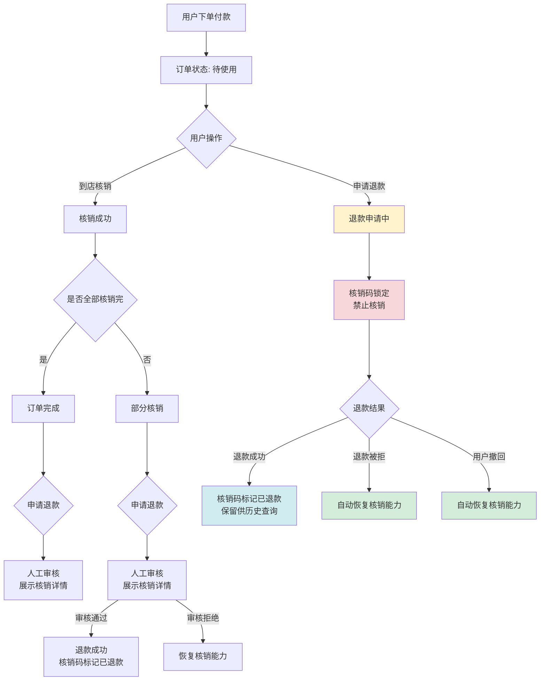
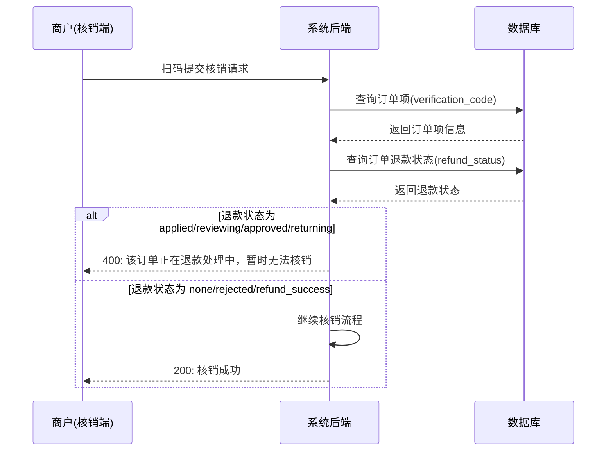
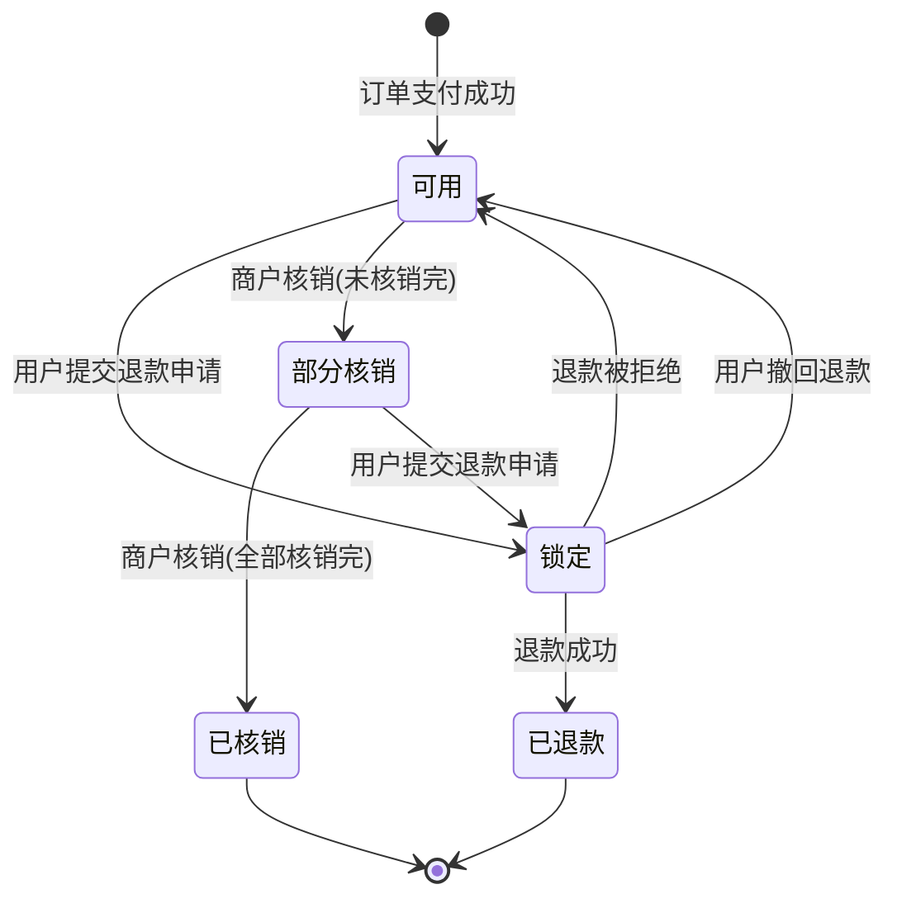

# 退款与核销互斥业务保护 产品需求文档（PRD）

## 1. 需求概述

### 1.1 背景与目的

当前系统中，用户下单购买到店服务类商品后，系统会为订单生成核销码（二维码）。用户到店后，商户扫码核销即可完成服务确认。但核销接口在执行时**仅校验了核销码有效性和已核销次数**，未对订单的退款状态进行检查。

这导致了一个业务风险漏洞：**当用户正在申请退款时，其核销码仍然可以被商户正常核销**，存在"既享受了服务又拿到退款"的可能。

本需求旨在建立**退款与核销的互斥保护机制**，确保两个业务流程不会相互冲突，保障平台与商户的资金安全。

### 1.2 目标用户

| 角色 | 说明 |
|------|------|
| 普通用户（C端） | 购买商品后，可申请退款或到店核销 |
| 商户（B端） | 通过核销小程序扫码核销用户订单 |
| 管理员（后台） | 审核退款申请，处理退款纠纷 |

### 1.3 核心价值

- **杜绝"退款+核销"双重得利**的业务漏洞，保护商户利益
- **明确退款与核销的互斥关系**，让各方在各状态下的行为预期清晰
- **退款被拒/撤回后自动恢复核销能力**，不影响正常用户体验
- **已核销订单退款走人工审核**，由运营灵活决定退款策略



---

## 2. 功能需求

### 2.1 功能清单总览

| 编号 | 功能模块 | 功能点 | 优先级 | 说明 |
|------|----------|--------|--------|------|
| F01 | 核销拦截 | 退款申请中订单禁止核销 | P0 | 核销接口增加退款状态检查，退款中订单拦截核销 |
| F02 | 核销恢复 | 退款被拒后自动恢复核销能力 | P0 | 退款申请被管理员拒绝后，自动解除核销锁定 |
| F03 | 核销恢复 | 用户撤回退款后自动恢复核销能力 | P0 | 用户主动撤回退款申请后，自动解除核销锁定 |
| F04 | 退款成功处理 | 退款成功后核销码标记"已退款" | P0 | 核销码保留但标记为已退款状态，仅供历史查询 |
| F05 | 已核销退款 | 已核销订单允许提交退款申请 | P0 | 需进入人工审核流程，由审核人决定退款金额 |
| F06 | 审核辅助 | 退款审核页展示核销详情 | P1 | 展示已核销次数/总次数 + 每次核销时间和门店信息 |
| F07 | 商户端提示 | 核销被拦截时的友好提示 | P1 | 核销小程序/APP 展示"该订单正在退款处理中，暂时无法核销" |

### 2.2 功能详细描述

#### F01：退款申请中订单禁止核销

**业务规则：**

- 当订单的 `refund_status` 处于以下任一状态时，核销接口拒绝核销：
  - `applied`（退款申请中）
  - `reviewing`（退款审核中）
  - `approved`（退款已批准，待退款）
  - `returning`（退回中）
- 核销码锁定时机：**用户提交退款申请后立即锁定**（从 `applied` 状态开始拦截）
- 拦截时返回明确的错误信息，HTTP 状态码 `400`

**交互说明：**

```
商户扫码 → 系统校验核销码有效性 → 校验核销次数 → 【新增】校验退款状态 → 核销成功/失败
```



#### F02：退款被拒后自动恢复核销能力

**业务规则：**

- 管理员在后台拒绝退款申请时，系统自动将订单的 `refund_status` 更新为 `rejected`
- 此时核销码自动解除锁定，商户可正常扫码核销
- 无需人工干预，状态变更即自动生效

**触发条件：** 管理员点击"拒绝退款" → 订单 `refund_status` 变为 `rejected` → 核销拦截条件不再满足 → 核销能力恢复

#### F03：用户撤回退款后自动恢复核销能力

**业务规则：**

- 用户在退款申请尚未完成的阶段主动撤回退款
- 撤回后订单 `refund_status` 恢复为 `none`
- 核销码自动解除锁定，逻辑与退款被拒一致

**触发条件：** 用户点击"撤回退款" → 订单 `refund_status` 恢复为 `none` → 核销拦截条件不再满足 → 核销能力恢复

#### F04：退款成功后核销码标记"已退款"

**业务规则：**

- 退款成功后（`refund_status` = `refund_success`），核销码不销毁、不删除
- 核销码保留在系统中，但标记为"已退款"状态
- 用户端展示核销码时，显示"已退款"标识，不可用于核销
- 历史记录中仍可查询到该核销码及其关联订单信息

**数据处理：**

- `OrderItem` 表中 `verification_code` 字段保留不清空
- 核销码在展示层面增加"已退款"状态标识
- 核销接口对 `refund_success` 状态的订单同样拦截，返回"该订单已退款，核销码已失效"

#### F05：已核销订单允许提交退款申请（人工审核）

**业务规则：**

- 已发生核销（`used_redeem_count > 0`）的订单，用户仍可提交退款申请
- 此类退款申请**强制进入人工审核流程**，不允许自动退款
- 审核人根据核销情况自主决定退款金额，系统不做自动计算规则的硬性限定

**退款申请提交时的处理：**

1. 检查该订单是否有核销记录
2. 若有核销记录，退款申请自动标记为"需人工审核"
3. 同时在退款申请中记录提交时的核销状态快照

#### F06：退款审核页展示核销详情

**业务规则：**

管理后台退款审核页面需展示以下辅助信息，帮助审核人做出合理决策：

| 展示信息 | 说明 | 数据来源 |
|----------|------|----------|
| 已核销次数 / 总核销次数 | 如 "3 / 10" | `OrderItem.used_redeem_count` / `total_redeem_count` |
| 核销比例 | 如 "30%" | 计算得出 |
| 每次核销时间 | 精确到分钟 | `OrderRedemption.redeemed_at` |
| 每次核销门店 | 门店名称 | `OrderRedemption.store_id` → `Store.store_name` |
| 核销操作人 | 商户/员工姓名 | `OrderRedemption.redeemed_by_user_id` → `User.name` |
| 订单总金额 | 订单实付金额 | `UnifiedOrder.paid_amount` |

**页面布局示意：**

```
┌───────────────────────────────────────────────┐
│  退款审核详情                                    │
├───────────────────────────────────────────────┤
│  订单编号: UO20260428123456                     │
│  用户: 张三 (138****1234)                       │
│  订单金额: ¥299.00                              │
│  退款申请金额: ¥299.00                          │
│  退款原因: xxxxxxxxx                            │
├───────────────────────────────────────────────┤
│  ⚠️ 核销情况（该订单已发生核销）                   │
│  ┌─────────────────────────────────────────┐  │
│  │ 核销进度: 3 / 10 次 (30%)               │  │
│  │                                         │  │
│  │ 核销明细:                               │  │
│  │ ① 2026-04-20 14:30  XX门店  店员A      │  │
│  │ ② 2026-04-22 10:15  XX门店  店员B      │  │
│  │ ③ 2026-04-25 16:45  YY门店  店员C      │  │
│  └─────────────────────────────────────────┘  │
│                                               │
│  审核退款金额: [输入框，审核人自主填写]           │
│  审核备注: [输入框]                             │
│                                               │
│  [通过退款]  [拒绝退款]                         │
└───────────────────────────────────────────────┘
```

#### F07：商户端核销被拦截时的友好提示

**提示信息：**

- 退款申请中 / 审核中 / 已批准 / 退回中：`"该订单正在退款处理中，暂时无法核销"`
- 退款已成功：`"该订单已退款，核销码已失效"`

**涉及端：**

- 核销小程序（verify-miniprogram）
- Flutter App 中的商户核销模块
- 管理后台的核销功能（如有）

---

## 3. 页面/界面设计

### 3.1 页面结构与导航

本需求涉及以下页面的修改，不新增独立页面：

| 页面 | 端 | 修改内容 |
|------|----|----------|
| 核销结果页 | 核销小程序 | 增加退款拦截提示展示 |
| 核销结果页 | Flutter App（商户端） | 增加退款拦截提示展示 |
| 订单详情页 | 用户端（H5/小程序/Flutter） | 核销码区域增加"已退款"状态标识 |
| 退款审核详情页 | 管理后台 | 增加核销情况展示区块 |

### 3.2 各页面功能说明

#### 3.2.1 核销结果页（核销小程序 / Flutter 商户端）

**正常核销成功：** 保持现有交互不变。

**核销被拦截时：**

- 页面展示错误提示卡片，红色/橙色警告色
- 提示文案根据退款状态区分（见 F07）
- 不展示核销码详情，仅展示提示信息和订单编号
- 提供"返回"按钮回到扫码页

#### 3.2.2 用户端订单详情页（H5 / 小程序 / Flutter）

**退款成功的订单：**

- 核销码区域显示"已退款"标签，核销码置灰
- 不再展示"去核销"或"出示二维码"等操作按钮
- 核销码仍可点击查看（仅供历史参考），但明确标注"已失效"

**退款申请中的订单：**

- 核销码区域显示"退款处理中"标签，核销码置灰
- 不展示核销操作按钮
- 提示文案："退款处理中，核销码暂时不可用"

#### 3.2.3 管理后台退款审核详情页

- 在现有退款审核页面中，增加"核销情况"展示区块（详见 F06 的布局示意）
- 仅当该订单存在核销记录时展示此区块
- 无核销记录时不展示，保持审核页面简洁

---

## 4. 非功能性需求

### 4.1 性能要求

- 核销接口增加退款状态校验后，响应时间增量不超过 50ms
- 退款审核页加载核销详情，接口响应时间不超过 500ms

### 4.2 安全要求

- 核销拦截逻辑必须在后端实现，前端拦截仅作为用户体验优化，不可作为唯一防线
- 退款状态校验与核销操作需在同一数据库事务内完成，防止并发条件下的状态不一致

### 4.3 兼容性要求

- 核销小程序、Flutter App 需兼容旧版本客户端（旧版客户端将直接收到后端返回的错误提示）
- 管理后台的退款审核页新增区块需兼容现有审核流程，不影响无核销记录订单的审核操作

---

## 5. 业务规则与约束

### 5.1 核销码状态流转规则



### 5.2 退款状态与核销能力对照表

| 退款状态 (`refund_status`) | 中文含义 | 核销能力 | 说明 |
|---|---|---|---|
| `none` | 无退款 | ✅ 可核销 | 正常状态 |
| `applied` | 退款申请中 | ❌ 禁止核销 | 提交申请后立即锁定 |
| `reviewing` | 退款审核中 | ❌ 禁止核销 | 管理员审核期间锁定 |
| `approved` | 退款已批准 | ❌ 禁止核销 | 退款批准待执行 |
| `returning` | 退回中 | ❌ 禁止核销 | 实物退回流程中 |
| `rejected` | 退款被拒 | ✅ 可核销 | 拒绝后自动恢复 |
| `refund_success` | 退款成功 | ❌ 禁止核销 | 已退款，核销码失效 |

### 5.3 已核销订单退款规则

| 场景 | 处理方式 |
|------|----------|
| 未核销订单申请退款 | 正常退款流程（可自动/人工） |
| 部分核销订单申请退款 | 强制人工审核，展示核销详情 |
| 全部核销订单申请退款 | 强制人工审核，展示核销详情 |
| 退款金额 | 由审核人根据核销情况自主决定，系统不做硬性限定 |

### 5.4 并发控制

- 核销与退款申请可能同时发生，需通过数据库事务+行级锁保证互斥
- 具体策略：核销时先获取订单行锁（`SELECT ... FOR UPDATE`），再检查退款状态

---

## 6. 权限设计

| 角色 | 权限说明 |
|------|----------|
| 普通用户 | 可提交退款申请、可撤回退款申请、可查看核销码状态 |
| 商户/店员 | 可扫码核销（受退款状态拦截）、可查看核销失败原因 |
| 管理员 | 可审核退款申请、可查看核销详情、可设定退款金额、可拒绝退款 |

---

## 7. 异常处理与边界情况

### 7.1 并发场景

| 场景 | 处理方式 |
|------|----------|
| 用户提交退款的同时商户正在核销 | 通过数据库行级锁保证：若退款先获得锁，核销将被拦截；若核销先获得锁，核销成功后退款申请进入人工审核 |
| 多个商户同时扫同一个码 | 现有的核销次数控制逻辑已能处理（`used_redeem_count` 原子递增） |

### 7.2 数据一致性

| 场景 | 处理方式 |
|------|----------|
| 退款审批过程中核销码状态不同步 | 退款审批时重新查询最新核销状态，不依赖缓存 |
| 退款成功但更新核销码状态失败 | 在同一事务中完成，事务回滚保证一致性 |

### 7.3 历史数据兼容

| 场景 | 处理方式 |
|------|----------|
| 存量已退款订单的核销码 | 无需回溯处理，新逻辑仅对新发生的退款生效 |
| 旧版客户端核销 | 后端统一拦截，旧版客户端会收到标准错误响应 |

---

## 8. 补充说明

### 8.1 涉及的现有接口改动

| 接口 | 改动内容 |
|------|----------|
| `POST /api/verify/redeem` | 增加退款状态校验逻辑 |
| `POST /api/merchant/orders/{order_id}/verify` | 增加退款状态校验逻辑 |
| `POST /api/unified-orders/{order_id}/refund` | 增加已核销标记，触发人工审核流程 |
| `GET /api/admin/refund-requests/{id}` | 返回数据中增加核销详情字段 |

### 8.2 涉及的数据表变更

| 表 | 变更 |
|----|------|
| `order_items` | 无字段变更，利用现有 `used_redeem_count` / `total_redeem_count` 字段 |
| `refund_requests` | 可选：增加 `has_redemption`（布尔）字段，标记提交时是否有核销记录 |
| `unified_orders` | 无字段变更，利用现有 `refund_status` 字段 |

### 8.3 决策记录

以下为本需求讨论过程中达成共识的全部决策点：

| # | 决策点 | 最终决策 | 理由 |
|---|--------|----------|------|
| 1 | 退款被拒后核销能力 | 自动恢复，无需人工干预 | 对齐主流电商平台做法，减少运营成本 |
| 2 | 退款中订单核销提示 | "该订单正在退款处理中，暂时无法核销" | 简洁明了，不暴露内部状态细节 |
| 3 | 已核销订单申请退款 | 允许提交，需人工审核 | 灵活处理复杂场景，避免一刀切 |
| 4 | 退款成功后核销码 | 保留并标记"已退款"，供历史查询 | 保留审计追溯能力 |
| 5 | 人工审核辅助信息 | 展示核销详情，审核人自主决定金额 | 不做计算规则硬性限定，灵活性最大化 |
| 6 | 核销码锁定时机 | 提交退款申请后立即锁定 | 最大程度防止漏洞，从申请阶段即开始保护 |
| 7 | 用户撤回退款后 | 自动恢复核销能力 | 与退款被拒逻辑一致，降低系统复杂度 |
| 8 | 部分核销退款金额计算 | 不做自动计算硬性限定 | 仅展示核销比例，由审核人自主决定 |
