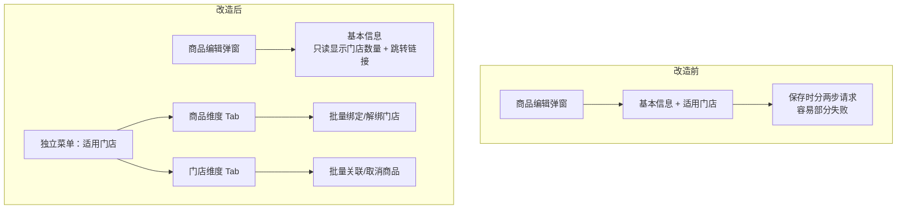
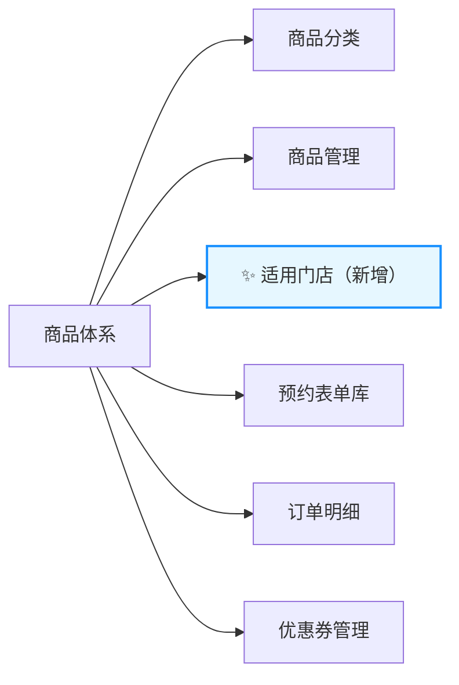
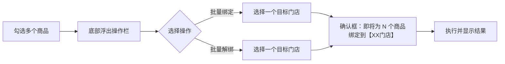
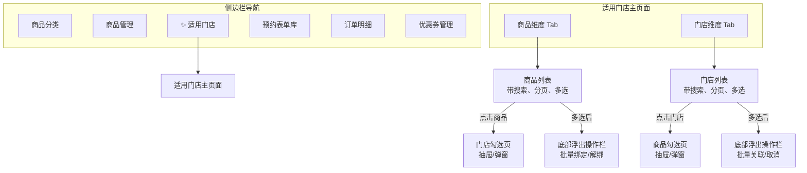

# 适用门店独立管理 产品需求文档（PRD）

## 1. 需求概述

### 1.1 背景与目的

在当前 bini-health 管理后台中，商品与门店的绑定关系嵌套在商品编辑弹窗内部的"适用门店"字段中。该方式存在以下痛点：

- 门店绑定操作与商品信息编辑耦合在同一个弹窗中，保存时容易出现部分保存成功（商品信息保存成功但门店绑定失败）的问题
- 无法从门店维度反向查看某个门店关联了哪些商品
- 不支持批量操作，管理员需逐个商品进行门店绑定，效率低下

本次需求将"适用门店"功能从商品编辑弹窗中完全独立出来，作为"商品体系"下的独立子菜单，提供**双向管理**能力（商品→门店 和 门店→商品），并支持批量操作，大幅提升门店绑定管理的效率和操作体验。



### 1.2 目标用户

管理后台的运营管理员、商品管理员——拥有"商品管理"操作权限的角色。

### 1.3 核心价值

| 价值维度 | 说明 |
|---------|------|
| 操作效率提升 | 支持批量操作，从逐个绑定变为批量管理 |
| 双向可见性 | 既可从商品视角管理门店，也可从门店视角管理商品 |
| 数据一致性 | 绑定操作独立于商品编辑，避免"商品保存成功但门店绑定失败"的问题 |
| 管理便捷性 | 独立菜单入口，门店绑定管理不再深藏于商品编辑弹窗中 |

---

## 2. 功能需求

### 2.1 功能清单总览

| 编号 | 功能模块 | 功能点 | 优先级 | 说明 |
|------|----------|--------|--------|------|
| F01 | 菜单与导航 | 新增"适用门店"侧边栏菜单 | P0 | 位于"商品管理"之后 |
| F02 | 商品维度 Tab | 商品列表展示 | P0 | 展示所有商品及其已绑定门店数量 |
| F03 | 商品维度 Tab | 商品门店勾选页 | P0 | 点击商品后进入门店勾选操作 |
| F04 | 门店维度 Tab | 门店列表展示 | P0 | 展示所有门店及其已关联商品数量 |
| F05 | 门店维度 Tab | 门店商品勾选页 | P0 | 点击门店后进入商品勾选操作 |
| F06 | 批量操作 | 商品维度批量绑定/解绑 | P0 | 多选商品 → 选择一个门店 → 批量绑定或解绑 |
| F07 | 批量操作 | 门店维度批量关联/取消 | P0 | 选择一个门店 → 多选商品 → 批量关联或取消 |
| F08 | 搜索与筛选 | 列表搜索 | P0 | 两个 Tab 的列表均支持关键字搜索 |
| F09 | 搜索与筛选 | 勾选页筛选 | P0 | 支持搜索 + 区域筛选 + 已绑定/未绑定快捷筛选 |
| F10 | 商品编辑弹窗改造 | 移除门店选择，改为只读展示 | P0 | 显示已绑定门店数量 + "去管理"跳转链接 |
| F11 | 新建商品引导 | 创建成功后提示绑定门店 | P1 | 弹出提示引导管理员去"适用门店"完成绑定 |

### 2.2 功能详细描述

#### F01：新增"适用门店"侧边栏菜单

**菜单位置**：商品体系 → 商品分类 → 商品管理 → **适用门店（新增）** → 预约表单库 → 订单明细 → 优惠券管理



**权限控制**：跟随商品管理权限——拥有商品管理操作权限的管理员自动获得"适用门店"的查看和编辑权限，无需单独配置。

---

#### F02：商品维度 Tab — 商品列表

**页面结构**：进入"适用门店"菜单后，默认展示商品维度 Tab。

**列表字段**：

| 序号 | 字段 | 说明 |
|------|------|------|
| 1 | 商品图片缩略图 | 商品主图的小尺寸缩略图 |
| 2 | 商品名称 | 商品的完整名称 |
| 3 | 商品分类 | 所属分类名称 |
| 4 | 价格 | 商品售价 |
| 5 | 状态 | 上架中 / 已下架 |
| 6 | 已绑定门店数 | 当前绑定的门店数量，可点击进入勾选页 |

**状态展示规则**：

- **上架中的商品**：正常显示，所有字段均为标准样式
- **已下架的商品**：仍然在列表中显示，但整行文字为灰色，并在状态列显示"已下架"标签。绑定关系可正常编辑

**分页**：每页 20 条，底部展示分页器

**搜索**：列表顶部搜索框，支持按商品名称搜索

**列表操作**：

- 每行前方有复选框，支持多选（用于批量操作）
- 点击"已绑定门店数"或行内操作按钮，进入该商品的门店勾选页

---

#### F03：商品维度 — 门店勾选页

当管理员点击某个商品后，进入该商品的门店勾选页面（可采用抽屉或弹窗形式）。

**页面元素**：

- **顶部**：显示当前操作的商品名称和图片
- **筛选区**：
  - 搜索框：按门店名称搜索
  - 区域/城市筛选：下拉选择
  - 快捷筛选：全部 / 已绑定 / 未绑定
- **门店列表**：展示所有门店，每行包含：
  - 勾选框（已绑定的默认勾选）
  - 门店名称
  - 门店编号
  - 营业状态
  - 门店地址

**已关闭门店的展示**：已关闭的门店仍然出现在列表中，可正常勾选绑定（方便门店重新开业后直接生效）。如果该门店与当前商品已有绑定关系，在门店名称后显示"门店已关闭"提示标记。

**保存方式**：即时保存——管理员勾选或取消勾选后立即生效，无需额外点击保存按钮。操作成功后显示短暂的"操作成功"提示。

```mermaid
flowchart TD
    A[管理员勾选/取消某门店] --> B{是否为批量操作?}
    B -->|否，单个操作| C[立即发送请求保存]
    C --> D[显示"操作成功"提示]
    B -->|是，批量操作| E[弹出二次确认框]
    E --> F[显示操作数量]
    F --> G[管理员确认]
    G --> H[批量发送请求保存]
    H --> I[显示"批量操作成功"提示]
```

---

#### F04：门店维度 Tab — 门店列表

**列表字段**：

| 序号 | 字段 | 说明 |
|------|------|------|
| 1 | 门店名称 | 门店的完整名称 |
| 2 | 门店编号 | 系统内唯一编号 |
| 3 | 营业状态 | 营业中 / 已关闭 |
| 4 | 已关联商品数 | 当前关联的商品数量，可点击进入勾选页 |

**状态展示规则**：

- **营业中的门店**：正常显示
- **已关闭的门店**：仍然在列表中显示，但整行文字为灰色，并在营业状态列显示"已关闭"标签。绑定关系可正常编辑

**分页**：每页 20 条

**搜索**：列表顶部搜索框，支持按门店名称搜索

**列表操作**：

- 每行前方有复选框，支持多选（用于批量操作）
- 点击"已关联商品数"或行内操作按钮，进入该门店的商品勾选页

---

#### F05：门店维度 — 商品勾选页

与 F03 对称设计。当管理员点击某个门店后，进入该门店的商品勾选页面。

**页面元素**：

- **顶部**：显示当前操作的门店名称和编号
- **筛选区**：
  - 搜索框：按商品名称搜索
  - 商品分类筛选：下拉选择
  - 快捷筛选：全部 / 已关联 / 未关联
- **商品列表**：展示所有商品，每行包含：
  - 勾选框（已关联的默认勾选）
  - 商品缩略图
  - 商品名称
  - 商品分类
  - 价格
  - 状态（上架中/已下架）

**已下架商品的展示**：已下架的商品仍然出现在列表中，灰色标明"已下架"，可正常勾选关联。

**保存方式**：与 F03 一致，即时保存 + 批量操作二次确认。

---

#### F06：商品维度 — 批量操作

**操作流程**：

1. 管理员在商品列表中通过复选框勾选多个商品
2. 页面底部浮出操作栏，包含两个按钮：
   - **批量绑定门店**：选中的商品统一绑定到某一个指定门店
   - **批量解绑门店**：选中的商品统一从某一个指定门店解绑
3. 点击按钮后弹出门店选择器，管理员选择一个目标门店
4. 弹出确认框，显示操作数量和目标门店，如："即将为 5 个商品绑定到【朝阳区旗舰店】，确认执行？"，并支持展开查看受影响的商品名称清单（默认收起）
5. 确认后执行批量操作，完成后显示结果提示



---

#### F07：门店维度 — 批量操作

与 F06 对称设计。

**操作流程**：

1. 管理员在门店列表中选择一个门店，进入该门店的商品勾选页
2. 在商品勾选页中通过复选框勾选多个商品
3. 页面底部浮出操作栏，包含：
   - **批量关联**：选中的商品全部关联到当前门店
   - **批量取消关联**：选中的商品全部从当前门店取消关联
4. 弹出确认框，显示操作数量，如："即将为【朝阳区旗舰店】关联 10 个商品，确认执行？"
5. 确认后执行，显示结果

---

#### F08 & F09：搜索与筛选

**列表级搜索（F08）**：

| Tab | 搜索字段 |
|-----|---------|
| 商品维度 | 商品名称模糊匹配 |
| 门店维度 | 门店名称模糊匹配 |

**勾选页级筛选（F09）**：

| 筛选项 | 类型 | 说明 |
|--------|------|------|
| 关键字搜索 | 输入框 | 门店勾选页按门店名称搜索；商品勾选页按商品名称搜索 |
| 区域筛选 | 下拉选择 | 门店勾选页按门店所在区域/城市筛选 |
| 分类筛选 | 下拉选择 | 商品勾选页按商品分类筛选 |
| 绑定状态 | 快捷切换 | 全部 / 已绑定（已关联） / 未绑定（未关联） |

---

#### F10：商品编辑弹窗改造

**改造内容**：

- **完全移除**原有的"适用门店"多选组件和智能推荐区域
- **新增只读展示区**：在商品编辑弹窗中合适位置显示：
  - 文字：`已绑定 X 个门店`（X 为实时数量）
  - 跳转链接：`去管理 →`，点击后跳转到"适用门店"菜单页面，并自动定位到该商品的门店勾选页

```mermaid
flowchart LR
    A["商品编辑弹窗<br/>已绑定 3 个门店 | 去管理 →"] -->|点击"去管理"| B["适用门店菜单<br/>自动打开该商品的门店勾选页"]
```

---

#### F11：新建商品引导

**触发条件**：管理员成功创建一个新商品后。

**行为**：弹出提示对话框（或顶部通知），内容为：

> 商品创建成功！该商品尚未绑定任何门店，请前往「适用门店」完成门店绑定。
> 
> [立即前往]   [稍后处理]

- 点击"立即前往"：跳转到"适用门店"菜单，自动打开该新商品的门店勾选页
- 点击"稍后处理"：关闭提示，留在当前页面

---

## 3. 页面/界面设计

### 3.1 页面结构与导航



### 3.2 各页面功能说明

#### 3.2.1 适用门店主页面

- 顶部：页面标题"适用门店"
- Tab 切换栏：商品维度 | 门店维度
- 搜索区：搜索输入框
- 内容区：对应 Tab 的列表内容
- 底部（条件出现）：批量操作浮出栏

#### 3.2.2 商品维度 — 门店勾选抽屉

- 右侧滑出抽屉（宽度约 600px）
- 顶部：商品信息摘要（图片 + 名称）
- 筛选栏：搜索 + 区域筛选 + 绑定状态快捷切换
- 门店勾选列表：带复选框的门店列表
- 底部（条件出现）：批量操作按钮

#### 3.2.3 门店维度 — 商品勾选抽屉

- 与商品维度的门店勾选抽屉对称
- 顶部：门店信息摘要（名称 + 编号）
- 筛选栏：搜索 + 分类筛选 + 关联状态快捷切换
- 商品勾选列表：带复选框的商品列表
- 底部（条件出现）：批量操作按钮

---

## 4. 非功能性需求

### 4.1 性能要求

| 场景 | 性能指标 |
|------|---------|
| 列表加载 | 首屏数据（20 条）加载时间 ≤ 1 秒 |
| 即时保存 | 单个勾选/取消操作响应时间 ≤ 500ms |
| 批量操作 | 批量绑定/解绑 50 个商品响应时间 ≤ 3 秒 |
| 搜索 | 搜索结果返回 ≤ 500ms |

### 4.2 安全要求

- 所有操作均需通过身份认证（登录态校验）
- 绑定/解绑操作需校验管理员是否具有商品管理权限
- 批量操作需进行二次确认，防止误操作
- API 接口需做参数校验和防重复提交处理

### 4.3 兼容性要求

- 浏览器：Chrome 80+、Firefox 78+、Safari 13+、Edge 80+
- 分辨率：最小支持 1280×720，推荐 1920×1080
- 与现有 Ant Design 管理后台保持一致的 UI 风格

---

## 5. 业务规则与约束

| 编号 | 规则 | 说明 |
|------|------|------|
| BR01 | 绑定数量不限 | 一个商品可绑定的门店数量不设上限 |
| BR02 | 关联数量不限 | 一个门店可关联的商品数量不设上限 |
| BR03 | 新商品默认不绑定 | 新创建的商品默认不绑定任何门店，创建成功后弹出引导提示 |
| BR04 | 新门店不自动关联 | 新增的门店不会自动关联任何商品，需管理员手动绑定 |
| BR05 | 下架商品可编辑绑定 | 已下架商品仍显示在列表中（灰色 + "已下架"标签），绑定关系可正常编辑 |
| BR06 | 已关闭门店可编辑绑定 | 已关闭门店仍显示在列表中（灰色 + "已关闭"标签），绑定关系可正常编辑 |
| BR07 | 门店关闭不解除绑定 | 门店关闭后已有绑定关系保留不变，但在商品的门店列表中用"门店已关闭"标记提示管理员 |
| BR08 | 所有商品规则一致 | 无特殊商品类型，所有商品的绑定规则完全一致 |
| BR09 | 即时保存 | 单个勾选/取消操作即时生效，无需手动点保存 |
| BR10 | 批量二次确认 | 批量操作必须弹出确认框，显示操作数量和目标，管理员确认后执行 |
| BR11 | 批量操作目标单选 | 批量操作时目标端（门店或商品）只能选择一个，来源端可多选 |

---

## 6. 权限设计

| 角色 | 权限说明 |
|------|----------|
| 超级管理员 | 拥有"适用门店"菜单的完整查看和编辑权限 |
| 商品管理员 | 拥有商品管理权限的角色，自动获得"适用门店"的查看和编辑权限 |
| 普通管理员（无商品管理权限） | 侧边栏不显示"适用门店"菜单，无法访问 |

权限判断逻辑：复用现有的商品管理权限控制，"适用门店"菜单的可见性和可操作性与"商品管理"菜单完全一致，无需新增独立的权限配置项。

---

## 7. 异常处理与边界情况

| 场景 | 处理方式 |
|------|---------|
| 网络异常导致即时保存失败 | 勾选状态自动回滚（恢复为操作前的状态），弹出红色错误提示"操作失败，请稍后重试" |
| 批量操作部分失败 | 显示操作结果摘要："成功 N 个，失败 M 个"，并列出失败的商品/门店名称及原因 |
| 商品/门店在操作过程中被删除 | 返回友好提示"该商品/门店已不存在"，刷新列表 |
| 并发编辑冲突 | 后端采用乐观锁或唯一约束，前端根据返回的冲突信息提示用户刷新后重试 |
| 列表数据为空 | 展示空状态插图和提示文字："暂无商品/门店数据" |
| 搜索无结果 | 展示空状态提示："未找到匹配结果，请尝试其他关键字" |
| 绑定/解绑时门店刚被关闭 | 正常执行绑定/解绑操作（已关闭门店允许编辑绑定关系），同时在列表中刷新门店状态标记 |
| 新建商品后不绑定门店 | 允许用户"稍后处理"，商品正常创建但处于未绑定门店状态 |
| 从商品编辑弹窗点击"去管理"跳转 | 自动导航到"适用门店"页面的商品维度 Tab，并打开该商品的门店勾选抽屉 |

---

## 8. 补充说明

### 8.1 与现有功能的影响评估

| 受影响模块 | 影响内容 | 处理方式 |
|-----------|---------|---------|
| 商品编辑弹窗 | 移除"适用门店"多选组件和智能推荐 | 替换为只读门店数量展示 + "去管理"跳转链接 |
| 商品保存逻辑 | 不再需要在保存商品时同步保存门店绑定 | 商品保存接口只处理商品基本信息，门店绑定由独立接口处理 |
| 现有门店绑定 API | `PUT /api/admin/products/{id}/stores` 等已有接口 | 可复用，作为新页面的后端支撑 |
| 侧边栏菜单配置 | 需在"商品管理"后新增菜单项 | 前端路由和菜单配置文件中新增 |

### 8.2 数据迁移

无需数据迁移。现有的商品-门店绑定关系数据保持不变，新页面直接读取和操作现有的 `product_store_binddings` 数据表。

### 8.3 后续可扩展方向

- 支持按商品分类批量绑定到门店（如"将所有'护理类'商品绑定到某门店"）
- 门店维度支持按区域批量操作
- 绑定关系变更日志记录
- 绑定关系导出为 Excel 报表

### 8.4 开发与部署

本系统将基于小白 AI 进行自动化开发，并部署至小白 AI 云服务器。所有功能将在一个版本内完成开发并一次性上线。
