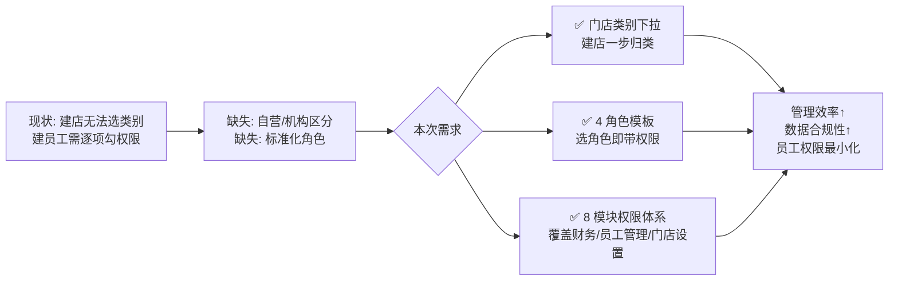
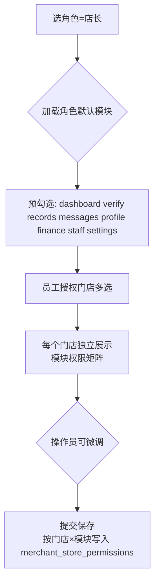
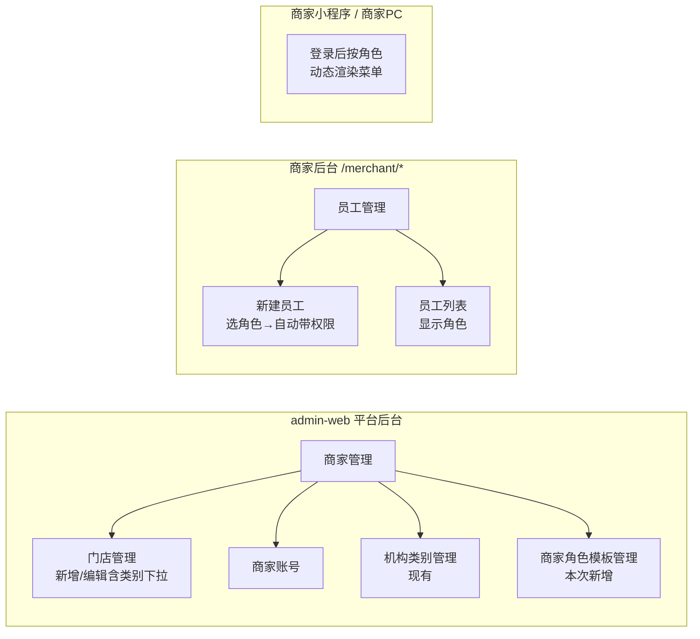
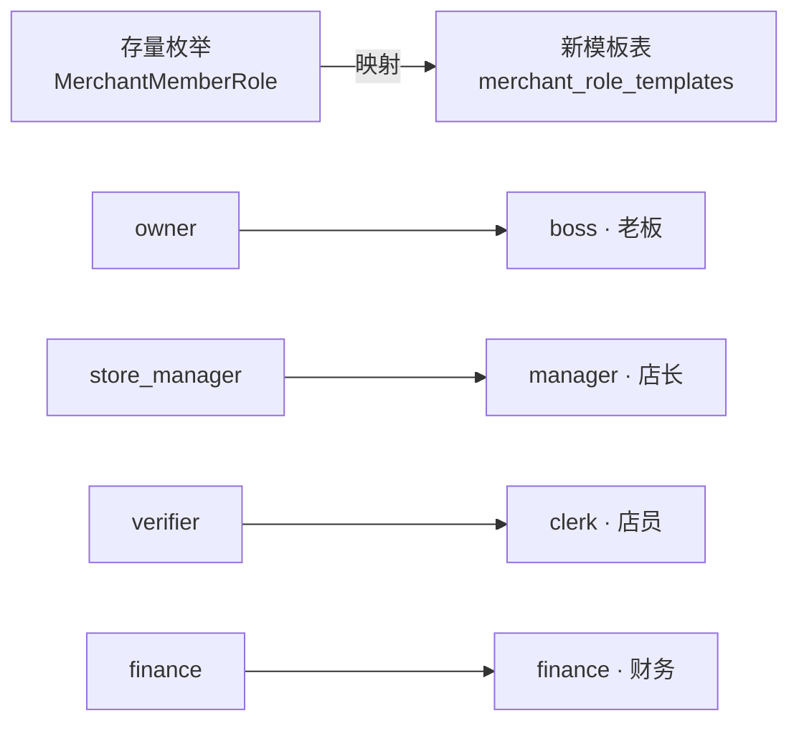

# 门店类别下拉 + 商家角色权限体系 产品需求文档（PRD）

> 版本：v1.0  
> 日期：2026-04-24  
> 状态：待评审 → 待开发

---

## 1. 需求概述

### 1.1 背景与目的

当前管理后台（admin-web）虽然已经在数据层建立了「门店类别」字典（`merchant_categories` 表，含 self_store / medical / homeservice / other 四个默认类别），**但在「新建门店」与「新建商家账号」的前端表单里，均没有暴露「所属类别」字段**，导致运营人员创建门店时无法指定"自营门店 / 医疗机构 / 居家服务机构 / 其他"，`MerchantStore.category_id` 默认留空，需要事后直接改库才能归类。

同时，商家端现有的账号体系只有粗粒度的 **owner（商家主账号） / staff（商家员工账号）** 二分，在运行态虽然已经存在 `MerchantMemberRole` 的四档细分（`owner / store_manager / verifier / finance`），但在新建员工表单上，前端仍然要求管理员**逐门店、逐模块**去勾选权限，**没有"选角色即带出权限"的角色模板概念**；典型的连锁/机构场景（老板、店长、财务、店员）缺少标准化的权限预设，商家操作成本高。

本次需求要一次性补齐两个缺口：

1. **门店类别下拉**：让"所属类别"在新建门店表单里可选
2. **商家角色权限体系**：引入"角色模板 + 模块权限预设"的标准化权限模型，覆盖**老板 / 店长 / 财务 / 店员**四种角色，统一商家员工的建号与授权体验

### 1.2 目标用户

| 用户角色 | 使用场景 |
| --- | --- |
| 平台运营（admin-web） | 在后台维护门店类别、维护全局角色字典、创建门店时指定类别 |
| 商家主账号（老板，owner） | 在商家后台为本商家员工建号并选定角色（店长 / 财务 / 店员） |
| 商家员工（店长 / 财务 / 店员） | 登录商家端（PC 商家后台 `/merchant/*` 或商家小程序），按角色拥有的模块开展工作 |

### 1.3 核心价值



*图 1：本次需求的价值链路*

---

## 2. 功能需求

### 2.1 功能清单总览

| 编号 | 功能模块 | 功能点 | 优先级 | 说明 |
| --- | --- | --- | --- | --- |
| F1 | admin-web · 门店管理 | 新建门店表单新增「所属类别」下拉 | P0 | 选项从 `GET /api/merchant-categories` 拉取 |
| F2 | admin-web · 门店管理 | 编辑门店表单新增「所属类别」下拉（可改） | P0 | 与 F1 成对出现，便于存量数据补齐 |
| F3 | admin-web · 门店列表 | 门店列表新增「所属类别」列 + 类别筛选器 | P1 | 便于运营按类别统计 |
| F4 | 后端 · 商家角色体系 | 扩充模块常量至 8 个 | P0 | `dashboard / verify / records / messages / profile / finance / staff / settings` |
| F5 | 后端 · 商家角色体系 | 新增"角色模板"数据模型与 API（只读字典） | P0 | 全局统一，商家不可改 |
| F6 | admin-web · 角色管理 | 平台 Admin 新增「商家角色模板管理」菜单 | P0 | 仅平台 Admin 可见与编辑 |
| F7 | 商家后台 · 新建员工 | 新建员工表单「身份类型」改为角色下拉 | P0 | 老板 / 店长 / 财务 / 店员 |
| F8 | 商家后台 · 新建员工 | 选角色后自动带出模块权限矩阵（可微调） | P0 | 默认预设见 6.1 |
| F9 | 商家后台 · 员工管理 | 店长可管理本店员工（改权限/停用，不可新增） | P0 | 对应角色 7B 约束 |
| F10 | 商家小程序/PC 后台 | 按角色与模块权限动态渲染菜单 | P0 | 无权限的模块菜单直接隐藏 |
| F11 | 老板多门店场景 | 同商家下多门店，老板自动覆盖全部门店 | P0 | 沿用现有 owner 逻辑，无需改造 |

### 2.2 功能详细描述

#### F1 · 新建门店表单新增「所属类别」下拉

- **入口**：admin-web → 商家管理 → 门店管理 → 新建门店
- **字段位置**：放在"门店名称 / 门店编码"之后，"联系人 / 联系电话"之前
- **字段类型**：Select 下拉（单选）
- **是否必填**：**必填**（默认选中"自营门店 (self_store)"以降低使用门槛）
- **数据源**：`GET /api/merchant-categories`（已存在）
- **提交字段**：`category_id`（外键 → `merchant_categories.id`）
- **交互细节**：
  - 下拉项显示 `name_zh`（如"自营门店"），value 为 `id`
  - 下拉按 `sort_order` 排序
  - 若 `merchant-categories` 接口返回空，给予提示："请先在『机构类别管理』维护类别"

#### F2 · 编辑门店表单新增「所属类别」下拉

- 同 F1 字段规范，允许修改现有门店的类别
- 编辑时回显当前 `category_id`；若为空，下拉显示"未归类"占位并必须选一个

#### F3 · 门店列表新增「所属类别」列 + 筛选器

- 列表新增"所属类别"列，显示 `name_zh`
- 表格顶部过滤器加"类别筛选"下拉（多选）
- 支持按类别导出

#### F4 · 扩充模块常量至 8 个

后端常量 `FULL_MODULE_CODES` 从 5 个扩充到 8 个：

| 模块 code | 中文显示 | 对应功能 |
| --- | --- | --- |
| `dashboard` | 工作台 | 数据看板、订单统计 |
| `verify` | 核销 | 扫码核销卡券 / 服务订单 |
| `records` | 记录 | 核销记录、到店记录 |
| `messages` | 消息 | 系统通知、客户消息 |
| `profile` | 我的 | 账号资料、切换门店 |
| `finance` | 财务对账 | 营业额、核销流水、退款、月度对账单 |
| `staff` | 员工管理 | 新增 / 编辑 / 停用员工、调权限 |
| `settings` | 门店设置 | 营业时间、门店资料、联系方式 |

- 数据迁移：存量 owner/staff 账号权限自动保留；新增的 3 个模块（finance / staff / settings）默认为"未授权"，由角色模板控制下发
- 相关枚举、i18n 文案、前端菜单图标同步扩充

#### F5 · 新增"角色模板"数据模型与 API

新增表 `merchant_role_templates`（全局字典，平台级）：

| 字段 | 类型 | 说明 |
| --- | --- | --- |
| id | int | 主键 |
| code | varchar(32) | 唯一，`boss / manager / finance / clerk` |
| name_zh | varchar(32) | 中文显示名：老板 / 店长 / 财务 / 店员 |
| module_codes | json | 默认权限模块数组，如 `["dashboard","verify","records","messages","profile","finance","staff","settings"]` |
| is_system | tinyint | 是否系统内置（内置角色不可删除） |
| sort_order | int | 排序 |
| created_at / updated_at | datetime | |

配套 API：

- `GET /api/merchant-role-templates` — 任意商家端登录态可调用，返回全部启用的角色模板（含默认模块）
- `POST /api/admin/merchant-role-templates` — 平台 Admin 创建
- `PUT /api/admin/merchant-role-templates/{id}` — 平台 Admin 编辑（内置角色可改 `module_codes`，不可改 `code`）
- `DELETE /api/admin/merchant-role-templates/{id}` — 仅自定义角色可删，内置不可

#### F6 · admin-web 新增「商家角色模板管理」菜单

- 菜单位置：侧边栏 → 商家管理 → 商家角色模板管理
- 列表页：展示 `老板 / 店长 / 财务 / 店员` 四个系统内置角色，每行展示勾选好的 8 个模块
- 编辑页：复选框矩阵，可勾选 / 取消该角色的默认模块
- 权限：仅平台 Admin 账号可见、可编辑；商家端完全不可见此入口（对应问题 4 的 D 选项）

#### F7 · 新建员工表单「身份类型」改为角色下拉

商家后台（PC `/merchant/staff/`）新建员工弹窗：

- 原"商家身份类型"字段（主账号/员工账号）**废弃显示**（后端仍然保留 `owner` 字段用于老板兜底）
- 新字段「**角色**」，选项：老板（boss，不可见 / 不可选）、店长（manager）、财务（finance）、店员（clerk）
  - 老板唯一，由注册时自动创建，普通建号入口不展示"老板"选项
- 下拉数据源：`GET /api/merchant-role-templates`

#### F8 · 选角色后自动带出模块权限矩阵



*图 2：角色模板 → 权限矩阵的联动逻辑*

- 选角色后，所有授权门店自动套用该角色的默认模块
- 操作员可对个别门店做"增减模块"的微调（不写回角色模板，只影响当前这个员工）
- 角色未选时，模块勾选区置灰不可操作

#### F9 · 店长权限约束（对应问题 7B）

店长角色虽然拥有 `staff` 模块，但在前端与后端层做双保险限制：

- **新增员工按钮**：店长登录时不显示
- **编辑员工权限**：店长可打开员工详情页、可编辑"可管理门店 / 模块权限"、可"停用 / 启用"
- **不可操作对象**：店长不可编辑"老板"账号，也不可把其他员工角色改为"老板"
- **后端校验**：所有新增类 API（`POST /api/merchant/staff`）对 `manager` 角色拒绝（403）

#### F10 · 按角色动态渲染菜单

- 商家后台 PC（`/merchant/*`）、商家小程序登录后：
  - 向后端请求 `GET /api/merchant/me/permissions`，返回当前登录人在"当前选中门店"下拥有的模块列表
  - 前端基于返回的模块列表，隐藏无权限的菜单项（不是置灰，而是完全不渲染）
  - 老板（owner）始终返回全部 8 个模块

#### F11 · 老板多门店（同商家）场景

- 同一个商家（Merchant）下挂多个门店（Store）时，**老板自动拥有所有门店的全部 8 个模块权限**
- 老板在顶部可切换"当前操作门店"，但数据看板支持"全部门店聚合视图"
- 无需任何新建账号动作，沿用现有 `owner` 逻辑（**本次零改造**）

---

## 3. 页面/界面设计

### 3.1 页面结构与导航



*图 3：本次需求涉及的页面导航结构*

### 3.2 各页面功能说明

#### 3.2.1 平台后台 · 新建门店页

- 表单字段：门店名称* / 门店编码 / **所属类别（新增，必选）** / 联系人 / 联系电话 / 门店地址 / 所属商家
- 提交后跳回列表，Toast 提示"门店创建成功，类别：XXX"

#### 3.2.2 平台后台 · 商家角色模板管理页

- 左侧：角色列表（老板 / 店长 / 财务 / 店员 + 自定义）
- 右侧：选中角色的模块权限矩阵（8 个模块复选框）
- 顶部按钮：保存
- 空态：系统首次部署时自动种入 4 个内置角色及 6.1 节的默认预设

#### 3.2.3 商家后台 · 新建员工页

字段顺序：

```
手机号*   初始密码*
员工姓名*   角色* [下拉: 店长/财务/店员]
授权门店* [多选]
─── 权限矩阵（按门店分 Tab）───
  [门店A]  [门店B]  [门店C]
  ├── dashboard  ☑（预勾）
  ├── verify     ☑
  ├── records    ☑
  ├── messages   ☑
  ├── profile    ☑ (锁定不可取消)
  ├── finance    ☑（店长/财务预勾，店员未勾）
  ├── staff      ☑（店长预勾，其他未勾）
  └── settings   ☐（仅店长预勾）
─────────────────────────
[提交]  [取消]
```

#### 3.2.4 商家后台 · 员工列表页

- 列：头像 / 姓名 / 手机号 / **角色** / 授权门店数 / 最近登录 / 状态 / 操作
- 角色列用 Tag 显示（老板=红色 / 店长=蓝色 / 财务=金色 / 店员=灰色）

---

## 4. 非功能性需求

### 4.1 性能要求

- 角色模板字典查询应做 15 分钟内存缓存（平台级），避免每次建号都打库
- `/api/merchant/me/permissions` 应在 200ms 内返回（按用户+门店维度缓存）

### 4.2 安全要求

- 店长角色的"新增员工"操作必须在后端 API 层再校验一次，不能只依赖前端隐藏按钮
- 跨商家切换时（假设后续开放）必须重算权限，不得沿用前一个商家的权限上下文
- 内置角色（`is_system=1`）的 `code` 字段不可被前端修改；接口层强校验

### 4.3 兼容性要求

- **存量数据兼容**：
  - 存量 `MerchantStore.category_id = NULL` 的门店，在列表中显示"未归类"，不强制刷数据库；运营可逐个补齐
  - 存量 `MerchantMemberRole = owner/store_manager/verifier/finance` 的账号自动映射到新的角色模板：`owner → boss` / `store_manager → manager` / `verifier → clerk` / `finance → finance`
  - 存量员工已有的 `merchant_store_permissions` 记录**完全保留**，不会被角色模板覆盖
- 浏览器兼容：Chrome / Edge / Safari 最新两个大版本
- 商家小程序：兼容微信基础库 2.25+

---

## 5. 业务规则与约束

1. **门店类别必选**：新建门店时"所属类别"必填，不允许留空；老数据可以是"未归类"
2. **商家角色字典由平台维护**：商家端**不可见**"角色管理"入口，商家只能在建员工时从下拉里选（对应决策 4D）
3. **老板唯一**：一个商家（Merchant）只能有一个老板账号（`boss`），即商家注册/被创建时自动生成的 owner；建员工流程不能选"老板"
4. **员工全局角色唯一**：同一个员工账号在其所有授权门店中担任**同一个角色**（对应决策 8B）；若业务上确需"A 店店长 / B 店店员"，则必须用不同手机号建两个账号
5. **数据范围不细分**：本期只控模块开关，不做"本人 / 本店 / 跨店"的数据范围细分（对应决策 6A）；同门店内同模块下，不同角色看到的数据是一样的
6. **跨商家多身份暂不支持**：本期不开放"一个手机号同时做多个独立商家的老板"（对应决策 9A，仅支持"同商家多门店"）
7. **角色模板变更回溯**：修改角色默认模块**只影响之后新建的员工**，不会回写已存在员工的权限（防止误操作导致线上员工权限大范围变动）

---

## 6. 权限设计

### 6.1 四个内置角色的默认权限预设（对应决策 5A）

| 角色 | dashboard<br/>工作台 | verify<br/>核销 | records<br/>记录 | messages<br/>消息 | profile<br/>我的 | finance<br/>财务对账 | staff<br/>员工管理 | settings<br/>门店设置 |
| --- | :---: | :---: | :---: | :---: | :---: | :---: | :---: | :---: |
| **老板 (boss)** | ✅ | ✅ | ✅ | ✅ | ✅ | ✅ | ✅ | ✅ |
| **店长 (manager)** | ✅ | ✅ | ✅ | ✅ | ✅ | ✅ | ✅ | ✅ |
| **财务 (finance)** | ✅ | ❌ | ✅ | ✅ | ✅ | ✅ | ❌ | ❌ |
| **店员 (clerk)** | ✅ | ✅ | ✅ | ✅ | ✅ | ❌ | ❌ | ❌ |

### 6.2 老板 vs 店长 的行为差异

虽然默认模块勾选相同，但运行态行为不同：

| 维度 | 老板 (boss) | 店长 (manager) |
| --- | --- | --- |
| 门店覆盖范围 | **自动**覆盖本商家全部门店 | 仅覆盖被授权的门店 |
| 员工管理能力 | 新增 / 编辑 / 停用（所有角色含店长） | **仅编辑 / 停用**（不可新增；不可操作老板） |
| 账号数量限制 | 每个商家唯一 | 不限 |
| 创建方式 | 商家注册/被管理员创建时自动生成 | 由老板在商家后台建号 |

### 6.3 平台 Admin 与商家端权限隔离

- 平台 Admin 账号**不**属于商家角色体系（老板 / 店长 / 财务 / 店员），是独立的平台管理员
- 平台 Admin 可查看、管理所有商家的角色模板、门店类别；但不能登录具体商家的商家后台替商家做业务操作

---

## 7. 异常处理与边界情况

| 场景 | 处理方式 |
| --- | --- |
| 新建门店提交时 `category_id` 已被删除 | 后端校验，返回 400「所选类别不存在，请重新选择」 |
| 修改门店类别后，门店下有进行中订单 | 允许修改，类别只影响统计口径，不影响订单 |
| 新建员工时手机号已是本商家其他角色 | 提示「该手机号已是本商家 XX 角色，是否覆盖？」二次确认 |
| 新建员工时手机号属于另一个商家 | 拒绝，提示「该手机号已被其他商家占用，请使用其他手机号」（因本期决策 9A，不跨商家） |
| 店长通过接口尝试新增员工 | 后端 403，返回「您没有新增员工的权限，请联系老板」 |
| 平台 Admin 删除了"店长"这种内置角色 | 拒绝，内置角色（`is_system=1`）不可删除 |
| 平台 Admin 把"店员"的 finance 模块打开，已有店员是否自动获得 | **不自动**。角色模板变更只影响之后新建员工（见 §5.7） |
| 员工被停用后再登录 | 登录拒绝，提示「账号已停用，请联系商家老板」 |
| 老板账号密码忘记 | 通过平台 Admin 重置；商家端无此入口 |

---

## 8. 补充说明

### 8.1 角色 code 与现有枚举的对齐

当前数据库 `MerchantMemberRole` 枚举已存在 `owner / store_manager / verifier / finance` 四档，与本次设计的 `boss / manager / clerk / finance` 一一对应。落地时：

- **数据库枚举保持不变**（为了不破坏存量数据），新增 `role_template_id` 外键指向 `merchant_role_templates`
- **API / 前端展示**统一使用"老板 / 店长 / 财务 / 店员"的中文，底层 code 透明
- 迁移脚本负责把存量 `MerchantStoreMembership` 的 `role` 字段与新模板表建立关联



*图 4：存量角色枚举与新角色模板的映射关系*

### 8.2 与现有功能的关联

- 本需求属于对 2026-04-24 已上线的「商家/机构后台 + 小程序商家管理入口 v1.0」的**补齐与升级**
- `merchant_categories` 表已存在，**不新建表**，仅补前端入口
- `MerchantStoreMembership / MerchantMemberRole` 已存在，**不重建**，仅新增 `merchant_role_templates` 字典表与映射
- `/merchant/staff/` 页面已存在，本期改造其"新建/编辑"表单

### 8.3 未覆盖范围（明确排除）

以下内容**本期不做**，留待后续需求：

1. 商家自定义角色（对应决策 4D，商家端无角色管理入口）
2. 跨商家多身份（对应决策 9A，一个手机号只绑一个商家）
3. 一员工多门店不同角色（对应决策 8B，全局角色唯一）
4. 数据范围粒度控制（对应决策 6A，本期只控模块不控数据）
5. 本地部署 / 私有化部署（默认统一云端部署）

### 8.4 交付与上线

- 所有需求（F1 ～ F11）**统一作为一个版本一次性上线**
- 涉及端：`backend` / `admin-web` / `h5-web`（商家 PC 后台 `/merchant/*`） / `miniprogram`（商家小程序） / `verify-miniprogram`（如有菜单裁剪）
- 上线后运营 SOP：
  1. 平台 Admin 进入「商家角色模板管理」核对默认权限矩阵
  2. 平台 Admin 通知商家："今后建员工请先选角色再改授权门店"
  3. 存量未归类门店由运营逐个补齐类别

---

*— 文档结束 —*
