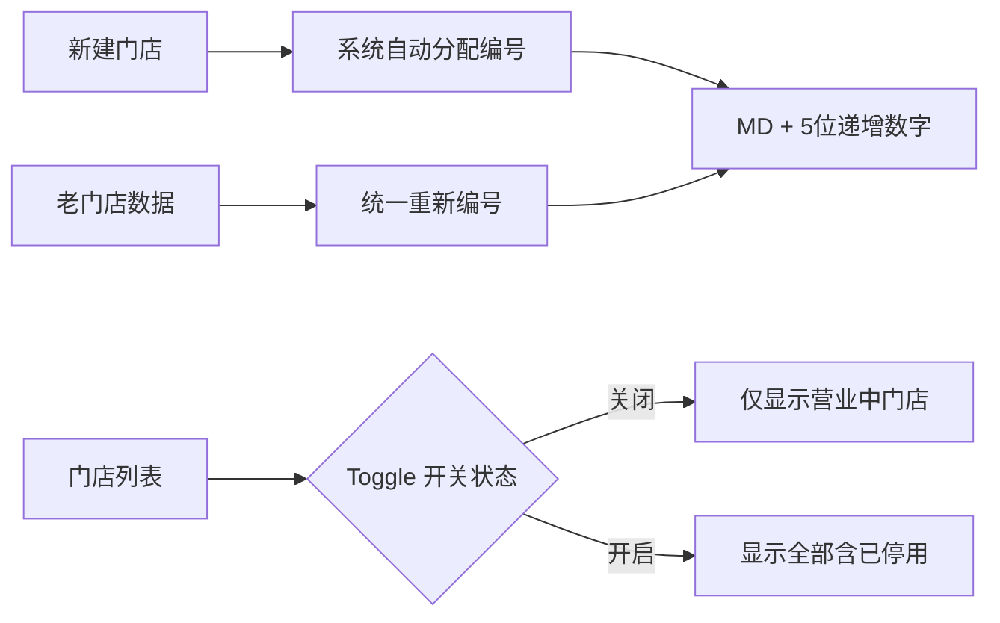
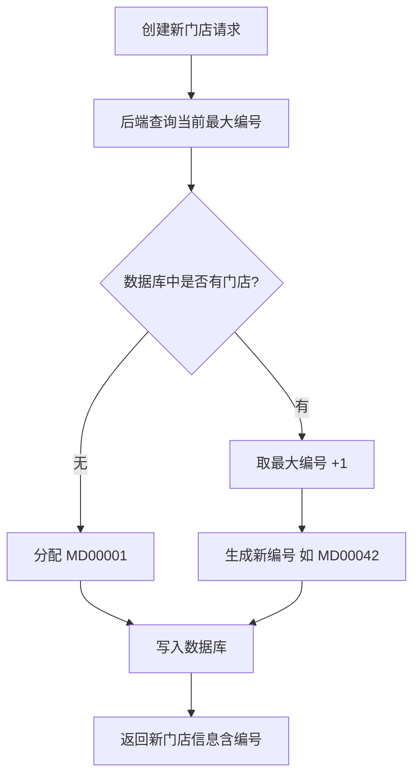
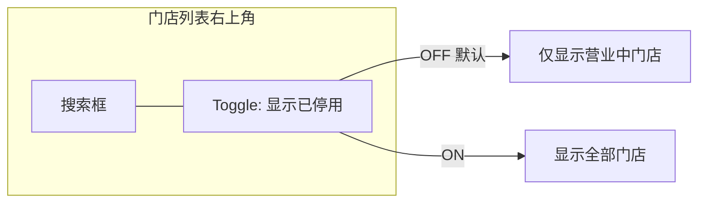

# 门店编号自动生成与已停用门店显示控制 产品需求文档（PRD）

## 1. 需求概述

### 1.1 背景与目的

当前系统的门店管理模块中，门店编号（store_code）由管理员在新建门店时手动输入，存在以下问题：

- **编号不规范**：不同管理员输入的编号格式不统一，缺乏统一标准
- **易重复/冲突**：手动输入容易出现编号重复或遗漏
- **管理效率低**：需要人工记忆和查找已用编号

此外，门店被停用后，管理后台的门店列表中仍然混合显示营业中和已停用的门店，影响日常管理效率。

本次需求旨在：

1. **实现门店编号自动生成**，统一编号规则，消除人工编号的不规范问题
2. **增加已停用门店的显示/隐藏控制**，让管理员可以按需查看已停用门店，保持列表整洁

### 1.2 目标用户

- **管理后台运营人员**：日常进行门店管理的后台操作人员

### 1.3 核心价值

| 价值维度 | 说明 |
|---------|------|
| 规范性 | 所有门店统一"MD + 5位数字"编号格式，告别手动编号混乱 |
| 效率性 | 新建门店时无需手动填写编号，系统自动分配 |
| 可管理性 | 默认隐藏已停用门店，列表更清爽；需要时一键显示全部 |
| 数据一致性 | 存量老门店统一重新编号，消除历史遗留的格式不一致 |

## 2. 功能需求

### 2.1 功能清单总览

| 编号 | 功能模块 | 功能点 | 优先级 | 说明 |
|------|---------|--------|--------|------|
| F01 | 门店编号自动生成 | 新建门店时自动分配编号 | P0 | 编号格式：MD + 5位递增数字 |
| F02 | 门店编号自动生成 | 编号字段改为只读展示 | P0 | 新建和编辑时均不可手动修改 |
| F03 | 门店编号自动生成 | 老门店数据统一重新编号 | P0 | 按创建时间从早到晚排序后依次编号 |
| F04 | 已停用门店显示控制 | 列表右上角 Toggle 开关 | P0 | 默认关闭（隐藏已停用门店） |
| F05 | 已停用门店显示控制 | 已停用门店视觉区分 | P0 | 已停用门店整行置灰显示 |

### 2.2 功能详细描述

#### F01：门店编号自动生成

**编号规则：**

- **格式**：`MD` + 5 位数字，从 `00001` 起递增
- **前缀**：固定为 `MD`，不支持后台配置修改
- **范围**：MD00001 ~ MD99999，最多支持 99,999 家门店
- **生成时机**：在门店记录写入数据库时由后端自动分配
- **唯一性**：编号在整个系统中全局唯一，不可重复

**编号分配逻辑：**

- 每次新建门店时，后端查询当前 `merchant_stores` 表中 `store_code` 字段的最大数字部分
- 在最大值基础上 +1，生成新的 5 位数编号
- 通过数据库事务确保并发安全（避免重复编号）

#### F02：编号字段改为只读展示

**前端变更：**

- **新建门店弹窗**：完全移除门店编号输入框。编号由系统自动分配，新建表单中无需展示编号字段
- **编辑门店弹窗**：门店编号字段以只读文本形式展示（灰底不可编辑），仅供管理员查看确认
- **门店列表**：门店编号列正常展示，可作为搜索关键词进行门店搜索

#### F03：老门店数据统一重新编号

**执行规则：**

- **排序依据**：按门店的 `created_at`（创建时间）从早到晚排序
- **编号分配**：最早创建的门店 = MD00001，依次递增
- **执行时机**：随本次需求上线时，通过数据迁移脚本一次性完成
- **执行方式**：在一个数据库事务中完成所有老门店的编号更新，确保原子性

**示例：**

| 门店名称 | 原编号 | 创建时间 | 新编号 |
|---------|--------|---------|--------|
| 总店 | SH-001 | 2026-04-01 10:00 | MD00001 |
| 分店A | FD-A | 2026-04-05 14:30 | MD00002 |
| 分店B | branch_b | 2026-04-10 09:15 | MD00003 |

#### F04：已停用门店显示控制 — Toggle 开关

**交互设计：**

- **位置**：门店列表页面右上角，紧挨搜索框旁边
- **形态**：Toggle 开关 + 文字标签 "显示已停用"
- **默认状态**：关闭（OFF）
- **关闭时**：列表仅展示 `status = "active"` 的营业中门店
- **开启时**：列表展示所有门店，包括 `status = "inactive"` 的已停用门店

**后端接口调整：**

- 门店列表查询接口新增可选参数 `include_inactive`（布尔值，默认 `false`）
- 当 `include_inactive=false` 时，仅返回 `status='active'` 的门店
- 当 `include_inactive=true` 时，返回所有状态的门店

#### F05：已停用门店视觉区分

**设计规范：**

- 当 Toggle 开关打开后，已停用门店在列表中**整行置灰显示**
- 置灰效果包括：
  - 文字颜色变为浅灰色（如 `#BFBFBF`）
  - 行背景色变为淡灰色（如 `#FAFAFA`）
  - 操作按钮保持可用（如"启用"按钮），但其他操作按钮（如"编辑"）置灰不可用
- 已停用门店在列表中的排列位置：**排在营业中门店之后**

## 3. 页面/界面设计

### 3.1 页面结构与导航

本次需求不新增页面，仅对现有**门店管理列表页**进行功能增强。

**涉及页面：** 管理后台 → 门店管理

### 3.2 门店管理列表页调整

#### 3.2.1 页面顶部操作区

| 元素 | 位置 | 说明 |
|------|------|------|
| 搜索框 | 右上角 | 现有功能，支持按门店名称/编号搜索 |
| Toggle 开关 | 搜索框右侧 | 新增，文字标签 "显示已停用"，默认关闭 |
| 新建门店按钮 | 右上角最右 | 现有功能，保持不变 |

#### 3.2.2 列表列定义

| 列名 | 字段 | 说明 |
|------|------|------|
| 门店编号 | store_code | 显示自动生成的编号，如 MD00001 |
| 门店名称 | store_name | 现有字段 |
| 门店类别 | category_id | 现有字段 |
| 联系人 | contact_name | 现有字段 |
| 联系电话 | contact_phone | 现有字段 |
| 状态 | status | 显示"营业中"或"已停用" |
| 操作 | — | 编辑、启用/停用 |

#### 3.2.3 新建门店弹窗

- **移除**门店编号输入框
- 其余表单字段保持不变（门店名称、联系人、联系电话、地址等）
- 保存成功后，返回的门店信息中包含系统自动分配的编号

#### 3.2.4 编辑门店弹窗

- 门店编号字段以**只读灰底文本**形式展示，不可编辑
- 其余表单字段保持不变

## 4. 非功能性需求

### 4.1 性能要求

- 门店编号自动生成过程应在 **200ms** 内完成
- 老门店重新编号的数据迁移脚本应在 **30 秒**内完成（当前数据量级下）
- Toggle 开关切换后，列表刷新响应时间不超过 **500ms**

### 4.2 安全要求

- 门店编号分配必须通过数据库事务保证唯一性，防止并发创建导致编号重复
- 编号字段在前后端均不可被篡改修改

### 4.3 兼容性要求

- 管理后台（Admin Web）：支持 Chrome、Edge、Firefox 等主流浏览器最新两个版本

## 5. 业务规则与约束

| 编号 | 规则描述 |
|------|---------|
| BR01 | 门店编号格式固定为 `MD` + 5 位数字（如 MD00001），前缀 `MD` 不可配置 |
| BR02 | 门店编号由系统自动生成，任何用户均不可手动输入或修改 |
| BR03 | 老门店按 `created_at` 从早到晚排序后重新编号，最早 = MD00001 |
| BR04 | 门店列表默认不显示已停用门店，需打开 Toggle 开关才显示 |
| BR05 | 已停用门店在列表中整行置灰，视觉上与营业中门店明确区分 |
| BR06 | 已停用门店排列在营业中门店之后 |
| BR07 | 编号递增基于当前数据库中最大编号值 +1，不重复不跳号 |

## 6. 权限设计

| 角色 | 权限说明 |
|------|---------|
| 超级管理员 | 可执行所有门店管理操作（新建、编辑、启用/停用、查看含已停用） |
| 普通管理员 | 根据现有权限体系，可能受限于部分操作 |
| 门店成员 | 无后台门店管理权限（仅通过 H5 端查看自己门店信息） |

## 7. 异常处理与边界情况

| 场景 | 处理方式 |
|------|---------|
| 并发创建门店导致编号冲突 | 后端使用数据库事务 + 唯一索引保障，冲突时自动重试分配下一个可用编号 |
| 编号达到 MD99999 后继续创建 | 提示"门店编号已达上限，请联系技术支持扩容"（当前业务场景下极不可能触达） |
| 老门店重新编号失败 | 迁移脚本在事务中执行，任何一条失败则全部回滚，保证数据一致性 |
| Toggle 开关切换时网络异常 | 前端在请求失败时将开关状态恢复为切换前的状态，并提示"加载失败，请重试" |
| 搜索条件与 Toggle 联动 | 当 Toggle 关闭时，搜索范围仅限营业中门店；Toggle 开启时，搜索范围包含所有状态门店 |

## 8. 补充说明

### 8.1 数据迁移方案

上线部署时需执行一次性数据迁移脚本：

1. 查询 `merchant_stores` 表所有记录，按 `created_at ASC` 排序
2. 从 MD00001 开始依次为每条记录生成新的 `store_code`
3. 在单个数据库事务中完成所有更新
4. 迁移完成后验证：所有 `store_code` 符合 `MD` + 5 位数字格式，无重复

### 8.2 对现有功能的影响

- **适用门店绑定模块**：门店编号变更后，适用门店绑定关系不受影响（绑定基于门店 `id` 而非 `store_code`）
- **H5 端门店信息展示**：门店编号展示将自动同步更新为新格式
- **订单/核销等关联数据**：通过门店 `id` 关联，不受编号变更影响
- **商家 PC 端登录**：不受影响，登录基于用户账号体系而非门店编号

### 8.3 与现有门店管理功能的关系

本次需求是对现有门店管理功能的增强优化，不涉及门店数据模型结构的变更（仅修改 `store_code` 字段的值和生成方式），对现有门店的新建、编辑、启用/停用等操作流程不产生破坏性变更。
